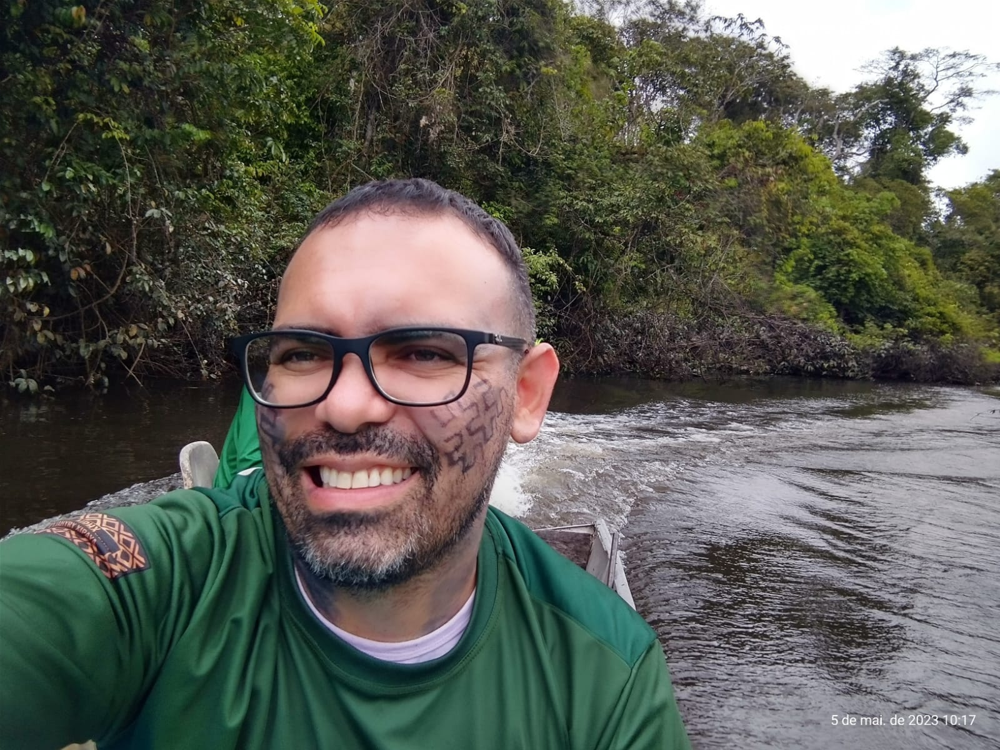
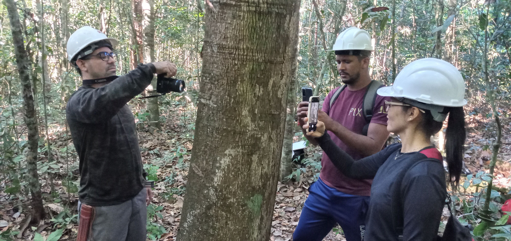
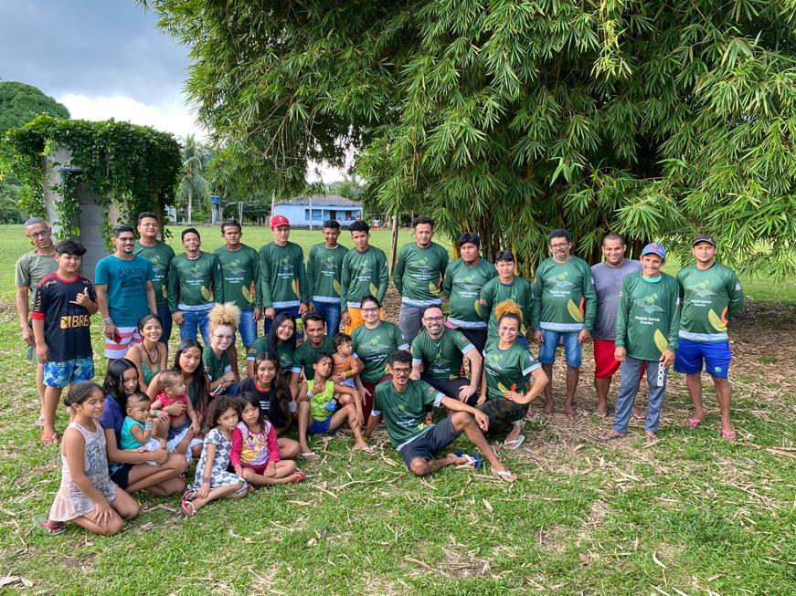

<!-- README.md is generated from README.Rmd. Please edit that file... -->
<!-- badges: start -->
<!-- badges: end -->
<!-- Emprestei a função list_github_files() da Curso-R (https://github.com/curso-r). A ideia desse readme emprestei da Curso-R. Achei excelente!-->

# Seja bem vindo(a)! :deciduous_tree: :smiley: :grin:

:calendar: Maio: 2, 9, 16, 23 e 30

:calendar: Junho: 6, 13, 20 e 27

:calendar: Julho: 4 e 11

:calendar: Agosto: 1, 8, 22 e 29

:alarm_clock: **14h00min - 18h50min**

<a itemprop="sameAs" content="https://orcid.org/0000-0002-2975-0927" href="https://orcid.org/0000-0002-2975-0927" target="orcid.widget" rel="me noopener noreferrer" style="vertical-align:top;">https://orcid.org/0000-0002-2975-0927</a>

**Lattes**: <http://lattes.cnpq.br/9063094443073532>

**Researchgate**: <https://www.researchgate.net/profile/Deivison-Souza>

**Siga o Instagram**:
[@lmftca_ufpa](https://www.instagram.com/lmftca_ufpa/) (Laboratório de
Manejo Florestal, Tecnologias e Comunidades Amazônicas)

**Site do LMFTCA**: <https://www.lmftca.com.br/> (Laboratório de Manejo
Florestal, Tecnologias e Comunidades Amazônicas)

------------------------------------------------------------------------

# Inventário Florestal (FL03039-IF)

Este repositório guarda os slides em .html, códigos R, arquivos .Rmd,
figuras, conjunto de dados (e outros) utilizados na disciplina de
**Inventário Florestal** (FL03039-IF) ministrada pelo **Prof. Deivison
Venicio Souza** no curso de graduação em **Engenharia Florestal** da
**Universidade Federal do Pará** (UFPA). O curso será ofertado na
**modalidade presencial**, conforme dispõe a [Resolução n. 5.453, de 14
de dezembro de
2021](https://sege.ufpa.br/boletim_interno/downloads/resolucoes/consepe/2021/5453%20Aprova%20a%20Resolu%C3%A7%C3%A3o%20sobre%20o%20retorno%20das%20Atividades%20Presenciais.pdf)
e em consonância à [Resolução n. 5.845, de 16 de dezembro de
2024](https://sege.ufpa.br/boletim_interno/downloads/resolucoes/consepe/2024/5845%20Aprova%20o%20Calend%C3%A1rio%20Acad%C3%AAmico%20da%20UFPA%20-%202025.pdf),
que aprovou o Calendário Acadêmico da Universidade Federal do Pará para
o ano de 2025.

# Programação da disciplina

A programação e os slides da disciplina **Inventário Florestal**
(IF-FL03039) estão detalhados a seguir.

| Slide | Link |
|:---|:---|
| Slides/01-Programacao.html | <https://deivisonsouza.github.io/FL03039-Inventario-Florestal/Slides/01-Programacao.html> |
| Slides/02-IF-Conceitos-Tipos.html | <https://deivisonsouza.github.io/FL03039-Inventario-Florestal/Slides/02-IF-Conceitos-Tipos.html> |
| Slides/03-Amostragem-IF.html | <https://deivisonsouza.github.io/FL03039-Inventario-Florestal/Slides/03-Amostragem-IF.html> |
| Slides/04-Métodos-Amostragem.html | <https://deivisonsouza.github.io/FL03039-Inventario-Florestal/Slides/04-Métodos-Amostragem.html> |
| Slides/05-AAS-Pratica.html | <https://deivisonsouza.github.io/FL03039-Inventario-Florestal/Slides/05-AAS-Pratica.html> |
| Slides/05-AAS-Teoria.html | <https://deivisonsouza.github.io/FL03039-Inventario-Florestal/Slides/05-AAS-Teoria.html> |
| Slides/06-AE.html | <https://deivisonsouza.github.io/FL03039-Inventario-Florestal/Slides/06-AE.html> |
| Slides/Aula8-Censo-Florestal.html | <https://deivisonsouza.github.io/FL03039-Inventario-Florestal/Slides/Aula8-Censo-Florestal.html> |

# Tutoriais da disciplina

Alguns tutoriais estão disponíveis para melhor compreensão/intuição de
alguns conteúdos da disciplina.

| Slide | Link |
|:---|:---|
| Slides/01-Programacao.html | <https://deivisonsouza.github.io/FL03039-Inventario-Florestal/Slides/01-Programacao.html> |
| Slides/02-IF-Conceitos-Tipos.html | <https://deivisonsouza.github.io/FL03039-Inventario-Florestal/Slides/02-IF-Conceitos-Tipos.html> |
| Slides/03-Amostragem-IF.html | <https://deivisonsouza.github.io/FL03039-Inventario-Florestal/Slides/03-Amostragem-IF.html> |
| Slides/04-Métodos-Amostragem.html | <https://deivisonsouza.github.io/FL03039-Inventario-Florestal/Slides/04-Métodos-Amostragem.html> |
| Slides/05-AAS-Pratica.html | <https://deivisonsouza.github.io/FL03039-Inventario-Florestal/Slides/05-AAS-Pratica.html> |
| Slides/05-AAS-Teoria.html | <https://deivisonsouza.github.io/FL03039-Inventario-Florestal/Slides/05-AAS-Teoria.html> |
| Slides/06-AE.html | <https://deivisonsouza.github.io/FL03039-Inventario-Florestal/Slides/06-AE.html> |
| Slides/Tutorial1-Simulacao-khaya.html | <https://deivisonsouza.github.io/FL03039-Inventario-Florestal/Slides/Tutorial1-Simulacao-khaya.html> |
| Slides/Tutorial2-Combinacao-simples.html | <https://deivisonsouza.github.io/FL03039-Inventario-Florestal/Slides/Tutorial2-Combinacao-simples.html> |
| Slides/Tutorial3-DP-vs-EPM.html | <https://deivisonsouza.github.io/FL03039-Inventario-Florestal/Slides/Tutorial3-DP-vs-EPM.html> |
| Slides/Tutorial4-Distribuicao-t.html | <https://deivisonsouza.github.io/FL03039-Inventario-Florestal/Slides/Tutorial4-Distribuicao-t.html> |
| Slides/Tutorial5-Intervalo-Confianca.html | <https://deivisonsouza.github.io/FL03039-Inventario-Florestal/Slides/Tutorial5-Intervalo-Confianca.html> |

# Conjunto de dados

Conjunto de dados usados na disciplina:

1 - **Khaya-simulado.xlsx** $\rightarrow$ São dados simulados (assumindo
a distribuição normal) para uma população florestal de 🌳*Khaya
Ivorensis*🌳 com 15 anos de idade, implantada a pleno sol sob o
espaçamento 5m x 5m, com dimensões de 500m x 200m (10 hectares).

| Slide | Link |
|:---|:---|
| Slides/data/AAS-Sanquetta.xlsx | <https://deivisonsouza.github.io/FL03039-Inventario-Florestal/Slides/data/AAS-Sanquetta.xlsx> |
| Slides/data/Area-Fixa-Supressao.xlsx | <https://deivisonsouza.github.io/FL03039-Inventario-Florestal/Slides/data/Area-Fixa-Supressao.xlsx> |
| Slides/data/Area-Fixa.xlsx | <https://deivisonsouza.github.io/FL03039-Inventario-Florestal/Slides/data/Area-Fixa.xlsx> |
| Slides/data/Bitterlich-Soares-et-al-2010.xlsx | <https://deivisonsouza.github.io/FL03039-Inventario-Florestal/Slides/data/Bitterlich-Soares-et-al-2010.xlsx> |
| Slides/data/Bitterlich.xlsx | <https://deivisonsouza.github.io/FL03039-Inventario-Florestal/Slides/data/Bitterlich.xlsx> |
| Slides/data/Khaya-simulado.xlsx | <https://deivisonsouza.github.io/FL03039-Inventario-Florestal/Slides/data/Khaya-simulado.xlsx> |
| Slides/data/Linha-Interceptadora.xlsx | <https://deivisonsouza.github.io/FL03039-Inventario-Florestal/Slides/data/Linha-Interceptadora.xlsx> |
| Slides/data/P443_MMA_Ameacadas_3.0.xlsx | <https://deivisonsouza.github.io/FL03039-Inventario-Florestal/Slides/data/P443_MMA_Ameacadas_3.0.xlsx> |
| Slides/data/Planilha-Analise-AAS-SUPER.xlsx | <https://deivisonsouza.github.io/FL03039-Inventario-Florestal/Slides/data/Planilha-Analise-AAS-SUPER.xlsx> |
| Slides/data/Planilha_Analise_AAS_Alunos.xlsx | <https://deivisonsouza.github.io/FL03039-Inventario-Florestal/Slides/data/Planilha_Analise_AAS_Alunos.xlsx> |

# Materias de apoio

- **Livros**

Silva, P. L. N.; Bianchini, Z. M; Dias, A. J. R. [Amostragem: Teoria e
Prática Usando R](https://amostragemcomr.github.io/livro/index.html).

Filipe J. Zabala. [Estatística
Básica](http://www.filipezabala.com/enrs/amostragem-1.html#exm:urna-aass)

# Facilitador :deciduous_tree:

 

Graduado em :deciduous_tree:**Engenharia Florestal** (ano 2008) e
Mestrado em Ciências Florestais (ano 2011) pela Universidade Federal
Rural da Amazônia (UFRA) e Doutorado em Engenharia Florestal pela
Universidade Federal do Paraná - UFPR (ano 2020). Também possui
Especialização em Data Science e Big Data pela UFPR (ano 2019).
Atualmente, é docente Associado I na Universidade Federal do Pará
(UFPA), atuando no curso de Graduação em Engenharia Florestal e no
Programa de Pós-Graduação em Biodiversidade e Conservação (PPGBC). É
responsável por ministrar as disciplinas de Estatística Básica,
Dendrometria, Experimentação Florestal e Inventário Florestal no Curso
de Graduação em Engenharia Florestal da UFPA, e a disciplina de
Estatística Computacional no PPGBC. Coordena projetos de pesquisas
orientados ao manejo e conservação da biodiversidade, com ênfase no
desenvolvimento de tecnologias baseadas em inteligência artificial e
visão computacional para o reconhecimento automático de espécies da
flora Amazônica. Também tem contribuído em projetos socioambientais
junto aos povos originários, em parceria com a Associação Indígena
Pyjahyry Xipaya - AIPHX, com ênfase na estruturação e fortalecimento de
cadeias de produtos da sociobiodiversidade e gestão territorial e
ambiental.

------------------------------------------------------------------------

**Este repositório está licenciado nos termos da licença MIT.**

