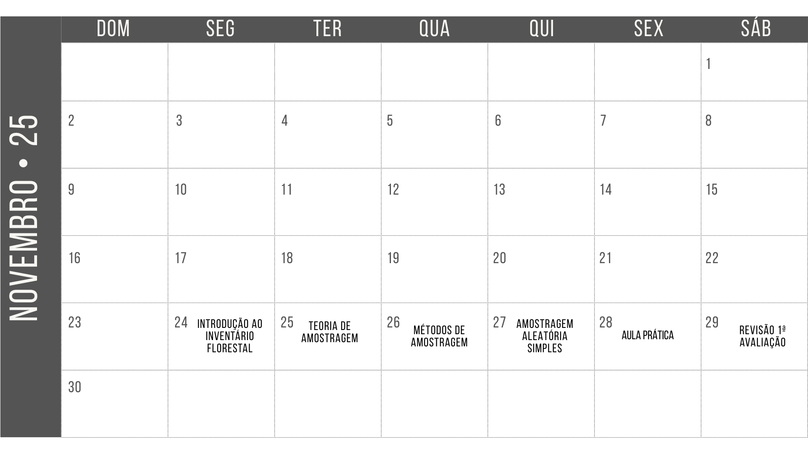
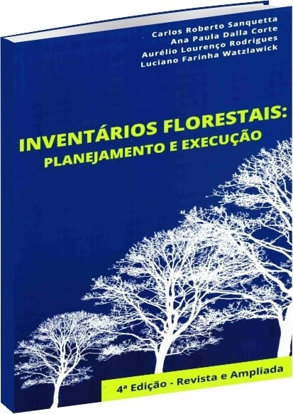
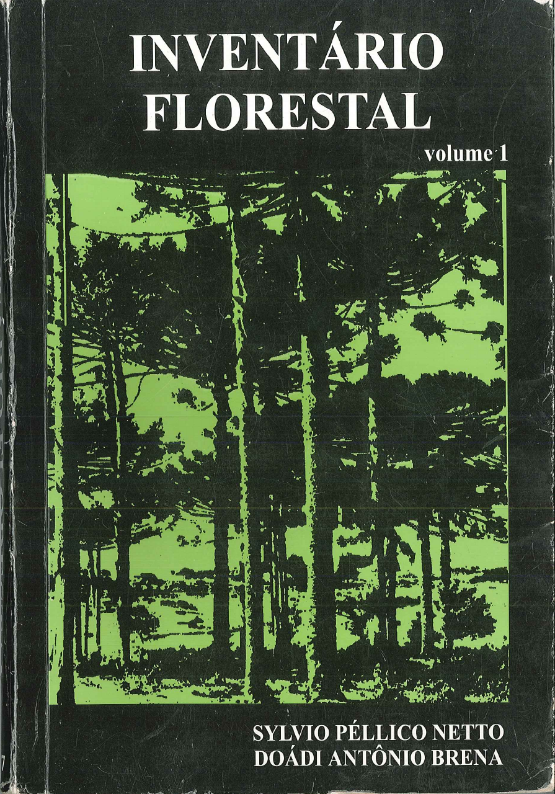

class: title-slide, center, middle
background-image: url(fig/slide-title/LMFTCA.png), url(fig/slide-title/ufra.png), url(fig/slide-title/capa.png)
background-position: 90% 90%, 10% 90%
background-size: 150px, 150px, cover

```{r setup, include=FALSE}
knitr::opts_chunk$set(
  fig.showtext = TRUE,
  fig.align = "center", 
  cache = TRUE,
  error = FALSE,
  message = FALSE, 
  warning = FALSE, 
  collapse = TRUE ,
  dpi = 600)
```

```{r xaringan-logo, echo=FALSE}
library(xaringanExtra)
use_logo(
  image_url = "fig/slide-title/logo.png",
  position = css_position(top = ".8em", right = "1em"),
  width = "200px",
  height = "200px"
)
```

```{r icon, echo=FALSE}
#remotes::install_github("mitchelloharawild/icons")
#library(icons)
#download_fontawesome()
#download_simple_icons()
```

<!-- title-slide -->
<!--# .font120[Inventário Florestal <br> (FL03039 - EF)] -->
# .font100[Inventário Florestal (EFBEL249) <br> (Forma Pará - Polo Pacajá/UFRA)]

## `r anicon::faa("pagelines", animate="horizontal", colour="green")` Programação da Disciplina `r anicon::faa("pagelines", animate="horizontal", colour="green")` <br> ᨒ
###### Período Letivo 2025.1

##### 〰〰〰〰〰〰🌱〰〰〰〰〰〰
##### ᨒ
##### .font120[**Prof. Dr. Deivison Venicio Souza**]
##### Universidade Federal do Pará (UFPA)
##### Faculdade de Engenharia Florestal
##### Laboratório de Manejo Florestal, Tecnologias e Comunidades Amazônicas
##### E-mail: deivisonvs@ufpa.br
<br>
##### 1ª versão: 22/novembro/2021 <br> (Atualizado em: `r format(Sys.Date(),"%d/%B/%Y")`) <br> Pacajá, Pará

---
layout: true
class: with-logo logo-ufpa
<div class="my-header"></div>
<div class="my-footer"><span>Prof. Dr. Deivison Venicio Souza (E-mail: deivisonvs@ufpa.br)&emsp;&emsp;&emsp;&emsp;&emsp; <div3>Inventário Florestal (FL03039 - EF)</div3>/ <div2>Programação e Orientações</div2> </div>

---

## 👋 Olá, sejam bem vindos!
<br>
### **Sobre o facilitador**

.pull-left[
.font60[
1. .green[Graduação (Titulação: ano 2008)]
    - Universidade Federal Rural da Amazônia (UFRA); e
    - Título: Bacharel em Engenharia Florestal.
    
2. .green[Mestrado (Titulação: ano 2011)]
    - Universidade Federal Rural da Amazônia (UFRA);
    - Programa de Pós-graduação em Ciências Florestais (PPGCF); e
    - Área de Concentração: Manejo de Ecossistemas Florestais.

3. .green[Especialização (Titulação: ano 2019)]
    - Universidade Federal do Paraná (UFPR);
    - Área: Big Data e Data Science
    
4. .green[Doutorado (Titulação: ano 2020)]
    - Universidade Federal do Paraná (UFPR);
    - Programa de Pós-graduação em Engenharia Florestal (PPGEF); e
    - Área de Concentração: Manejo Florestal.
]
]

.pull-right[
```{r echo = FALSE, out.width='70%', fig.align='center', fig.cap='', dpi=600}

```
]

---

## 👋 Olá, sejam bem vindos!
<br>
### **Interesses atuais**

.pull-left[
.font60[
1. .green[Linguagem de programação]
    - R
    - Python

2. .green[Modelagem preditiva aplicada à ciência florestal]
    - Métodos Tradicionais e Aprendizado de máquina
    
3. .green[Visão computacional e Inteligência Artificial]
    - Reconhecimento de espécies baseado em imagens (aéreas e terrestres)
    - Deep Learning/Convolutional Neural Networks/Transfer Learning
    - Estimativa de biomassa e carbono
    - Monitoramento da saúde da arborização urbana
    
4. .green[Sistemas Interativos de Visualização e Análise de Dados]
    - Dashboard (Estático e Dinâmico)
    - Aplicação Web (Reconhecimento de espécies)
    - Aplicativo Mobile (Próximos passos...)
]
]

.pull-right[
### **Websites e contatos**

.font80[
`r icons::simple_icons("github")` GitHub: https://github.com/DeivisonSouza

<span class="iconify" data-icon="fa-brands:orcid" data-inline="false"></span>


<div itemscope itemtype="https://schema.org/Person"><a itemprop="sameAs" content="https://orcid.org/0000-0002-2975-0927" href="https://orcid.org/0000-0002-2975-0927" target="orcid.widget" rel="me noopener noreferrer" style="vertical-align:top;">https://orcid.org/0000-0002-2975-0927</a></div>

```{r, echo=FALSE, out.width='20%', fig.align='center', fig.cap=''}

```

Email: deivisonvs@ufpa.br
]
]

---

## 👋 Olá, sejam bem vindos!
<br>

### 🕵 **Projetos de Pesquisa/Extensão Finalizados** (com fomento)

.font90[
<br>
✔️ 1) Sistema de Visão Computacional para Reconhecer Espécies no Manejo Florestal Madeireiro na Amazônia Brasileira. (**Financiador**: Centro de Indústrias Produtoras e Exportadoras de Madeira do Estado de Mato Grosso - CIPEM) - ([https://cipem.org.br/](https://cipem.org.br/))
<br><br>

✔️ 2) Projeto Ipa’wã (Copaíba): Etnomapeamento e inventário de copaibais nativos na TI Xipaya (Aldeias Tukamã, Tukayá e Kaarimã). (**Financiador**: Fundo Brasileiro para a Biodiversidade - FUNBIO) - ([https://www.funbio.org.br/](https://www.funbio.org.br/)) (Parceria entre Associação Indígena Pyjahyry Xipaia – AIPHX e UFPA)
]

---

## 👋 Olá, sejam bem vindos!
<br>

### 🕵 **Projetos de Pesquisa/Extensão em Andamento** (com/sem fomento)

.font90[
<br>
✔️ 1) DeepWood: Reconhecimento de Espécies Florestais Baseado em Imagens de Madeira e Aprendizado Profundo (Portaria/UFPA N. 130/2024). (**Sem Financiador**) - (**Parceria**: Laboratório de Anatomia e Qualidade da Madeira LANAQM/UFPR e LMFTCA/UFPA)
<br><br>

✔️ 2) Apoio ao Fortalecimento da Gestão Territorial e Ambiental da Terra Indígena Xipaya (TI Xipaya) - (Portaria/UFPA N. 95/2025). (**Financiador**: Indigenous Peoples Assistance Facility - IPAF) (**Parceria**: Associação Indígena Pyjahyry Xipaia e LMFTCA/UFPA) - **Proponente**: AIPHX
]

---

## 👋 Olá, sejam bem vindos!
<br>

### 💻 **Siga nossas redes sociais e de parceiros...**
<br>

👉 **Laboratório de Manejo Florestal, Tecnologias e Comunidades Amazônicas - LMFTCA**

✔️ *Instagram LMFTCA*: [@lmftca_ufpa](https://www.instagram.com/lmftca_ufpa/)

✔️ *Site do LMFTCA*:
[https://www.lmftca.com.br/](https://www.lmftca.com.br/)
<br><br>

👉 **Instituto Juma**

✔️ *Instagram IJ*: [@instituto.juma](https://www.instagram.com/instituto.juma/)

✔️ *Site do IJ*:
[https://institutojuma.org/](https://institutojuma.org/)

<!-- Slide 7 -->
---

## 📚 Ementa da disciplina (FL03039 - EF)
<br>
.shadow4[
.font80[
1 - Introdução aos Inventários Florestais; 

2 - Amostragem em Inventários Florestais;

&nbsp;&nbsp;&nbsp;&nbsp;**2.1 - Conceitos Básicos e Principais Estimadores;**

&nbsp;&nbsp;&nbsp;&nbsp;2.2 - Métodos de Amostragem;

&nbsp;&nbsp;&nbsp;&nbsp;2.3 - Amostragem Aleatória Simples - AAS;

&nbsp;&nbsp;&nbsp;&nbsp;2.4 - Amostragem Estratificada - AE;

&nbsp;&nbsp;&nbsp;&nbsp;2.5 - Amostragem Sistemática - AS; 

&nbsp;&nbsp;&nbsp;&nbsp;2.6 - Amostragem em Dois Estágios - ADE; e

&nbsp;&nbsp;&nbsp;&nbsp;2.7 - Amostragem em Conglomerados - AG.

3 - Censo Florestal (Inventário Florestal 100%); e

4 - Amostragem em Múltiplas Ocasiões.


<!--7  5 - Inventário Florestal Nacional; e-->

<!--7  6 - Planejamento e Custos de Inventários Florestais.-->

<!--7 - Tecnologias Aplicadas em Inventários Florestais.-->
]
]

<!-- Slide 2 -->
---

## 🗓 Cronograma .black[.font80[(**Horário: 14h30min - 19h30min**)]]

<br>

```{r, echo = FALSE, out.width='75%', fig.align='center', fig.cap='', dpi=600}

```

<!-- Slide 3 -->
---

## 🗓 Cronograma .black[.font80[(**Horário: 14h30min - 19h30min**)]]

<br>

```{r, echo = FALSE, out.width='75%', fig.align='center', fig.cap='', dpi=600}
knitr::include_graphics("fig/class0/Dez.png")
```

<!-- Slide 7 -->
---

## 👨🏻‍🏫 Estratégias e Ferramentas de Ensino
<br>

.font70[

👉 **Aulas expositivas** (*Sala de Aula*)

Aulas teóricas e práticas presenciais, realização de atividades complementares e avaliações de aprendizado.

<br>

👉 **Aulas práticas (sala e/ou campo)**

Aula prática de análise de IF-100% em Excel para fins de Projetos de Manejo Florestal Sustentável - PMFS (Usando dados reais). Práticas de instalação e medição de parcelas amostrais em povoamentos florestais. 

<br>

👉 **Turma virtual** (*SIGAA*)

Comunicação, envio de atividades complementares e de conteúdos digitas.

<br>

👉 **Vistas Técnicas**: A definir.

<br>

👉 **Repositório GitHub**

Repositório com os slides em .html, arquivos .R e .Rmd, figuras, conjunto de dados (e outros). O repositório pode ser acessado em: [FL03039-IF](https://github.com/DeivisonSouza/FL03039-IF)
]

<!-- Slide 9 -->
---

## ✍ Estratégias de avaliação da aprendizagem

.font80[

<br>

👉 **Atividades práticas**

Exercícios com dados reais (quando possível) para aprendizado de cálculo de estimativas populacionais a partir de dados de diferentes processos de amostragem.

<br>

👉 **Avaliações teóricas**

Avaliações teóricas presenciais.

<br>

👉 **Participação e Engajamento** 

O nível de participação e interação nas aulas presenciais poderá ser critério para definir uma pontuação extra nas avaliações teóricas.
]

<!-- Slide 9 -->
---

## 📝 Média Final
<br><br>

\begin{equation*}
\large
MF1 = \frac{1ª NAP + 2ª NAP}{2}
\end{equation*}

<br><br>

.font80[
**MF1** = Média Final 1

**1ª NAP** = 1ª Nota de Avaliação Parcial (Prova Teórica + Atividades)

**2ª NAP** = 2ª Nota de Avaliação Parcial (Prova Teórica + Atividades)
]

----------------------------------


???
\begin{equation*}
\large
MF = \frac{(NA*2)+NPT}{3}
\end{equation*}

.font80[
**MF** = Média Final

**NA** = Nota das Atividade (Soma das atividades será 10 pts.)

**NP** = Nota das Provas Teóricas (Soma das provas será 10 pts.)

<br>

| Conceito     | Intervalo      |
|--------------|----------------|
| Excelente    | 9,0 ≤ MF ≤ 10    |
| Bom          | 7,0 ≤ MF ≤ 8,9   |
| Regular      | 5,0 ≤ MF ≤ 6,9 |
| Insuficiente | 0 ≤ MF ≤ 4,9   |
]

<!-- Slide 10 -->
---
## 📑 Plano de Ensino
<br><br>

O plano de ensino da disciplina pode ser acessado em:

[Plano de Ensino (FL03039 - IF)](https://github.com/DeivisonSouza/FL03034-EF/blob/master/Slides/PE/EF-PE.pdf)


<!-- Slide 11 -->
---

## 👎 Dos Critérios de Aprovação

<br>

.font80[
Conforme o Regulamento de Graduação da UFRA será reprovado no componente curricular disciplina o discente com:

- Não obtiver a frequência mínima de 75% da carga horária total da disciplina. (.green[**Aplicável**])
<br><br>
- Não alcançar Média Final 1 (MF1), obtida pela média aritmética das Notas Parciais [MF1= (1ª NAP + 2ª NAP)/2], igual ou superior a seis, ou seja, MF1 ≥ 6,0. (.green[**Aplicável**])
]

???
.font80[
Conforme o Regimento Geral da UFPA, será considerado reprovado o discente que:

- Obtiver o conceito Insuficiente (INS), isto é, nota inferior a 5 (cinco); (.green[**Aplicável**])
- Sem Avaliação (SA); ou (.green[**Aplicável**])
- Não obtiver a frequência mínima de 75% na disciplina, isto é, Sem Frequência (SF). (.green[**Aplicável**])
]

<!-- Slide 12 -->
---

## 📜 Normativas

<br>

.font80[

- [Regimento geral da UFRA - Resolução do CONSUN Nº 178, de 6 de junho de 2017](https://novo.ufra.edu.br/images/Regimento_Geral/regimento_ufra_comAlteracoes-FINAL-Resolucao288.pdf)

Contém as disposições básicas que nortearão a vida institucional da UFRA e disciplina os aspectos de organizações e funcionamento dos vários órgãos e unidades que compõe a sua estrutura organizacional.

<br>

- [Resolução n° 725 de 21 de dezembro de 2022, alterada pela Resolução nº 753 de 11 de abril de 2023](https://proen.ufra.edu.br/index.php?option=com_content&view=article&id=345&Itemid=532)

A Regulamentação do Ensino de graduação da UFRA, aprovada pelo Conselho Superior de Ensino, Pesquisa e Extensão (CONSEPE) através da Resolução n° 725 de 21 de dezembro de 2022, alterada pela Resolução n. 753 de 11 de abril de 2023.
]

-----------------------------------------------------

???
.font80[
- [Regimento geral da UFPA de 29/12/2006](chrome-extension://efaidnbmnnnibpcajpcglclefindmkaj/https://www.ufpa.br/images/docs/regimento_geral.pdf)

Disciplina os aspectos gerais e comuns da estruturação e do funcionamento dos órgãos e serviços da Universidade Federal do Pará (UFPA), cujo Estatuto regulamenta.

- [Resolução n. 4.399, de 14 de maio de 2013](chrome-extension://efaidnbmnnnibpcajpcglclefindmkaj/http://www.proeg.ufpa.br/images/Artigos/Academico/Downloads/Regulamento_de_Graduacao.pdf)

Aprova o Regulamento do Ensino de Graduação da Universidade Federal do Pará.

- [Resolução  n. 5.845, de 16 de dezembro de 2024](https://sege.ufpa.br/boletim_interno/downloads/resolucoes/consepe/2024/5845%20Aprova%20o%20Calend%C3%A1rio%20Acad%C3%AAmico%20da%20UFPA%20-%202025.pdf)

Aprovou o Calendário Acadêmico da Universidade Federal do Pará para o ano de 2025.
]

<!-- Slide 12 -->
---

## 📖 Bibliografia básica

<br>
.pull-left-4[
.font80[
SANQUETTA, C. R.; CORTE, A. P. D.; RODRIGUES, A. L.; WATZLAWICK, L. F. **Inventários Florestais: Planejamento e execução**. 2023, 406 p. 4ª Edição.

<br>

👉 **Acesso em**: [Inventários Florestais: Planejamento e execução](https://www.editoraufv.com.br/produto/inventarios-florestais-planejamento-e-execucao-4-edicao/1965483?srsltid=AfmBOoop0gyo-kLMzP9hB7ILWmIX3qxJR2DKLW1LUWpZzTDt-dthnAZG)

]
<br><br>
]

.pull-right-4[
```{r, echo=FALSE, out.width='60%', fig.align='center', fig.cap='', dpi=600}

```

]

---

## 📖 Bibliografia básica

<br>
.pull-left-4[
.font80[
PÉLLICO NETTO, S.; BRENA, D.A. **Inventário florestal**. Curitiba: editorado pelos autores, 1997. 316 p.

]
<br><br>
]

.pull-right-4[
```{r, echo=FALSE, out.width='60%', fig.align='center', fig.cap='', dpi=600}

```

]

---

## Bibliografia básica

<br>
.pull-left-4[
SOARES, C. P. B.; PAULA NETO, F.; SOUZA, A. L. **Dendrometria e Inventário Florestal**. 2ª ed. - Viçosa, MG: Ed. UFV, 2011. 272 p.
<br><br>

**.green[Capítulos do livro estão na Web]** `r anicon::faa("hand-point-down", animate="vertical")`

Link: http://www.mensuracaoflorestal.com.br/sobre-o-site


]

.pull-right-4[
```{r, echo=FALSE, out.width='65%', fig.align='center', fig.cap='', dpi=600}
knitr::include_graphics('https://editoraufv.cdn.plataformaneo.com.br/produto/3492395282_dendrometria-e-inventario-florestal.jpg')
```

]

<!-- Slide 14 -->
---

## 📖 Bibliografia complementar

.font80[
<br><br>
AVERY, T. E.; BURKHART, H. E. **Forest Measurements**. McGraw Hill Book Co., Nova York, 1994, 408p.
<br><br>
QUEIROZ, W. T. **Técnicas de amostragem em inventário florestal nos trópicos**. Belém: FCAP. Serviço de Documentação e Informação, 1998. 147 p.
<br><br>
SCOLFORO, J. R. S.; MELLO, J. M. **Inventário Florestal**. Lavras: UFLA/FAEPE, 2006. 561p.
<br><br>
SOARES, C. P. B.; PAULA NETO, F.; SOUZA, A. L. **Dendrometria e inventário florestal**. 2ª ed. - Viçosa, MG: Ed. UFV, 2011. 272p.
]

---

layout: false
name: etim
class: inverse, middle, center
background-image: url(fig/class0/sec.png)
background-size: cover

## .font200[Obrigado!]

```{r, echo=FALSE, out.width='20%', fig.align='center', fig.cap='', dpi=600}
knitr::include_graphics('fig/slide-title/LMFTCA.png')
```

👨🏻‍👩🏻‍👦🏻‍👦🏻 [@lmftca_ufpa](https://www.instagram.com/lmftca_ufpa/)

🌎 [https://www.lmftca.com.br/](https://www.lmftca.com.br/)

