class: title-slide, center, middle
background-image: url(fig/slide-title/LMFTCA.png), url(fig/slide-title/ufpa.png), url(fig/slide-title/capa.png)
background-position: 90% 90%, 10% 90%
background-size: 150px, 150px, cover

```{r setup, include=FALSE}
knitr::opts_chunk$set(
  fig.showtext = TRUE,
  fig.align = "center", 
  cache = TRUE,
  error = FALSE,
  message = FALSE, 
  warning = FALSE, 
  collapse = TRUE ,
  dpi = 600)
```

```{r xaringan-logo, echo=FALSE}
library(xaringanExtra)
use_logo(
  image_url = "fig/slide-title/logo.png",
  position = css_position(top = ".8em", right = "1em"),
  width = "200px",
  height = "200px"
)
```

```{r icon, echo=FALSE}
#remotes::install_github("mitchelloharawild/icons")
#library(icons)
#download_fontawesome()
#download_simple_icons()
```

```{r packages, include=FALSE}
# remotes::install_github("dill/emoGG")
library(ggplot2)
library(dplyr)
library(ggimage)
```


<!-- title-slide -->
# .font120[Inventário Florestal <br> (FL03039 - EF)]

## `r anicon::faa("pagelines", animate="horizontal", colour="green")` Métodos de Amostragem`r anicon::faa("pagelines", animate="horizontal", colour="green")` <br> 🌳
###### Área Fixa e Área Variável

##### 〰〰〰〰〰〰🌳〰〰〰〰〰〰
##### ᨒ
##### .font120[**Prof. Dr. Deivison Venicio Souza**]
##### Universidade Federal do Pará (UFPA)
##### Faculdade de Engenharia Florestal
##### Laboratório de Manejo Florestal, Tecnologias e Comunidades Amazônicas
##### E-mail: deivisonvs@ufpa.br
<br>
##### 1ª versão: 22/Novembro/2021 <br> (Atualizado em: `r format(Sys.Date(),"%d/%B/%Y")`) <br> Altamira, Pará

---
layout: true
class: with-logo logo-ufpa
<div class="my-header"></div>
<div class="my-footer"><span>Prof. Dr. Deivison Venicio Souza (E-mail: deivisonvs@ufpa.br)&emsp;&emsp;&emsp;&emsp;&emsp; <div3>Inventário Florestal (FL03039 - EF)</div3>/ <div2>Métodos de Amostragem</div2> </div>

---

## 📚 Ementa da disciplina (FL03039 - EF)
<br>
.shadow4[
.font80[
1 - Introdução aos Inventários Florestais; 

2 - Amostragem em Inventários Florestais;

&nbsp;&nbsp;&nbsp;&nbsp;2.1 - Conceitos Básicos e Principais Estimadores;

&nbsp;&nbsp;&nbsp;&nbsp;**2.2 - Métodos de Amostragem**;

&nbsp;&nbsp;&nbsp;&nbsp;2.3 - Amostragem Aleatória Simples - AAS;

&nbsp;&nbsp;&nbsp;&nbsp;2.4 - Amostragem Estratificada - AE;

&nbsp;&nbsp;&nbsp;&nbsp;2.5 - Amostragem Sistemática - AS; 

&nbsp;&nbsp;&nbsp;&nbsp;2.6 - Amostragem em Dois Estágios - ADE; e

&nbsp;&nbsp;&nbsp;&nbsp;2.7 - Amostragem em Conglomerados - AG.

3 - Censo Florestal (Inventário Florestal 100%); 

4 - Amostragem em Múltiplas Ocasiões;

5 - Inventário Florestal Nacional; e

6 - Planejamento e Custos de Inventários Florestais.

<!--7 - Tecnologias Aplicadas em Inventários Florestais.-->
]
]

---

## 🎯 Objetivos
<br><br>
.font80[
Ao final desta aula espera-se que o discente seja capaz de...

* Conhecer os principais método de amostragem aplicados em inventário florestais;
* Compreender a diferença entre método de amostragem de área fixa e de área variável;
* Compreender e aplicar o Fator de Proporcionalidade (FP) no método de área fixa;
* Calcular estimativas de número de árvores, área basal e volume por hectare; e
* Entender as vantagens e desvantagens do emprego do método de área fixa em inventários florestais por amostragem.
]

---

## 📙 Conteúdo
<br>
.pull-left-4[
.pull-top[
👉 **Parte 1 - Método de Área Fixa**
.font80[

[1 - Conceito e Tipos](#ct)

[2 - Unidade de Amostra Circular](#uac)

[3 - Unidade de Amostra Quadrada](#uaq)

[4 - Unidade de Amostra Retangular](#uar)

[5 - Fator de Proporcionalidade](#fp)

[6 - Estimativas de Número de Árvores, Área Basal e Volume](#est)

[7 - Vantagens e Desvantagens](#vd)

[8 - Exemplo do Método de Área Fixa](#emaf)

]
]
]

.pull-right-4[
👉 **Parte 2 - Método de Área Variável**
.font80[
[1 - Método de Bitterlich](#mb)

[2 - Método da Linha Interceptadora](#mli)

[3 - Método de Strand](#ms)

[4 - Método de Prodan](#mp)

]
]

<!-- Slide XX -->
---
layout: false
name: if
class: inverse, middle, center
background-image: url(fig/class0/sec.png)
background-size: cover

.font150[**Métodos de Amostragem <br> (Conceitos e Tipos)**]

---
layout: true
class: with-logo logo-ufpa
<div class="my-header"></div>
<div class="my-footer"><span>Prof. Dr. Deivison Venicio Souza (E-mail: deivisonvs@ufpa.br)&emsp;&emsp;&emsp;&emsp;&emsp; <div3>Inventário Florestal (FL03039 - EF)</div3>/ <div2>Métodos de Amostragem</div2> </div>

---
name: ma
## 🌳 Métodos de Amostragem

.shadow1[
### Conceito

- É a forma de .blue[abordagem da população florestal] referente a .blue[uma única unidade de amostra] (ou parcela). Ou seja, o tipo de unidade amostral a ser empregada no inventário florestal. 
]

---
name: ma
## 🌳 Métodos de Amostragem

```{r, echo=FALSE, out.width='60%', fig.align='center', fig.cap='', dpi=600}
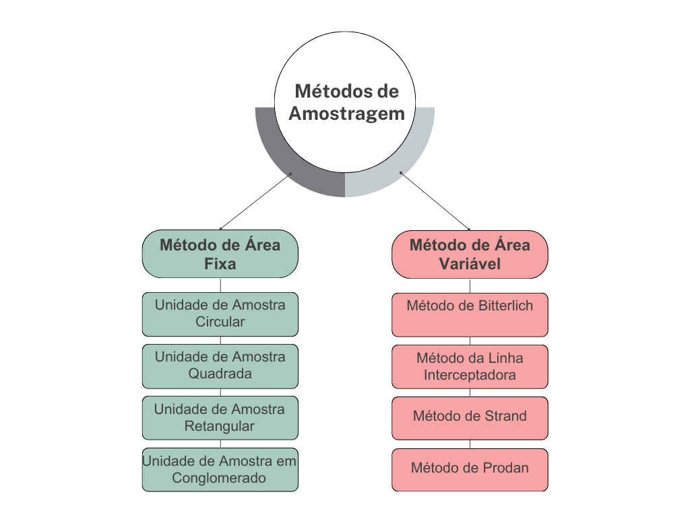
```

---
layout: false
name: if
class: inverse, middle, center
background-image: url(fig/class0/sec.png)
background-size: cover

.font150[**Métodos de Área Fixa**]

---
layout: true
class: with-logo logo-ufpa
<div class="my-header"></div>
<div class="my-footer"><span>Prof. Dr. Deivison Venicio Souza (E-mail: deivisonvs@ufpa.br)&emsp;&emsp;&emsp;&emsp;&emsp; <div3>Inventário Florestal (FL03039 - EF)</div3>/ <div2>Métodos de Amostragem</div2> </div>

---

## 🌳 Métodos de Amostragem

.shadow1[
### Método de Área Fixa - .black[Características]
.font90[
- A .blue[seleção] dos indivíduos é feita .blue[proporcional à área da Unidade de Amostra (UA)];
- O quantitativo da variável de interesse calculado para uma UA de área fixa é extrapolado para hectare (unidade de área), por meio de um fator denominado .blue[Fator de proporcionalidade - FP].
<br>

**Obs.:** Essa extrapolação para hectare somente é necessária quando a UA tem dimensão diferente de 1 hectare.

**Fonte**: Sanquetta et al. (2009)
]
]

---

## 🌳 Métodos de Amostragem

.shadow1[
### Método de Área Fixa - .black[Forma e Tamanho de Parcelas]
.font80[
- Existem diversos tipos de parcelas (unidades de amostras) que podem ser usadas em campo para realização de inventários florestais por amostragem.
- Essas parcelas podem variar de forma e tamanho em função da condição de campo ou objetivo.
- **Decisão:** é orientada pela .blue[maior praticidade e operacionalidade] de sua localização e demarcação em campo.
]
]

```{r, echo=FALSE, out.width='45%', fig.align='center', fig.cap='', dpi=600}
knitr::include_graphics('fig/class4/formas.png')
```

---

## 🌳 Métodos de Amostragem

.shadow1[
### Método de Área Fixa - .black[Parcelas Circulares]
.font80[
- **Mais Usual**: em inventário amostral de .blue[plantações florestais];
- **Mais eficiente**: Dentre todas as formas de parcelas, admitindo-se a .blue[mesma área], é aquela que possui .blue[menor perímetro] e, por conseguinte, .blue[minimizam o problema de árvores marginais];
- **Raio da parcela**: O controle do raio é o aspecto mais importante;
- **Tamanho**: Raios > 15 metros não são recomendáveis, pois são pouco operacionais e inviabilizam um IF eficiente.
<br>

👉 **Tamanho Médio**: varia de 400 m<sup>2</sup> a 600 m<sup>2</sup>

👉 **Tamanho Máximo**: 700 m<sup>2</sup>

<br>
**Fonte**: Sanquetta et al. (2009)
]
]

---

## 🌳 Métodos de Amostragem
<br>

.pull-left-4[
```{r, echo=FALSE, out.width='80%', fig.align='center', fig.cap='', dpi=600}
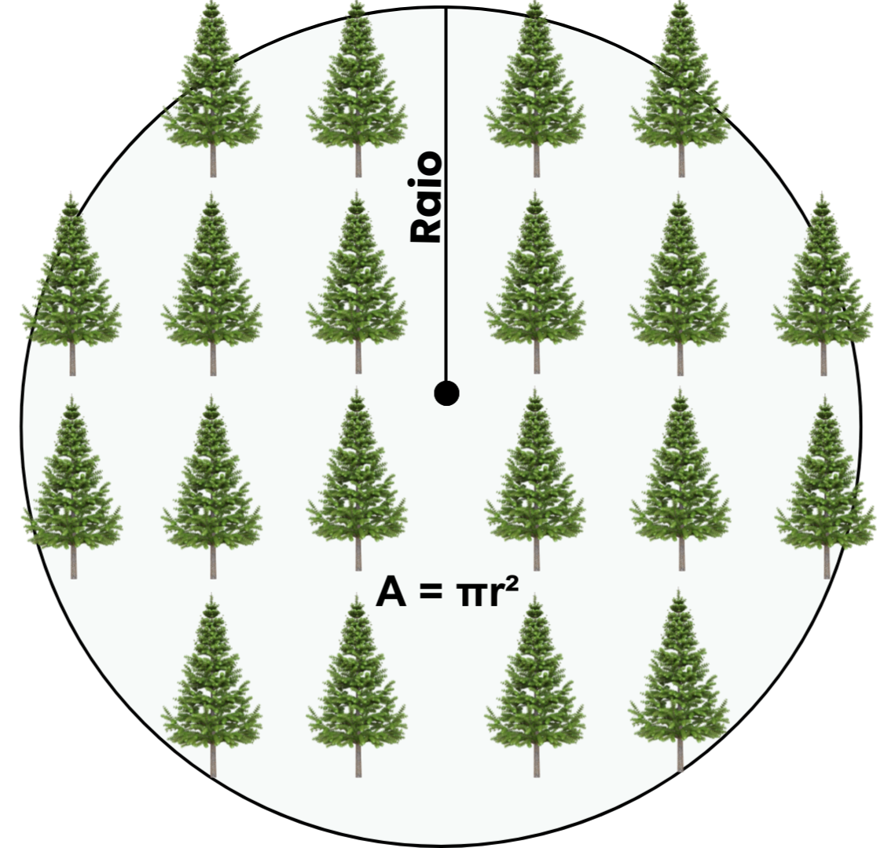
```
]

--

.pull-right-4[
.shadow3[
.center[
#### 👉 Unidade de Amostra Circular
]

- **Área da parcela circular**: 

$$A = \pi r^2 = \frac{\pi d^2}{4} (m^2~ou~ha)$$ 
.font80[
r = raio da parcela, em metros

d = 2r (d = diâmetro da parcela, em metros)

π = 3,14159 (constante infinita)
<br><br>

1 hectare ➔ 10.000 m²

]
]
]

---

## 🌳 Métodos de Amostragem
<br>

.pull-left-4[
```{r, echo=FALSE, out.width='80%', fig.align='center', fig.cap='', dpi=600}
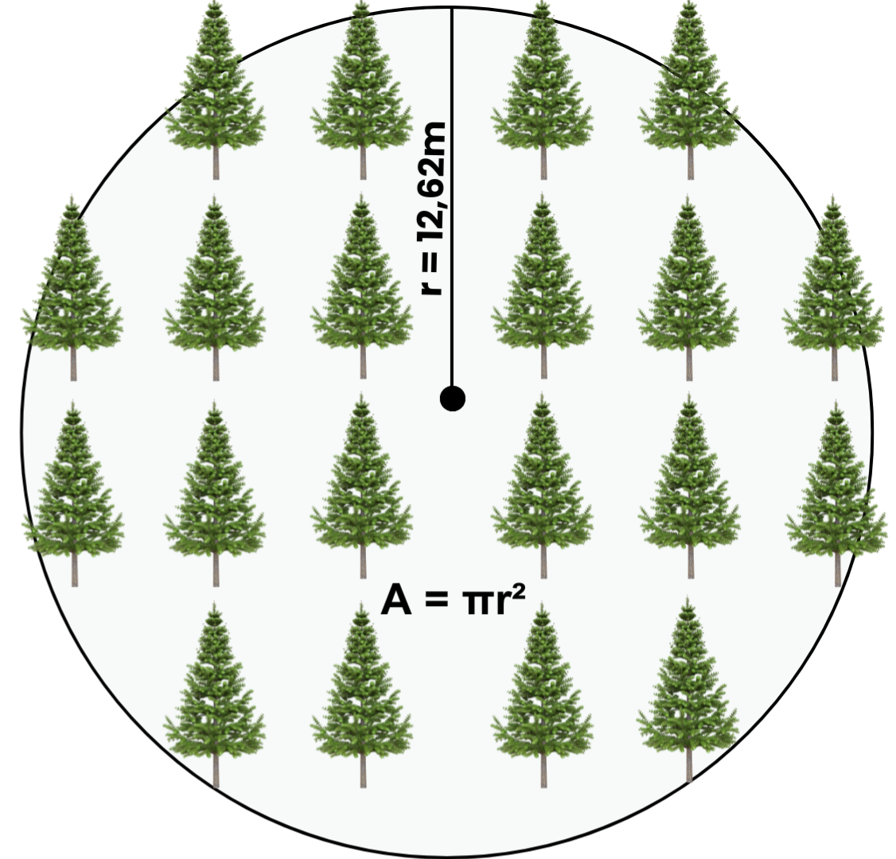
```
]

--

.pull-right-4[
.shadow3[
.center[
#### 👉 Unidade de Amostra Circular
]
.font80[
- 🤔 **Qual a área da parcela, em m² e hectare, para os valores de raios diâmetros a seguir**:


✍ raio = 12,62m❓

--

A = π(12,62) 👉 .blue[A = **500,34** m²] (em metro quadrado)

A = 500,34m²/10.000m² = .blue[A = **0,050034** ha] (em hectare)

<br>

✍ raio = 13,82m❓
]
]
]

---

## 🌳 Métodos de Amostragem

.shadow3[
.font80[
### Método de Área Fixa - .black[Parcelas Circulares]
<br>
👉 **Como controlar o raio da parcela?**

- As parcelas circulares requerem o controle preciso do raio para garantir a inclusão correta de árvores.
- Alguns procedimentos têm sido empregados:
<br>

**1 – Uso de corda**

**2 – Controladores automáticos de distância** (plot centers com transponder e Vertex III)

<br>
**Fonte**: Sanquetta et al. (2009)
]
]

---

## 🌳 Métodos de Amostragem

<br>
.pull-left-2[
.shadow3[
.font80[
### Método de Área Fixa - .black[Parcelas Circulares]
<br>
👉 **Critérios de inclusão de árvores?**

- **Árvores marginais**: em parcelas circulares podem ocorrer árvores marginais.
- Portanto, é importante definir um critério de inclusão de árvores marginais.
]
]
]

<br>

.pull-right-1[
```{r, echo=FALSE, out.width='100%', fig.align='center', fig.cap='', dpi=600}
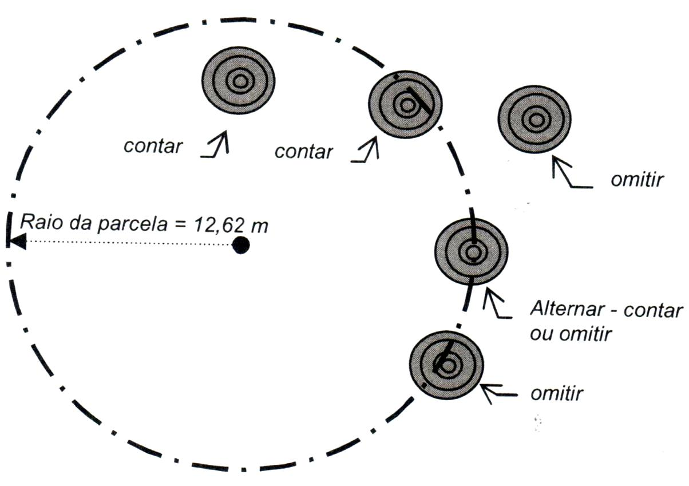
```
<br>
.font80[
**Fonte**: Sanquetta et al. 2009
]
]

---

## 🌳 Métodos de Amostragem

.shadow1[
### Método de Área Fixa - .black[Parcelas Quadradas]
.font80[
- **Fácil instalação**: Maior facilidade de instalação (plantios com alinhamentos bem definidos);
- **Parcelas Permanentes**: Usual em monitoramento da dinâmica de florestas naturais (Inventário Florestal Contínuo - IFC).
<br>

👉 **Inventários pré-corte (Floresta Plantada)**: 400 m² (20 m x 20 m) a 900 m² (30 m x 30 m)

👉 **Florestas naturais**: 900 m² (30 m x 30 m) a 10.000 m² (100 m x 100 m).

<br>

**Obs.:** Em floresta plantadas é recomendável usar parcelas quadradas quando o espaçamento entre linhas e entrelinhas for quadrado. Por exemplo, espaçamento 3 m x 3 m. Do contrário, recomenda-se usar parcelas retangulares.


<br>
**Fonte**: Sanquetta et al. (2009; 2023)
]
]

---

## 🌳 Métodos de Amostragem
<br>

.pull-left-4[
```{r, echo=FALSE, out.width='80%', fig.align='center', fig.cap='', dpi=600}
knitr::include_graphics('fig/class4/AQ.png')
```
]

--

.pull-right-4[
.shadow3[
.center[
#### 👉 Unidade de Amostra Quadrada
]

- **Área da parcela quadrada**: 

$$A = L^2 ~ (m^2~ou~ha)$$ 
.font80[
L = comprimento do lado do quadrado, em metros

<br>

1 hectare ➔ 10.000 m²

]
]
]

---

## 🌳 Métodos de Amostragem
<br>

.pull-left-4[
```{r, echo=FALSE, out.width='80%', fig.align='center', fig.cap='', dpi=600}
knitr::include_graphics('fig/class4/AQCalc.png')
```
]

--

.pull-right-4[
.shadow3[
.center[
#### 👉 Unidade de Amostra Quadrada
]
.font80[
- 🤔 **Qual a área da parcela, em m² e hectare, admitindo os seguintes valores de lados de quadrados**:


✍ L = 50m❓

--

A = 50² 👉 .blue[A = **2.500** m²] (em metro quadrado)

A = 2.500m²/10.000m² = .blue[A = **0,25** ha] (em hectare)

<br>

✍ L = 100m❓
]
]
]

---

## 🌳 Métodos de Amostragem

.shadow1[
### Método de Área Fixa - .black[Parcelas Retangulares]
.font80[
- **Florestas nativas**: Recomendada para situações de maior heterogeneidade da formação vegetal;
- **Florestas plantadas**: Recomendada quando o espaçamento entre linhas e entrelinhas não for quadrado. Por exemplo, espaçamento 2 m x 3 m.
<br>

👉 **Tamanho mais usual**: 2.500 m² (10 m x 250 m)

👉 **Tamanhos recomendados**: 1000 m² (10 m x 100 m ou 20 m x 50 m) a 10.000 m² (20 m x 500 m).

<br>
**Fonte**: Sanquetta et al. (2009; 2023)
]
]

---

## 🌳 Métodos de Amostragem
<br>

.pull-left-4[
<br>
```{r, echo=FALSE, out.width='90%', fig.align='center', fig.cap='', dpi=600}
knitr::include_graphics('fig/class4/AR.png')
```
]

--

.pull-right-4[
.shadow3[
.center[
#### 👉 Unidade de Amostra Retangular
]

- **Área da parcela retangular**: 

$$A = bh ~ (m^2~ou~ha)$$ 
.font80[
b = base do retângulo, em metros

h = altura do retângulo, em metros

<br>

1 hectare ➔ 10.000 m²

]
]
]

---

## 🌳 Métodos de Amostragem
<br>

.pull-left-4[
<br><br>
```{r, echo=FALSE, out.width='90%', fig.align='center', fig.cap='', dpi=600}
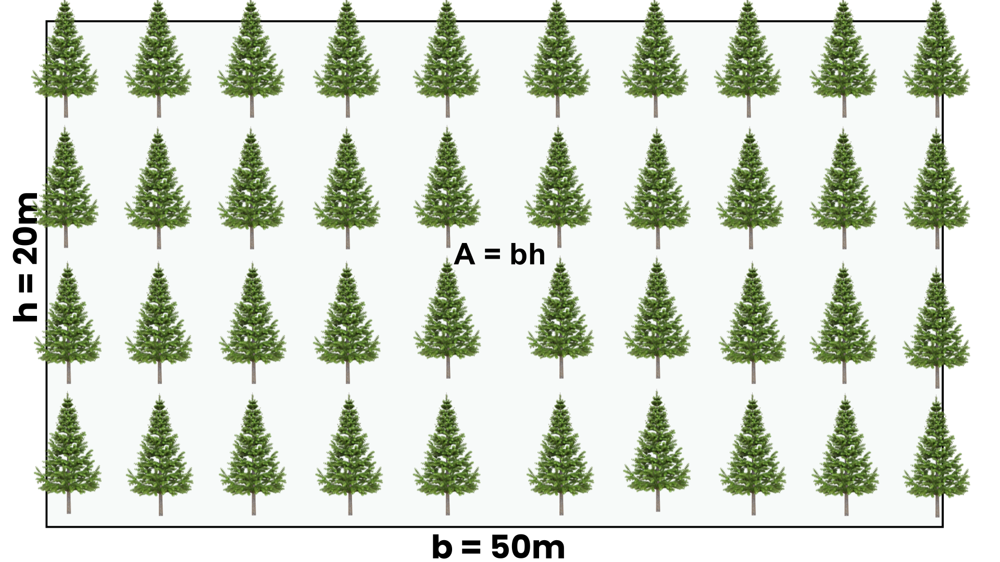
```
]

--

.pull-right-4[
.shadow3[
.center[
#### 👉 Unidade de Amostra Retangular
]
.font80[
- 🤔 **Qual a área da parcela, em m² e hectare, admitindo os seguintes valores de base e altura dos retângulos**:


✍ b = 50m e h = 20m❓

--

A = 50x20 👉 .blue[A = **1.000** m²] (em metro quadrado)

A = 1.000m²/10.000m² = .blue[A = **0,1** ha] (em hectare)

<br>

✍ b = 500m e h = 20m❓
]
]
]

---

## 🌳 Métodos de Amostragem

.shadow1[
### Método de Área Fixa - .black[Fator de Proporcionalidade]
.font80[
- No método de área fixa, a variável de interesse é medida em parcelas amostrais com tamanho de área definido;
- Por exemplo, se a variável de interesse é volume de madeira e a área da parcela é 1ha, então o volume será expresso em m³.ha<sup>-1</sup> (m³/ha);
- No entanto, nem sempre são usadas parcelas de área igual a 1 hectare;
- Por exemplo, se empregada uma parcela de 2500m², então volume calculado seria expresso em m³/2500m²;
- Em inventários florestais é usual apresentar as estimativas dos parâmetros populacionais por hectare (número de árvores, área basal e volume por hectare); e
- Portanto, pode-se fazer uma simples extrapolação usando um **Fator de Proporcionalidade - FP**.

.pull-left-4[
<br>
$$
\large
\begin{equation*}
FP = \frac{A}{a}
\end{equation*}
$$
]

.pull-right-4[
<br>
**Em que:**

$A$ = Área de 1 hectare (10.000 m²)

$a$ = Área da unidade amostral (em m² ou ha)

]
]
]

---

## 🌳 Métodos de Amostragem

.shadow1[
### Método de Área Fixa - .black[Fator de Proporcionalidade]
]

.pull-left-4[
.font80[
<br>
✍ Calcule o FP para cada tamanho de parcela a seguir:

| **Área da parcela (m²)** | **Fator de Proporcionalidade - FP** |
|:------------------------:|:-----------------------------------:|
|            100           |                  100                 |
|            400           |                  ❓                  |
|            500           |                  ❓                  |
|            600           |                  ❓                  |
|            800           |                  ❓                  |
|           1000           |                  ❓                  |
|           2.500          |                  ❓                  |
|          10.000          |                  ❓                  |

]
]

--

.pull-right-4[
<br>
**Exemplo**:

$$
\large
\begin{equation*}
FP = \frac{A}{a} = \frac{10.000~m²}{100~m²} = 100
\end{equation*}
$$

.center[**ou**]

$$
\large
\begin{equation*}
FP = \frac{A}{a} = \frac{1~ha}{0,01~ha} = 100
\end{equation*}
$$

]

---

## 🌳 Métodos de Amostragem

.shadow1[
### Método de Área Fixa - .black[Extrapolação das estimativas para hectare]
.font80[
- Uma vez calculado o FP pode-se extrapolar as estimativas dos parâmetros populacionais para hectare (Péllico Netto; Brena, 1997; Sanquetta et al., 2009; 2023
]
]

.pull-left-4[
.font80[**Estimativa do número de árvores por hectare (N):**]

$$
\large
\begin{equation*}
N = m.FP
\end{equation*}
$$

.font80[**Estimativa da área basal por hectare (G):**]

$$
\large
\begin{equation*}
G = \sum_{i}^{m}g_i.FP
\end{equation*}
$$

]

.pull-right-4[

.font80[**Estimativa do volume por hectare (V):**]

$$
\large
\begin{equation*}
V = \sum_{i}^{m}v_i.FP
\end{equation*}
$$
.font80[
Em que:

$m$ = nº de árvores incluídas na UA

$g_i$ = área transversal da $i$-ésima árvore da UA

$v_i$ = volume da $i$-ésima árvore da UA
]
]

---

## 🌳 Métodos de Amostragem

.shadow1[
### Método de Área Fixa - .black[Fator de Proporcionalidade]
.font80[
- 👉 **Vamos praticar**: Suponha que uma unidade de amostra de tamanho 20 m x 20 m (400 m²) foi instalada em um povoamento plantado de *Tectona gradis* (espaçamento 3,5 m x 3,5 m), implantado com objetivo de produzir madeira serrada. Foram medidas as circunferências a 1,30m do solo e altura de cada árvore (n = 36).
]
]

--

.pull-left-10[
```{r, echo=FALSE, out.width='60%', fig.align='center', fig.cap='', dpi=600}
knitr::include_graphics('fig/class4/exer.png')
```
]

.pull-right-10[
.shadow3[
.font80[
**Então, pede-se:**

- Converter as circuferências das árvores para diâmetro.
- Calcular as áreas transversais (gi) de cada árvore.
- Calcular o volume individual (vi) de cada árvore.
- Calcular a área basal da parcela (m²/400m²).
- Calcular o volume da parcela (m²/400m²).
- Calcular o número de árvores por hectare.
- Calcular a área basal por hectare.
- Calcular o volume por hectare.
]
]
]

---

## 🌳 Métodos de Amostragem

.pull-left-1[
```{r, echo=FALSE, out.width='40%', fig.align='left', fig.cap='', dpi=600}
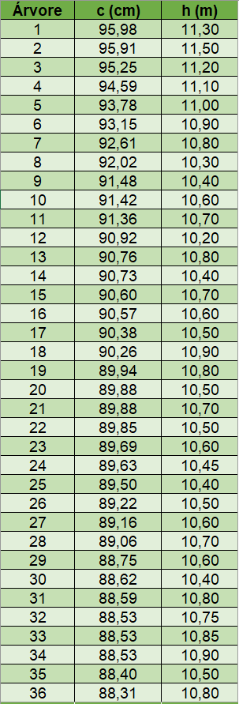
```
]

--

.pull-right-2[
.font80[
**Fórmulas úteis:**
.pull-left-11[
👉 **Conversão circunferência para diâmetro:**
$$
\normalsize
\begin{equation*}
d = \frac{c}{\pi}
\end{equation*}
$$

👉 **Área Transversal (m²):**
$$
\normalsize
\begin{equation*}
g_i = \frac{\pi d^2}{40000}
\end{equation*}
$$

👉 **Volume da árvore em pé:**

$$
\normalsize
\begin{equation*}
v_i = g_i.h.0,7
\end{equation*}
$$

👉 **Fator de Proporcionalidade:**
$$
\normalsize
\begin{equation*}
FP = \frac{A}{a}
\end{equation*}
$$

]

.pull-right-11[

👉 **Número de árvores por hectare (árvore/ha):**
$$
\normalsize
\begin{equation*}
N = m.FP
\end{equation*}
$$

👉 **Área Basal por hectare (m²/ha):**
$$
\normalsize
\begin{equation*}
G = \sum_{i}^{m}g_i.FP
\end{equation*}
$$

👉 **Volume por hectare (m³/ha):**
$$
\normalsize
\begin{equation*}
V = \sum_{i}^{m}v_i.FP
\end{equation*}
$$

]
]
]

---

## 🌳 Métodos de Amostragem

.pull-left-4[
```{r, echo=FALSE, out.width='80%', fig.align='left', fig.cap='', dpi=600}
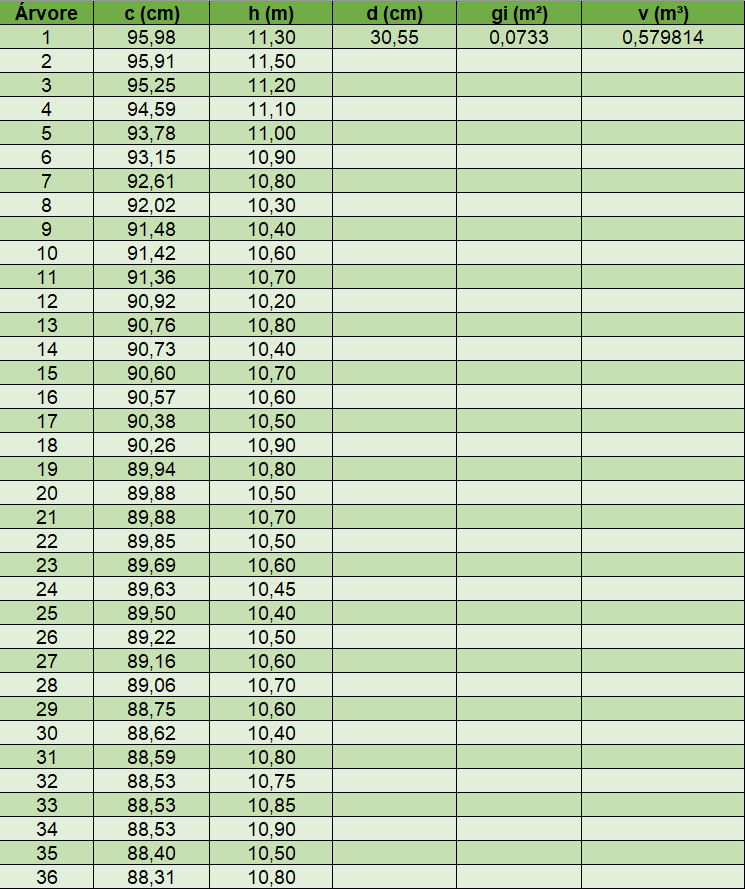
```
]

--

.pull-right-4[
.font80[
**Exemplo de cálculo:**
<br>

👉 **Conversão circunferência para diâmetro (cm):**
$$
\normalsize
\begin{equation*}
d = \frac{c}{\pi} = \frac{95,98}{\pi} = \color{blue}{30,55}~\color{magenta}{cm}
\end{equation*}
$$

👉 **Área Transversal (m²):**
$$
\normalsize
\begin{equation*}
g_i = \frac{\pi d^2}{40000} = \frac{\pi (30,55^2)}{40000} = \color{blue}{0,0733}~\color{magenta}{m²}
\end{equation*}
$$

👉 **Volume da árvore em pé (m³):**

$$
\normalsize
\begin{equation*}
v_i = g_i.h.0,7 = 0,0733.(11,30).0,7 = \color{blue}{0,5798}~\color{magenta}{m³}
\end{equation*}
$$
<br>

.center[.blue[**Faça os cálculos para as demais árvores!**]]

]
]

---

## 🌳 Métodos de Amostragem

.pull-left-4[
```{r, echo=FALSE, out.width='80%', fig.align='left', fig.cap='', dpi=600}
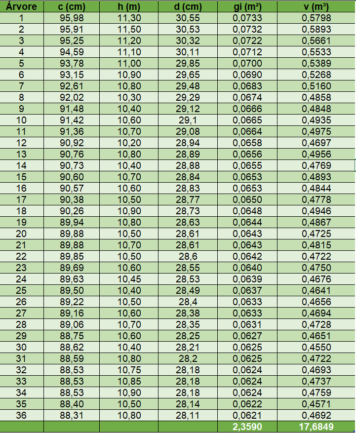
```
]

--

.pull-right-4[
.font80[
**Exemplo de cálculo:**
<br>

👉 **Área Basal da parcela (m²/400 m²):**
$$
\normalsize
\begin{equation*}
G = \sum_{i}^{m}g_i = 0,0733 + ... + 0,0621 = \color{blue}{2,3590}~\color{magenta}{m²/400~m²}
\end{equation*}
$$


👉 **Volume da parcela (m³/400 m²):**
$$
\normalsize
\begin{equation*}
V = \sum_{i}^{m}v_i = 0,5798 + ... + 0,4692 = \color{blue}{17,6849}~\color{magenta}{m³/400~m²}
\end{equation*}
$$
<br>

.center[.red[**Atenção**]`r anicon::faa("exclamation-triangle", colour="red")`: .blue[a Área Basal e o Volume calculados estão em função da área da parcela, isto é, 400 m². Portanto, precisamos extrapolar para hectare!]]

]
]

---

## 🌳 Métodos de Amostragem

.shadow1[
### Método de Área Fixa - .black[Extrapolação das estimativas para hectare]
]

<br>

.pull-left-4[
👉 .font80[**Fator de Proporcionalidade - FP:**]

$$
\normalsize
\begin{equation*}
FP = \frac{A}{a} = \frac{10.000~m²}{400~m²} = \color{blue}{25}
\end{equation*}
$$

👉 .font80[**Estimativa do número de árvores por hectare (N):**]

$$
\normalsize
\begin{equation*}
N = m.FP = 36.(25) = \color{blue}{900}~\color{magenta}{árvores.ha^{-1}}
\end{equation*}
$$

👉 .font80[**Estimativa da área basal por hectare (G):**]

$$
\normalsize
\begin{equation*}
G = \sum_{i}^{m}g_i.FP = 2,3590.(25) = \color{blue}{58,98}~\color{magenta}{m².ha^{-1}}
\end{equation*}
$$

]

.pull-right-4[

👉 .font80[**Estimativa do volume por hectare (V):**]

$$
\normalsize
\begin{equation*}
V = \sum_{i}^{m}v_i.FP = 17,6849.(25) = \color{blue}{442,12}~\color{magenta}{m³.ha^{-1}}
\end{equation*}
$$
.font80[
Em que:

$m$ = nº de árvores incluídas na UA

$g_i$ = área transversal da $i$-ésima árvore da UA

$v_i$ = volume da $i$-ésima árvore da UA
]
]

---

layout: false
name: if
class: inverse, middle, center
background-image: url(fig/class0/sec.png)
background-size: cover

.font150[**Métodos de Área Variável**]

---
layout: true
class: with-logo logo-ufpa
<div class="my-header"></div>
<div class="my-footer"><span>Prof. Dr. Deivison Venicio Souza (E-mail: deivisonvs@ufpa.br)&emsp;&emsp;&emsp;&emsp;&emsp; <div3>Inventário Florestal (FL03039 - EF)</div3>/ <div2>Métodos de Amostragem</div2> </div>

---

## 🌳 Métodos de Amostragem

.pull-left-3[
.shadow1[
### Método de Bitterlich - .black[Walter Bitterlich]
.font80[
- **Walter Bitterlich**: Engenheiro Florestal Austríaco.
- **Relascopia**: .blue[Rela] (Latim) = **Contagem** e .blue[Skopein] (Grego) = **Olhar**
- **Sinonímias**: 

👉 Estação ou Prova de Numeração Angular (PNA);

👉 Ponto de Amostragem Horizontal;

👉 Amostragem por Contagem Angular (ACS); e

👉 Amostragem de Raio Variável;

- **Relascópio de Espelho de Bitterlich (REB)**: instrumento multifuncional criado por Walter Bitterlich em 1947. 

👉 **Ideia original**: estimar área basal por hectare de forma rápida.

👉 **Outras variáveis**: altura, número de árvores e volume por hectare.

]
]
]

.pull-right-3[
<br>
```{r, echo=FALSE, out.width='100%', fig.align='center', fig.cap='', dpi=600}

```
.font80[**Walter Bitterlich (1908-2008)**]
]

---

## 🌳 Métodos de Amostragem

.shadow1[
.font80[
### Método de Bitterlich - .black[Postulado de Bitterlich]
O número de árvores (m) contadas em um giro de 360°, cujos diâmetros à 1,30 m do solo, observados a partir de um ponto fixo (centro da parcela) na floresta, que apareçam superiores a um dado ângulo constante de projeção (K) são proporcionais à Área Basal (G) por hectare.
]
]

<br>

.shadow1[
.font80[
### Método de Bitterlich - .black[Na prática...]

Na prática, um observado usando o Relascópio de Espelho de Bitterlich (REB) se posiciona em um ponto na floresta (amostragem por pontos), e durante um giro de 360° conta todas as árvores com diâmetro à 1,30 m do solo superior a um ângulo constante. Em caso de árvores duvidosa (ausência de certeza se o diâmetro da árvore é maior ou menor que o ângulo de projeção) pode-se considerar como meia árvore ou determinar por meio de cálculos se árvore deve ser contada ou não na unidade amostral.
]
]

---

## 🌳 Métodos de Amostragem

.shadow1[
.font80[
### Método de Bitterlich - .black[Relascópio de Espelho de Bitterlich]
]
]

.pull-left-4[
<br>
```{r, echo=FALSE, out.width='100%', fig.align='center', fig.cap='', dpi=600}
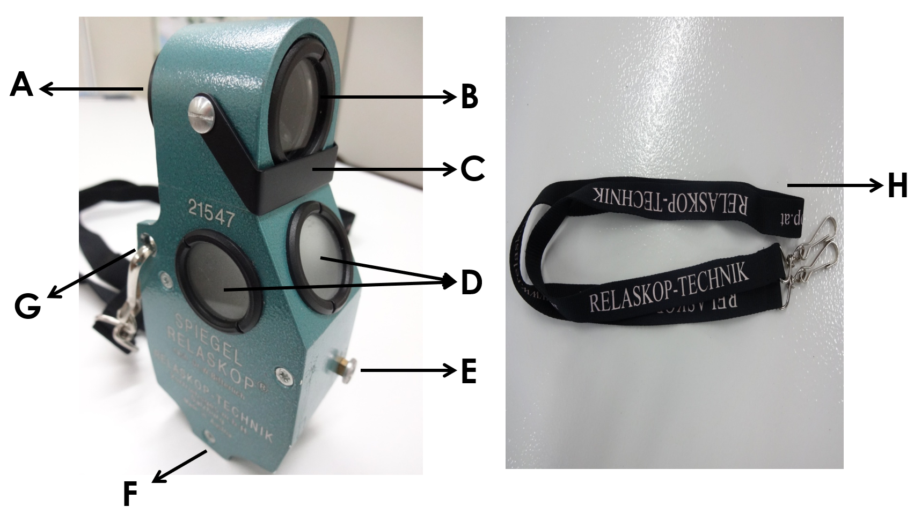
```
]

.pull-right-4[
.shadow3[
.font80[
#### .center[.black[**Características Externas**]]

A) Ocular de pontaria (mira);

B) Objetiva;

C) Placa metálica p/ sombreamento (viseira);

D) Janelas de iluminação;

E) Botão liberador/fixador do pêndulo;

F) Orifício com rosca (acoplar um tripé);

G) Dois orifícios laterais (transporte ao peito); e

H) Cordão p/ transporte ao peito.
]
]
]

---

## 🌳 Métodos de Amostragem

.shadow1[
.font80[
### Método de Bitterlich - .black[Relascópio de Espelho de Bitterlich]
]
]

.pull-left-4[
<br>
.shadow3[
.font80[
- **Campo de visão circular**:

👉 A) **Semicírculo superior**: Paisagem

👉 B) **Semicírculo inferior**: Escalas

👉 C) **Linha Diretriz de Avaliação**
]
]
]

.pull-right-4[
```{r, echo=FALSE, out.width='100%', fig.align='center', fig.cap='', dpi=600}
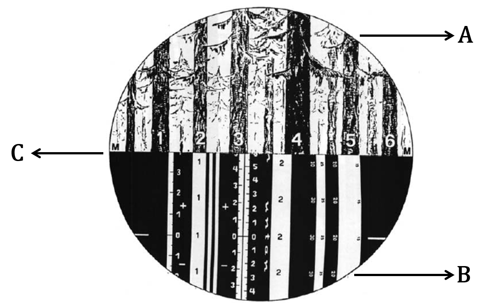
```
]

---

## 🌳 Métodos de Amostragem

.shadow1[
.font80[
### Método de Bitterlich - .black[Relascópio de Espelho de Bitterlich]

- **Escalas do REB**: O REB possui 3 tipos de escalas: Numeração, Distâncias Horizontais e Hipsométrica.
]
]

.pull-left-8[
<br>
.shadow3[
.font80[
- **Escalas de Numeração**:

👉 Principais escalas do REB;

👉 Usadas para estimar a Área Basal (m².ha<sup>-1</sup>);

👉 Medir diâmetro em diferentes alturas; e

👉 O REB possui 9 opções de FAB.

]
]
]

--

.pull-left-8[
<br>
.shadow3[
.font80[
- **Distâncias Horizontais**:

👉 Medir distâncias horizontais (15, 20, 25 e 30 m);

👉 Auxilia na obtenção de outras variáveis: i) medição de diâmetros a diferentes alturas; e ii) medição de qualquer tipo de altura.
]
]
]

--

.pull-left-8[
<br>
.shadow3[
.font80[
- **Hipsométrica**:

👉 Medir altura sob diferentes distâncias horizontais (20, 25 e 30 m).

]
]
]

---

## 🌳 Métodos de Amostragem

.shadow1[
.font80[
### Método de Bitterlich - .black[Fator de Área Basal - FAB]

- **Definição**: É uma constante que relaciona o número de árvores contadas em um giro de 360° com a Área Basal por hectare.
- **Exemplo**:

👉 Se FAB = 1, cada árvore qualificada na unidade amostral assume valor de 1 m².ha<sup>-1</sup>.

👉 Se FAB = 2, cada árvore qualificada na unidade amostral assume valor de 2 m².ha<sup>-1</sup>.

]
]

---

## 🌳 Métodos de Amostragem

.shadow1[
.font80[
### Método de Bitterlich - .black[Relascópio de Espelho de Bitterlich]

- **Bandas e combinações de bandas**: o REB dispõe de 9 opções de FABs estimar a Área Basal (m².ha<sup>-1</sup>).
]
]

.font80[
|               *Banda*             |     *l/L (d/R)*    |     *K*   (FAB)    |
|:-------------------------------:|:----------------:|:----------------:|
|                1e               |       1/200      |        1/16      |
|                2e               |       2/200      |        1/4       |
|                3e               |       3/200      |        9/16      |
|             Banda 1           |        1/50      |         1        |
|          Banda 1 + 1e         |       5/200      |       25/16      |
|             Banda 2           |       √2/50      |         2        |
|          Banda 1 + 2e         |       6/200      |        9/4       |
|          Banda 1 + 3e         |       7/200      |       49/16      |
|     Banda 4 (Banda 1 + 4e)    |        1/25      |         4        |
.center[**e: estreita**]
]

---

## 🌳 Métodos de Amostragem

.shadow1[
.font80[
### Método de Bitterlich - .black[Relascópio de Espelho de Bitterlich]
]
]

.pull-left-4[
<br>
.shadow3[
.font70[

👉 1) Escala hipsométricas p/ 20m de distância horizontal;

👉 2) Escala de numeração: Banda 1;

👉 3) Escalas de numeração: 4 bandas estreitas;

👉 4) Escala hipsométricas p/ 25m de distância horizontal;

👉 5) Escala hipsométricas p/ 30m de distância horizontal

👉 6) Escala de numeração: Banda 2; e

👉 7) Escalas de distâncias horizontais fixas de 30, 25, 20 e 15m.
]
]
]

.pull-right-4[
```{r, echo=FALSE, out.width='50%', fig.align='center', fig.cap='Escalas do REB no plano horizontal', dpi=600}
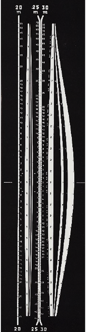
```
]

---

## 🌳 Métodos de Amostragem

.shadow1[
.font80[
### Método de Bitterlich - .black[Relascópio de Espelho de Bitterlich]

- **Qual FAB escolher?**: A escolha dependerá (MACHADO; FIGUEIREDO FILHO, 2009; CAMPOS; LEITE, 2009):

👉 Homogeneidade do povoamento;

👉 Densidade da floresta;

👉 Topografia do local; e

👉 Humano: Acuidade visual.

]
]

<br>

.font80[
**Povoamento mais heterogêneos:**
👉 Requer < FAB (> distância crítica → > representatividade)

**Povoamento mais denso e acidentado**
👉 Requer > FAB (< distância crítica → < probabilidade de superposição dos fustes)
]

---

## 🌳 Métodos de Amostragem

.shadow1[
.font80[
### Método de Bitterlich - .black[Relascópio de Espelho de Bitterlich]

- O FAB escolhido deve contemplar um número mínimo adequado de árvores “qualificadas”  por estação de leitura, com fins de diminuir a variância da variável observada e, ainda, evitar superposição de árvores durante as leituras de campo (Campos e Leite, 2009).

]
]

<br>

.font80[
👉 Campos e Leite (2009) → 8 a 15 árvores por estação de leitura (ponto amostral)

👉 Machado e Figueiredo Filho (2009) → 20 a 30 árvores por estação de leitura (ponto amostral)

👉 Sanquetta et al. (2023) → 15 a 20 árvores por estação de leitura (ponto amostral)
]

---

## 🌳 Métodos de Amostragem

.shadow1[
.font80[
### Método de Bitterlich - .black[Qualificação de árvores na unidade amostral]

- Ao realizar um giro de 360° usando um REB 3 situações podem ocorrer:

👉 **1ª Situação**: O diâmetro da árvore **<** ângulo projetado (FAB);


👉 **2ª Situação**: O diâmetro da árvore **=** ângulo projetado (FAB); e


👉 **3ª Situação**: O diâmetro da árvore **>** ângulo projetado (FAB).

<br>

.center[**Pergunta-se: Quais árvores devem ser qualificadas/contadas na unidade amostral?**]

]
]


---

## 🌳 Métodos de Amostragem

.shadow1[
### Método de Bitterlich - .black[Sanquetta et al. (2023) - pg. 90]
.font80[
- 👉 **Vamos praticar**: Na tabela a seguir estão os dados de um inventário usando o método de Bitterlich (*Pinus taeda*). Trata-se apenas de um ponto amostral (estação de leitura) usando Fator de Área Basal (FAB) = 2.
]
]

--

.pull-left-10[
<br>
```{r, echo=FALSE, out.width='100%', fig.align='center', fig.cap='', dpi=600}
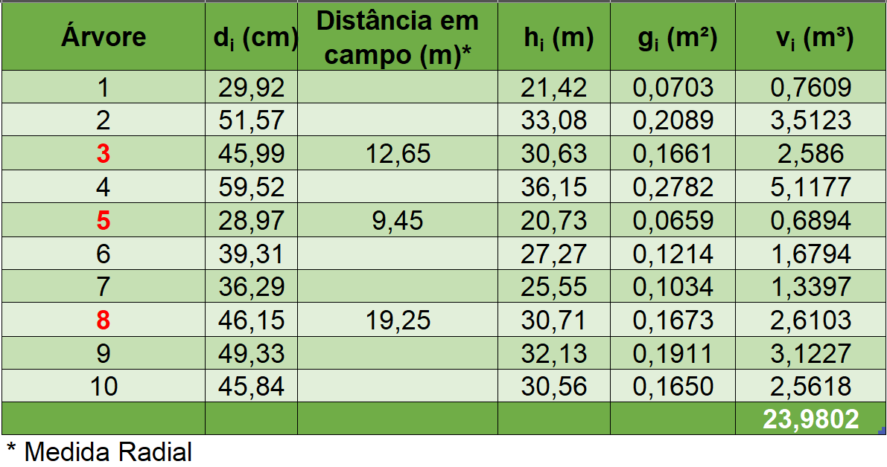
```
]

.pull-right-10[
<br>
.shadow3[
.font80[
**Então, pergunta-se:**

- 1) Quais árvores duvidosas devem ser contadas (ou descartadas) na unidade amostral?
- 2) Qual a estimativa da Área Basal (G) por hectare?
- 3) Qual a estimativa do número de árvores (N) por hectare?
- 4) Qual a estimativa do volume (V) por hectare?
]
]
]

---

## 🌳 Métodos de Amostragem

.shadow1[
### Método de Bitterlich - .black[Sanquetta et al. (2023) - pg. 90]
]

.pull-left-4[
```{r, echo=FALSE, out.width='70%', fig.align='left', fig.cap='', dpi=600}
knitr::include_graphics('fig/class4/bitt.png')
```
]


.pull-right-4[
<br>
```{r, echo=FALSE, out.width='100%', fig.align='center', fig.cap='', dpi=600}

```
]

---

## 🌳 Métodos de Amostragem

.shadow1[
### Método de Bitterlich - .black[Árvores Duvidosas]
]

.pull-right-4[
.font80[
- **Decisão:** 

👉 $R$ campo > $R_i$ (Árvore Não Qualificada)

👉 $R$ campo ≤ $R_i$ (Árvore Qualificada)

<br>

**Em que:**

$R_i$ = Distância radial calculada para i-ésima árvore duvidosa.

$d_i$ = diâmetro a 1,30 m do solo da i-ésima árvore duvidosa.

$FAB$ = Fator de Área Basal.

<br>

]
]

--

.pull-left-10[
.font80[**Distância radial calculada (Ri) - Árvore 3:**]

$$
\small
\begin{equation*}
R_i = \frac{50d_i}{\sqrt{FAB}} = \frac{50(0,4599)}{\sqrt{2}} = \textbf{16,26}~m ~ \color{green}{(Qualificada)}
\end{equation*}
$$

.font80[**Distância radial calculada (Ri) - Árvore 5:**]

$$
\small
\begin{equation*}
R_i = \frac{50d_i}{\sqrt{FAB}} = \frac{50(0,2897)}{\sqrt{2}} = 10,24~m ~ \color{green}{(Qualificada)}
\end{equation*}
$$

.font80[**Distância radial calculada (Ri) - Árvore 8:**]

$$
\small
\begin{equation*}
R_i = \frac{50d_i}{\sqrt{FAB}} = \frac{50(0,4615)}{\sqrt{2}} = \textbf{16,32}~m ~ \color{red}{(Não~Qualificada)}
\end{equation*}
$$

.font80[**Portanto, a árvore 8 não deve ser contada na UA.**]

]

---

## 🌳 Métodos de Amostragem

.shadow1[
### Método de Bitterlich - .black[Estimativa da Área Basal por hectare]

- Basta multiplicar o número de árvores contadas na unidade amostral (**desconsiderar a árvore 8, pois não foi qualificada**) pelo FAB usado (nesse caso, igual a 2).
]

<br>

.font80[**Estimativa da Área Basal por hectare:**

$$
\Large
\begin{equation*}
G = m.FAB = 9.(2) = \textbf{18}~\color{magenta}{m².ha^{-1}}
\end{equation*}
$$
<br>

**Em que:**

$m$ = Número de árvores contadas na unidade amostral (giro de 360°).

$FAB$ = Fator de Área Basal.
]

---

## 🌳 Métodos de Amostragem

.shadow1[
.font80[
### Método de Bitterlich - .black[Estimativa do Número de Árvores por hectare]
- Basta multiplicar o FAB pelo somatório do inverso das áreas transversais de cada árvore qualificada na unidade amostral.
]
]

.pull-left-10[
.font80[**Estimativa do Número de Árvores por hectare**

$$
\small
\begin{equation*}
N = \sum_{i=1}^{m}N_i = FAB\sum_{i=1}^{m}\left(\frac{1}{g_i}\right) = 2\left(\frac{1}{0,0703}+...+\frac{1}{0,1650}\right)= \\~\\
N = 145,99 \cong \textbf{146}~\color{magenta}{árvores.ha^{-1}}
\end{equation*}
$$
<br>

**Em que:**

$g_i$ = Área transversal de cada árvore na unidade amostral, em m².

$FAB$ = Fator de Área Basal.
]
]

--

.pull-right-4[

```{r, echo=FALSE, out.width='100%', fig.align='center', fig.cap='', dpi=600}
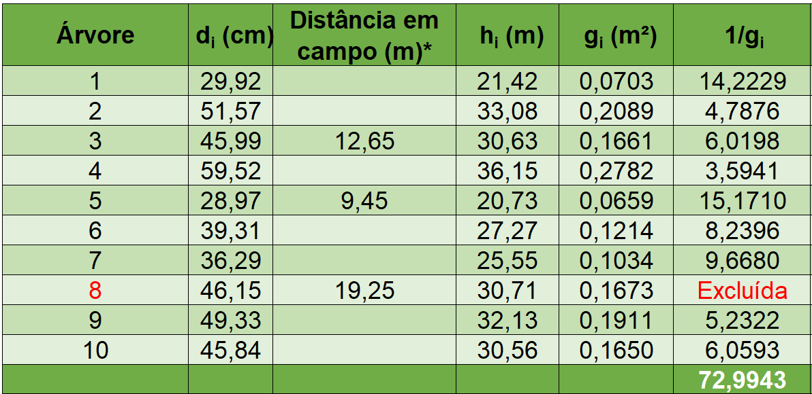
```

]

---

## 🌳 Métodos de Amostragem

.shadow1[
### Método de Bitterlich - .black[Estimativa do Volume por hectare]
.font80[
- O volume por hectare é obtido usando os volumes e áreas transversais de cada árvore na unidade amostral.
]
]

.pull-left-10[
.font80[**Estimativa do Volume por hectare**

$$
\small
\begin{equation*}
V = \sum_{i=1}^{m}V_i = \sum_{i=1}^{m}\left(\frac{FAB}{g_i}.v_i\right) \\~\\
V = \left(\frac{2}{0,0703}.0,7609 + ... + \frac{2}{0,1650}.2,5618\right) = \textbf{261,42}~\color{magenta}{m³.ha^{-1}}
\end{equation*}
$$
<br>

**Em que:**

$FAB$ = Fator de Área Basal.

$g_i$ = Área transversal de cada árvore na unidade amostral, em m².

$v_i$ = Volume de cada árvore na unidade amostral, em m³.


]
]

--

.pull-right-4[

```{r, echo=FALSE, out.width='100%', fig.align='center', fig.cap='', dpi=600}

```

]

---

## 📖 Referências

<br><br>
CAMPOS, J. C. C.; LEITE, H. G. Mensuração florestal: perguntas e respostas. 3ª ed. - Viçosa, MG: Ed. UFV, 2009. 548 p.
<br><br>
PÉLLICO NETTO, S.; BRENA, D.A. Inventário Florestal. Curitiba: editorado pelos autores, 1997. 316p.
<br><br>
QUEIROZ, W. T. de. Técnicas de amostragem em inventário florestal nos trópicos. Belém: FCAP. Serviço de Documentação e Informação, 1998. 147 p.


---

## 📖 Referências

<br><br>
MACHADO, S. do A.; FIGUEIREDO FILHO, A. Dendrometria. 2.ed. guarapuava: UNICENTRO, 2009. 316p.
<br><br>
SANQUETTA, C.R.; WATZLAWICK, L.F.; CORTE, A.P.D.; FERNANDES, L.A.V.; SIQUEIRA, J.D.P. Inventários florestais: planejamento e execução. 2ª ed. Curitiba. 2009. 316p.
<br><br>
SCOLFORO, J. R. S.; MELLO, J. M. de. Inventário Florestal. Lavras: UFLA/FAEPE, 1997. 341 p.
<br><br>
SOARES, C. P. B.; PAULA NETO, F. de; SOUZA, A. L. de. Dendrometria e inventário florestal. 2ª ed. - Viçosa, MG: Ed. UFV, 2011. 272 p.

---

layout: false
name: etim
class: inverse, middle, center
background-image: url(fig/class0/sec.png)
background-size: cover

## .font200[Obrigado!]

```{r, echo=FALSE, out.width='20%', fig.align='center', fig.cap='', dpi=600}

```

👨🏻‍👩🏻‍👦🏻‍👦🏻 [@lmftca_ufpa](https://www.instagram.com/lmftca_ufpa/)

🌎 [https://www.lmftca.com.br/](https://www.lmftca.com.br/)


