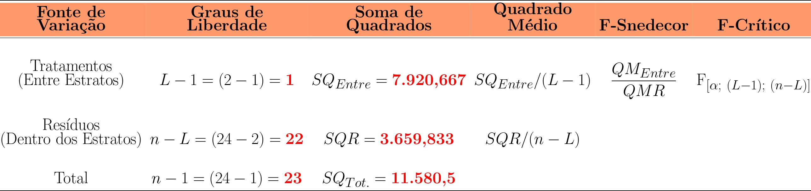
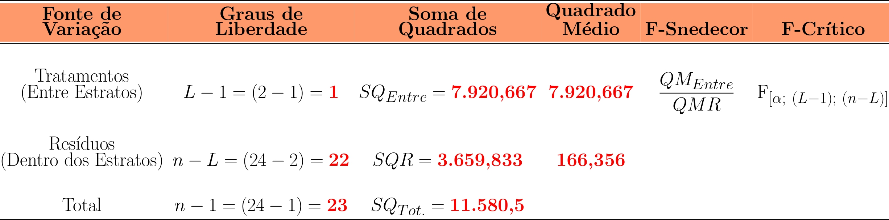

class: title-slide, center, middle
background-image: url(fig/slide-title/LMFTCA.png), url(fig/slide-title/ufra.png), url(fig/slide-title/capa.png)
background-position: 90% 90%, 10% 90%
background-size: 150px, 150px, cover

```{r setup, include=FALSE}
knitr::opts_chunk$set(
  fig.showtext = TRUE,
  fig.align = "center", 
  cache = FALSE,
  error = FALSE,
  message = FALSE, 
  warning = FALSE, 
  collapse = TRUE ,
  dpi = 600)
```

```{r xaringan-logo, echo=FALSE}
library(xaringanExtra)
use_logo(
  image_url = "fig/slide-title/ufpa.png",
  position = css_position(top = ".8em", right = "1em"),
  width = "140px",
  height = "140px"
)

use_scribble()

```

```{r icon, echo=FALSE}
#remotes::install_github("mitchelloharawild/icons")
#library(icons)
#download_fontawesome()
#download_simple_icons()
```

```{r customDT, echo=F}
CustomDT <- function(data){
  data %>% DT::datatable(editable = 'cell', rownames = FALSE,
                         style = "default",
                         class = "display", width = '250px',
                         caption = '',
     options=list(pageLength = 16, dom = 'tip', autoWidth = F,
       initComplete = htmlwidgets::JS(
          "function(settings, json) {",
          paste0("$(this.api().table().container()).css({'font-size': '", "14pt", "'});"),
          "}")
       ) 
     )
}
```

```{r packages, include=FALSE}
# remotes::install_github("dill/emoGG")
library(ggplot2)
library(dplyr)
library(ggimage)
```


<!-- title-slide -->
<!--# .font120[Inventário Florestal <br> (FL03039 - EF)] -->
# .font100[Inventário Florestal (EFBEL249) <br> (Forma Pará - Polo Pacajá/UFRA)]

## `r anicon::faa("pagelines", animate="horizontal", colour="green")` Amostragem Estratificada`r anicon::faa("pagelines", animate="horizontal", colour="green")` <br>  ᨒ
###### Estudo de Caso - Floresta Nativa

##### 〰〰〰〰〰〰🌳〰〰〰〰〰〰
##### ᨒ
##### .font120[**Prof. Dr. Deivison Venicio Souza**]
##### Universidade Federal do Pará (UFPA)
##### Faculdade de Engenharia Florestal
##### Laboratório de Manejo Florestal, Tecnologias e Comunidades Amazônicas
##### E-mail: deivisonvs@ufpa.br
<br>
##### 1ª versão: 16/maio/2025 <br> (Atualizado em: `r format(Sys.Date(),"%d/%B/%Y")`) <br> Altamira, Pará

---
layout: true
class: with-logo logo-ufpa
<div class="my-header"></div>
<div class="my-footer"><span>Prof. Dr. Deivison Venicio Souza (E-mail: deivisonvs@ufpa.br)&emsp;&emsp;&emsp;&emsp;&emsp; <div3>Inventário Florestal (FL03039 - EF)</div3>/ <div2>Amostragem Estratificada</div2> </div>

---

## 📚 Ementa da disciplina (FL03039 - EF)
<br>
.shadow4[
.font80[
1 - Introdução aos Inventários Florestais; 

2 - Amostragem em Inventários Florestais;

&nbsp;&nbsp;&nbsp;&nbsp;2.1 - Conceitos Básicos e Principais Estimadores;

&nbsp;&nbsp;&nbsp;&nbsp;2.2 - Métodos de Amostragem;

&nbsp;&nbsp;&nbsp;&nbsp;2.3 - Amostragem Aleatória Simples - AAS;

&nbsp;&nbsp;&nbsp;&nbsp;**2.4 - Amostragem Estratificada - AE**;

&nbsp;&nbsp;&nbsp;&nbsp;2.5 - Amostragem Sistemática - AS; 

&nbsp;&nbsp;&nbsp;&nbsp;2.6 - Amostragem em Dois Estágios - ADE; e

&nbsp;&nbsp;&nbsp;&nbsp;2.7 - Amostragem em Conglomerados - AG.

3 - Censo Florestal (Inventário Florestal 100%); 

4 - Amostragem em Múltiplas Ocasiões;

5 - Inventário Florestal Nacional; e

6 - Planejamento e Custos de Inventários Florestais.

<!--7 - Tecnologias Aplicadas em Inventários Florestais.-->
]
]

---

## 🎯 Objetivos
<br><br>
.font90[
Ao final desta aula espera-se que o discente seja capaz de...

* Aprender a calcular as estimativas da AE por meio de um estudo de caso; e
* Aprender a interpretar as estimativas e concluir sobre a precisão do IF realizado.
]

---

## 📙 Conteúdo
<br>

.pull-top[
**Parte 2 - Inventário Florestal usando AE**
.font80[

[1 - Estudo de Caso (Sanquetta et al., 2023; pg. 136)](#ec)

&nbsp;&nbsp;[1.1 - Média Aritmética por Estrato](#maEC)

&nbsp;&nbsp;[1.2 - Média Estratificada](#dpEC)

&nbsp;&nbsp;[1.3 - Variância, Desvio Padrão e Coeficiente de Variação por Estrato](#dpEC)

&nbsp;&nbsp;[1.4 - Variância Estratificada](#iaEC)

&nbsp;&nbsp;[1.5 - Intensidade Amostral (ou Suficiência Amostral) por Estrato e Total](#iaEC)

&nbsp;&nbsp;[1.6 - Variância da Média Estratificada](#epmEC)

&nbsp;&nbsp;[1.7 - Erro Padrão da Média Estratificada](#epmEC)

&nbsp;&nbsp;[1.8 - Erro de Amostragem (Absoluto e %)](#eaEC)

&nbsp;&nbsp;[1.9 - Intervalo de Confiança Para Média Estratificada](#icmEC)

&nbsp;&nbsp;[1.10 - Total por Estrato e População](#tpEC)

&nbsp;&nbsp;[1.11 - Intervalo de Confiança Para o Total da População](#icptpEC)

]
]

<!-- Slide XX -->
---
layout: false
name: if
class: inverse, middle, center
background-image: url(fig/class0/sec.png)
background-size: cover

.font150[.yellow2[**AE - Estudo de Caso** <br> .orange[**(Sanquetta et al., 2023; pg. 136)**]]]

---
layout: true
<div class="my-header"></div>
<div class="my-footer"><span>Prof. Dr. Deivison Venicio Souza (E-mail: deivisonvs@ufpa.br)&emsp;&emsp;&emsp;&emsp;&emsp;<div3>Amostragem Estratificada - AE</div3>/ <div2>Parte 2 - AE - Estudo de Caso</div2> </div>

---
name: ecap
## 🌳 AE - Estudo de Caso .orange[.font80[(Sanquetta *et al*., 2023; pg. 136)]]
<br>

### .font90[Estudo de Caso - *Floresta Explorada e Inexplorada*]
<br>

.font90[
Uma empresa de consultoria florestal realizou um inventário em floresta natural com área total de **1.000 hectares**, usando o processo de amostragem estratificada. Por meio de fotografias aéreas foram previamente identificados 2 estratos florestais: 1) **Estrato 1: Floresta Explorada (650 ha)**; e 2) **Estrato 2: Floresta Não Explorada (350 ha)**. Foi realizado um inventário piloto com alocação de **12 unidades amostrais** de tamanho **1 hectare** em cada estrato. Os volumes de madeira por parcela em cada estrato estão na tabela a seguir. Para os cálculos das estimativas considere um .blue[erro máximo admissível de 10%] e uma .blue[probabilidade de 95%]. Assim, pede-se:
<br><br>

a) Calcular as estimativas da amostragem estratificada.

b) Realizar a ANOVA da estratificação e concluir sobre o o teste F.

c) Concluir sobre a precisão das estimativas obtidas a partir do inventário realizado.

d) O Inventário Piloto pode ser admitido como Inventário Definitivo?
]

---
name: data
## 🌳 AE - Estudo de Caso .orange[.font80[(Sanquetta *et al*., 2023; pg. 136)]]

.pull-left-4[
<br><br>
### .center[.font90[Volume de madeira por parcela (1 hectare) em cada estrato.]]
<br>

(**Unidade de medida**: $m^3/ha$ ou $m^3.ha^{-1}$)

]

.pull-right-4[
```{r tibble, echo=F, eval=T}
data <- readxl::read_excel("data/AE-Sanquetta.xlsx")
DT::datatable(data,
              editable = 'cell', rownames = FALSE,
                         style = "default",
                         class = "display", width = '300px',
                         caption = '',
     options=list(pageLength = 12, dom = 't', autoWidth = F,
       initComplete = htmlwidgets::JS(
          "function(settings, json) {",
          paste0("$(this.api().table().container()).css({'font-size': '", "12pt", "'});"),
          "}")
       ))
```
]

---

## 🌳 AE - Estudo de Caso .orange[.font80[(Sanquetta *et al*., 2023; pg. 136)]]

### 👉 .font80[Estimadores da Amostragem Estratificada]

.font70[
| **Estimador (do Parâmetro)**                          | Volume (unidade de medida)   |
|-------------------------------------------------------|:----------------------------:|
| 1 - Média Aritmética por Estrato                      | $m^3.ha^{-1}$                |
| 2 - Média Estratificada                               | $m^3.ha^{-1}$                |
| 3 - Variância                                         | $\left(m^3.ha^{-1}\right)^2$ |
| 4 - Desvio Padrão                                     | $m^3.ha^{-1}$                |
| 5 - Coeficiente de variação                           | $\%$                         |
| 6 - Variância Estratificada                           | $\left(m^3.ha^{-1}\right)^2$ |
| 7 - Intensidade amostral                              | $Parcelas$                   |
| 8 - Variância da Média Estratificada                  | $\left(m^3.ha^{-1}\right)^2$ |
| 9 - Erro Padrão da Média Estratificada                | $m^3.ha^{-1}$                |
| 10 - Erro de amostragem                               | $\left(m^3.ha^{-1}~ou~\% \right)$ |
| 11 - Intervalo de Confiança Para Média Estratificada  | $m^3.ha^{-1}$                |
| 12 - Total por Estrato e População                    | $m³$                         |
| 13 - Intervalo de Confiança Para o Total da População | $m³$                         |

]

---
name: maEC
## 🌳 AE - Estudo de Caso .orange[.font80[(Sanquetta *et al*., 2023; pg. 136)]]

.shadow1[
### 👉 Média aritmética amostral por estrato $(\bar{X}_h)$
]

.pull-left-4[
.font80[

$$
\normalsize
\begin{equation*}
\bar{X}_h = \frac{1}{n_h}\sum_{i=1}^{n_h}X_{hi}
\end{equation*}
$$

**Em que:**

- $\bar{X}_h$ (lê-se: X-barra "agá") = estimador da média aritmética populacional $\mu_h$ (lê-se: "mi") no estrato $h$ ou média amostral no estrato $h$.
- $n_h$ = número de parcelas alocadas no estrato $h$.
- $\Sigma$ (sigma maiúscula) = símbolo de somatório. 
- $X_{hi}$ = $i$-ésimo valor da variável $X$ nas unidades amostrais do estrato $h$.

]
]

--

<br>

.pull-right-4[

.font80[
👉 **Média Aritmética (.blue[Estrato 1] - Floresta Explorada):**

$$
\normalsize
\begin{equation*}
\bar{X}_1 = \frac{1}{12}.(101 + 82 + ... + 100) = \textbf{89,08}~\color{magenta}{m³.ha^{-1}}
\end{equation*}
$$
<br><br>

👉 **Média Aritmética (.blue[Estrato 2] - Floresta Não Explorada):**

$$
\normalsize
\begin{equation*}
\bar{X}_2 = \frac{1}{12}.(125 + 147 + ... + 130) = \textbf{125,42}~\color{magenta}{m³.ha^{-1}}
\end{equation*}
$$

]
]

---
name: maEC
## 🌳 AE - Estudo de Caso .orange[.font80[(Sanquetta *et al*., 2023; pg. 136)]]

.shadow1[
### 👉 Variância amostral por estrato $(S_h^2)$
]

.font80[
<br>

$$
\normalsize
\begin{equation*}
S_h^2 = \frac{1}{n_{h} - 1}\sum_{i=1}^{n_h}\left (X_{hi} - \bar{X_h}  \right )^2
\end{equation*}
$$

**Em que:**

- $S_h^2$ (lê-se: S-quadrado "agá") = estimador da variância populacional no estrato $h$ ($\sigma^2_h$) ou variância amostral no estrato $h$.
- $n_h$ = número de parcelas alocadas no estrato $h$.
- $X_{hi}$ = $i$-ésimo valor da variável $X$ nas unidades amostrais do estrato $h$.
- $\bar{X_h}$ = estimativa da média aritmética populacional $\mu$ no estrato $h$.

]

---
name: maEC
## 🌳 AE - Estudo de Caso .orange[.font80[(Sanquetta *et al*., 2023; pg. 136)]]

.pull-left-4[
```{r echo=F, eval=T}

df <- data |>
  select(-`Estrato II`) |>
  mutate(Media = round(mean(`Estrato I`), 2),
         "xi-media" = round(`Estrato I` - mean(`Estrato I`), 6),
         "(xi-media)²" = round(`xi-media`^2, 6)) %>%
  tibble::add_row(
    Parcela = "Total",
    "xi-media" = round(sum(.$`xi-media`), 1),
    "(xi-media)²" = round(sum(.$`(xi-media)²`), 4))

df %>% 
   DT::datatable(editable = 'cell', rownames = FALSE, style = "default",
                 class = "display", width = '400px',
                 caption = '',
     options=list(pageLength = 13, dom = 'tip', autoWidth = F,
       initComplete = htmlwidgets::JS(
          "function(settings, json) {",
          paste0("$(this.api().table().container()).css({'font-size': '", "12pt", "'});"),
          "}")
       ) 
     )
```

]


--

<br>

.pull-right-4[

👉 **Variância amostral (.blue[Estrato 1] - Floresta Explorada):**

$$
\normalsize
\begin{equation*}
S_h^2 = \frac{1}{n_{h} - 1}\sum_{i=1}^{n_h}\left (X_{h_i} - \bar{X_h}  \right )^2 \\~\\
S_{h_1}^2 = \frac{1}{12 - 1}(786,9167) = \textbf{71,54}~\color{magenta}{(m³.ha^{-1})^2}
\end{equation*}
$$

]

---
name: maEC
## 🌳 AE - Estudo de Caso .orange[.font80[(Sanquetta *et al*., 2023; pg. 136)]]


.pull-left-4[
```{r echo=F, eval=T}

df <- data |>
  select(-`Estrato I`) |>
  mutate(Media = round(mean(`Estrato II`), 2),
         "xi-media" = round(`Estrato II` - mean(`Estrato II`), 6),
         "(xi-media)²" = round(`xi-media`^2, 6)) %>%
  tibble::add_row(
    Parcela = "Total",
    "xi-media" = round(sum(.$`xi-media`), 1),
    "(xi-media)²" = round(sum(.$`(xi-media)²`), 4))

df |> 
   DT::datatable(editable = 'cell', rownames = FALSE, style = "default",
                 class = "display", width = '400px',
                 caption = '',
     options=list(pageLength = 13, dom = 'tip', autoWidth = F,
       initComplete = htmlwidgets::JS(
          "function(settings, json) {",
          paste0("$(this.api().table().container()).css({'font-size': '", "12pt", "'});"),
          "}")
       ) 
     )
```

]


--

<br>

.pull-right-4[

👉 **Variância amostral (.blue[Estrato 2] - Floresta Não Explorada):**

$$
\normalsize
\begin{equation*}
S_h^2 = \frac{1}{n_{h} - 1}\sum_{i=1}^{n_h}\left (X_{h_i} - \bar{X_h}  \right )^2 \\~\\
S_{h_2}^2 = \frac{1}{12 - 1}(2.872,9167) = \textbf{261,17}~\color{magenta}{(m³.ha^{-1})^2}
\end{equation*}
$$
]


---
name: maEC
## 🌳 AE - Estudo de Caso .orange[.font80[(Sanquetta *et al*., 2023; pg. 136)]]

.shadow1[
### 👉 Média estratificada $(\bar{X}_{est})$
]

$$
\normalsize
\begin{equation*}
\bar{X}_{est} = \sum_{h=1}^{L}\frac{N_h}{N}\bar{X_h} = \sum_{h=1}^{L}W_h\bar{X_h}
\end{equation*}
$$

**Em que:**

- $\bar{X}_{est}$ (lê-se: X-barra "est") = estimador da média aritmética populacional estratificada ($\mu_{est}$) ou média amostral estratificada.
- $N_h$ = Número de parcelas possíveis de serem alocadas no estrato $h$.
- $N$ = Número de parcelas possíveis de serem alocadas na população.
- $\bar{X}_h$ = estimador da média aritmética populacional $\mu_h$ no estrato $h$.
- $W_h$ = Proporção do estrato $h$ na população florestal.

---
name: maEC
## 🌳 AE - Estudo de Caso .orange[.font80[(Sanquetta *et al*., 2023; pg. 136)]]

.shadow1[
### 👉 Média estratificada $(\bar{X}_{est})$
]

.pull-left-4[
.font80[
👉 **Nº de parcelas possíveis de serem alocadas no estrato $h$?**

- Nº de parcelas possíveis de serem alocadas no estrato $h_1$ ($N_{h_1}$) - **Floresta Explorada**:

$$
\normalsize
\begin{equation*}
N_{h_1} = \frac{A_{h_1}}{a} = \frac{650~ha}{1~ha} = \textbf{650}~\color{magenta}{parcelas}
\end{equation*}
$$

- Nº de parcelas possíveis de serem alocadas no estrato $h_2$ ($N_{h_2}$) - **Floresta Não Explorada**:

$$
\normalsize
\begin{equation*}
N_{h_2} = \frac{A_{h_2}}{a} = \frac{350~ha}{1~ha} = \textbf{350}~\color{magenta}{parcelas}
\end{equation*}
$$
<br>
.font80[
**Interpretação**: Considerando o tamanho dos estratos e da unidade amostral, é possível alocação de 650 e 350 parcelas de 1 hectare nos Estratos I e II da floresta, respectivamente.
]
]
]

--

.pull-right-4[
.font80[
👉 **Proporção de cada estrato $h$ na população florestal?**

- Proporção (peso) do estrato $h_1$ na população florestal ($W_{h_1}$) - **Floresta Explorada**:

$$
\normalsize
\begin{equation*}
W_{h_1} = \frac{N_{h_1}}{N} = \frac{650~parcelas}{1.000~parcelas} = \textbf{0,65}~\textbf{(65%)}
\end{equation*}
$$

- Proporção (peso) do estrato $h_2$ na população florestal ($W_{h_2}$) - **Floresta Não Explorada**:

$$
\normalsize
\begin{equation*}
W_{h_2} = \frac{N_{h_2}}{N} = \frac{350~parcelas}{1.000~parcelas} = \textbf{0,35}~\textbf{(35%)}
\end{equation*}
$$

<br>
.font80[
**Interpretação**: O peso dos Estratos I e II são 0,65 e 0,35, respectivamente. Ou seja, as áreas dos Estratos I e II representam 65% e 35%, respectivamente, da área total da população florestal.
]

]
]


---
name: maEC
## 🌳 AE - Estudo de Caso .orange[.font80[(Sanquetta *et al*., 2023; pg. 136)]]

.shadow1[
### 👉 Média estratificada $(\bar{X}_{est})$
]

$$
\large
\begin{equation*}
\bar{X}_{est} = \sum_{h=1}^{L}W_h\bar{X_h} \\~\\
\bar{X}_{est} = \underbrace{0,65.(89,08)}_{W_{h_1} (\bar{X}_{h_1})} + \underbrace{0,35.(125,42)}_{W_{h_2} (\bar{X}_{h_2})} = \\~\\
\bar{X}_{est} = \textbf{101,80}~\color{magenta}{m³.ha^{-1}}
\end{equation*}
$$


---
name: maEC
## 🌳 AE - Estudo de Caso .orange[.font80[(Sanquetta *et al*., 2023; pg. 136)]]

.shadow1[
### 👉 Variância amostral estratificada $(S^2_{est})$
]

$$
\large
\begin{equation*}
S^2_{est} = \sum_{h=1}^{L}W_h S_h^2
\end{equation*}
$$

**Em que:**

- $S^2_{est}$ (lê-se: S-Quadrado "est") = estimador da variância populacional estratificada ($\sigma^2_{est}$) ou variância amostral estratificada.
- $W_h$ = Proporção do estrato $h$ na população florestal.
- $S_h^2$ = estimador da variância populacional $\sigma^2$ no estrato $h$.


---
name: maEC
## 🌳 AE - Estudo de Caso .orange[.font80[(Sanquetta *et al*., 2023; pg. 136)]]

.shadow1[
### 👉 Variância amostral estratificada $(S^2_{est})$
]

$$
\large
\begin{equation*}
S^2_{est} = \sum_{h=1}^{L}W_h S_h^2 \\~\\
S^2_{est} = \underbrace{0,65.(71,54)}_{W_{h_1} (S_{h_1}^2)} + \underbrace{0,35.(261,17)}_{W_{h_2} (S_{h_2}^2)} \\~\\
S^2_{est} = \textbf{137,91}~\color{magenta}{(m³.ha^{-1})^2}
\end{equation*}
$$

---

## 🌳 AE - Estudo de Caso .orange[.font80[(Sanquetta *et al*., 2023; pg. 136)]]

.shadow1[
### 👉 Intensidade amostral (ou suficiência amostral) $(n)$
]

<br>

.font90[
**Para calcular a intensidade amostral é preciso responder as seguintes questões:**

- 1) Existem evidências de diferenças significativas entre as médias dos estratos $h$? (**ANOVA**)
- 2) Qual natureza da população (Finita ou Infinita)? (**População finita = fração amostral > 2%**)
- 3) Qual o tipo de alocação das unidades de amostras nos estratos? (**Alocação proporcional ou ótima**)
- 4) Qual a estimativa da variância amostral estratificada da variável de interesse? ($S^2_{est}$)
- 5) Qual o limite de erro (LE) admissível para a estimativa variável de interesse? (**10% é mais usual**)

]


---
name: X
## 🌳 AE - Estudo de Caso .orange[.font80[(Sanquetta *et al*., 2023; pg. 136)]]

.shadow1[
### 👉 Intensidade amostral (ou suficiência amostral) $(n)$
]

<br>

.font90[
🤔 **1) Existem evidências de diferenças significativas entre as médias dos estratos** $h$❓
]

--

.font90[
🤓☝️ Pode-se realizar uma Análise de Variância (ANAVA) da Estratificação!

]

--

<br>

```{r, echo=FALSE, out.width='70%', fig.align='center', fig.cap='', dpi=600}
knitr::include_graphics('fig/class6/ANOVA.jpg')
```

.font80[
$L$ = Número de estratos;
$n$ = Número total de unidades amostradas na população.
]

---
name: X
## 🌳 AE - Estudo de Caso .orange[.font80[(Sanquetta *et al*., 2023; pg. 136)]]

.shadow1[
### 👉 Intensidade amostral (ou suficiência amostral) $(n)$
]

<br>

.font90[
🤔 **1) Existem evidências de diferenças significativas entre as médias dos estratos** $h$❓
]

.font90[**1º Passo**: determinar os valores de graus de liberdade de todas as fontes de variação.]
<br><br>

```{r, echo=FALSE, out.width='85%', fig.align='center', fig.cap='', dpi=600}
knitr::include_graphics('fig/class6/ANOVA_gl2.jpg')
```


---
name: X
## 🌳 AE - Estudo de Caso .orange[.font80[(Sanquetta *et al*., 2023; pg. 136)]]

.shadow1[
### 👉 Intensidade amostral (ou suficiência amostral) $(n)$
]

<br>

.font90[
🤔 **1) Existem evidências de diferenças significativas entre as médias dos estratos** $h$❓
<br>

**2º Passo**: Determinar as Somas de Quadrados.
]

.pull-left-4[

.font80[
- **Somas de Quadrados Entre Estratos**

$$
\begin{equation*}
\normalsize
SQ_{Entre} = \dfrac{\sum\limits_{h=1}^{L} \biggl(\sum\limits_{i=1}^{n_h}X_{hi}\biggr)^2}{n_h} - \color{red}{C}
\end{equation*}
$$
- **Somas de Quadrados Totais**

$$
\begin{equation*}
\normalsize
SQ_{Tot} = \sum\limits_{h=1}^{L} \sum\limits_{i=1}^{n_h}X_{hi}^2 - \color{red}{C}
\end{equation*}
$$
]
]

.pull-right-4[
.font80[
- **Fator em Comum (C)**

$$
\begin{equation*}
\normalsize
C = \dfrac{\biggl(\sum\limits_{h=1}^{L} \sum\limits_{i=1}^{n_h}X_{hi}\biggr)^2}{L(n_h)}
\end{equation*}
$$

.font80[
As equações de SQ<sub>Tot.</sub> e SQ<sub>Trat.</sub> possuem uma parte em comum denominada **Fator em Comum** (C). Portanto, inicialmente é estratégico calcular este fator.
]
]
]

---
name: X
## 🌳 AE - Estudo de Caso .orange[.font80[(Sanquetta *et al*., 2023; pg. 136)]]

.pull-left-4[
```{r echo=F, eval=T}
library(dplyr)
df <- data |>
  summarise(
        across(where(is.numeric), ~ sum(.x, na.rm = TRUE)),
        Parcela = "Total" # Assign a label for the total row
      )
df2 <- bind_rows(data, df)

df2 |> 
   DT::datatable(editable = 'cell', rownames = FALSE, style = "default",
                 class = "display", width = '400px',
                 caption = '',
     options=list(pageLength = 13, dom = 'tip', autoWidth = F,
       initComplete = htmlwidgets::JS(
          "function(settings, json) {",
          paste0("$(this.api().table().container()).css({'font-size': '", "12pt", "'});"),
          "}")
       ) 
     )
```

]

--

.pull-left-4[
- **Fator em Comum (C)**
<br>

$$
\begin{equation*}
\normalsize
C = \dfrac{\biggl(\sum\limits_{h=1}^{L} \sum\limits_{i=1}^{n_h}X_{hi}\biggr)^2}{L(n_h)} \\~\\
C = \dfrac{\biggl(1.069 + 1.505\biggr)^2}{2(12)} \\~\\
C = \dfrac{6.625.476,0}{24} = \textbf{276.061,5}
\end{equation*}
$$
]

---
name: X
## 🌳 AE - Estudo de Caso .orange[.font80[(Sanquetta *et al*., 2023; pg. 136)]]

.pull-left-4[
```{r echo=F, eval=T}
library(dplyr)
df <- data |>
  summarise(
        across(where(is.numeric), ~ sum(.x, na.rm = TRUE)),
        Parcela = "Total" # Assign a label for the total row
      )
df2 <- bind_rows(data, df)

df2 |> 
   DT::datatable(editable = 'cell', rownames = FALSE, style = "default",
                 class = "display", width = '400px',
                 caption = '',
     options=list(pageLength = 13, dom = 'tip', autoWidth = F,
       initComplete = htmlwidgets::JS(
          "function(settings, json) {",
          paste0("$(this.api().table().container()).css({'font-size': '", "12pt", "'});"),
          "}")
       ) 
     )
```

]

--

.pull-left-4[
- **Soma de Quadrados Totais**
<br>

$$
\begin{equation*}
\normalsize
SQ_{Tot} = \sum\limits_{h=1}^{L} \sum\limits_{i=1}^{n_h}X_{hi}^2 - \color{red}{C} \\~\\
SQ_{Tot} = 287.642,0 - \color{red}{276.061,5} \\~\\
SQ_{Tot} = \textbf{11.580,5}
\end{equation*}
$$

<br><br>

$$
\begin{equation*}
\sum\limits_{h=1}^{L} \sum\limits_{i=1}^{n_h}X_{hi}^2 = 101² + 82² + 100² + ... + 130² = 287.642,0
\end{equation*}
$$
]

---
name: X
## 🌳 AE - Estudo de Caso .orange[.font80[(Sanquetta *et al*., 2023; pg. 136)]]

.pull-left-4[
```{r echo=F, eval=T}
library(dplyr)
df <- data |>
  summarise(
        across(where(is.numeric), ~ sum(.x, na.rm = TRUE)),
        Parcela = "Total" # Assign a label for the total row
      )
df2 <- bind_rows(data, df)

df2 |> 
   DT::datatable(editable = 'cell', rownames = FALSE, style = "default",
                 class = "display", width = '400px',
                 caption = '',
     options=list(pageLength = 13, dom = 'tip', autoWidth = F,
       initComplete = htmlwidgets::JS(
          "function(settings, json) {",
          paste0("$(this.api().table().container()).css({'font-size': '", "12pt", "'});"),
          "}")
       ) 
     )
```

]

--

.pull-left-4[
- **Soma de Quadrados Entre Estratos**
<br>

$$
\begin{equation*}
\normalsize
SQ_{Entre} = \dfrac{\sum\limits_{h=1}^{L} \biggl(\sum\limits_{i=1}^{n_h}X_{hi}\biggr)^2}{n_h} - \color{red}{C} \\~\\
SQ_{Entre} = \dfrac{3.407.786,0}{12} - \color{red}{276.061,5} \\~\\
SQ_{Entre} = \textbf{7.920,667}
\end{equation*}
$$

<br><br>

$$
\begin{equation*}
\sum\limits_{h=1}^{L} \biggl(\sum\limits_{i=1}^{n_h}X_{hi}\biggr)^2 = 1.069² + 1.505² = 3.407.786,0
\end{equation*}
$$
]

---
name: X
## 🌳 AE - Estudo de Caso .orange[.font80[(Sanquetta *et al*., 2023; pg. 136)]]

.pull-left-4[
```{r echo=F, eval=T}
library(dplyr)
df <- data |>
  summarise(
        across(where(is.numeric), ~ sum(.x, na.rm = TRUE)),
        Parcela = "Total" # Assign a label for the total row
      )
df2 <- bind_rows(data, df)

df2 |> 
   DT::datatable(editable = 'cell', rownames = FALSE, style = "default",
                 class = "display", width = '400px',
                 caption = '',
     options=list(pageLength = 13, dom = 'tip', autoWidth = F,
       initComplete = htmlwidgets::JS(
          "function(settings, json) {",
          paste0("$(this.api().table().container()).css({'font-size': '", "12pt", "'});"),
          "}")
       ) 
     )
```

]

--

.pull-left-4[
- **Soma de Quadrados de Resíduos**
<br>

$$
\begin{equation*}
\normalsize
SQR = SQ_{Tot} - SQ_{Entre} \\~\\
SQR = 11.580,5 - 7.920,667 \\~\\
SQR = \textbf{3.659,833}
\end{equation*}
$$
]

---
name: X
## 🌳 AE - Estudo de Caso .orange[.font80[(Sanquetta *et al*., 2023; pg. 136)]]

.shadow1[
### 👉 Intensidade amostral (ou suficiência amostral) $(n)$
]

<br>

.font90[
🤔 **1) Existem evidências de diferenças significativas entre as médias dos estratos** $h$❓
]

.font90[**2º Passo**: Determinar as Somas de Quadrados da ANOVA.]
<br><br>

```{r, echo=FALSE, out.width='85%', fig.align='center', fig.cap='', dpi=600}

```

---
name: X
## 🌳 AE - Estudo de Caso .orange[.font80[(Sanquetta *et al*., 2023; pg. 136)]]
<br>

.font90[
🤔 **1) Existem evidências de diferenças significativas entre as médias dos estratos** $h$❓
]

**3º Passo**: Determinar os Quadrados Médios - .blue[Entre e Resíduo]
<br><br>

.pull-left-9[
**Quadrado Médio Entre Tratamentos (Estratos) - Variância Entre Estratos**
<br><br>
$\normalsize QM_{Entre} = \dfrac{SQ_{Entre}}{L-1} = \dfrac{7.920,667}{2-1} = \textbf{7.920,667}$
]

.pull-right-9[
**Quadrado Médio de Resíduos - Variância Dentro dos Estratos**
<br><br>
$\normalsize QMR = \dfrac{SQR}{n - L} = \dfrac{3.659,833}{24 - 2} = \textbf{166,356}$
]

---
name: X
## 🌳 AE - Estudo de Caso .orange[.font80[(Sanquetta *et al*., 2023; pg. 136)]]

.shadow1[
### 👉 Intensidade amostral (ou suficiência amostral) $(n)$
]

<br>

.font90[
🤔 **1) Existem evidências de diferenças significativas entre as médias dos estratos** $h$❓
]

.font90[**3º Passo**: Determinar os Quadrados Médios - .blue[Entre e Resíduo]]
<br><br>

```{r, echo=FALSE, out.width='85%', fig.align='center', fig.cap='', dpi=600}

```

---

## 📖 Referências

<br><br>
CAMPOS, J. C. C.; LEITE, H. G. **Mensuração florestal: perguntas e respostas**. 3ª ed. - Viçosa, MG: Ed. UFV, 2009. 548 p.
<br><br>
PÉLLICO NETTO, S.; BRENA, D. A. **Inventário Florestal**. Curitiba: editorado pelos autores, 1997. 316p.
<br><br>
QUEIROZ, W. T. **Técnicas de amostragem em inventário florestal nos trópicos**. Belém: FCAP. Serviço de Documentação e Informação, 1998. 147 p.
<br><br>
QUEIROZ, W. T. **Amostragem em Inventário Florestal**. Belém: Universidade Federal Rural da Amazônia, 2012. 441 p.

---

## 📖 Referências

<br><br>
SANQUETTA, C. R.; CORTE, A. P. D.; RODRIGUES, A. L.; WATZLAWICK, L. F. **Inventários florestais: planejamento e execução**. 4ª ed. Curitiba, PR. 2023. 406p.
<br><br>
SCOLFORO, J. R. S.; MELLO, J. M. **Inventário Florestal**. Lavras: UFLA/FAEPE, 1997. 341 p.
<br><br>
SOARES, C. P. B.; PAULA NETO, F.; SOUZA, A. L. **Dendrometria e inventário florestal**. 2ª ed. - Viçosa, MG: Ed. UFV, 2011. 272 p.

---

layout: false
name: etim
class: inverse, middle, center
background-image: url(fig/class0/sec.png)
background-size: cover

## .font200[Obrigado!]

```{r, echo=FALSE, out.width='20%', fig.align='center', fig.cap='', dpi=600}
knitr::include_graphics('fig/slide-title/LMFTCA.png')
```

👨🏻‍👩🏻‍👦🏻‍👦🏻 [@lmftca_ufpa](https://www.instagram.com/lmftca_ufpa/)

🌎 [https://www.lmftca.com.br/](https://www.lmftca.com.br/)
