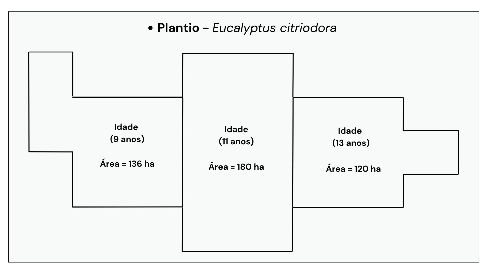
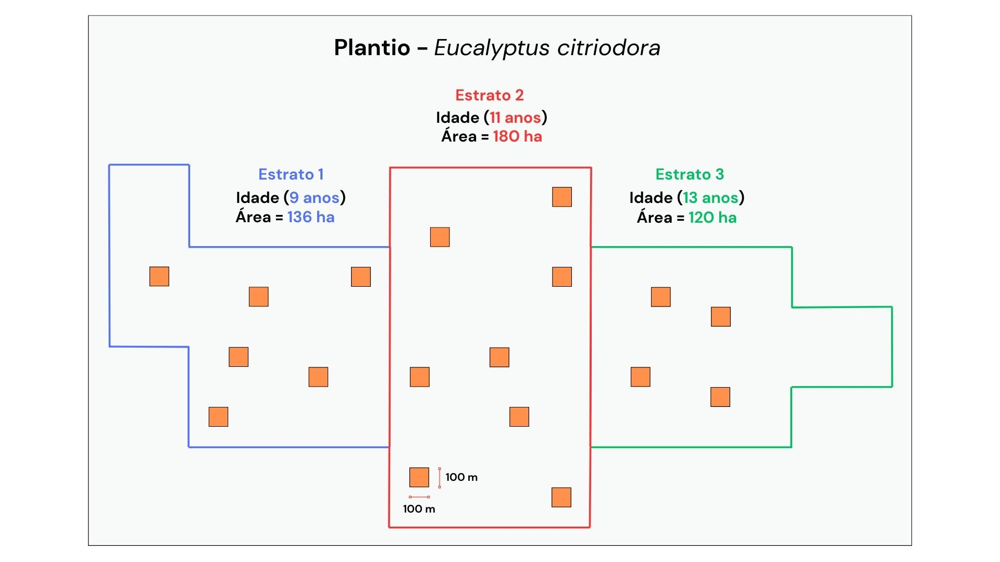
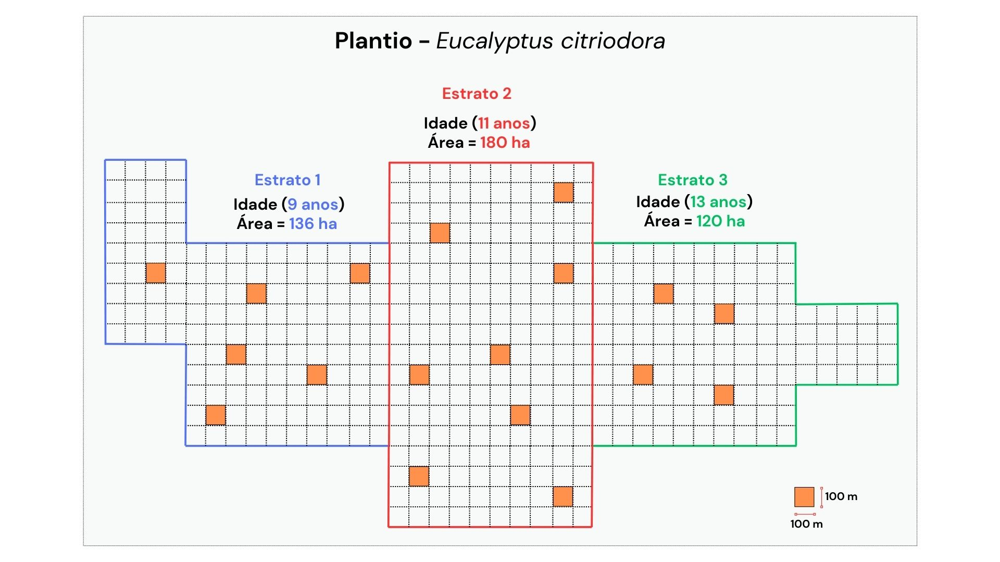
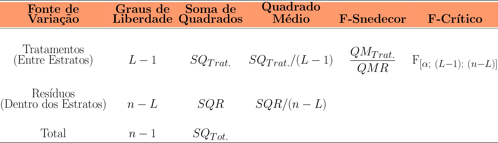

class: title-slide, center, middle
background-image: url(fig/slide-title/LMFTCA.png), url(fig/slide-title/ufpa.png), url(fig/slide-title/capa.png)
background-position: 90% 90%, 10% 90%
background-size: 150px, 150px, cover

```{r setup, include=FALSE}
knitr::opts_chunk$set(
  fig.showtext = TRUE,
  fig.align = "center", 
  cache = FALSE,
  error = FALSE,
  message = FALSE, 
  warning = FALSE, 
  collapse = TRUE ,
  dpi = 600)
```

```{r xaringan-logo, echo=FALSE}
library(xaringanExtra)
use_logo(
  image_url = "fig/slide-title/ufpa.png",
  position = css_position(top = ".8em", right = "1em"),
  width = "140px",
  height = "140px"
)

use_scribble()

```

```{r icon, echo=FALSE}
#remotes::install_github("mitchelloharawild/icons")
#library(icons)
#download_fontawesome()
#download_simple_icons()
```

```{r customDT, echo=F}
CustomDT <- function(data){
  data %>% DT::datatable(editable = 'cell', rownames = FALSE,
                         style = "default",
                         class = "display", width = '250px',
                         caption = '',
     options=list(pageLength = 16, dom = 'tip', autoWidth = F,
       initComplete = htmlwidgets::JS(
          "function(settings, json) {",
          paste0("$(this.api().table().container()).css({'font-size': '", "14pt", "'});"),
          "}")
       ) 
     )
}
```

```{r packages, include=FALSE}
# remotes::install_github("dill/emoGG")
library(ggplot2)
library(dplyr)
library(ggimage)
```


# .font120[Inventário Florestal <br> (FL03039 - EF)]

## `r anicon::faa("pagelines", animate="horizontal", colour="green")` Amostragem Estratificada`r anicon::faa("pagelines", animate="horizontal", colour="green")` <br>  ᨒ
###### Teoria e Estimadores

##### 〰〰〰〰〰〰🌳〰〰〰〰〰〰
##### ᨒ
##### .font120[**Prof. Dr. Deivison Venicio Souza**]
##### Universidade Federal do Pará (UFPA)
##### Faculdade de Engenharia Florestal
##### Laboratório de Manejo Florestal, Tecnologias e Comunidades Amazônicas
##### E-mail: deivisonvs@ufpa.br
<br>
##### 1ª versão: 16/maio/2025 <br> (Atualizado em: `r format(Sys.Date(),"%d/%B/%Y")`) <br> Altamira, Pará

---
layout: true
class: with-logo logo-ufpa
<div class="my-header"></div>
<div class="my-footer"><span>Prof. Dr. Deivison Venicio Souza (E-mail: deivisonvs@ufpa.br)&emsp;&emsp;&emsp;&emsp;&emsp; <div3>Inventário Florestal (FL03039 - EF)</div3>/ <div2>Amostragem Estratificada</div2> </div>

---

## 📚 Ementa da disciplina (FL03039 - EF)
<br>
.shadow4[
.font80[
1 - Introdução aos Inventários Florestais; 

2 - Amostragem em Inventários Florestais;

&nbsp;&nbsp;&nbsp;&nbsp;2.1 - Conceitos Básicos e Principais Estimadores;

&nbsp;&nbsp;&nbsp;&nbsp;2.2 - Métodos de Amostragem;

&nbsp;&nbsp;&nbsp;&nbsp;2.3 - Amostragem Aleatória Simples - AAS;

&nbsp;&nbsp;&nbsp;&nbsp;**2.4 - Amostragem Estratificada - AE**;

&nbsp;&nbsp;&nbsp;&nbsp;2.5 - Amostragem Sistemática - AS; 

&nbsp;&nbsp;&nbsp;&nbsp;2.6 - Amostragem em Dois Estágios - ADE; e

&nbsp;&nbsp;&nbsp;&nbsp;2.7 - Amostragem em Conglomerados - AG.

3 - Censo Florestal (Inventário Florestal 100%); 

4 - Amostragem em Múltiplas Ocasiões;

5 - Inventário Florestal Nacional; e

6 - Planejamento e Custos de Inventários Florestais.

<!--7 - Tecnologias Aplicadas em Inventários Florestais.-->
]
]

---

## 🎯 Objetivos
<br><br>
.font80[
Ao final desta aula espera-se que o discente seja capaz de...

* Compreender os conceitos básicos associados à Amostragem Estratificada (AE);
* Conhecer os principais estimadores da AE;
* Aprender a calcular as estimativas da AE por meio de um estudo de caso; e
* Aprender a interpretar as estimativas e concluir sobre a precisão do IF realizado.
]

---

## 📙 Conteúdo

.pull-left-4[
.pull-top[
**Parte 1 - AE: Fundamentos Teóricos**
.font80[

[1 - Definição](#def)

[2 - Quando usar a AE?](#qua)

[3 - Relação: Variância, intensidade amostral e custo](#rel)

[4 - Critérios para estratificação](#ce)

[5 - Vantagens e desvantagens da AE](#vd)

]
]
]

.pull-right-4[

**Parte 2 - Estimadores da AE**

.font80[

[1 - Principais Estimadores da AE](#peae)

&nbsp;&nbsp;[1.1 - Média Aritmética por Estrato](#mae)

&nbsp;&nbsp;[1.2 - Média Estratificada](#me)

&nbsp;&nbsp;[1.3 - Variância e Desvio Padrão por Estrato](#vde)

&nbsp;&nbsp;[1.4 - Variância Estratificada](#ve)

&nbsp;&nbsp;[1.5 - Variância e Erro Padrão da Média Estratificada](#vepme)

&nbsp;&nbsp;[1.6 - Intensidade Amostral (ou Suficiência Amostral)](#ia)

&nbsp;&nbsp;[1.7 - Erro de Amostragem (absoluto e %)](#ea)

&nbsp;&nbsp;[1.8 - Intervalo de Confiança para Média Estratificada](#icme)

&nbsp;&nbsp;[1.9 - Total por Estrato e População](#tep)

&nbsp;&nbsp;[1.10 - Intervalo de Confiança Para o Total da População](#icptp)

]
]

---

## 📙 Conteúdo

.pull-left-4[
.pull-top[
**Parte 3 - Inventário Florestal usando AE**
.font80[

[1 - Estudo de Caso (Sanquetta et al., 2023; pg. 124)](#ec)

&nbsp;&nbsp;[1.1 - Média Aritmética Amostral](#maEC)

&nbsp;&nbsp;[1.2 - Variância, Desvio Padrão e Coeficiente de Variação](#dpEC)

&nbsp;&nbsp;[1.3 - Intensidade Amostral (ou Suficiência Amostral)](#iaEC)

&nbsp;&nbsp;[1.4 - Erro Padrão da Média Amostral](#epmEC)

&nbsp;&nbsp;[1.5 - Erro de Amostragem](#eaEC)

&nbsp;&nbsp;[1.6 - Intervalo de Confiança Para Média](#icmEC)

&nbsp;&nbsp;[1.7 - Total da População](#tpEC)

&nbsp;&nbsp;[1.8 - IC Para o Total da População](#icptpEC)

]
]
]

<!-- Slide XX -->
---
layout: false
name: if
class: inverse, middle, center
background-image: url(fig/class0/sec.png)
background-size: cover

.font150[.yellow2[**Amostragem Estratificada** <br> .orange[**(Fundamentos Teóricos)**]]]

---
layout: true
<div class="my-header"></div>
<div class="my-footer"><span>Prof. Dr. Deivison Venicio Souza (E-mail: deivisonvs@ufpa.br)&emsp;&emsp;&emsp;&emsp;&emsp;<div3>Amostragem Estratificada - AE</div3>/ <div2>Parte 1 - Fundamentos Teóricos</div2> </div>

---
name: def
## 🌳 Amostragem Estratificada
<br>

.shadow1[
### Definição
.font90[
**Processo de amostragem** que consiste na divisão da população florestal em **estratos** (subpopulações) **não superpostos**, que sejam **mais homogêneos** em termos de distribuição da **variável de interesse**. Em seguida, a distribuição das unidades de amostra é realizada de forma aleatória dentro de cada estrato (Queiroz, 1998; Soares et al., 2011).
]
]

---
name: qua
## 🌳 Amostragem Estratificada
<br>

.shadow1[
### AAS versus AE: Quando usar?
.font90[
- **Amostragem Aleatória Simples**: recomendada quando a população florestal .blue[for homogênea] quanto à distribuição da .blue[variável de interesse].
- **Amostragem Estratificada**: recomendada quando a população florestal .blue[não for homogênea] quanto à distribuição da .blue[variável de interesse].
<br>

**Fonte:** (Soares et al., 2011)
]
]

---
name: rel
## 🌳 Amostragem Estratificada

.shadow1[
### Relação: Variância, intensidade amostral e custo
.font90[

- Quanto .blue[**>**] a variância da variável de interesse, .blue[**>**] será a intensidade amostral (n) e .blue[**>**] será o tempo e o custo da amostragem.

👉 > Variância da variável de interesse

👉 > Intensidade de amostragem (n)

👉 > Tempo e custo da amostragem

- Portanto, em condições de heterogeneidade da variável de interesse, estratificar o povoamento florestal é uma abordagem eficiente:

👉 < Variância da variável de interesse dentro dos estratos

👉 < Intensidade de amostragem (n)

👉 < Tempo e custo da amostragem

]
]

---
name: ce
## 🌳 Amostragem Estratificada

.pull-left-4[
.shadow1[
### Critérios para estratificação
.font90[
- Em campo, a variável de interesse pode variar em função das características do povoamento florestal ou sítio. Portanto, nessas situações é comum usar algum critério de estratificação.
]
]
]

--

.pull-right-4[
```{r, echo=FALSE, out.width='90%', fig.align='center', fig.cap='', dpi=600}
knitr::include_graphics('fig/class6/ce.jpg')
```
]

---

## 🌳 Amostragem Estratificada

.shadow1[
### Qual melhor critério de estratificação?
.font90[
- A .blue[estratificação com base na variável de interesse] é seguramente o procedimento mais eficiente (Scolforo e Mello, 1997). Portanto, sempre que possível, a variável a ser estimada no IF deve ser usada como critério de estratificação (Péllico Netto e Brena, 1997). 
- Por exemplo, se o .blue[volume por hectare] é a variável de interesse a ser estimada, é desejável estratificar o povoamento florestal em função das classes de volume (Soares et al., 2011).
]
]

---
name: vd
## 🌳 Amostragem Estratificada

.pull-left-4[
.shadow1[
### Vantagens da estratificação
.font80[
- **Estimativas por estrato**: Permite obter estimativas da média e variância populacional por estrato.
- **Intensidade amostral**: Para uma igual intensidade amostral, as estimativas usando a AE são mais precisas do que àquelas obtidas com AAS (**Em condições de heterogeneidade!**);
- **Custos**: AE tem menor custo de amostragem, pois existe uma diminuição da intensidade amostral (n) para atingir uma mesma precisão do que as necessárias à AAS.
<br>

**Fonte:** Scolforo e Mello, (1997)
]
]
]

--

.pull-left-4[
.shadow1[
### Desvantagens da estratificação
.font80[
- O tamanho de cada estrato deve ser bem definido.
(**Trabalho adicional!**)
]
]
]

<!-- Slide XX -->
---
layout: false
name: if
class: inverse, middle, center
background-image: url(fig/class0/sec.png)
background-size: cover

.font150[.yellow2[**Amostragem Estratificada** <br> .orange[**(Estimadores)**]]]

---
layout: true
<div class="my-header"></div>
<div class="my-footer"><span>Prof. Dr. Deivison Venicio Souza (E-mail: deivisonvs@ufpa.br)&emsp;&emsp;&emsp;&emsp;&emsp;<div3>Amostragem Estratificada - AE</div3>/ <div2>Parte 2 - Estimadores</div2> </div>

---
name: peae
## 🌳 Estimadores da Amostragem Estratificada
<br>

.pull-left-12[
**Os principais estimadores da AE são:**
]

.pull-right-12[
.font80[
| **Estimador (do Parâmetro)**                          | **Símbolo**                |
|-------------------------------------------------------|:----------------------------:|
| 1 - Média Aritmética por Estrato                                  | $\bar{X}_h$                  |
| 2 - Média Estratificada                                         | $\bar{X}_{st}$                      |
| 3 - Variância por Estrato                                     | $S^2_h$                        |
| 4 - Desvio Padrão por Estrato                           | $S_h$                        |
| 5 - Variância Estratificada                              | $S^2_{st}$                        |
| 6 - Variância da Média Estratificada                          | $S^2_{\bar{X}(st)}$             |
| 7 - Erro Padrão da Média Estratificada                          | $S_{\bar{X}(st)}$              |
| 8 - Intensidade Amostral por Estrato e Total                         | $n~e~n_h$  
| 9 -  Erro de Amostragem (absoluto e %)                                | $\left(E_a~ou~E_r \right)$ |
| 10 - Intervalo de Confiança para Média Estratificada                 | $IC_{\bar{X}(st)}$             |
| 11 - Total por Estrato e População                               | $\hat{X_h}~e~\hat{X}$                  |
| 12 - Intervalo de Confiança para o Total da População | $IC_{\hat{X}}$             |
]
]

---

## 🌳 Estimadores da Amostragem Estratificada

.shadow1[
### Notações
]

.pull-left-9[
<br>
.font80[
$X_{ih}$ = Variável de interesse

$L$ = Número de estratos da população

$h$ = Estrato

$a$ = Área da parcela

$N_h$ = Número de parcelas possíveis de serem alocadas no estrato h (.blue[**1**])

$N$ = Número de parcelas possíveis de serem alocadas na população (.blue[**2**])

$n_h$ = Número total de parcelas alocadas no estrato h

$n$ = Número total de parcelas alocadas na população florestal (.blue[**3**])

$A_h$ = Área total do estrato h

$A$ = Área total da população florestal (.blue[**4**])
]
]


.pull-right-9[
<br>
$$
\begin{equation}
\small
N_h = \frac{A_h}{a}
\end{equation}
$$

$$
\begin{equation}
\small
N = \sum_{h=1}^{L}N_h
\end{equation}
$$

$$
\begin{equation}
\small
n = \sum_{h=1}^{L}n_h
\end{equation}
$$

$$
\begin{equation}
\small
A = \sum_{h=1}^{L}A_h
\end{equation}
$$

]

---

## 🌳 Estimadores da Amostragem Estratificada

.shadow1[
### Notações
]

.pull-left-9[
<br>
.font80[

$W_h$ = Proporção do estrato h na população florestal (.blue[**5**])

$w_h$ = Proporção do estrato h na amostra total (.blue[**6**])

$f_h$ = Fração amostral do estrato h (.blue[**7**])

$f$ = Fração amostral da população (.blue[**8**])
]
]


.pull-right-9[
<br>
$$
\begin{equation}
\small
W_h = \frac{N_h}{N} = \frac{A_h}{A}
\end{equation}
$$

$$
\begin{equation}
\small
w_h = \frac{n_h}{n}
\end{equation}
$$

$$
\begin{equation}
\small
f_h = \frac{n_h}{N_h}
\end{equation}
$$

$$
\begin{equation}
\small
f = \frac{n}{N}
\end{equation}
$$

]

---

## 🌳 Estimadores da Amostragem Estratificada

<br><br>
.shadow1[
.font80[
### Notações
- **Exemplo**: Imagine um povoamento florestal de .blue[*Eucalyptus citriodora*], pertencente à empresa "Florestal", com .blue[diferentes idades] (9, 11 e 13 anos) e .blue[tamanhos] (136, 180 e 120 hectares), respectivamente. O povoamento foi implantado sob o mesmo espaçamento e classe de sítio para produção de madeira serrada. Agora, suponha que a empresa esteja interessada em .blue[estimar o volume de madeira] das árvores em pé nos povoamentos de diferentes idades. Para isso, realizou um IF piloto e estabeleceu 6, 8 e 4 parcelas de 100 m x 100 m nas idades 9, 11 e 13, respectivamente.
]
]

---

## 🌳 Estimadores da Amostragem Estratificada

<br>
```{r, echo=FALSE, out.width='70%', fig.align='center', fig.cap='', dpi=600}

```

---

## 🌳 Estimadores da Amostragem Estratificada
<br>

.shadow3C[
.font80[
**Abordagem**: Estratificar a área em função da idade dos plantios.
]
]

--

.pull-left-4[
<br><br>
```{r, echo=FALSE, out.width='100%', fig.align='center', fig.cap='', dpi=600}

```
]

--

.pull-right-4[
<br>
- **Notações**
.font80[
$X_{ih}$ = Volume por hectare ($m³.ha^{-1}$)

$L$ = $3$ estratos

$h$ = ($h_1$ = estrato 1), ($h_2$ = estrato 2), ($h_3$ = estrato 3)

$a$ = $1~ha$ ($10.000~m²$)

$n_h$ = ($n_{h1}$ = 6), ($n_{h2}$ = 8), ($n_{h3}$ = 4)

$n$ = $n_{h1} + n_{h2} + n_{h3} = 18$

$A_h$ = ($A_{h1} = 136~ha$), ($A_{h2} = 180~ha$), ($A_{h3} = 120~ha$)

$A$ = $A_{h1} + A_{h2} + A_{h3} = 436~ha$

]
]

---

## 🌳 Estimadores da Amostragem Estratificada
<br>

.shadow3C[
.font80[
**Abordagem**: Estratificar a área em função da idade dos plantios.
]
]

--

.pull-left-4[
<br><br>
```{r, echo=FALSE, out.width='100%', fig.align='center', fig.cap='', dpi=600}

```
]

--

.pull-right-4[
- **Notações**
.font80[
👉 Número de parcelas possíveis de serem alocadas em cada estrato h e na população

$$
\normalsize
\begin{equation*}
N_{h1} = \frac{A_{h1}}{a} = \frac{136~ha}{1~ha} = \textbf{136}~\color{magenta}{parcelas} \\~\\
N_{h2} = \frac{A_{h2}}{a} = \frac{180~ha}{1~ha} = \textbf{180}~\color{magenta}{parcelas} \\~\\
N_{h3} = \frac{A_{h3}}{a} = \frac{120~ha}{1~ha} = \textbf{120}~\color{magenta}{parcelas}
\end{equation*}
$$
$$
\normalsize
\begin{equation*}
N = \sum_{h=1}^{L}N_h = 136 + 180 + 120 = \textbf{436}~\color{magenta}{parcelas}
\end{equation*}
$$
]
]

---

## 🌳 Estimadores da Amostragem Estratificada
<br>

.shadow3C[
.font80[
**Abordagem**: Estratificar a área em função da idade dos plantios.
]
]

--

.pull-left-4[
<br><br>
```{r, echo=FALSE, out.width='100%', fig.align='center', fig.cap='', dpi=600}

```
]

--

.pull-right-4[
- **Notações**
.font80[
👉 Proporção de cada estrato h na população florestal

$$
\normalsize
\begin{equation*}
W_{h1} = \frac{136~ha}{436~ha} \approx
\textbf{0,3119} \approx \textbf{31,19}~\color{magenta}{\%} \\~\\
W_{h2} = \frac{180~ha}{436~ha} \approx
\textbf{0,4128} \approx \textbf{41,28}~\color{magenta}{\%} \\~\\
W_{h3} = \frac{120~ha}{436~ha} \approx
\textbf{0,2752} \approx \textbf{27,52}~\color{magenta}{\%}
\end{equation*}
$$
]
]

---

## 🌳 Estimadores da Amostragem Estratificada
<br>

.shadow3C[
.font80[
**Abordagem**: Estratificar a área em função da idade dos plantios.
]
]

--

.pull-left-4[
<br><br>
```{r, echo=FALSE, out.width='100%', fig.align='center', fig.cap='', dpi=600}

```
]

--

.pull-right-4[
- **Notações**
.font80[
👉 Proporção de cada estrato h na amostra total
<br>

$$
\normalsize
\begin{equation*}
w_{h1} = \frac{n_{h1}}{n} =  \frac{6}{18} \approx
\textbf{0,3333} \approx \textbf{33,33}~\color{magenta}{\%}\\~\\
w_{h2} = \frac{n_{h2}}{n} = \frac{8}{18} \approx
\textbf{0,4444} \approx \textbf{44,44}~\color{magenta}{\%}\\~\\
w_{h3} = \frac{n_{h3}}{n} = \frac{4}{18} \approx
\textbf{0,2222} \approx \textbf{22,22}~\color{magenta}{\%}
\end{equation*}
$$
]
]

---

## 🌳 Estimadores da Amostragem Estratificada
<br>

.shadow3C[
.font80[
**Abordagem**: Estratificar a área em função da idade dos plantios.
]
]

--

.pull-left-4[
<br><br>
```{r, echo=FALSE, out.width='100%', fig.align='center', fig.cap='', dpi=600}

```
]

--

.pull-right-4[
- **Notações**
.font80[
👉 Fração amostral de cada estrato h e população
<br>

$$
\normalsize
\begin{equation*}
f_{h1} = \frac{n_{h1}}{N_{h1}} = \frac{6}{136} = \textbf{0,0441} \approx \textbf{4,41}~\color{magenta}{\%} \\~\\
f_{h2} = \frac{n_{h2}}{N_{h2}} = \frac{8}{180} = \textbf{0,0444} \approx \textbf{4,44}~\color{magenta}{\%} \\~\\
f_{h3} = \frac{n_{h3}}{N_{h3}} = \frac{4}{120} = \textbf{0,0333} \approx \textbf{3,33}~\color{magenta}{\%}
\end{equation*}
$$
$$
\normalsize
\begin{equation*}
f = \frac{n}{N} = \frac{18}{436} \approx \textbf{0,0413} \approx \textbf{4,13}~\color{magenta}{\%}
\end{equation*}
$$

]
]

---
name: ma
## 🌳 Estimadores da Amostragem Estratificada

.shadow1[
## Média aritmética amostral por estrato
.font90[
👉 Estimar a média populacional $\mu_h$ (média amostral de cada estrato $h$) para a variável de interesse $X$, baseado nas unidades amostrais de cada estrato $h$.

\begin{equation}
\large
\bar{X}_h = \frac{1}{n_h}\sum_{i=1}^{n_h}X_{hi}
\end{equation}

- $\bar{X}_h$ (lê-se: X-barra "agá") = estimador da média aritmética populacional $\mu_h$ (lê-se: "mi") no estrato $h$ ou média amostral no estrato $h$.
- $n_h$ = número de parcelas alocadas no estrato $h$.
- $\Sigma$ (sigma maiúscula) = símbolo de somatório. 
- $X_{hi}$ = $i$-ésimo valor da variável $X$ nas unidades amostrais do estrato $h$.

]
]

---
name: ma
## 🌳 Estimadores da Amostragem Estratificada

.shadow1[
## Média amostral estratificada
.font80[
👉 Estimar a média populacional $\mu$ estratificada (média amostral estratificada) da variável de interesse $X$, baseado em todas as unidades amostrais alocadas nos diferentes estratos. Matematicamente, consiste em ponderar a média amostral de cada estrato $h$ pelo seu respectivo tamanho.

\begin{equation}
\large
\bar{X}_{est} = \sum_{h=1}^{L}\frac{N_h}{N}\bar{X_h} = \sum_{h=1}^{L}W_h\bar{X_h}
\end{equation}

- $\bar{X}_{est}$ (lê-se: X-barra "est") = estimador da média aritmética populacional estratificada ($\mu_{est}$) ou média amostral estratificada.
- $N_h$ = Número de parcelas possíveis de serem alocadas no estrato $h$.
- $N$ = Número de parcelas possíveis de serem alocadas na população.
- $\bar{X}_h$ = estimador da média aritmética populacional $\mu_h$ no estrato $h$.
- $W_h$ = Proporção do estrato $h$ na população florestal.
]
]

---

name: ma
## 🌳 Estimadores da Amostragem Estratificada

<br>

.shadow1[
## Média amostral x Média estratificada
.font80[
👉 A média amostral $\bar{X}$ e a média estratificada $\bar{X}_{est}$ somente serão coincidentes quando a fração amostral for idêntica para todos os estrato.
]
]

---
name: dp
## 🌳 Estimadores da Amostragem Estratificada

.shadow1[
## Variância amostral por estrato
.font90[
👉 Estimar a variabilidade (ou dispersão) da variável de interesse $X$ entre as unidades amostrais do estrato $h$.

\begin{equation}
\large
S_h^2 = \frac{1}{n_{h} - 1}\sum_{i=1}^{n_h}\left (X_{hi} - \bar{X_h}  \right )^2
\end{equation}

- $S_h^2$ (lê-se: S-quadrado "agá") = estimador da variância populacional no estrato $h$ ($\sigma^2_h$) ou variância amostral no estrato $h$.
- $n_h$ = número de parcelas alocadas no estrato $h$.
- $X_{hi}$ = $i$-ésimo valor da variável $X$ nas unidades amostrais do estrato $h$.
- $\bar{X_h}$ = estimativa da média aritmética populacional $\mu$ no estrato $h$.
]
]

---

## 🌳 Estimadores da Amostragem Estratificada

.shadow1[
## Desvio padrão amostral por estrato
.font90[
👉 Estimar a variabilidade (ou dispersão) da variável de interesse $X$ entre as unidades amostrais do estrato $h$. Porém, **é expresso na mesma unidade de medida da variável de interesse.**

\begin{equation}
\large
S_h = \sqrt{\frac{1}{n_{h} - 1}\sum_{i=1}^{n_h}\left (X_{hi} - \bar{X_h} \right )^2}
\end{equation}

- $S_h$ (lê-se: S "agá") = estimador do desvio padrão populacional no estrato $h$ ($\sigma_h$) ou desvio padrão amostral no estrato $h$.
- $n_h$ = número de parcelas alocadas no estrato $h$.
- $X_{hi}$ = $i$-ésimo valor da variável $X$ nas unidades amostrais do estrato $h$.
- $\bar{X_h}$ = estimativa da média aritmética populacional $\mu$ no estrato $h$.
]
]

---

## 🌳 Estimadores da Amostragem Estratificada

.shadow1[
## Coeficiente de variação amostral por estrato
.font90[
👉 Estimar a variabilidade (ou dispersão) da variável de interesse $X$ entre as unidades amostrais do estrato $h$. Porém, expresso em termos relativos (em %).

\begin{equation}
\large
CV_h = \frac{S_h}{\bar{X_h}} \left( 100 \right)
\end{equation}

- $CV_h$ = estimador do coeficiente de variação populacional no estrato $h$ ou coeficiente de variação amostral no estrato $h$.
- $S_h$ = estimativa do desvio padrão populacional $\sigma$ no estrato $h$.
- $\bar{X_h}$ = estimativa da média aritmética populacional $\mu$ no estrato $h$.
]
]

---

## 🌳 Estimadores da Amostragem Estratificada

.shadow1[
## Variância amostral estratificada
.font90[
👉 Estimar a variância populacional $\mu$ estratificada (variância amostral estratificada) da variável de interesse $X$, baseado em todas as unidades amostrais alocadas nos diferentes estratos.

\begin{equation}
\large
S^2_{est} = \sum_{h=1}^{L}W_h S_h^2
\end{equation}

- $S^2_{est}$ (lê-se: S-Quadrado "est") = estimador da variância populacional estratificada ($\sigma^2_{est}$) ou variância amostral estratificada.
- $W_h$ = Proporção do estrato $h$ na população florestal.
- $S_h^2$ = estimador da variância populacional $\sigma^2$ no estrato $h$.
]
]

---

## 🌳 Estimadores da Amostragem Estratificada

.shadow1[
## Variância da média estratificada
.font90[

\begin{equation}
\large
S^2_{\bar{X}(est)} = \sum_{h=1}^{L}W_h^2 \frac{S_h^2}{n_h} - \sum_{h=1}^{L} \frac{W_h S_h^2}{N}
\end{equation}

- $S^2_{\bar{X}(est)}$ (lê-se: S-Quadrado "X-barra est") = estimador da **variância da média populacional estratificada** ($\sigma^2_{\mu(est)}$) ou variância da média estratificada amostral.
- $W_h$ = Proporção do estrato $h$ na população florestal.
- $S_h^2$ = estimador da variância populacional $\sigma^2$ no estrato $h$.
- $n_h$ = número de parcelas alocadas no estrato $h$.
- $N$ = Número de parcelas possíveis de serem alocadas na população.
]
]

---

## 🌳 Estimadores da Amostragem Estratificada

.shadow1[
## Erro padrão da média estratificada
.font90[

\begin{equation}
\large
S_{\bar{X}(est)} = \sqrt{\sum_{h=1}^{L}W_h^2 \frac{S_h^2}{n_h} - \sum_{h=1}^{L} \frac{W_h S_h^2}{N}}
\end{equation}

- $S_{\bar{X}(est)}$ (lê-se: S "X-barra est") = estimador do **erro padrão da média populacional estratificada** ($\sigma_{\mu(est)}$) ou erro padrão da média estratificada amostral.
- $W_h$ = Proporção do estrato $h$ na população florestal.
- $S_h^2$ = estimador da variância populacional $\sigma^2$ no estrato $h$.
- $n_h$ = número de parcelas alocadas no estrato $h$.
- $N$ = Número de parcelas possíveis de serem alocadas na população.
]
]

---

## 🌳 Estimadores da Amostragem Estratificada

.shadow1[
## Intensidade amostral (ou suficiência amostral)
.font90[
👉 Em processo de amostragem estratificada, a intensidade amostral é calculada em função do tipo de alocação das unidades amostrais nos estratos (PÉLLICO NETTO; BRENA, 1997; SANQUETTA et al., 2009, QUEIROZ, 2012; SCOLFORO; MELLO, 1997):
<br>

- a) Alocação proporcional
- b) Alocação ótima ou de Neyman
]
]

---

## 🌳 Estimadores da Amostragem Estratificada

.shadow1[
## Intensidade amostral (ou suficiência amostral)
.font90[
<br>
👉 **ALOCAÇÃO PROPORCIONAL**

- O número de parcelas a serem distribuídas em cada estrato
é proporcional ao tamanho do estrato (SCOLFORO; MELLO 1997).
- A variabilidade da variável de interesse no estrato e o custo não é levada em consideração.
- Portanto, estrato com maior área recebe mais parcelas do que os estratos menores.

👉 **> Tamanho do estrato ➡️ + Parcelas**

]
]

---

## 🌳 Estimadores da Amostragem Estratificada

.shadow1[
## Intensidade amostral (ou suficiência amostral)
.font80[
<br>
👉 **ALOCAÇÃO PROPORCIONAL**

- A estimativa da intensidade amostral é obtida em função da **variância estratificada** (PÉLLICO NETTO; BRENA, 1997).

$$
\begin{equation}
\large
n = \dfrac{t^2\sum\limits_{h=1}^{L}W_h S^2_h}{E^2+t^2\sum\limits_{h=1}^{L}\dfrac{W_h S^2_h}{N}} ~~~~ (\color{blue}{Populações~finitas})
\end{equation}
$$


$$
\begin{equation}
\large
n = \dfrac{t^2\sum\limits_{h=1}^{L}W_h S^2_h}{E^2} ~~~~ (\color{blue}{Populações~infinitas})
\end{equation}
$$
]
]

---

## 🌳 Estimadores da Amostragem Estratificada

.shadow1[
## Intensidade amostral (ou suficiência amostral)
.font80[
<br>
👉 **ALOCAÇÃO PROPORCIONAL - Número de parcelas por estrato h?**

$$
\begin{equation}
\large
n_h = \frac{N_h}{N}n = W_hn
\end{equation}
$$

- $N_h$ = Número de parcelas possíveis de serem alocadas no estrato $h$.
- $N$ = Número de parcelas possíveis de serem alocadas na população.
- $n$ = Número total de parcelas que devem ser alocadas na população florestal.
- $W_h$ = Proporção do estrato $h$ na população florestal.

]
]

---

## 🌳 Estimadores da Amostragem Estratificada

.shadow1[
## Análise de Variância (ANOVA) da Estratificação
.font80[
- A ANOVA deve ser realizada na primeira estratificação da população florestal. O objetivo é inferir se existe (ou não) diferença significativa entre as médias dos estratos.
- Portanto, através da ANOVA é possível inferir se a estratificação foi benéfica (ou não), em termos de precisão e custo, comparado a Amostragem Aleatória Simples (AAS).
]
]

--

```{r, echo=FALSE, out.width='60%', fig.align='center', fig.cap='', dpi=600}

```

.font80[
$L$ = Número de estratos;
$n$ = Número total de unidades amostradas na população.
]

---

## 🌳 Estimadores da Amostragem Estratificada

.shadow1[
## Análise de Variância (ANOVA) da Estratificação
.font80[
- **Hipóteses estatísticas do teste F**

👉  **Hipótese de Nulidade:**
- As médias dos estratos são estatisticamente todas iguais entre si.

$H_0: \bar{X_{h_1}} = \bar{X_{h_2}} = ... = \bar{X_{h_L}}$

👉  **Hipótese Alternativa:**
- Pelo menos dois estratos possuem médias são estatisticamente diferentes entre si.

$H_1: Não~H_0$
]
]

---

## 🌳 Estimadores da Amostragem Estratificada

.shadow1[
## Análise de Variância (ANOVA) da Estratificação
.font80[
- **Regras de decisão do teste F**

👉  Se $F_{calculado}$ > $F_{crítico}$, **rejeita-se a hipótese de nulidade** ($H_0$). Portanto, existem evidências de que as médias da variável de interesse de pelo menos dois estratos diferem estatísticamente, ao nível de probabilidade estabelecido. Assim, pode-se admitir que a estratificação foi benéfica ao inventário.

👉  Se $F_{calculado}$ $\leq$ $F_{crítico}$, **.blue[não] rejeita-se a hipótese de nulidade** ($H_0$). Portanto, não existem evidências de que as médias da variável de interesse de pelo menos dois estratos diferem estatísticamente, ao nível de probabilidade estabelecido. Assim, pode-se admitir que a estratificação não foi benéfica ao inventário.
]
]


---

## 📖 Referências

<br><br>
CAMPOS, J. C. C.; LEITE, H. G. **Mensuração florestal: perguntas e respostas**. 3ª ed. - Viçosa, MG: Ed. UFV, 2009. 548 p.
<br><br>
PÉLLICO NETTO, S.; BRENA, D. A. **Inventário Florestal**. Curitiba: editorado pelos autores, 1997. 316p.
<br><br>
QUEIROZ, W. T. **Técnicas de amostragem em inventário florestal nos trópicos**. Belém: FCAP. Serviço de Documentação e Informação, 1998. 147 p.
<br><br>
QUEIROZ, W. T. **Amostragem em Inventário Florestal**. Belém: Universidade Federal Rural da Amazônia, 2012. 441 p.

---

## 📖 Referências

<br><br>
SANQUETTA, C. R.; CORTE, A. P. D.; RODRIGUES, A. L.; WATZLAWICK, L. F. **Inventários florestais: planejamento e execução**. 4ª ed. Curitiba, PR. 2023. 406p.
<br><br>
SCOLFORO, J. R. S.; MELLO, J. M. **Inventário Florestal**. Lavras: UFLA/FAEPE, 1997. 341 p.
<br><br>
SOARES, C. P. B.; PAULA NETO, F.; SOUZA, A. L. **Dendrometria e inventário florestal**. 2ª ed. - Viçosa, MG: Ed. UFV, 2011. 272 p.
