class: title-slide, center, middle
background-image: url(fig/slide-title/LMFTCA.png), url(fig/slide-title/ufra.png), url(fig/slide-title/capa.png)
background-position: 90% 90%, 10% 90%
background-size: 150px, 150px, cover

```{r setup, include=FALSE}
knitr::opts_chunk$set(
  fig.showtext = TRUE,
  fig.align = "center", 
  cache = TRUE,
  error = FALSE,
  message = FALSE, 
  warning = FALSE, 
  collapse = TRUE ,
  dpi = 600)
```

```{r xaringan-logo, echo=FALSE}
library(xaringanExtra)
use_logo(
  image_url = "fig/slide-title/logo.png",
  position = css_position(top = ".8em", right = "1em"),
  width = "200px",
  height = "200px"
)
```

```{r icon, echo=FALSE}
#remotes::install_github("mitchelloharawild/icons")
#library(icons)
#download_fontawesome()
#download_simple_icons()
```

```{r customDT, echo=F}
CustomDT <- function(data){
  data %>% DT::datatable(editable = 'cell', rownames = FALSE,
                         style = "default",
                         class = "display", width = '250px',
                         caption = '',
     options=list(pageLength = 16, dom = 'tip', autoWidth = F,
       initComplete = htmlwidgets::JS(
          "function(settings, json) {",
          paste0("$(this.api().table().container()).css({'font-size': '", "14pt", "'});"),
          "}")
       ) 
     )
}
```

```{r packages, include=FALSE}
# remotes::install_github("dill/emoGG")
library(ggplot2)
library(dplyr)
library(ggimage)
```


<!-- title-slide -->
<!--# .font120[Inventário Florestal <br> (FL03039 - EF)] -->
# .font100[Inventário Florestal (EFBEL249) <br> (Forma Pará - Polo Pacajá/UFRA)]

## `r anicon::faa("pagelines", animate="horizontal", colour="green")` Censo Florestal `r anicon::faa("pagelines", animate="horizontal", colour="green")` <br> (Manejo Florestal Madeireiro)
###### Conceitos Chaves, Legislação e Etapas

##### 〰〰〰〰〰〰🌳〰〰〰〰〰〰
##### ᨒ
##### .font120[**Prof. Dr. Deivison Venicio Souza**]
##### Universidade Federal do Pará (UFPA)
##### Faculdade de Engenharia Florestal
##### Laboratório de Manejo Florestal, Tecnologias e Comunidades Amazônicas
##### E-mail: deivisonvs@ufpa.br
<br>
##### 1ª versão: 21/Setembro/2023 <br> (Atualizado em: `r format(Sys.Date(),"%d/%B/%Y")`) <br> Altamira, Pará

---
layout: true
class: with-logo logo-ufpa
<div class="my-header"></div>
<div class="my-footer"><span>Prof. Dr. Deivison Venicio Souza (E-mail: deivisonvs@ufpa.br)&emsp;&emsp;&emsp;&emsp;&emsp; <div3>Inventário Florestal (FL03039 - EF)</div3>/ <div2>Censo Florestal (Inventário Florestal 100%)</div2> </div>

---

## 📚 Ementa da disciplina (FL03039 - EF)
<br>
.shadow4[
.font80[
1 - Introdução aos Inventários Florestais; 

2 - Amostragem em Inventários Florestais;

&nbsp;&nbsp;&nbsp;&nbsp;2.1 - Conceitos Básicos e Principais Estimadores;

&nbsp;&nbsp;&nbsp;&nbsp;2.2 - Métodos de Amostragem;

&nbsp;&nbsp;&nbsp;&nbsp;2.3 - Amostragem Aleatória Simples - AAS;

&nbsp;&nbsp;&nbsp;&nbsp;2.4 - Amostragem Estratificada - AE;

&nbsp;&nbsp;&nbsp;&nbsp;2.5 - Amostragem Sistemática - AS; 

&nbsp;&nbsp;&nbsp;&nbsp;2.6 - Amostragem em Dois Estágios - ADE; e

&nbsp;&nbsp;&nbsp;&nbsp;2.7 - Amostragem em Conglomerados - AG.

**3 - Censo Florestal (Inventário Florestal 100%) e MFS**; e

4 - Amostragem em Múltiplas Ocasiões.

<!--7 - Tecnologias Aplicadas em Inventários Florestais.-->
]
]

---

## 🎯 Objetivos
<br><br>

.font80[
Ao final desta aula espera-se que o discente seja capaz de...

* Entender a relação entre Censo Florestal (ou Inventário 100%) e o Manejo Florestal Sustentável para fins Madeireiro;
* Conhecer as principais legislações (Leis, Resoluções, INs) que orientam o MFS e IF-100%;
* Compreender os conceitos chaves (legais) para o licenciamento ambiental do MFS para fins madeireiros;
* Compreender as principais etapas do MFS para fins madeireiros;
* Compreender as principais etapas para realização do censo florestal; 
* Conhecer os instrumentos, materiais e produtos do IF-100%; e
* Aprender a realizar análise técnica de IF-100% no âmbito MFS para fins Madeireiro.
]

---

## 📙 Conteúdo

.pull-left-4[
.pull-top[
.font80[**Parte 1 - MFS e Censo Florestal: Conceitos e Legislação**]
.font70[

[1 - Relação entre Censo Florestal e MFS para Fins Madeireiros](#cen)

[2 - Conceitos chaves para o MFS madeireiro](#df)

&nbsp;&nbsp;[2.1 - Principais Legislações](#pl)

&nbsp;&nbsp;[2.2 - Constituição Federal e Meio Ambiente](#cfma)

&nbsp;&nbsp;[2.3 - Manejo Florestal Sustentável - MFS](#mfs)

&nbsp;&nbsp;[2.4 - Área de Reserva Legal - ARL](#rl)

&nbsp;&nbsp;[2.5 - Área de Preservação Permanente - APP](#app)

&nbsp;&nbsp;[2.6 - Área de Uso Alternativo do Solo - AUAS](#auas)

&nbsp;&nbsp;[2.7 - Área de Manejo Florestal - AMF](#amf)

&nbsp;&nbsp;[2.8 - Unidade de Manejo Florestal - AMF](#umf)

&nbsp;&nbsp;[2.9 - Área de Efetiva Exploração Florestal - AEEF](#aeef)

&nbsp;&nbsp;[2.10 - Unidade de Produção Anual - UPA](#upa)

&nbsp;&nbsp;[2.11 - Unidade de Trabalho - UT](#ut)

&nbsp;&nbsp;[2.12 - Plano Manejo Florestal Sustentável - PMFS](#pmfs)

&nbsp;&nbsp;[2.13 - Plano Operacional Anual - POA](#poa)

]
]
]


.pull-right-4[
.font80[**Parte 1 - MFS para fins madeireiros e Legislação** (cont.)]

.font70[

&nbsp;&nbsp;[2.14 - Autorização de Exploração - AUTEX (ou AUTEF)](#autex)

&nbsp;&nbsp;[2.15 - Ciclo de Corte](#cc)

&nbsp;&nbsp;[2.16 - Diâmetro Mínimo de Corte](#dmc)

&nbsp;&nbsp;[2.17 - Intensidade Máxima de Corte](#imc)

]
]


.pull-right-4[
.font80[**Parte 2 - Etapas do MFS para fins madeireiros**]

.font70[

[1 - Principais Etapas do MFS para fins madeireiros](#macro)

&nbsp;&nbsp;[1.1 - Macroplanejamento](#macro)

&nbsp;&nbsp;[1.2 - Microplanejamento (incluindo o IF-100%)](#micro)

&nbsp;&nbsp;&nbsp;&nbsp;[1.2.1 - Censo Florestal: conceito e importância](#sua)

&nbsp;&nbsp;[1.3 - Atividades Exploratórias](#ae)

&nbsp;&nbsp;[1.4 - Atividades Pós-Exploratórias](#ape)

]
]

---

## 📙 Conteúdo

.pull-left-4[
.font80[**Parte 3 - Censo Florestal (IF-100%)**]

.font70[

[1 - Censo florestal e legislação](#censo)

[2 - Etapas do censo florestal](#etapas)

&nbsp;&nbsp;[2.1 - Identificação de árvores](#id)

&nbsp;&nbsp;[2.2 - Medição e estimativa de variáveis dendrométricas](#med)

&nbsp;&nbsp;[2.3 - Avaliação da qualidade do fuste (tronco)](#qf)

&nbsp;&nbsp;[2.4 - Detecção de presença de oco](#oco)

&nbsp;&nbsp;[2.5 - Corte de cipós pré-exploratório no IF-100%](#cipo)

&nbsp;&nbsp;[2.6 - Seleção de árvores matrizes](#matr)

&nbsp;&nbsp;[2.7 - Plaqueamento de árvores](#placa)

&nbsp;&nbsp;[2.8 - Mapeamento de árvores](#mapa)

[3 - Equipe, equipamentos e materiais](#equip)

[4 - Produtos do censo florestal](#prod)

&nbsp;&nbsp;[4.1 - Cálculos de medidas derivadas](#md)

&nbsp;&nbsp;[4.2 - Mapa de corte e colheita](#corte)

]
]


.pull-right-4[
.pull-top[
.font80[**Parte 4 - Análise Técnica de IF-100%**]
.font70[

[1 - Estudo de Caso (Fazenda Maringá)](#ec)

]
]
]

<!-- Slide XX -->
---
layout: false
name: if
class: inverse, middle, center
background-image: url(fig/class0/sec.png)
background-size: cover

.font150[**Censo Florestal e Manejo Florestal Madeireiro <br>**]

---
layout: true
class: with-logo logo-ufpa
<div class="my-header"></div>
<div class="my-footer"><span>Prof. Dr. Deivison Venicio Souza (E-mail: deivisonvs@ufpa.br)&emsp;&emsp;&emsp;&emsp;&emsp; <div3>Inventário Florestal (FL03039 - EF)</div3>/ <div2>MFS de Florestas Nativas da Amazônia</div2> </div>

---
name: if100
## Censo Florestal (IF-100%)

.shadow1b[
### Definição
<br>
.font90[
É uma .blue[atividade pré-exploratória] que consite na coleta de .blue[características quantitativas e qualitativas de todas as árvores] de valor comercial (e potencial) existentes em uma área destinada ao *Manejo Florestal Sustentável (MFS)*.
]
]

.pull-right-3[
.pull-down[
`r anicon::faa("seedling", size = 3, speed = "slow", animate = 'vertical', color = "green")`
`r anicon::faa("leaf", size = 3, speed = "slow", animate = 'vertical', color = "green")`

]
]

---
name: mfs
## Manejo Florestal Sustentável - MFS: Definição

.shadow1b[
.font80[
.center[
### [Lei nº 12.651, de 25 de maio de 2012 - Novo Código Florestal](https://www.planalto.gov.br/ccivil_03/_ato2011-2014/2012/lei/l12651.htm)
]
<br>

**Manejo Florestal Sustentável** (.orange[inciso VII do Art. 3º]):
<br><br>

_.orange[**Manejo Florestal Sustentável**]: **administração da vegetação natural** para a obtenção de **benefícios econômicos, sociais e ambientais**, respeitando-se os mecanismos de sustentação do ecossistema objeto do manejo e considerando-se, cumulativa ou alternativamente, a **utilização de múltiplas espécies madeireiras ou não**, **de múltiplos produtos e subprodutos da flora**, bem como a utilização de outros **bens e serviços**._
]
]

.pull-right-3[
.pull-down[
`r anicon::faa("seedling", size = 3, speed = "slow", animate = 'vertical', color = "green")`
`r anicon::faa("leaf", size = 3, speed = "slow", animate = 'vertical', color = "green")`

]
]

---
name: emfs
## Relação: MFS Madeireiro e Censo Florestal

.shadow1b[
### Etapas do MFS em Florestas Naturais (Balieiro et al., 2010)
<br>

```{r echo = FALSE, out.width='35%', fig.align='center', fig.cap='', dpi=600}
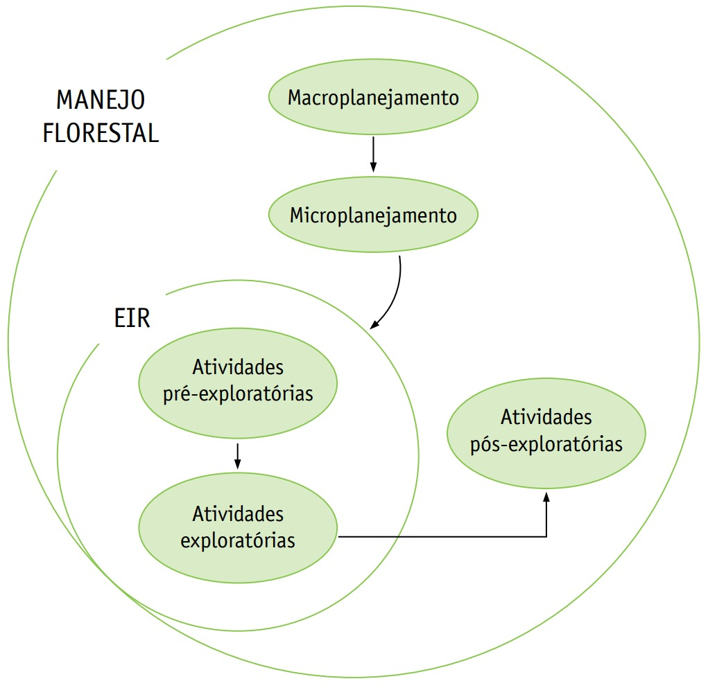
```

]

---

## Relação: MFS Madeireiro e Censo Florestal

.shadow1b[
### Etapas do MFS em Florestas Naturais (Balieiro et al., 2010)
<br>

As principais etapas do MFS para fins madeireiros são:
<br>

- **1ª Etapa - Macroplanejamento**
- **2ª Etapa - Microplanejamento (.blue[incluindo o IF-100%])**
- **3ª Etapa - Atividades Exploratórias**
- **4ª Etapa - Atividades Pós-Exploratórias**

]

---
name: pl
## Manejo Florestal Sustentável - MFS

.shadow1b[
.center[
### .blue[Principais Legislações - MFS para fins madeireiros]
]
<br>
.font70[

- **Esfera Federal:**

1 - [Constituição da República Federativa do Brasil de 1988](http://www.planalto.gov.br/ccivil_03/Constituicao/Constituicao.htm) (Art. 225º do Capítulo VI - Do Meio Ambiente)

2 - [Lei nº 6.938 de 31 de agosto de 1981](https://www.planalto.gov.br/ccivil_03/leis/l6938.htm) (Política Nacional do Meio Ambiente - PNMA)

3 - [Decreto nº 5.975 de 30 de novembro 2006](http://www.planalto.gov.br/ccivil_03/_ato2004-2006/2006/decreto/d5975.htm) (Defini fundamentos técnicos gerais do PMFS, transporte de produtos e subprodutos florestais)

4 - [Lei nº 11.284 de 02 de março de 2006](https://www.planalto.gov.br/ccivil_03/_Ato2004-2006/2006/Lei/L11284.htm) (Lei de gestão de florestas públicas para a produção sustentável)

5 - [Norma de Execução/IBAMA 01 de 24 de 04 de 2007](https://www.legisweb.com.br/legislacao/?id=91545)  (Diretrizes Técnicas para Elaboração dos PMFS)

6 - [Lei nº 12.651 de 25 de maio de 2012](https://www.planalto.gov.br/ccivil_03/_ato2011-2014/2012/lei/l12651.htm) (Novo Código Florestal)

7 - [Resolução nº 406 de 02 de fevereiro de 2009](http://conama.mma.gov.br/?option=com_sisconama&task=arquivo.download&id=578) (Parâmetros técnicos para elaboração, avaliação e execução de PMFS fins madeireiros)

8 - [Portaria MMA nº 443 de 17 de dezembro de 2014](https://www.icmbio.gov.br/cepsul/images/stories/legislacao/Portaria/2014/p_mma_443_2014_lista_esp%C3%A9cies_amea%C3%A7adas_extin%C3%A7%C3%A3o.pdf) (Lista as espécies da flora brasileira ameaçadas de extinção)

9 - [Portaria MMA nº 148 de 07 de junho de 2022](https://www.icmbio.gov.br/cepsul/images/stories/legislacao/Portaria/2020/P_mma_148_2022_altera_anexos_P_mma_443_444_445_2014_atualiza_especies_ameacadas_extincao.pdf) (Altera anexos da Portaria MMA nº 443, de 17 de dezembro de 2014)

10 - [Instrução Normativa nº 01 de 12 de fevereiro de 2015 – MMA](https://www.ibama.gov.br/sophia/cnia/legislacao/MMA/IN0001-12022015.pdf)  (Regulamenta o manejo das espécies vulneráveis - VU)

11 - [Instrução Normativa/IBAMA nº 28 de 10 de dezembro de 2024 – MMA](https://www.ibama.gov.br/component/legislacao/?view=legislacao&legislacao=139446)  (MFS espécies listadas na CITES dos gêneros Handroanthus, Tabebuia, Dipteryx e Cedrela)
]
]

---
name: pl
## Manejo Florestal Sustentável - MFS


.shadow1b[
.center[
### .blue[Principais Legislações - MFS para fins madeireiros]
]
<br>
.font70[

- **Esfera Estadual (Pará):**

1 - [Instrução Normativa/SEMAS nº 09 de 22 de Junho de 2011](https://www.semas.pa.gov.br/legislacao/files/pdf/9523.pdf)  (Cadastro Ambiental Rural - CAR e Licenciamento Ambiental de Atividades Rurais – LAR)

2 - [Instrução Normativa/SEMAS nº 05 de 10 de Setembro de 2015](https://www.semas.pa.gov.br/legislacao/files/pdf/184.pdf)  (Procedimentos técnicos para elaboração, apresentação, execução e avaliação técnica de PMFS nas florestas nativas exploradas ou não e suas formas de sucessão)

3 - [Instrução Normativa/SEMAS nº 03 de 10 de Outubro de 2017](https://www.semas.pa.gov.br/legislacao/files/pdf/200.pdf)  (Calendário Florestal: períodos para a safra da exploração de madeira)

4 - [Portaria/SEMAS nº 39 de 14 de Janeiro de 2025](https://www.semas.pa.gov.br/legislacao/normas/view/610526)  (Estabelece o modelo padronizado para apresentação dos arquivos digitais de inventário florestal)

]
]

---
name: pmfs
## Documentos técnicos: PMFS e POA

.shadow1b[
.font80[
.center[
### [Resolução nº 406, de 02 de fevereiro de 2009](http://conama.mma.gov.br/?option=com_sisconama&task=arquivo.download&id=578)
]

<br>

_.orange[**Plano Manejo Florestal Sustentável - PMFS** (inciso X do Art. 2º)]: documento técnico básico que apresenta as diretrizes e procedimentos para administração da floresta de acordo com os princípios do manejo florestal sustentável._

<br>

_.orange[**Plano Operacional Anual - POA** (inciso XI do Art. 2º)]: documento a ser apresentado ao órgão ambiental competente, contendo as informações definidas em suas diretrizes técnicas, com a especificação das atividades a serem realizadas no período de 12 meses._
]
]

---

## Documentos técnicos: PMFS e POA

```{r echo = FALSE, out.width='60%', fig.align='center', fig.cap='', dpi=600}
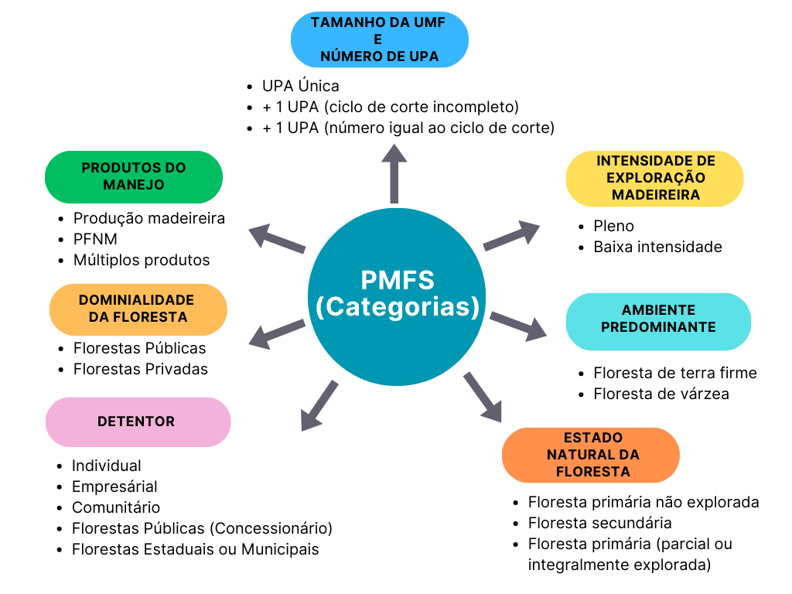
```
.center[.font50[**Fonte:** O Autor. [(Baseado na Instrução Normativa/SEMAS nº 05, de 10 de Setembro de 2015)](https://www.semas.pa.gov.br/legislacao/files/pdf/184.pdf)]]

---
name: amf
## Área de Manejo Florestal - AMF

.shadow1b[
.font80[
.center[
### [Resolução nº 406, de 02 de fevereiro de 2009](http://conama.mma.gov.br/?option=com_sisconama&task=arquivo.download&id=578)
]

<br>

_.orange[**Área de Manejo Florestal** (inciso I do Art. 2º)]: **conjunto de Unidades de Manejo Florestal - UMF** que compõem o PMFS, contíguas ou não, localizadas em um único Estado._

<br>

_.orange[**Unidade de Manejo Florestal** (inciso XII do Art. 2º)]: Área do imóvel rural a ser utilizada no manejo florestal._
]
]

.shadow1b[
.font80[
.center[
### [Instrução Normativa/SEMAS nº 05, de 10 de Setembro de 2015](https://www.semas.pa.gov.br/legislacao/files/pdf/184.pdf)
]

<br>

_.orange[**Unidade de Manejo Florestal** (inciso XXIV do Art. 2º)]: área do imóvel rural ou sob contrato de concessão que se constitui parte integrante da Área de Manejo Florestal – AMF._

]
]

---
name: upa
## Unidade de Produção Anual e Unidade de Trabalho

.shadow1b[
.font80[
.center[
### [Resolução nº 406, de 02 de fevereiro de 2009](http://conama.mma.gov.br/?option=com_sisconama&task=arquivo.download&id=578)
]

<br>

_.orange[**Unidade de Produção Anual - UPA** (inciso XIII do Art. 2º)]: subdivisão da Área de Manejo Florestal, destinada a ser explorada em um ano._

<br>

_.orange[**Unidade de Trabalho - UT** (inciso XIV do Art. 2º)]: subdivisão operacional da Unidade de Produção Anual._
]
]

---
name: umf
## UMF, UPA e UT
<br>

```{r echo = FALSE, out.width='50%', fig.align='center', fig.cap='', dpi=600}
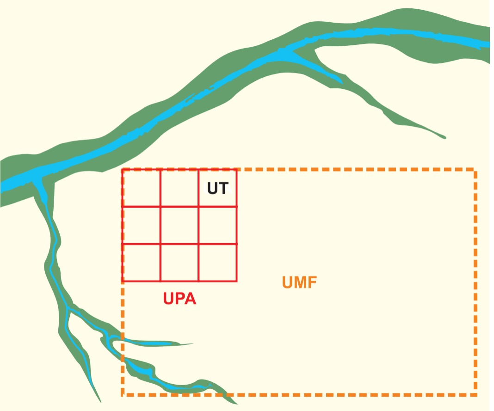
```

.center[.font80[**Fonte:** [Reis et al., 2013.](http://www.ift.org.br/publicacoes/producao-tecnica/manuais-e-cartilhas/)]]

---
name: aeef
## Área de Efetiva Exploração Florestal

.shadow1b[
.font80[
.center[
### [Instrução Normativa/SEMAS nº 05, de 10 de Setembro de 2015](https://www.semas.pa.gov.br/legislacao/files/pdf/184.pdf)
]

<br>

_.orange[**Área de Efetiva Exploração Florestal - AEE** (inciso I do Art. 2º)]: **área efetivamente explorada na .blue[Unidade de Trabalho - UT]**, computando-se as áreas com árvores sem porte comercial para exploração e excluindo-se:_

<br>

a) Áreas de preservação permanente;

b) Áreas inacessíveis;

c) Áreas de infraestrutura;

d) Áreas antropizadas (em regime ou não de pousio); e

e) Áreas indisponíveis legalmente.

]
]

---
name: aemf
## Área de Efetivo Manejo Florestal

.shadow1b[
.font80[
.center[
### [Instrução Normativa/SEMAS nº 05, de 10 de Setembro de 2015](https://www.semas.pa.gov.br/legislacao/files/pdf/184.pdf)
]

<br>

_.orange[**Área de Efetivo Manejo** (inciso II do Art. 2º)]: **área da .blue[Unidade de Manejo Florestal - UMF] com potencial presente ou futuro para exploração florestal**, excluídas:_

<br>

a) Áreas de preservação permanente;

b) Áreas inacessíveis;

c) Áreas de infraestrutura;

d) Áreas antropizadas (em regime ou não de pousio); e

e) Áreas indisponíveis legalmente.

]
]

---
name: autef
## Autorizações: AUTEX ou AUTEF

.shadow1b[
.font80[
.center[
### [Resolução nº 406, de 02 de fevereiro de 2009](http://conama.mma.gov.br/?option=com_sisconama&task=arquivo.download&id=578)
]

<br>

_.orange[**Autorização para Exploração - AUTEX** (inciso II do Art. 2º)]: documento expedido pelo órgão competente que autoriza o início da exploração da Unidade de Produção Anual-UPA e especifica o volume máximo por espécie permitido para exploração._
]
]

.shadow1b[
.font80[
.center[
### [Instrução Normativa/SEMAS nº 05, de 10 de Setembro de 2015](https://www.semas.pa.gov.br/legislacao/files/pdf/184.pdf)
]

<br>

_.orange[**Autorização para Exploração Florestal - AUTEF** (inciso VI do Art. 2º)]: documento expedido pela Secretaria de Estado de Meio Ambiente e Sustentabilidade do Pará - SEMAS/PA, que autoriza o início da exploração da Unidade de Produção Anual - UPA, do ano a que se refere, e especifica o volume máximo por espécie e volume total permitido para exploração, com a validade para uma safra._
]
]

---
name: autef
## Modelo de AUTEF (SEMAS/PA)

.pull-left-10[
```{r echo = FALSE, out.width='85%', fig.align='center', fig.cap='Página 1', dpi=600}
knitr::include_graphics("fig/class8/AUTEF/1.jpg")
```
]

.pull-right-10[
```{r echo = FALSE, out.width='55%', fig.align='center', fig.cap='Página 2', dpi=600}
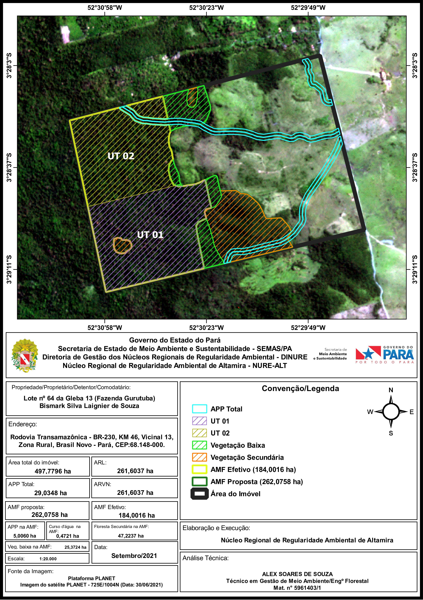
```
]

---

## Modelo de AUTEF (SEMAS/PA)

.pull-left-10[
```{r echo = FALSE, out.width='100%', fig.align='center', fig.cap='Página 3', dpi=600}
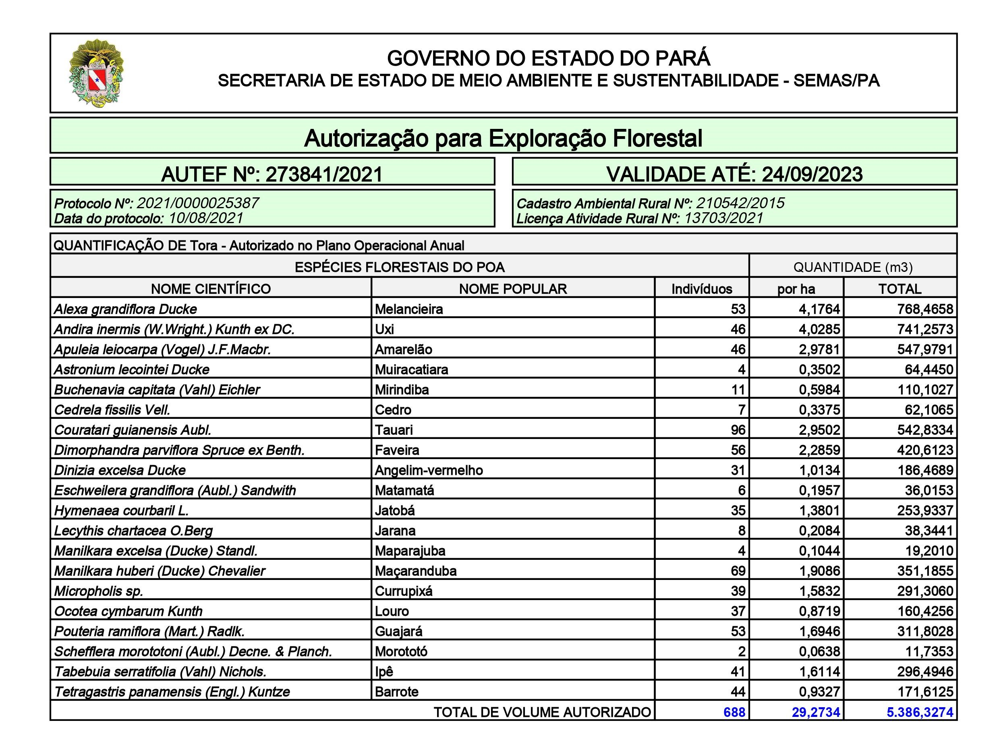
```
]

.pull-right-10[
```{r echo = FALSE, out.width='55%', fig.align='center', fig.cap='Página 4', dpi=600}
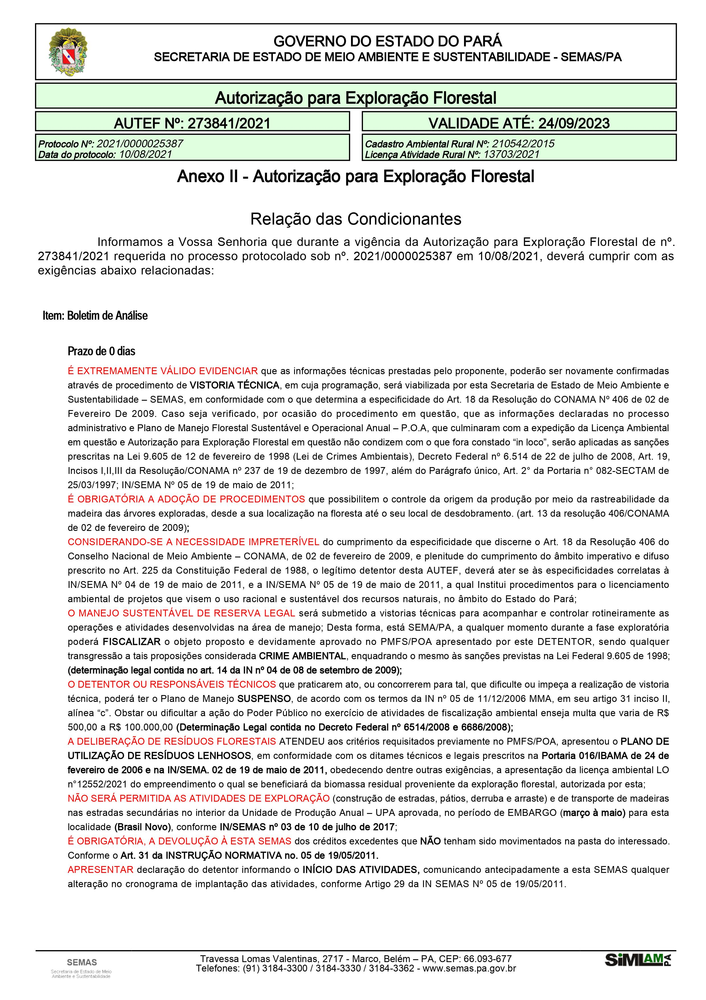
```
]

<!-- Slide XX -->
---
layout: false
name: if
class: inverse, middle, center
background-image: url(fig/class0/sec.png)
background-size: cover

.font150[**Censo Florestal (IF-100%): definições legais e etapas**]

---
layout: true
class: with-logo logo-ufpa
<div class="my-header"></div>
<div class="my-footer"><span>Prof. Dr. Deivison Venicio Souza (E-mail: deivisonvs@ufpa.br)&emsp;&emsp;&emsp;&emsp;&emsp; <div3>Inventário Florestal (FL03039 - EF)</div3>/ <div2>MFS de Florestas Nativas da Amazônia</div2> </div>

---
name: cc
## Ciclo de Corte

.shadow1b[
.font80[
.center[
### [Resolução nº 406, de 02 de fevereiro de 2009](http://conama.mma.gov.br/?option=com_sisconama&task=arquivo.download&id=578)
]

<br>

_.orange[**Ciclo de Corte** (inciso III do Art. 2º)]: **período de tempo**, em anos, **entre sucessivas colheitas** de produtos florestais madeireiros ou não-madeireiros numa mesma área._

- .blue[**Ideia**]: Período de tempo necessário para que a floresta se recupere da exploração florestal, e possa ser novamente explorada.
- .blue[**Quantos anos?**]: (denpende do método de extração de madeira!)

| **Arraste de Tora** |               **Ciclo de corte**               |
|:-------------------:|:----------------------------------------------:|
|    Com maquinário   | **_Mínimo_**: 25 anos<br>**_Máximo_**: 35 anos |
|    Sem maquinário   |              **_Mínimo_**: 10 anos             |

]
]

---

## Ciclo de Corte

.pull-left-3[
```{r echo = FALSE, out.width='55%', fig.align='center', fig.cap='', dpi=600}
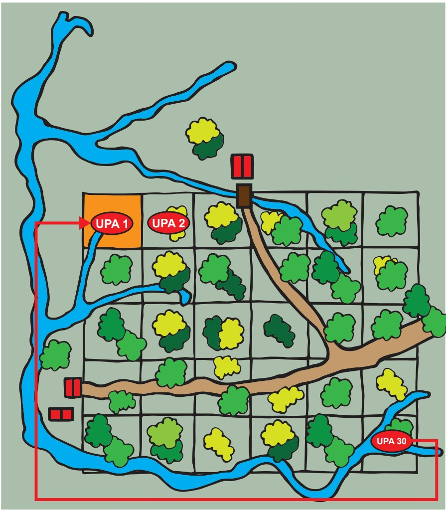
```
.center[.font80[**Fonte:** [Reis et al., 2013.](http://www.ift.org.br/publicacoes/producao-tecnica/manuais-e-cartilhas/)]]

]

.pull-right-3[

- .font80[**Exemplo**: Uma UMF de 30.000ha, poderia ser dividida em 30 UPAS (1.000ha) e adotar um ciclo de corte de 30 anos (Intensidade de corte de ≅ 25 m³/ha). Cada UPA podería ser subdividida em 10 UTs de 100ha.]
]

---
name: ic
## Intensidade de Corte

.shadow1b[
.font80[
.center[
### [Resolução nº 406, de 02 de fevereiro de 2009](http://conama.mma.gov.br/?option=com_sisconama&task=arquivo.download&id=578)
]

<br>

_.orange[**Intensidade de Corte** (inciso VI do Art. 2º)]: volume comercial das árvores derrubadas para aproveitamento, estimado por meio de equações volumétricas previstas no PMFS e com base nos dados do IF-100%, expresso em metros cúbicos por unidade de área (m³/ha) de efetiva exploração florestal, calculada para cada Unidade de Trabalho (UT)._

<br>

_.orange[**Intensidades Máximas de Corte** (inciso IV do Art. 4º)]: _

.blue[Qual máximo de metros cúbicos (de madeira) posso explorar por hectare?]

<br>

| **Arraste de Tora** |   **Intensidade Máxima <br> de corte**  |   **Ciclo de corte inicial**|
|:-------------------:|:---------------------------------------:|:---------------------------:|
|    Com maquinário   |           30 m³/ha                      |               35 anos       |
|    Sem maquinário   |           10 m³/ha                      |               10 anos       |

]
]

---
name: rel
## Relação entre EPA, CC e IC

.shadow1b[
.font80[
.center[
### [Resolução nº 406, de 02 de fevereiro de 2009](http://conama.mma.gov.br/?option=com_sisconama&task=arquivo.download&id=578)
]

<br>

_.orange[**Estimativa da Produtividade Anual - EPA** (inciso I do Art. 4º)]: a EPA da floresta manejada para o grupo de espécies comerciais, quando não houver estudos para a área, será de .blue[**0,86 m³/ha/ano**] para PMFS com uso de máquinas para arraste de toras._

- Em PMFS com arraste mecanizado, em geral, usa-se a EPA (.blue[**0,86 m³/ha/ano**]) para definir o Ciclo de Corte (CC) adequado em função da Intensidade de Corte (IC), ou vice-versa. Por exemplo:

**a) Qual ciclo de corte para um PMFS que prevê uma intensidade de exploração de 30 m³/ha?**

**b) Qual intensidade de exploração máxima para um PMFS que prevê um ciclo de corte de 30 anos?**

]
]


.pull-left-4[
**Questão a**
$$
\small
\begin{align*}
    \left.\begin{aligned}
    0,86~m³/ha & \longleftrightarrow 1~ano \\
    30~m³/ha & \longleftrightarrow X~anos
    \end{aligned}\right\}   X = 34,88~anos ∼ \color{blue}{35~anos}
\end{align*}
$$
]

--

.pull-right-4[
**Questão b**
$$
\small
\begin{align*}
    \left.\begin{aligned}
    0,86~m³/ha & \longleftrightarrow 1~ano \\
    X~m³/ha & \longleftrightarrow 30~anos
    \end{aligned}\right\}   X = 25,8~m³/ha ∼ \color{blue}{25~m³/ha}
\end{align*}
$$
]


---
name: dmc
## Diâmetro Mínimo de Corte - DMC

.shadow1b[
.font80[
.center[
### [Resolução nº 406, de 02 de fevereiro de 2009](http://conama.mma.gov.br/?option=com_sisconama&task=arquivo.download&id=578)
]

<br>

_.orange[**Diâmetro Mínimo de Corte** (inciso V do Art. 2º)]: diâmetro mínimo de uma árvore a partir do qual é **permitido seu corte** em um PMFS._


- **Árvores de qual tamanho podem derrubadas (exploradas)?**

_.orange[**Art. 6º**]: Fica estabelecido o .blue[**DMC de 50 cm**] para todas as espécies, para as quais ainda não se estabeleceu o DMC específico._

<br>

.center[`r anicon::faa("exclamation-triangle", colour="red")` .blue[**Apenas árvores com diâmetro a 1,30 m do solo (d) ≥ 50 cm podem ser destinadas para corte!**]]

]
]

---
name: dmaxc
## Diâmetro Máximo de Corte - DMaxC


---

## Censo Florestal (IF-100%): Quais etapas/variáveis?

```{r echo = FALSE, out.width='45%', fig.align='center', fig.cap='', dpi=600}
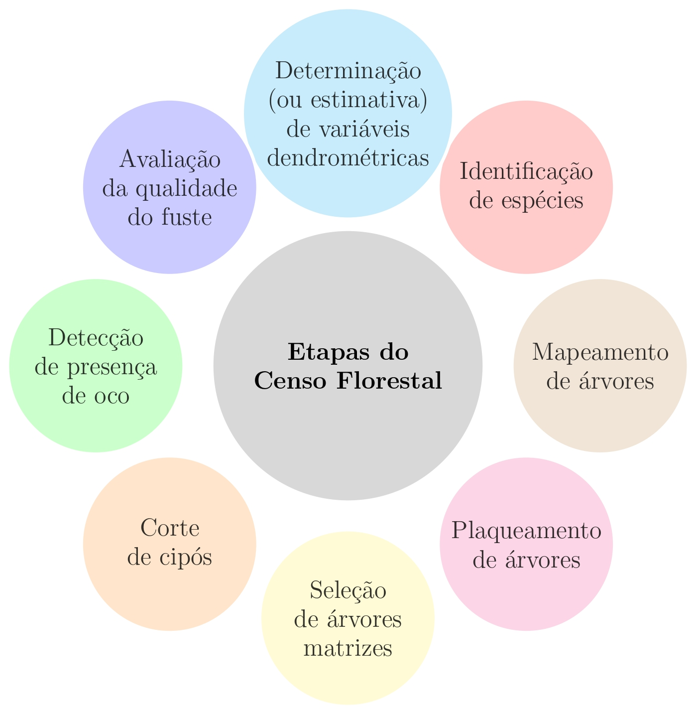
```


<!-- Slide XX -->
---
layout: false
name: if
class: inverse, middle, center
background-image: url(fig/class0/sec.png)
background-size: cover

.font150[**Outras Definições**]

---
layout: true
class: with-logo logo-ufpa
<div class="my-header"></div>
<div class="my-footer"><span>Prof. Dr. Deivison Venicio Souza (E-mail: deivisonvs@ufpa.br)&emsp;&emsp;&emsp;&emsp;&emsp; <div3>Inventário Florestal (FL03039 - EF)</div3>/ <div2>MFS de Florestas Nativas da Amazônia</div2> </div>

---
name: cfma
## Constituição Federal e Meio Ambiente

.shadow1b[
.font80[
.center[
### [Constituição da República Federativa do Brasil de 1988](http://www.planalto.gov.br/ccivil_03/Constituicao/Constituicao.htm)
]
<br>

**Constituição Federal e Meio Ambiente** (.orange[Art. 225º do Capítulo VI - Do Meio Ambiente]):
<br><br>

_.orange[**Art. 225**]. **Todos têm direito ao meio ambiente ecologicamente equilibrado**, bem de uso comum do povo e essencial à sadia qualidade de vida, impondo-se ao Poder Público e à coletividade o dever de **defendê-lo e preservá- lo para as presentes e futuras gerações**._

- § 1º Para assegurar a efetividade desse direito, incumbe ao Poder Público:

VII – proteger a fauna e a flora, vedadas, na forma da lei, as práticas que coloquem em risco sua função ecológica, provoquem a extinção de espécies ou submetam os animais a crueldade.

]
]

.pull-right-3[
.pull-down[
`r anicon::faa("seedling", size = 3, speed = "slow", animate = 'vertical', color = "green")`
`r anicon::faa("leaf", size = 3, speed = "slow", animate = 'vertical', color = "green")`

]
]

---
name: arl
## Área de Reserva Legal - ARL

.shadow1b[
.font80[
.center[
### [Lei nº 12.651, de 25 de maio de 2012 - Novo Código Florestal](https://www.planalto.gov.br/ccivil_03/_ato2011-2014/2012/lei/l12651.htm)
]

<br>

_.orange[**Reserva Legal** (inciso III do Art. 3º)]: **área** localizada no interior de uma **propriedade ou posse rural**, delimitada nos termos do .orange[art. 12], com a função de:_


a) Assegurar o uso econômico de modo sustentável dos recursos naturais do imóvel rural;

b) Auxiliar a conservação e a reabilitação dos processos ecológicos; 

c) Promover a conservação da biodiversidade; e

d) Servir de abrigo e a proteção de fauna silvestre e da flora nativa.

]
]

.pull-right-3[
.pull-down[
`r anicon::faa("seedling", size = 3, speed = "slow", animate = 'vertical', color = "green")`
`r anicon::faa("leaf", size = 3, speed = "slow", animate = 'vertical', color = "green")`

]
]

---

## Área de Reserva Legal - ARL

.shadow1b[
.font80[
.center[
### [Lei nº 12.651, de 25 de maio de 2012 - Novo Código Florestal](https://www.planalto.gov.br/ccivil_03/_ato2011-2014/2012/lei/l12651.htm)
]

<br>

_.orange[**Art. 12**]: Todo **imóvel rural deve manter área com cobertura de vegetação nativa**, **a título de Reserva Legal**, sem prejuízo da aplicação das normas sobre as Áreas de Preservação Permanente, observados os seguintes **percentuais mínimos em relação à área do imóvel**._

<br>

I - localizado na **Amazônia Legal**:

.red[a) 80% (oitenta por cento), no imóvel situado em área de florestas.]

b) 35% (trinta e cinco por cento), no imóvel situado em área de cerrado.

c) 20% (vinte por cento), no imóvel situado em área de campos gerais.

]
]

.pull-right-3[
.pull-down[
`r anicon::faa("seedling", size = 3, speed = "slow", animate = 'vertical', color = "green")`
`r anicon::faa("leaf", size = 3, speed = "slow", animate = 'vertical', color = "green")`

]
]

---

## Área de Reserva Legal - ARL

<br>

```{r echo = FALSE, out.width='35%', fig.align='center', fig.cap='', dpi=600}
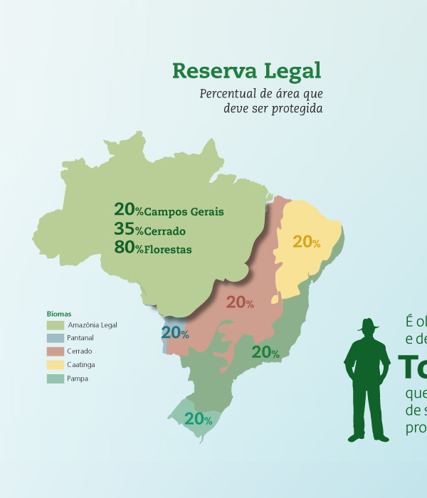
```

.center[.font50[**Fonte:** [https://www.behance.net](https://www.behance.net/gallery/13486573/Fazenda-Brasil-infografia-sobre-o-codigo-florestal)]]

---
name: al
## Amazônia Legal

```{r echo = FALSE, out.width='66%', fig.align='center', fig.cap='', dpi=600}
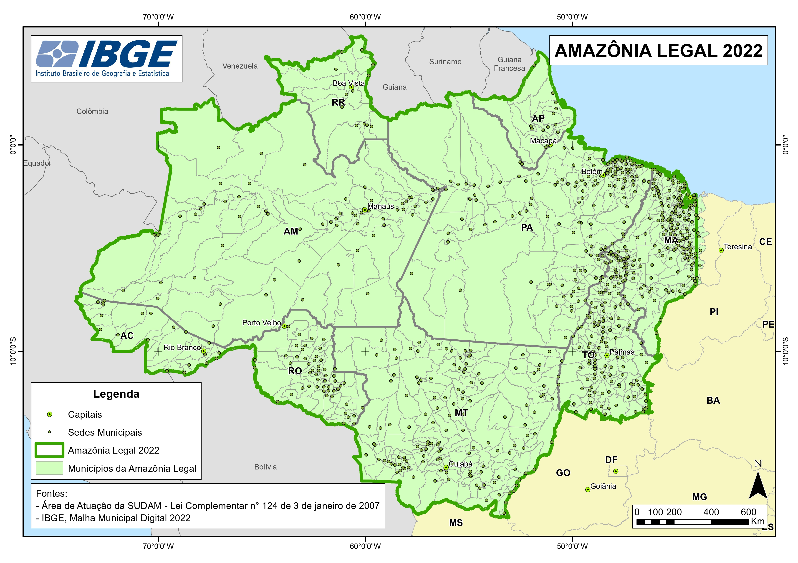
```
.center[.font40[**Fonte**: [IBGE](https://www.ibge.gov.br/geociencias/cartas-e-mapas/mapas-regionais/15819-amazonia-legal.html)]]

---

## Área de Reserva Legal - ARL

<br>

**É permitida a exploração econômica direta da RL?**

**Resposta**: .green[**Sim, sob regime de manejo sustentável.**] `r anicon::faa("thumbs-up", colour="green", animate = "vertical")` 

-------------------------------------------------------------------------

.shadow1b[
.font80[
.center[
### [Lei nº 12.651, de 25 de maio de 2012 - Novo Código Florestal](https://www.planalto.gov.br/ccivil_03/_ato2011-2014/2012/lei/l12651.htm)
]

- O Novo código florestal admite o manejo sustentável da vegetação da RL:

**Seção II - Do Regime de Proteção da Reserva Legal**

_.orange[**§ 1º do Art. 17**]: **Admite-se a exploração econômica da Reserva Legal** mediante **manejo sustentável**, previamente aprovado pelo órgão competente do Sisnama, de acordo com as modalidades previstas no art. 20._

_.orange[**Art. 20**]: No manejo sustentável da vegetação florestal da Reserva Legal, serão adotadas práticas de exploração seletiva nas modalidades de **manejo sustentável sem propósito comercial** para consumo na propriedade e **manejo sustentável para exploração florestal com propósito comercial**._

]
]

---

## Área de Reserva Legal - ARL

<br>

**É permitida a exploração econômica direta da RL?**

**Resposta**: .green[**Sim, sob regime de manejo sustentável.**] `r anicon::faa("thumbs-up", colour="green", animate = "vertical")` 

-------------------------------------------------------------------------

.shadow1b[
.font80[
.center[
### [Lei nº 12.651, de 25 de maio de 2012 - Novo Código Florestal](https://www.planalto.gov.br/ccivil_03/_ato2011-2014/2012/lei/l12651.htm)
]

- O Novo código florestal admite o manejo sustentável da vegetação da RL:

**Seção II - Do Regime de Proteção da Reserva Legal**

_.orange[**Art. 21**]: É livre a coleta de **produtos florestais não madeireiros**, tais como frutos, cipós, folhas e sementes, devendo-se observar:_

I - os períodos de coleta e volumes fixados em regulamentos específicos, quando houver;

II - a época de maturação dos frutos e sementes; e

III - técnicas que não coloquem em risco a sobrevivência de indivíduos e da espécie coletada no caso de coleta de flores, folhas, cascas, óleos, resinas, cipós, bulbos, bambus e raízes.

]
]

---

## Área de Reserva Legal - ARL

<br>

**É permitida a exploração econômica direta da RL?**

**Resposta**: .green[**Sim, sob regime de manejo sustentável.**] `r anicon::faa("thumbs-up", colour="green", animate = "vertical")` 

-------------------------------------------------------------------------

.shadow1b[
.font80[
.center[
### [Lei nº 12.651, de 25 de maio de 2012 - Novo Código Florestal](https://www.planalto.gov.br/ccivil_03/_ato2011-2014/2012/lei/l12651.htm)
]

- O Novo código florestal admite o manejo sustentável da vegetação da RL:

**Seção II - Do Regime de Proteção da Reserva Legal**

_.orange[**Art. 22**]: O **manejo florestal sustentável da vegetação da Reserva Legal com propósito comercial depende de autorização do órgão competente** e deverá atender as seguintes diretrizes e orientações:_

I - não descaracterizar a cobertura vegetal e não prejudicar a conservação da vegetação nativa da área;

II - assegurar a manutenção da diversidade das espécies; e

III - conduzir o manejo de espécies exóticas com a adoção de medidas que favoreçam a regeneração de espécies nativas.

]
]

---
name: app
## Área de Preservação Permanente - APP

.shadow1b[
.font80[
.center[
### [Lei nº 12.651, de 25 de maio de 2012 - Novo Código Florestal](https://www.planalto.gov.br/ccivil_03/_ato2011-2014/2012/lei/l12651.htm)
]

<br>

_.orange[**Área de Preservação Permanente** (inciso II do Art. 3º)]: **área protegida**, **coberta ou não por vegetação nativa**, com a **função ambiental de preservar**:_

a) Os recursos hídricos;

b) A paisagem;

c) A estabilidade geológica;

d) A biodiversidade; 

e) Facilitar o fluxo gênico de fauna e flora;

f) Proteger o solo; e 

g) Assegurar o bem-estar das populações humanas.


<br>

`r anicon::faa("exclamation-triangle", colour="red")` **Área Protegida! Não é permitida a exploração econômica direta!**

`r anicon::faa("exclamation-triangle", colour="red")` **No MFS para fins madeireiros não pode explorar árvores em APP!**
]
]

---

## Área de Preservação Permanente - APP

.shadow1b[
.font70[
.center[
### [Lei nº 12.651, de 25 de maio de 2012 - Novo Código Florestal](https://www.planalto.gov.br/ccivil_03/_ato2011-2014/2012/lei/l12651.htm)
]

<br>

**Seção I - Da Delimitação das Áreas de Preservação Permanente**

_.orange[**Art. 4**]: Considera-se Área de Preservação Permanente, em zonas rurais ou urbanas:_

----------------------------------------------------------------------
_.blue[**I**] - **as faixas marginais de qualquer curso d’água natural perene e intermitente**, excluídos os efêmeros, desde a borda da calha do leito regular, em largura mínima de:_

a) 30 (trinta) metros, para os cursos d’água de menos de 10 (dez) metros de largura;

b) 50 (cinquenta) metros, para os cursos d’água que tenham de 10 (dez) a 50 (cinquenta) metros de largura;

c) 100 (cem) metros, para os cursos d’água que tenham de 50 (cinquenta) a 200 (duzentos) metros de largura;

d) 200 (duzentos) metros, para os cursos d’água que tenham de 200 (duzentos) a 600 (seiscentos) metros de largura; e

e) 500 (quinhentos) metros, para os cursos d’água que tenham largura superior a 600 (seiscentos) metros.

----------------------------------------------------------------------
_.blue[**II**] - as **áreas no entorno dos lagos e lagoas naturais**, em faixa com largura mínima de:_

a) 100 (cem) metros, em zonas rurais, exceto para o corpo d’água com até 20 (vinte) hectares de superfície, cuja faixa marginal será de 50 (cinquenta) metros; e

b) 30 (trinta) metros, em zonas urbanas.

]
]

---

## Área de Preservação Permanente - APP
<br>

```{r echo = FALSE, out.width='60%', fig.align='center', fig.cap='', dpi=600}
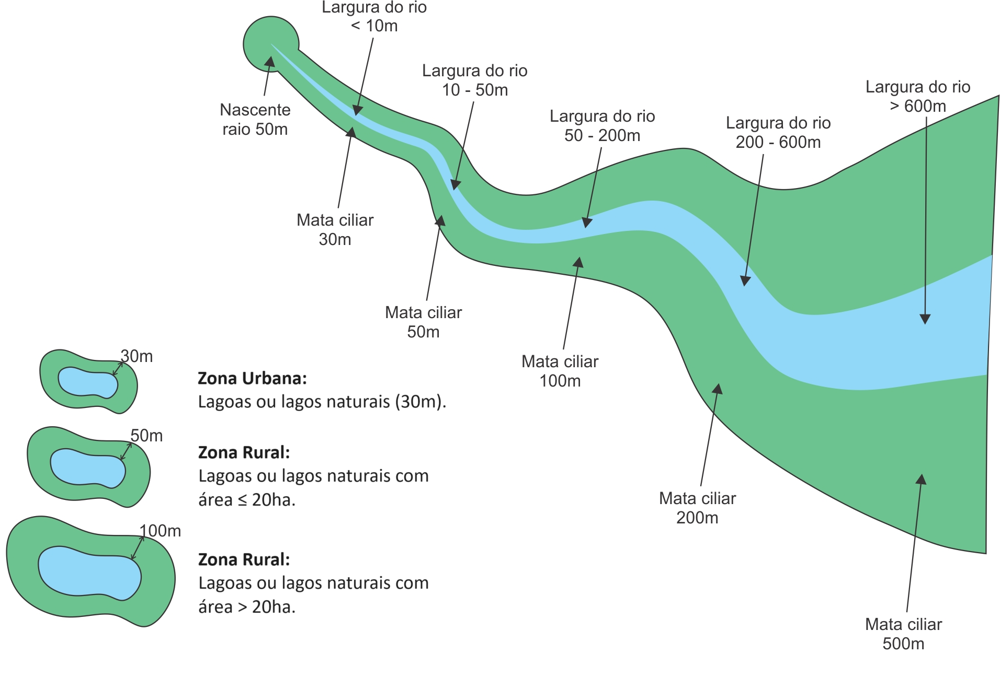
```

.center[.font50[**Fonte:** Adaptado de [https://www.inteliagro.com.br/](https://www.inteliagro.com.br/quanto-deve-medir-uma-app-area-de-preservacao-permanente-de-um-rio/)]]

---

## Área de Preservação Permanente - APP
<br>
.center[.font80[**Fonte:** [Climate Policy Initiative](https://www.climatepolicyinitiative.org/pt-br/publication/monitor-da-implementacao-do-codigo-florestal/)]]

```{r echo = FALSE, out.width='60%', fig.align='center', fig.cap='Exemplos de APPs', dpi=600}
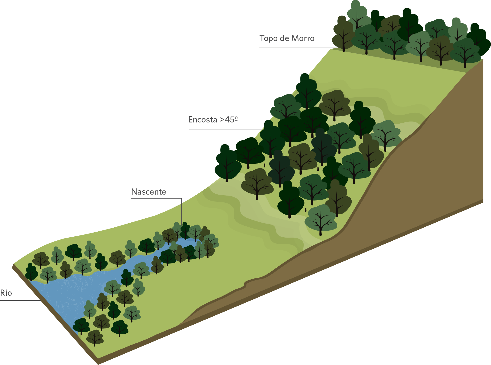
```

---
name: auas
## Área de Uso Alternativo do Solo - AUAS

.shadow1b[
.font80[
.center[
### [Lei nº 12.651, de 25 de maio de 2012 - Novo Código Florestal](https://www.planalto.gov.br/ccivil_03/_ato2011-2014/2012/lei/l12651.htm)
]

<br>

_.orange[**Uso Alternativo do Solo** (inciso VI do Art. 3º)]: **substituição de vegetação nativa e formações sucessoras por outras coberturas do solo**, como atividades agropecuárias, industriais, de geração e transmissão de energia, de mineração e de transporte, assentamentos urbanos ou outras formas de ocupação humana._
]
]

---
layout: false
name: if
class: inverse, middle, center
background-image: url(fig/class0/sec.png)
background-size: cover

.font150[**Manejo Florestal Sustentável de Florestas Nativas <br> (Etapas do MFS para fins Madeireiros)**]

---
layout: true
class: with-logo logo-ufpa
<div class="my-header"></div>
<div class="my-footer"><span>Prof. Dr. Deivison Venicio Souza (E-mail: deivisonvs@ufpa.br)&emsp;&emsp;&emsp;&emsp;&emsp; <div3>Inventário Florestal (FL03039 - EF)</div3>/ <div2>Etapas do MFS de Florestas Nativas da Amazônia</div2> </div>

---
name: emfs
## Manejo Florestal Sustentável Para Fins Madeireiros

.shadow1b[
### Etapas do MFS em Florestas Naturais (Balieiro et al., 2010)
<br>

```{r echo = FALSE, out.width='40%', fig.align='center', fig.cap='Etapas do MFS para fins madeireiros', dpi=600}

```

]

---

## Manejo Florestal Sustentável Para Fins Madeireiros

.shadow1b[
### Etapas do MFS em Florestas Naturais (Balieiro et al., 2010)
<br>

As principais etapas do MFS para fins madeireiros são:
<br>

- **1ª Etapa - Macroplanejamento**
- **2ª Etapa - Microplanejamento (.blue[incluindo o IF-100%])**
- **3ª Etapa - Atividades Exploratórias**
- **4ª Etapa - Atividades Pós-Exploratórias**

]

---

## Manejo Florestal Sustentável Para Fins Madeireiros

.shadow1b[
### 1ª Etapa - Macroplanejamento (Balieiro et al., 2010)
.font80[
<br>

Etapa fundamental para a elaboração e a execução do Plano de Manejo Florestal Sustentável (PMFS):

- O MFS é viável economicamente?
- Subsidios para as demais atividades do MFS.

<br>

**1 - Identificação e seleção das áreas com potencial ao MFS madeireiro**

- Na Unidade de Manejo Florestal (UMF) existem .blue[Áreas de Preservação Permanente (APPs)]?
- Na UMF deve constar a .blue[Área de Reserva Absoluta] (≥ 5% do total da área concedida)? (**Proibida exploração econômica!**)
- Na UMF já existem .blue[Áreas abertas] (com construções ou sem vegetação)?

]
]

---

## Manejo Florestal Sustentável Para Fins Madeireiros

.shadow1b[
### 1ª Etapa - Macroplanejamento (Balieiro et al., 2010)
<br>
.font90[
**1 - Identificação e seleção das áreas com potencial ao MFS**

]
]

---

layout: false
name: if
class: inverse, middle, center
background-image: url(fig/class0/sec.png)
background-size: cover

.font150[**Manejo Florestal Sustentável de Florestas Nativas <br> (Censo Florestal ou Inventário Florestal 100%)**]

---
layout: true
class: with-logo logo-ufpa
<div class="my-header"></div>
<div class="my-footer"><span>Prof. Dr. Deivison Venicio Souza (E-mail: deivisonvs@ufpa.br)&emsp;&emsp;&emsp;&emsp;&emsp; <div3>Inventário Florestal (FL03039 - EF)</div3>/ <div2>Aspectos Técnicos do Censo Florestal</div2> </div>

---

## Censo Florestal (IF-100%)

.shadow1b[
### Definição
<br>
.font90[
É uma .blue[atividade pré-exploratória] que consite na coleta de .blue[características quantitativas e qualitativas de todas as árvores] de valor comercial (e potencial) existentes em uma área destinada ao manejo florestal.
]
]

.pull-right-3[
.pull-down[
`r anicon::faa("seedling", size = 3, speed = "slow", animate = 'vertical', color = "green")`
`r anicon::faa("leaf", size = 3, speed = "slow", animate = 'vertical', color = "green")`

]
]

---
name: etapas
## Etapas Precedentes ao Censo Florestal (IF-100%)

.shadow1b[
### Antes do IF-100% deve-se:
<br>
.font80[
👉 **1 - Elaborar o mapa de localização (UPA e UTs).**
- .blue[**Objetivo**]: Auxiliar em campo na delimitação da UT (Azimute da linha base da UT).

<br>

👉 **2 - Delimitar (em campo) as Unidades de Trabalho - UT.**
- .blue[**Objetivo**]: Definir os limites físicos da UT.
- .blue[**Tamanho**]: É comum (.red[Não é uma regra!]) a delimitação de UTs com área de 100ha (1000m x 1000m). (Vai depender do tamanho da área!)
- .blue[**Recomendação**]: Sempre que possível, delimitar UTs com limites regulares (retangulares ou quadradas).
]
]

---
name: estr
## Unidade de Trabalho: Estrutura

.pull-left-2[
```{r echo = FALSE, out.width='100%', fig.align='center', fig.cap='', dpi=600}
knitr::include_graphics("fig/class8/UT.jpeg")
```
.center[.font80[**Fonte:** [Reis et al., 2013.](http://www.ift.org.br/publicacoes/producao-tecnica/manuais-e-cartilhas/)]]

]

.pull-right-1[
<br>
.center[**Recomendações** (Reis et al., 2013)]
.font80[
- **Linha Base**: Sempre que possível, no .blue[sentido norte-sul].
- **Trilhas de orientação**: Sempre que possível, no .blue[sentido leste-oeste].
- **Distancia entre trilhas**: As trilhas de orientação são abertas a cada 50m, e perpendicular à linha base.

<br>

**Por que priorizar esses sentidos?**

- Facilita a construção de estradas secundárias no sentido leste-oeste (melhor ventilação, exposição ao sol e manutenção).
]
]

---

## Unidade de Trabalho: Estrutura

.shadow1b[
### Fatores que afetam a posição e forma das UTs (Reis et al., 2013)
<br>
.font80[
👉 **1 - Condições do terreno**:
- Presença de grotas (baixadas), igarapés, morros.

👉 **2 - Estradas pré-existentes (e futuras)**:
- Posicionar as UTs de modo a facilitar o acesso por estradas pré-existentes (ou futuras). 

👉 **3 - Escoamento da produção fluvial?**:
- Posicionar as UTs de modo a facilitar o escoamento por rio.
]
]

---
name: mat
## Unidade de Trabalho: Equipe, materiais e equipamentos

.shadow1b[
### Equipe, materiais e equipamentos (Reis et al., 2013)
<br>
.font80[
👉 **1 - Equipe**: 4 pessoas (1 coordenador e 3 trabalhadores)
- **Coordenador**: Usar a bússola e definir os ângulos de orientação.
- **Trabalhadores**: Abrir as trilhas com facão, cortar e colocar piquetes (com indicação da distância) e medir distâncias entre piquetes.

<br>

👉 **2 - Materiais e Equipamentos**:
- **Material**: facão, lápis estaca azul, papel milimetrado, prancheta e lápis.
- **Equipamento**: bússola, trena/cabo de agrimensor (30/50 metros), cantil, kit de primeiros socorros. 
- **EPIs**: capacete, calças e camisas de mangas compridas, bota de bico de aço, perneira e colete de identificação.
]
]

---
name: delim
## Unidade de Trabalho: Delimitação

.shadow1b[
### Delimitação da UT: 3 abordagens (Reis et al., 2013)
]

.pull-left-2[
```{r echo = FALSE, out.width='70%', fig.align='center', fig.cap='', dpi=600}
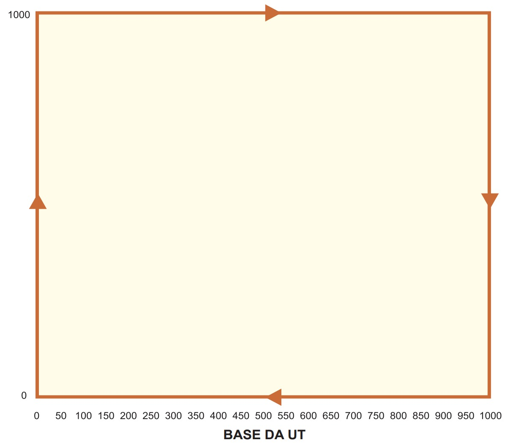
```
.center[.font80[**Fonte:** [Reis et al., 2013.](http://www.ift.org.br/publicacoes/producao-tecnica/manuais-e-cartilhas/)]]

]

.pull-right-1[
<br>
.center[**Abordagem 1** (Reis et al., 2013)]
.font80[

- **Esquadrejamento da UT**: A ideia é fechar o quadrado (esquadrejamento) da UT. Na sequência, abre-se as trilhas de orientação internas.
]
]

---

## Unidade de Trabalho: Delimitação

.shadow1b[
### Delimitação da UT: 3 abordagens (Reis et al., 2013)
]

.pull-left-2[
```{r echo = FALSE, out.width='70%', fig.align='center', fig.cap='', dpi=600}
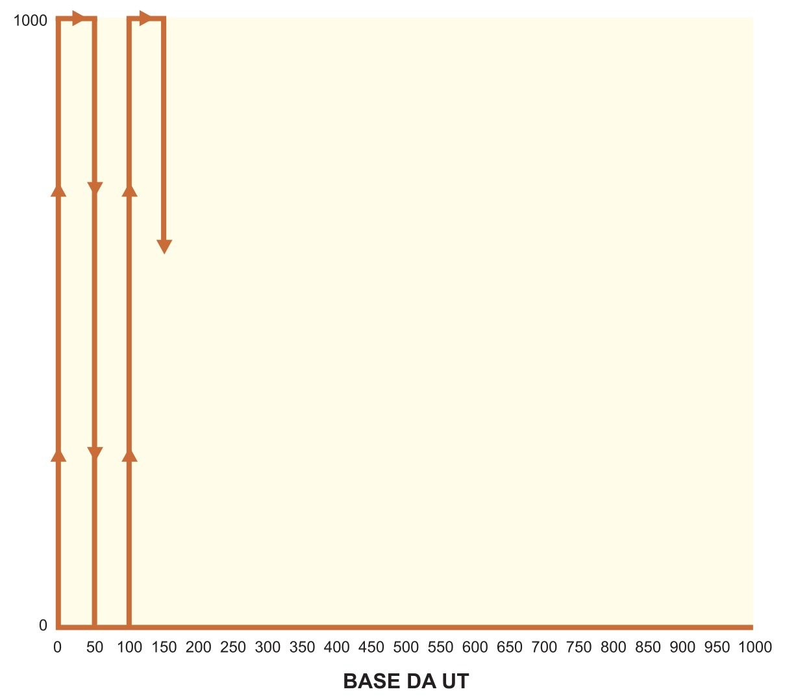
```
.center[.font80[**Fonte:** [Reis et al., 2013.](http://www.ift.org.br/publicacoes/producao-tecnica/manuais-e-cartilhas/)]]

]

.pull-right-1[
<br>
.center[**Abordagem 2** (Reis et al., 2013)]
.font80[

- **Abrir dois lados (ângulo de 90º)**: A ideia é abrir dois lados (a linha base e uma trilha de orientação), formando um ângulo de 90º. Na sequência, prosseguir a abertura das trilhas internas (zigue-zague), e ao mesmo tempo fechando os lados da UT.
]
]

---

## Unidade de Trabalho: Delimitação

.shadow1b[
### Delimitação da UT: 3 abordagens (Reis et al., 2013)
]

.pull-left-2[
```{r echo = FALSE, out.width='70%', fig.align='center', fig.cap='', dpi=600}
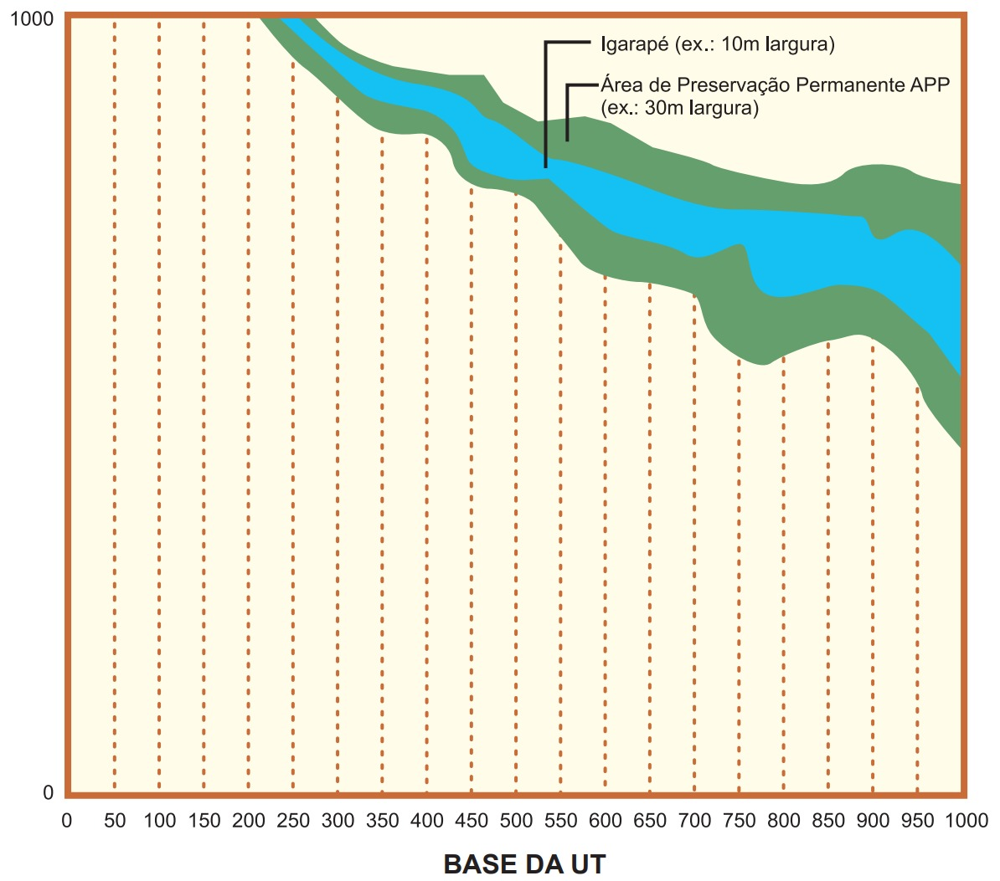
```
.center[.font80[**Fonte:** [Reis et al., 2013.](http://www.ift.org.br/publicacoes/producao-tecnica/manuais-e-cartilhas/)]]

]

.pull-right-1[
<br>
.center[**Abordagem 3** (Reis et al., 2013)]
.font80[

- **UTs irregulares**:

**Problema**: Não é possível (ou muito difícil) esquadrejar todo o perímetro da UT. Portanto, a UT não terá uma forma regular (quadradas ou retangulares).

**Ideia**: Caminhar até o início da área que não poderá ser manejada (encostas de morros, APPs). Esse ponto será limite final da trilha de orientação.
]
]

---

## Unidade de Trabalho: Delimitação

.shadow1b[
### Delimitação da UT: Passo a Passo (Reis et al., 2013)
]

.pull-left-4[
```{r echo = FALSE, out.width='70%', fig.align='center', fig.cap='', dpi=600}
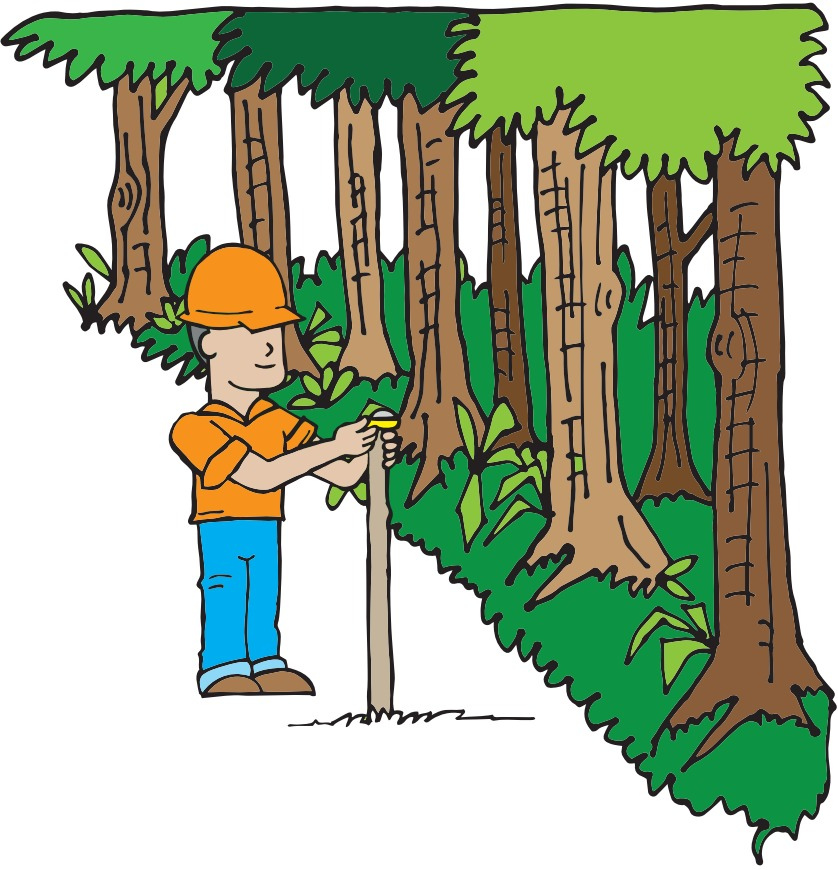
```
.center[.font80[**Fonte:** [Reis et al., 2013.](http://www.ift.org.br/publicacoes/producao-tecnica/manuais-e-cartilhas/)]]

]

.pull-right-4[
<br>
.center[**Passo 1** (Reis et al., 2013)]
.font80[
- Deslocar-se até o marco zero da UT (ponto inicial);
- Retirar um piquete e fixar no marco inicial; e
- Apoiar a bússula no piquete e procurar o azimute definido no macroplanejamento.

<br>

**Obs.:** azimute indica a direção de abertura da linha base.
]
]

---

## Unidade de Trabalho: Delimitação

.shadow1b[
### Delimitação da UT: Passo a Passo (Reis et al., 2013)
]

.pull-left-4[
```{r echo = FALSE, out.width='70%', fig.align='center', fig.cap='', dpi=600}
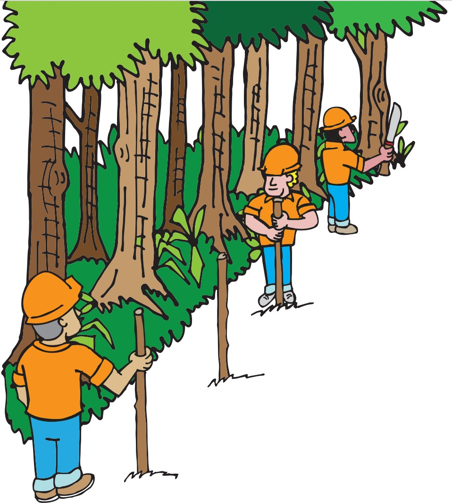
```
.center[.font80[**Fonte:** [Reis et al., 2013.](http://www.ift.org.br/publicacoes/producao-tecnica/manuais-e-cartilhas/)]]

]

.pull-right-4[
<br>
.center[**Passo 2** (Reis et al., 2013)]
.font80[
- **Início do balizamento**: Iniciar o balizamento para abertura da linha base. 

]
]

---

## Unidade de Trabalho: Delimitação

.shadow1b[
### Delimitação da UT:
- .blue[**Procedimento**]:

1)  Abertura da linha base;


**3 - Abertura das trilhas de orientação.**

- .blue[**Objetivo**]: Linha 
- .blue[**Objetivo**]: Divisão interna da UT.
- .blue[**Disposição**]: Trilhas ou picadas perpendiculares à linha  base (formando faixas).

**Importante**: As faixas formadas auxiliarão na execução do IF-100% e outras atividades do MFS.
]

---

## Etapas do Censo Florestal (IF-100%)

.shadow1b[
### Identificação de espécies
<br>


]


---
layout: false
name: if
class: inverse, middle, center
background-image: url(fig/class0/sec.png)
background-size: cover

.font150[**Manejo Florestal Sustentável de Florestas Nativas <br> (Análise Técnica do Censo Florestal)**]

---
layout: true
class: with-logo logo-ufpa
<div class="my-header"></div>
<div class="my-footer"><span>Prof. Dr. Deivison Venicio Souza (E-mail: deivisonvs@ufpa.br)&emsp;&emsp;&emsp;&emsp;&emsp; <div3>Inventário Florestal (FL03039 - EF)</div3>/ <div2>Análise Técnica do Censo Florestal</div2> </div>

---

## 📖 Referências

<br>
Balieiro, M. R.; Espada, A. L. V.; Nogueira, O; Palmieri, R.; Lentini, M. **As Concessões de Florestas Públicas na Amazônia Brasileira: Um manual para pequenos e médios produtores florestais.** 2ª edição, Piracicaba: Imaflora, SP. Belém: IFT, PA, 2010. 204p.
<br><br>
Pinheiro, C. S.; Costa, P. F.; Galdino, M.; Pires, I. P. Encarte Técnico. **Planejamento e Construção da Delimitação em Áreas Florestais**. Instituto Floresta Tropical - IFT. Belém-PA, 2020.
<br><br>
Reis, S. L.; Couto, C. S.; Pinheiro, C. S.; Espada, A. L. V.; Lima, J. A.; Lentini, M. W. **Técnicas Pré-Exploratórias para o Planejamento da Exploração de Impacto Reduzido no Manejo Florestal Comunitário e Familiar**. Belém: IFT, 2013.
<br><br>
Sanquetta, C. R.; Corte, A. P. D.; Rodrigues, A. L.; Watzlawick, L. F. **Inventários Florestais: Planejamento e Execução.** 4ª edição - Revista e Ampliada. Curitiba. 2023. 406p.

---

layout: false
name: etim
class: inverse, middle, center
background-image: url(fig/class0/sec.png)
background-size: cover

## .font200[Obrigado!]

```{r, echo=FALSE, out.width='20%', fig.align='center', fig.cap='', dpi=600}
knitr::include_graphics('fig/slide-title/LMFTCA.png')
```

👨🏻‍👩🏻‍👦🏻‍👦🏻 [@lmftca_ufpa](https://www.instagram.com/lmftca_ufpa/)

🌎 [https://www.lmftca.com.br/](https://www.lmftca.com.br/)
