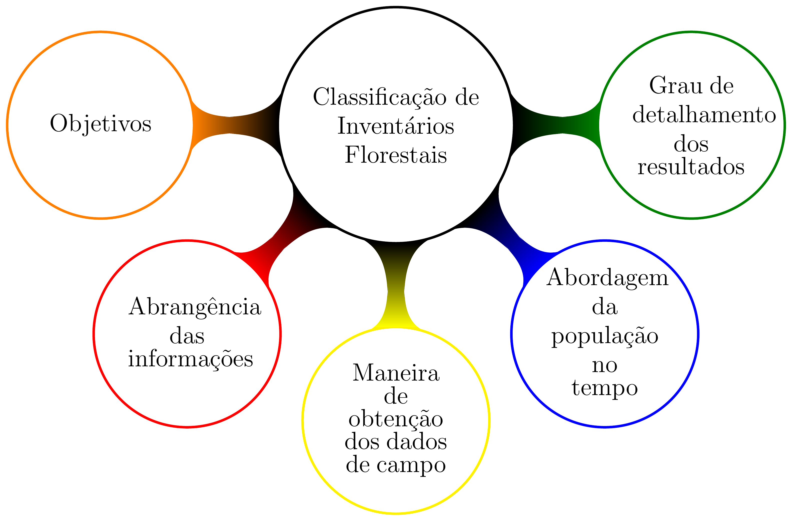
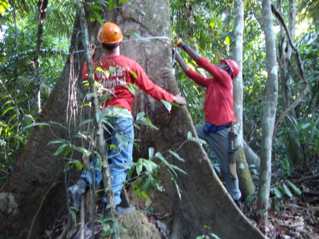
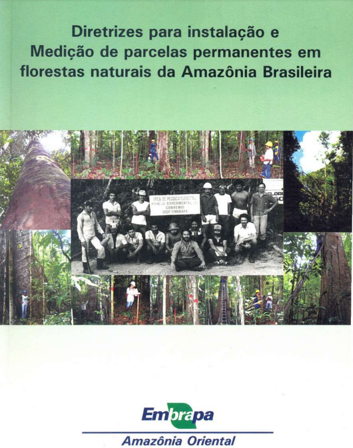
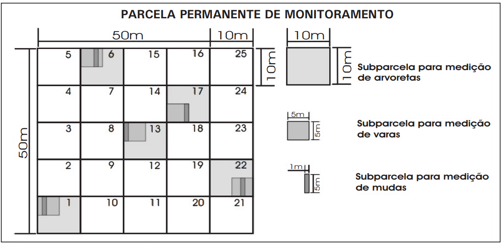
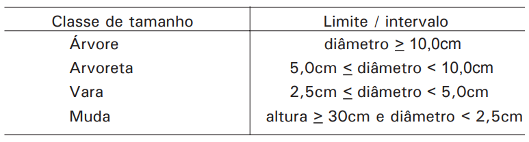
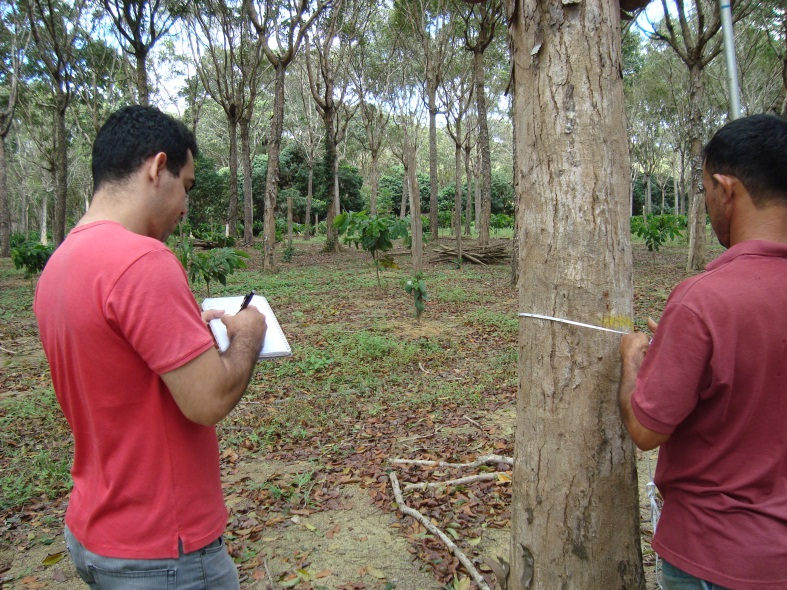

class: title-slide, center, middle
background-image: url(fig/slide-title/ufpa2.png), url(fig/slide-title/forest.png), url(fig/slide-title/img3.png)
background-position: 84% 90%, 95% 90%
background-size: 220px, 90px, cover

```{r setup, include=FALSE}
knitr::opts_chunk$set(
  fig.showtext = TRUE,
  fig.align = "center", 
  cache = TRUE,
  error = FALSE,
  message = FALSE, 
  warning = FALSE, 
  collapse = TRUE ,
  dpi = 600)
```

```{r xaringan-logo, echo=FALSE}
library(xaringanExtra)
use_logo(
  image_url = "fig/slide-title/ufpa.png",
  position = css_position(top = ".8em", right = "1em"),
  width = "140px",
  height = "140px"
)
```

```{r icon, echo=FALSE}
#remotes::install_github("mitchelloharawild/icons")
#library(icons)
#download_fontawesome()
#download_simple_icons()
```

```{r packages, include=FALSE}
# remotes::install_github("dill/emoGG")
library(ggplot2)
library(dplyr)
library(ggimage)
```


<!-- title-slide -->
# Inventário Florestal <br> (FL03039 - IF)
<br>
## .yellow2[Introdução ao] <br> `r anicon::faa("pagelines", animate="horizontal", colour="green")` .yellow2[Inventário Florestal] `r anicon::faa("pagelines", animate="horizontal", colour="green")`

#### **Prof. Dr. Deivison Venicio Souza**
#### Universidade Federal do Pará (UFPA) 
#### Faculdade de Engenharia Florestal
#### E-mail: deivisonvs@ufpa.br
<br>
#### `r format(Sys.Date(),"%d/%B/%Y")`
#### Altamira, Pará

---
layout: true
<div class="my-header"></div>
<div class="my-footer"><span>Prof. Dr. Deivison Venicio Souza (E-mail: deivisonvs@ufpa.br)&emsp;&emsp;&emsp;&emsp;&emsp;Inventário Florestal (FL03039 - IF) - Introdução ao Inventário Florestal</div>

---

## Ementa da disciplina (FL03039 - IF)

.pull-left-3[
.shadow4[
**1 - Introdução aos Inventários Florestais;**

2 - Teoria de Amostragem; 

3 - Amostragem Aleatória Simples;

4 - Amostragem Estratificada;

5 - Amostragem Sistemática; 

6 - Amostragem em Dois Estágios;

7 - Amostragem em Conglomerados;

8 - Censo Florestal (Inventário Florestal 100%); 

9 - Amostragem em Múltiplas Ocasiões;

10 - Inventário Florestal Nacional;

11 - Planejamento e Custo de Inventários Florestais; e

12 - Tecnologias em Inventários Florestais.
]
]


---

## Objetivos
<br><br>
Ao final desta aula espera-se que o discente seja capaz de...

* Compreender os principais conceitos associados à inventários florestais;
* Compreender, diferenciar e definir os principais tipos de inventários florestais;
* Compreender a importância dos inventários florestais na quantificação de recursos; e
* Compreender as principais questões técnicas associadas ao planejamento de inventários florestais.

---

## Conteúdo

**Parte 1 - Inventários Florestais: Conceito, Importância e Tipos**

.pull-left[
.pull-top[
.font90[

[1 - Conceito e Importância](#ifci)

[2 - Tipos de Inventários Florestais (Péllico Netto; Brena, 1997)](#tif)

&nbsp;&nbsp;[2.1 - Quanto ao Objetivo](#qo)

&nbsp;&nbsp;&nbsp;&nbsp;[2.1.1 - Inventário Florestal de Cunho tático](#ifct)

&nbsp;&nbsp;&nbsp;&nbsp;[2.1.2 - Inventário Florestal de Cunho Estratégico](#ifce)

&nbsp;&nbsp;[2.2 - Quanto à Abrangência das Informações](#qai)

&nbsp;&nbsp;&nbsp;&nbsp;[2.2.1 - Inventário Florestal Nacional ](#ifn)

&nbsp;&nbsp;&nbsp;&nbsp;[2.2.2 - Inventário Florestal Regional](#ifr)

&nbsp;&nbsp;&nbsp;&nbsp;[2.2.3 - Inventário Florestal de Área Restrita](#ifar)
]
]
]

.pull-right[

.font90[
&nbsp;&nbsp;[2.3 - Quanto à Maneira de Obtenção dos Dados de Campo](#qmodc)

&nbsp;&nbsp;&nbsp;&nbsp;[2.3.1 - Inventário Florestal 100% (Censo Florestal)](#if100)

&nbsp;&nbsp;&nbsp;&nbsp;[2.3.2 - Inventário por Amostragem](#ia)

&nbsp;&nbsp;&nbsp;&nbsp;[2.3.3 - Inventário por Fontes Secundárias](#ifs)

&nbsp;&nbsp;[2.4 - Quanto à Abordagem da População no Tempo](#qapt)

&nbsp;&nbsp;&nbsp;&nbsp;[2.4.1 - Inventário Florestal Temporário](#ift)

&nbsp;&nbsp;&nbsp;&nbsp;[2.4.2 - Inventário Florestal Contínuo](#ifc)

&nbsp;&nbsp;[2.5 - Quanto ao Grau de Detalhamento dos Resultados](#qgdr)

&nbsp;&nbsp;&nbsp;&nbsp;[2.5.1 - Inventários Exploratórios](#ie)

&nbsp;&nbsp;&nbsp;&nbsp;[2.5.2 - Inventários de Reconhecimento](#ir)

&nbsp;&nbsp;&nbsp;&nbsp;[2.5.3 - Inventários Detalhados](#id)

]
]


---

## Conteúdo

.pull-top[
**Parte 2 - Planejamento de Inventários Florestais**
.font90[
[1 - Definição de Questões Técnicas](#dqt)

&nbsp;&nbsp;[1.2 - Qual o objetivo geral do IF?](#qogif)

&nbsp;&nbsp;[2.1 - ](#TA)

&nbsp;&nbsp;[2.2 - ](#AAS)
]
]

<!-- Slide XX -->
---
layout: false
name: if
class: inverse, middle, center
background-image: url(fig/au1/sec.png)
background-size: cover

.font200[.yellow2[**Inventários Floretais: <br> Conceito, Importância e Tipos**]]

---
layout: true
<div class="my-header"></div>
<div class="my-footer"><span>Prof. Dr. Deivison Venicio Souza (E-mail: deivisonvs@ufpa.br)&emsp;&emsp;&emsp;&emsp;&emsp;Inventário Florestal (FL03039 - IF) - Introdução ao Inventário Florestal</div>

---
name: ifci
## Inventário Florestal
<br><br>
.shadow1[
## Conceito
É uma atividade que visa obter informações **qualitativas** e **quantitativas** dos recursos florestais existentes em uma área pré-especificada (PÉLLICO NETTO; BRENA, 1997), com o objetivo de bem administrá-los, seja através da seu uso racional racional, seja por meio de formulação de políticas públicas.
]

---
name: tif
## Tipos de Inventários Florestais
<br>

**Péllico Netto e Brena (1997)** classificam os IFs quanto à/ao(s):
<br><br>

```{r, echo=FALSE, out.width='55%', fig.align='center', fig.cap='', dpi=600}

```

---
name: qo
## Tipos de Inventários Florestais
<br><br>
.shadow1[
### 1 - Quanto ao objetivo
a) Inventário florestal de cunho tático; e

b) Inventário florestal de cunho estratégico.
]

---
name: ifct
## Tipos de Inventários Florestais

.pull-left-4[
### a) Inventário Florestal de Cunho Tático
<br>
.font90[
São inventários realizados para atender .blue[demandas técnicas] específicas de uma empresa ou propriedade florestal (PMFS, dinâmica, outros).
]
]

--
name: ifce
.pull-right-4[
### b) Inventário Florestal de Cunho Estratégico
<br>
.font90[
**Realizados com o objetivo de:**

- Instruir o poder público na formulação de políticas públicas de conservação, desenvolvimento e uso dos recursos florestais;
- Subsidiar o planejamento e administração das florestas em nível nacional, estadual ou regional; e
- Subsidiar a análise de impactos ambientais que seriam causados pela implantação de determinado empreendimento.
]
]

---
name: qai
## Tipos de Inventários Florestais
<br><br>
.shadow1[
## 2 - Quanto à Abrangência das Informações
a) Inventário florestal nacional;

b) Inventário florestal regional; e

c) Inventário florestal de área restrita.
]

---
name: ifn
## Tipos de Inventários Florestais
<br>

.pull-left-4[
.font90[
### a) Inventário Florestal Nacional - IFN
<br>
- São inventários extensivos que .blue[cobrem países inteiros];

**O objetivo é:**

- Fornecer informações para a definição de políticas, administração florestal, e elaboração de planos de desenvolvimento e uso das florestas; e
- **IFN-Brasil**: [https://www.florestal.gov.br/inventario-florestal-nacional](https://www.florestal.gov.br/inventario-florestal-nacional)

]
]

.pull-right-4[
```{r, echo=FALSE, out.width='45%', fig.align='center', fig.cap='', dpi=600}
knitr::include_graphics('https://i0.wp.com/florestalbrasil.com/wp-content/uploads/2017/01/Servi25C325A7o-Florestal-Brasileiro.png?fit=1004%2C500&ssl=1')
```

```{r, echo=FALSE, out.width='45%', fig.align='center', fig.cap='', dpi=600}
knitr::include_graphics('https://snif.florestal.gov.br/images/img/recursos_florestais/Logo_IFN.png')
```


]

---
name: ifr
## Tipos de Inventários Florestais
<br>

.pull-left-4[
.font90[
### b) Inventário Florestal Regional - IFR
<br>
- São IF de .blue[grandes áreas], cobrindo regiões, estados ou a região de ocorrência natural de uma espécie;

**O objetivo é:**

- Embasar planos estratégicos de desenvolvimento regional;
- Subsidiar a adoção de medidas para preservar certas espécies;
- Avaliar a viabilidade de instalação de indústrias madeireiras, outros.
]
]

---
name: ifar
## Tipos de Inventários Florestais
<br>

.pull-left-4[
.font90[
### c) Inventário Florestal de Área Restrita
<br>
- São IF que cobrem .blue[menores áreas] em .blue[regiões restritas];
- São mais comuns e constituem a maioria dos IF realizados por empresas florestais; e
- São de cunho tático.

]
]

--

<br>
.pull-right-4[
.font90[

**O objetivo é:**

- O objetivo é determinar o potencial florestal (produtos madeireiros e não madeireiros) para uso sustentável; e
- No contexto madeireiro, as informações do IF são a base para a elaboração de PMFS.
<br>
]
<br>

.font80[
.blue[

Lei nº 12.651 de 25/05/2012 (novo Código Florestal)

Instrução Normativa/MMA nº. 05 de 11/12/2006

Resolução CONAMA nº. 406 de 02/02/2009

Instrução Normativa/SEMAS nº. 05/2011

Instrução Normativa/SEMAS nº. 05 de 10/09/2015
]
]
]

---
name: qmodc
## Tipos de Inventários Florestais
<br><br>
.shadow1[
### 3 - Quanto à Maneira de Obtenção dos Dados de Campo
a) Inventário Florestal 100% (Censo Florestal);

b) Inventário por amostragem; e

c) Inventário por fontes secundárias.
]

---
name: if100
## Tipos de Inventários Florestais

.pull-left-4[
.font90[
### a) Inventário Florestal 100% (Censo Florestal)
<br>
- Inventário de .blue[todas as árvores] da população florestal;
- Também chamado de .blue[IF por Enumeração Total];
- No MFS para fins madeireiro, o IF-100% é uma .blue[etapa fundamental e obrigatória]; e
- As informações do IF-100% são usadas para .blue[elaborar PMFS], que serão apresentados aos orgãos ambientais competentes.

]
]

.pull-right-4[
```{r, echo=FALSE, out.width='70%', fig.align='center', fig.cap='', dpi=600}

```
<br><br>

.font80[
*MFS* = Manejo Florestal Sustentável

*PMFS* = Plano de Manejo Florestal Sustentável
]
]


---
name: ia
## Tipos de Inventários Florestais

.pull-left-4[
.font90[
### b) Inventário por Amostragem
<br>
- No IF amostral mede-se .blue[parte da população] florestal;
- Os .blue[parâmetros populacionais são estimados] com base em dados amostrais; e
- Na prática, são realizados com uso de parcelas (ou unidades) amostrais.
]
]

--
<br><br>

.pull-left-4[
.font90[

**Qual motivo?**

- Quando a população florestal a ser inventariada é grandes demais, uma abordagem exaustiva (ou de 100%) de todos os indivíduos torna-se delongada e onerosa.

]
]

---

## Tipos de Inventários Florestais

.left-column[
### População Florestal

```{r eval = T, echo = F, fig.width=.8, fig.height=.8}

grid <- expand.grid(
  x = seq(0, 20, length = 15),
  y = seq(0, 3, length = 15)
  )

img <- "fig/au1/pinus1.png"

grid %>% 
  ggplot(aes(x, y)) + 
  geom_image(image=img, size=.1) +
  theme_bw() +
  theme(axis.text = element_blank(),
        axis.ticks = element_blank(),
        axis.title=element_blank())

```
]

.right-column[
### Amostra da População

```{r eval = T, echo = F, fig.width=.8, fig.height=.8}

grid <- expand.grid(
  x = seq(0, 20, length = 15),
  y = seq(0, 3, length = 15)
  ) %>%
  mutate(image = sample(c("fig/au1/pinus1.png",
                          "fig/au1/pinus2.png"),
                        size = length(y), replace = TRUE))

grid %>%
  ggplot(aes(x, y)) + 
  geom_image(aes(image=image), size=.1) +
  theme_bw() +
  theme(axis.text = element_blank(),
        axis.ticks = element_blank(),
        axis.title=element_blank())

```

]


---
name: ifs
## Tipos de Inventários Florestais

.pull-left-4[
.font90[
### c) Inventário por Fontes Secundárias
<br>
- **RADAM BRASIL**: foi responsável, nos anos 70 e 80, pelo levantamento dos recursos naturais de todo o território brasileiro.

]
]

---
name: qapt
## Tipos de Inventários Florestais
<br><br>
.shadow1[
### 4 - Quanto à Abordagem da População no Tempo
a) IF temporários (ou de uma ocasião); e

b) IF contínuos (ou de múltiplas ocasiões).
]

---
name: ift
## Tipos de Inventários Florestais

.pull-left-4[
.font70[
### a) Inventários Florestais Temporários (ou de uma ocasião)]
<br>

.font90[
- São caracterizados por uma única abordagem da população no tempo; e
- A estrutura da amostragem não é duradoura.

]
]


---
name: ifc
## Tipos de Inventários Florestais

.pull-left-4[
.font70[
### b) Inventários Florestais Contínuos (ou de múltiplas ocasiões)]
<br>

.font90[
- São caracterizados por várias abordagens da população no tempo. Isto é, o inventário é .blue[repetido periodicamente];
- Na prática, são .blue[áreas (parcelas) demarcadas na floresta] em que a vegetação (árvores, arvoretas, varas e mudas) é identificada e medida; e
- Comumente a área demarcada é chamada de .blue[Parcela Permanente de Monitoramento (PPM)].

]
]

--
<br><br>

.pull-right-4[
.font90[
**Importância?**

- Os dados coletados em PPMs são essenciais para o sucesso do manejo florestal sustentável; 

**A partir de dados de PPMs pode-se entender:**

* A composição florística;
* A estrutura e a dinâmica da floresta; e
* As taxas de crescimento, ingresso e mortalidade (e outros).

]
]


---

## Tipos de Inventários Florestais
<br>

.pull-left-12[
<br><br>

.center[
**Acesse a diretriz** `r anicon::faa("hand-point-down", animate="vertical")`

[Diretrizes para instalação e medição de parcelas permanentes em florestas naturais da Amazônia brasileira](http://bommanejo.cpatu.embrapa.br/arquivos/6-Silvaetal2006.pdf)
(Silva et al., 2005)

]
]

.pull-right-12[
```{r, echo=FALSE, out.width='45%', fig.align='center', fig.cap='', dpi=600}

```
]

---

## Tipos de Inventários Florestais
<br>

.pull-left-3[
[Diretrizes para instalação e medição de parcelas permanentes em florestas naturais da Amazônia brasileira](http://bommanejo.cpatu.embrapa.br/arquivos/6-Silvaetal2006.pdf)
(Silva et al., 2005)
]

<br><br><br><br>

.pull-left-2[
```{r, echo=FALSE, out.width='85%', fig.align='center', fig.cap='', dpi=600}

```
]

.pull-right-1[
```{r, echo=FALSE, out.width='110%', fig.align='center', fig.cap='', dpi=600}

```
]

---
name: qdr
## Tipos de Inventários Florestais
<br><br>
.shadow1[
### 5 - Quanto ao Grau de Detalhamento dos Resultados
a) Inventários Exploratórios;

b) Inventários de Reconhecimento; e

c) Inventários Detalhados.
]

---
name: ife
## Tipos de Inventários Florestais
<br>

.pull-left-4[

### a) Inventários Florestais Exploratórios
- Realizado em grandes áreas, em nível de estado ou país.

**Objetiva:**

- Avaliar a cobertura florestal de determinada região, sua extensão, localização, e caracterizar os tipos florestais existentes.

]

.pull-right-4[

### b) Inventários Florestais de Reconhecimento

- Realizado em nível estadual ou regional;

**Objetiva:**

- Caracterizar os tipos de formações florestais;
- Determinar estimativas de volume sem controle de precisão; e
- Definir áreas de preservação, potencial madeireiro, etc.
]

---
name: ifd
## Tipos de Inventários Florestais
<br>

.pull-left-4[

### c) Inventários Florestais Detalhados
- São os mais comuns. Em geral, realizados em pequenas áreas, com maior detalhamento das informações e controle de precisão.

]
<br><br>

.pull-right-4[

**Objetiva:**
- Avaliar a cobertura florestal;
- Caracterizar os tipos florestais;
- Determinar a composição de espécies; 
- Determinar estimativas de volume com controle de precisão, etc.

]

<!-- Slide XX -->
---
name: pif
layout: false
name: conc
class: inverse, middle, center
background-image: url(fig/au1/sec.png)
background-size: cover

.font200[.yellow2[**Planejamento de <br> Inventários Florestais**]]

---
layout: true
<div class="my-header"></div>
<div class="my-footer"><span>Prof. Dr. Deivison Venicio Souza (E-mail: deivisonvs@ufpa.br)&emsp;&emsp;&emsp;&emsp;&emsp;Inventário Florestal (FL03039 - IF) - Introdução ao Inventário Florestal</div>

---

## Planejamento de Inventários Florestais
<br>

.pull-left-4[
De acordo com Sanquetta et al. (2009):

- As bases para o planejamento do inventário florestal variam em função dos .blue[objetivos] e dos .blue[recursos] necessários para sua execução. 
- Verificar as .blue[necessidades do cliente] e as especificações técnicas exigidas pelas .blue[normais legais].
]


.pull-right-4[
```{r, echo=FALSE, out.width='75%', fig.align='center', fig.cap='', dpi=600}

```
.center[
.font90[
**Fonte**: O autor.

**Foto**: Vistoria (SEMA) de plantio de Mogno.
]
]
]

---
name: dqt
## Planejamento de Inventários Florestais
<br>
### Definição de Questões Técnicas

.pull-left-4[
- Durante a fase de planejamento de um Inventário Florestal, algumas questões técnicas precisam ser previamente definidas.
<br><br>

.center[**Quais seriam essas questões?**]
]

.pull-right-4[
  
<div style='font-size:50%'>([Source link](https://twitter.com/Kingwole/status/826485113731047426), accessed jan 31, 2017)</div>   

]

---

## Planejamento de Inventários Florestais
<br>
### Definição de Questões Técnicas
<br>

.font90[
**1.** Qual o objetivo geral do inventário florestal?

**2.** Quais as características da área a ser inventariada?

**3.** Quais as legislações (Leis, Resoluções, INs) vigentes que regulamentam a atividade?

**4.** Qual tipo de IF realizar para atender ao objetivo geral?

**5.** Quais dados devem ser coletados?

**6.** Qual a precisão exigida para as estimativas dos parâmetros populacionais (IF Amostral)?

**7.** Qual o sistema de amostragem será utilizado (método + processo de amostragem) - (IF Amostral)?

**8.** Quantas parcelas serão necessárias para atender a precisão exigida (IF Amostral - IF de Diagnóstico)?

**9.** Qual o apoio logístico? 

]

---

## Planejamento de Inventários Florestais
<br>
### Definição de Questões Técnicas
<br>

**1. Qual o objetivo geral do inventário florestal?**

--

.pull-left-4[
.font90[
- Identificar, mapear espécies e quantificar o .blue[volume de madeira] em floresta natural a ser manejada;<br>
(.magenta[Planos de Manejo Florestal Sustentável])
]


.font90[
- Quantificar a .blue[produção volumétrica] de determinada espécie em um povoamento .blue[plantado];<br>
(.magenta[Projetos de Desbastes])
]
]


--

.pull-right-4[
.font90[
- Monitoramento da .blue[dinâmica, composição florística e estrutura] populacional de floresta natural; <br>
(.magenta[IFC - Parcelas Permanentes])
]


.font90[
- Avaliar a .blue[composição florística, área basal, volume] de uma área para supressão de vegetação. <br>
(.magenta[Projetos de Supressão Vegetal])
]
]

---

## Planejamento de Inventários Florestais
<br>
### Definição de Questões Técnicas
<br>

**2. Quais as características da área a ser inventariada?**

.pull-left-5[
.font90[
Para subsidiar o planejamento de um IF deve-se conhecer de antemão (ou então buscar) todas as .blue[informações] disponíveis e necessárias para melhor .blue[caracterizar a área] a ser inventariada (SANQUETTA et al., 2009).
]
]

--

.pull-right-5[
.font90[
- Qual o tamanho da área a ser inventariada? (Mapa da área)
- Qual o uso do solo da propriedade? 

(Floresta, pasto, agricultura, área de preservação permanente, áreas desmatadas, áreas com infraestrutura, etc.)

- Qual a acessibilidade da área?

Mapa com as vias de acesso (rios, estradas, etc.);
Tipo de relevo;
Meios de transporter para se chegar até a área de inventário; e
Infraestrutura existente para apoio durante o levantamento de campo.

]
]

---

## Planejamento de Inventários Florestais
<br>
### Definição de Questões Técnicas
<br>

**3. Quais as legislações (Leis, Resoluções, INs) vigentes que regulamentam a atividade?**
<br><br>

.font90[
Lei nº 12.651 de 25/05/2012 (novo Código Florestal)

Instrução Normativa/MMA nº. 05 de 11/12/2006 `r emo::ji("point_right")` PMFS

Resolução CONAMA nº. 406 de 02/02/2009 `r emo::ji("point_right")` PMFS

Instrução Normativa/SEMAS nº. 05/2011`r emo::ji("point_right")` PMFS

Instrução Normativa/SEMAS nº. 05 de 10/09/2015 `r emo::ji("point_right")` PMFS
]

---

## Planejamento de Inventários Florestais
<br>
### Definição de Questões Técnicas
<br>

**4. Qual tipo de IF realizar para atender ao objetivo geral?**

--

.font90[
- Inventário Florestal 100% (ou Censo Florestal) `r emo::ji("point_right")` Projetos de Manejo Florestal Sustentável.
]

--

.font90[
- Inventário Florestal Amostral `r emo::ji("point_right")` Projetos de Desbaste (ou Corte Raso), Projetos de Supressão da Vegetação (e outros)
]

--

.font90[
- Inventário Florestal Contínuo `r emo::ji("point_right")` Monitoramento da vegetação (crescimento, produção, florística)
]

---

## Planejamento de Inventários Florestais
<br>
### Definição de Questões Técnicas
<br>

**5. Quais dados devem ser coletados?**

--

.font90[
- .magenta[Projetos de Manejo Florestal Sustentável] `r emo::ji("point_right")` IF-100% `r emo::ji("point_right")` Delimitar áreas, identificar e mapear espécies, medir variáveis dendrométricas (d<sub>1,3</sub>, altura), e outros. (**Objetivo:** Manejo para fins madeireiros)

]

--

.font90[
- .magenta[Projetos de Desbaste] `r emo::ji("point_right")` IF Amostral `r emo::ji("point_right")` Medir Variáveis Dendrométricas (d<sub>1,3</sub>, altura). (**Objetivo:** Quantificar a produção de madeira)
]


--

.font90[
- .magenta[Projetos de Supressão de Vegetação] `r emo::ji("point_right")` IF Amostral `r emo::ji("point_right")` Medir Variáveis Dendrométricas (d<sub>1,3</sub>, altura) e Identificar Espécies. (**Objetivo:** Quantificar a área basal e volume por espécie)
]

--

.font90[
- .magenta[Projetos de Monitoramento da Flora] `r emo::ji("point_right")` IF Amostral `r emo::ji("point_right")` Identificar e Mapear Espécies/Registros Fotográficos/Coletas Botânicas/Fenologia. (**Objetivo:** Monitorar o comportamento da Vegetação, por exemplo, após algum empreendimento)
]

---

## Planejamento de Inventários Florestais
<br>
### Definição de Questões Técnicas
<br>

**6. Qual a precisão exigida para as estimativas dos parâmetros populacionais (IF Amostral)?**

- A decisão deve obedecer a(s) norma(s) legal(is) vigente(s);

.magenta[IF para Projetos de Supressão] = 5%, 10% ou 15% de erro máximo admissível para a estimativa da média da população?

---

## Planejamento de Inventários Florestais
<br>
### Definição de Questões Técnicas
<br>

**7. Qual o sistema de amostragem será utilizado - (IF Amostral)**

.magenta[Sistema de Amostragem] = .blue[Método Amostragem + Processo de Amostragem]

.pull-left-4[
.font90[
**Sobre o Método de Amostragem?**

- Método de Amostragem: Área fixa ou de Área variável?
- A forma e o tamanho das unidades de amostra dependem do método de amostragem.
]
]

--

.pull-right-4[
.font90[
**Sobre o Processo de Amostragem?**

- Amostragem Aleatória Simples (mais comum)
- Amostragem Estratificada
- Amostragem Sistemática
- Amostragem em Dois Estágios
- Amostragem em Conglomerado (Inventário Florestal Nacional)
]
]

---

## Planejamento de Inventários Florestais
<br>
### Definição de Questões Técnicas
<br>

**8. Quantas parcelas serão necessárias para atender a precisão exigida (IF Amostral - IF Piloto)?**

.pull-left-4[
.font90[
- .magenta[Inventário Piloto - IP]: um inventário com número reduzido de parcelas (ou unidades de amostras).
<br><br>

.center[**Quantas parcelas estabelecer em campo para atender a precisão requerida?**]

]
]

.pull-right-4[

```{r, echo=FALSE, out.width='45%', fig.align='center', fig.cap='', dpi=600}
knitr::include_graphics('https://media1.giphy.com/media/kaq6GnxDlJaBq/giphy.gif')
```

<div style='font-size:50%'>([Source link](http://www.reactiongifs.com/suspicious-3/?utm_source=rss&utm_medium=rss&utm_campaign=suspicious-3), accessed jun 06, 2014)</div>  

]

---

## Planejamento de Inventários Florestais
<br>
### Definição de Questões Técnicas
<br>

**8. Quantas parcelas serão necessárias para atender a precisão exigida (IF Amostral - IF Piloto)?**
<br><br>

**Como funciona na prática?**

.font90[
1) Estabelece-se um .magenta[número reduzido de parcelas] em campo;

2) Os .magenta[dados] são coletadas dentro das parcelas (d<sub>1,3</sub>, altura);

3) A partir desses dados é possível determinar a .magenta[intensidade amostral (n)]. O estimador de *n* dependerá do Processo de Amostragem; e

4) Determinar se o .magenta[IF Piloto] pode ser considerado .magenta[IF Definitivo].
]

---

## Referências

<br><br>
PÉLLICO NETTO, S.; BRENA, D.A. Inventário Florestal. Curitiba: editorado pelos autores, 1997. 316p.
<br><br>
SANQUETTA, C.R.; WATZLAWICK, L.F.; CORTE, A.P.D.; FERNANDES, L.A.V.; SIQUEIRA, J.D.P. Inventários florestais: planejamento e execução. 2ª ed. Curitiba. 2009. 316p.
