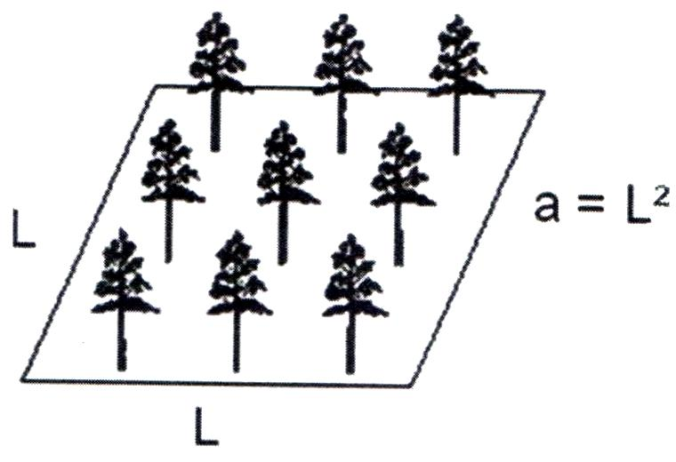

class: title-slide, center, middle
background-image: url(fig/slide-title/ufpa2.png), url(fig/slide-title/forest.png), url(fig/slide-title/img3.png)
background-position: 84% 90%, 95% 90%
background-size: 220px, 90px, cover

```{r setup, include=FALSE}
knitr::opts_chunk$set(
  fig.showtext = TRUE,
  fig.align = "center", 
  cache = TRUE,
  error = FALSE,
  message = FALSE, 
  warning = FALSE, 
  collapse = TRUE ,
  dpi = 600)
```

```{r xaringan-logo, echo=FALSE}
library(xaringanExtra)
use_logo(
  image_url = "fig/slide-title/ufpa.png",
  position = css_position(top = ".8em", right = "1em"),
  width = "140px",
  height = "140px"
)
```

```{r icon, echo=FALSE}
#remotes::install_github("mitchelloharawild/icons")
#library(icons)
#download_fontawesome()
#download_simple_icons()
```

```{r packages, include=FALSE}
# remotes::install_github("dill/emoGG")
library(ggplot2)
library(dplyr)
library(ggimage)
```


<!-- title-slide -->
# Inventário Florestal <br> (FL03039 - IF)
<br>
## .yellow2[Amostragem em] <br> `r anicon::faa("pagelines", animate="horizontal", colour="green")` .yellow2[Inventários Florestais] `r anicon::faa("pagelines", animate="horizontal", colour="green")`

#### **Prof. Dr. Deivison Venicio Souza**
##### Universidade Federal do Pará (UFPA) 
##### Faculdade de Engenharia Florestal
##### E-mail: deivisonvs@ufpa.br
###### 1ª versão: 22/Novembro/2021 <br> (Atualizado em: `r format(Sys.Date(),"%d/%B/%Y")`) <br> Altamira, Pará

---
layout: true
<div class="my-header"></div>
<div class="my-footer"><span>Prof. Dr. Deivison Venicio Souza (E-mail: deivisonvs@ufpa.br)&emsp;&emsp;&emsp;&emsp;&emsp;Inventário Florestal (FL03039 - IF) - Amostragem em Inventários Florestais</div>

---

## Ementa da disciplina (FL03039 - IF)

.pull-left-3[
.shadow4[
1 - Introdução aos Inventários Florestais;

**2 - Amostragem em Inventários Florestais;**

3 - Amostragem Aleatória Simples;

4 - Amostragem Estratificada;

5 - Amostragem Sistemática; 

6 - Amostragem em Dois Estágios;

7 - Amostragem em Conglomerados;

8 - Censo Florestal (Inventário Florestal 100%); 

9 - Amostragem em Múltiplas Ocasiões;

10 - Inventário Florestal Nacional;

11 - Planejamento e Custo de Inventários Florestais; e

12 - Tecnologias em Inventários Florestais.
]
]


---

## Objetivos
<br><br>
Ao final desta aula espera-se que o discente seja capaz de...

* Compreender os conceitos básicos associados à teoria de amostragem para inventários florestais;
* Conhecer os principais estimadores calculados a partir de dados amostrais   de inventários florestais;
* Conhecer a proposta de classificação da amostragem de Péllico Netto e Brena (1997);
* Compreender o conceito de método, processo e sistema de amostragem; e
* Aplicar o Fator de Proporcionalidade (FP) para o método de área fixa.

---

## Conteúdo

.pull-left-4[
.pull-top[
**Parte 1 - Conceitos Básicos para Amostragem**
.font90[

[1 - População x Amostra](#pa)

[2 - População Finita x População Infinita](#pfpi)

[3 - Variável (ou característica)](#var)

[4 - Unidade de Amostra (ou Parcela)](#ua)

[5 - Por que Realizar Amostragem?](#pra)

[6 - Parâmetro, Estimador e Estimativa](#pee)

]
]
]


.pull-right-4[

**Parte 2 - Estimadores em IF por <br> Amostragem**

.font90[

[1 - Principais Estimadores em IF por Amostragem](#peifa)

&nbsp;&nbsp;[1.1 - Intensidade Amostral (ou Suficiência Amostral)](#ia)

&nbsp;&nbsp;[1.2 - Média Aritmética](#ma)

&nbsp;&nbsp;[1.3 - Desvio Padrão, Variância e Coeficiente de Variação](#dp)

&nbsp;&nbsp;[1.4 - Variância da Média](#vm)

&nbsp;&nbsp;[1.5 - Erro Padrão da Média](#epm)

&nbsp;&nbsp;[1.6 - Erro de Amostragem](#ea)

&nbsp;&nbsp;[1.7 - Intervalo de Confiança Para Média](#icm)

&nbsp;&nbsp;[1.8 - Total da População](#tp)

&nbsp;&nbsp;[1.9 - IC Para o Total da População](#icptp)

]
]


<!-- Slide XX -->
---
layout: false
name: if
class: inverse, middle, center
background-image: url(fig/au1/sec.png)
background-size: cover

.font200[.yellow2[**Conceitos básicos <br> para amostragem**]]

---
layout: true
<div class="my-header"></div>
<div class="my-footer"><span>Prof. Dr. Deivison Venicio Souza (E-mail: deivisonvs@ufpa.br)&emsp;&emsp;&emsp;&emsp;&emsp;Inventário Florestal (FL03039 - IF) - Amostragem em Inventários Florestais</div>

---
name: pa
## População x Amostra

.shadow1[
## População

Do ponto de vista estatístico, uma população é o conjunto de todos os indivíduos, elementos ou unidades sobre os quais se deseja desenvolver estudos, visando conhecer determinadas características (QUEIROZ, 1998).
]


.shadow1[
## Amostra

Quando somente uma parte dos elementos ou unidades de uma população é selecionada para o procedimento das análises, tem-se o que se denomina de amostra (QUEIROZ, 1998).

]
<br>

.red[**Atenção**]`r anicon::faa("exclamation-triangle", colour="red")`: .blue[**A amostra deve ser representativa da população estudada!**]

---

## População x Amostra
<br>

**EXEMPLO**

.font90[
- Suponha que um povoamento plantado de *Pinus* sp. foi estabelecido em uma área de .blue[225m<sup>2</sup> (15m x 15m)]. (.green[Obviamente é uma área pequena, mas é útil para entender o conceito!])]
--
.font90[
- O .blue[espaçamento inicial] foi de .blue[1m x 1m], com .blue[espaço vital] de .blue[1m<sup>2</sup>].]
--
.font90[
- Baseado no espaçamento e tamanho da área, pode-se determinar a .blue[quantidade de árvores] no povoamento (sem admitir mortalidade) `r emo::ji("point_right")` **225 árvores**.]
--
.font90[
- Portanto, neste exemplo, a população de *Pinus* sp. é composta de 225 árvores.]

---

## População x Amostra
<br>

**EXEMPLO**

.font90[
- Agora, suponha que aos 5 anos de idade deseja-se estimar o volume de madeira ( $v_i = g_i× ht × 0,5$ ).magenta[<sup>1</sup>] desse pequeno povoamento: Ter-se-ia 2 opções `r emo::ji("point_right")` .magenta[Censo Florestal ou Amostragem].]
--
.font90[
- **Censo Florestal**: Todos as árvores devem ser medidas para a característica de interesse.
- **Amostragem**: Apenas parte das árvores devem ser medidas para a característica de interesse.
]

--

<br>
.font90[
Na estatística, comumente o .blue[número total de elemento na população] é simbolizado por **N**, e o número de elementos na amostra é representado por **n**. 
]
--

<br><br>
.font90[
.magenta[<sup>1</sup>]Equação usada em [Lima et al. (2013)](https://www.scielo.br/j/floram/a/FVtWMSMjgDxHh4D9SCZfrkt/?format=pdf&lang=pt)

.magenta[Efeito do Espaçamento no Desenvolvimento Volumétrico de *Pinus taeda* L.]
]

---

## População x Amostra

.left-column[
#### População Florestal (*Pinus* sp.)

```{r eval = T, echo = F, fig.width=.8, fig.height=.8}

grid <- expand.grid(
  x = seq(0, 20, length = 15),
  y = seq(0, 3, length = 15)
  )

img <- "fig/au1/pinus1.png"

grid %>% 
  ggplot(aes(x, y)) + 
  geom_image(image=img, size=.1) +
  theme_bw() +
  theme(axis.text = element_blank(),
        axis.ticks = element_blank(),
        axis.title=element_blank())

```
]

.right-column[
#### Amostra da População (*Pinus* sp.)

```{r eval = T, echo = F, fig.width=.8, fig.height=.8}

grid <- expand.grid(
  x = seq(0, 20, length = 15),
  y = seq(0, 3, length = 15)
  ) %>%
  mutate(image = sample(c("fig/au1/pinus1.png",
                          "fig/au1/pinus2.png"),
                        size = length(y), replace = TRUE))

grid %>%
  ggplot(aes(x, y)) + 
  geom_image(aes(image=image), size=.1) +
  theme_bw() +
  theme(axis.text = element_blank(),
        axis.ticks = element_blank(),
        axis.title=element_blank())

```

]

---
name: var
## Variável

.pull-left-4[
- É qualquer .blue[característica que varia] de uma unidade (indivíduo ou parcela) para outra (CAMPOS; LEITE, 2009).
]

```{r, echo=FALSE, out.width='60%', fig.align='center', fig.cap='', dpi=600}
knitr::include_graphics('fig/au1/TV.png')
```

---
name: var
## Variável
<br>

### Tipos de Variáveis (Vieira, 2010)
<br>

A .blue[variável é qualitativa] (ou categórica) quando seus valores são distribuídos em categorias mutuamente exclusivas. Pode ser classificada em 2 tipos: .magenta[Variável nominal] ou .magenta[Variável ordinal].


--
<br>

Uma .blue[variável quantitativa (ou numérica)] é expressa por números que têm significado em uma escala numérica. Pode ser classificada em 2 tipos:  .magenta[Variável discreta] ou .magenta[Variável contínua].

---

## Variáveis em Inventários Florestais
<br>

.pull-left-5[
```{r, echo=FALSE, out.width='100%', fig.align='center', fig.cap='', dpi=600}
knitr::include_graphics('fig/au1/dap.jpg')
```
.font90[.magenta[d<sub>1,3</sub> = diâmetro a 1,30 m do solo] (Fita diamétrica)]
<br><br><br><br><br><br>

.font80[**Fotos**: Acervo pessoal.]
]

.pull-left-5[
```{r, echo=FALSE, out.width='70%', fig.align='center', fig.cap='', dpi=600}
knitr::include_graphics('fig/au1/cub2.jpg')
```
.magenta[.font90[v = Volume por Cubagem Rigorosa (Smalian, Huber, Newton)]]
]

.pull-left-5[
```{r, echo=FALSE, out.width='70%', fig.align='center', fig.cap='', dpi=600}
knitr::include_graphics('fig/au1/dtoco.jpg')
```
.magenta[.font90[d<sub>toco</sub> = diâmetro do toco]]
]

.pull-left-5[
```{r, echo=FALSE, out.width='95%', fig.align='center', fig.cap='', dpi=600}
knitr::include_graphics('fig/au1/alt.jpg')
```
.font90[.magenta[h = altura de árvores] 

(Vara telescópica)]

]


---
name: ua
## Unidade de Amostra (Ou Parcela)
<br>

.shadow1[
## Unidade de Amostra

- É o espaço físico sobre o qual são observadas e medidas as características quantitativas e qualitativas da população (PÉLLICO NETTO; BRENA, 1997).
- Comumente, em IF uma .blue[Amostra] é constituída por um conjunto de .blue[Unidades Amostrais] (ou Parcelas) de mesma dimensão.

]

---

## Unidade de Amostra (Ou Parcela) - Exemplos
<br>

```{r, echo=FALSE, out.width='85%', fig.align='center', fig.cap='', dpi=600}

```

.font80[
Fonte: [Viane et al. (2013)](https://www.researchgate.net/publication/304073085_Pacto_pela_restauracao_da_Mata_Atlantica_-_Protocolo_de_monitoramento_para_programas_e_projetos_de_restauracao_florestal)
]

---
name: pra
## Por que realizar amostragem?
<br>

- Na prática, a coleta de dados de uma população florestal pode ser realizada por dois procedimentos: .magenta[Censo] ou .magenta[Amostragem].
<br><br>
--

- **Problema**: Frequentemente as populações florestais são .blue[extensas], ou por vezes inacessíveis. Portanto, medir todos os elementos da população implica em .blue[alto custo operacional] e de .blue[tempo de execução].
<br><br>
--

- **Amostragem**: É indicada quando a população é muito .blue[extensa]. Assim, os dados podem ser obtidos com .blue[maior rapidez] e .blue[menor custo] operacional, quando comparado ao Censo Florestal.
<br><br>
--

.center[.red[**Atenção**]`r anicon::faa("exclamation-triangle", colour="red")`: Sempre consulte as normas legais vigentes que regulamentam a atividade!]
<br>

.center[.magenta[Plano de Manejo Florestal Sustentável] `r emo::ji("point_right")` **IF-100% é obrigatório**]

---
name: pee
## Parâmetro, Estimador e Estimativa

.shadow1[
### Parâmetro

- É uma .blue[quantidade] usada para descrever uma variável de interesse, a partir de .blue[dados populacionais].
- Os parâmetros são comumente representados por .blue[letras gregas].
- Os valores dos parâmetros populacionais são .blue[normalmente desconhecidos], pois na maioria das vezes é inviável medir todos os elementos da população.
]
<br>

.center[
.font90[
$\mu$ = Média Populacional (ou Paramétrica)

$\sigma^2$ = Variância Populacional (ou Paramétrica)

$\sigma$ = Desvio Padrão Populacional (ou Paramétrica)
]
]

.font90[
$\sigma$: letra grega sigma.

$\mu$: letra grega mu (lê-se "mi").
]

---

## Parâmetro, Estimador e Estimativa

.shadow1[
### Estimador (do Parâmetro)
- É uma .blue[estatística] usada para .blue[estimar um parâmetro da população] (para alguma característica de interesse), a partir de dados da .blue[amostra].
- São exemplos de estimadores: $\bar{X}$, $S^2$, $S$ e outros

]

.shadow1[
### Estimativa (do Parâmetro)
- É o valor numérico assumido pelo estimador, a partir de dados amostrais.
- Estimativa = é um valor aproximado (do Parâmetro).
]

---

## Parâmetro, Estimador e Estimativa
<br>

### Formulação Matemática (Exemplos)

|                                Parâmetro                                |                         Estimador (do Parâmetro)                         |                                      Descrição                                      |
|:-----------------------------------------------------------------------:|:------------------------------------------------------------------------:|:-----------------------------------------------------------------------------------:|
|                   $$\mu = \frac{1}{N}\sum_{i=1}^{N}X_i$$                  |                 $$\bar{X} = \frac{1}{n}\sum_{i=1}^{n}X_i$$                 |        $\mu$ = média populacional <br> $\bar{X}$ = estimador da média populacional       |
|    $$\sigma^2 = \frac{1}{N}\sum_{i=1}^{N}\left (X_i - \mu  \right )^2$$   |    $$S^2 = \frac{1}{n-1}\sum_{i=1}^{n}\left (X_i - \bar{X}  \right )^2$$   |   $\sigma^2$ = variância populacional <br> $S^2$ = estimador da variância populacional   |
| $$\sigma = \sqrt{\frac{1}{N}\sum_{i=1}^{N}\left (X_i - \mu  \right )^2}$$ | $$S = \sqrt{\frac{1}{n-1}\sum_{i=1}^{n}\left (X_i - \bar{X}  \right )^2}$$ | $\sigma$ = desvio padrão populacional <br> $S$ = estimador do desvio padrão populacional |

---

## Resumindo...(Péllico Netto; Brena, 1997)

```{r, echo=FALSE, out.width='40%', fig.align='center', fig.cap='', dpi=600}
knitr::include_graphics('fig/class2/pop.jpg')
```

<!-- Slide XX -->
---
layout: false
name: if
class: inverse, middle, center
background-image: url(fig/au1/sec.png)
background-size: cover

.font200[.yellow2[**Estimadores em Inventários <br> Florestais por Amostragem**]]

---
layout: true
<div class="my-header"></div>
<div class="my-footer"><span>Prof. Dr. Deivison Venicio Souza (E-mail: deivisonvs@ufpa.br)&emsp;&emsp;&emsp;&emsp;&emsp;Inventário Florestal (FL03039 - IF) - Amostragem em Inventários Florestais</div>

---
name: peifa
## Principais Estimadores em IF por Amostragem
<br>

.pull-left-4[
.font90[
- Em IF por amostragem, os estimadores a serem usados dependem do processo (técnica) de amostragem.
<br><br>

**Processos de Amostragem:**

- Amostragem Aleatória Simples
- Amostragem Estratificada
- Amostragem Sistemática
- Amostragem em Dois Estágios
- Amostragem em Conglomerado
]
]

.pull-right-4[
.font90[
.center[**Principais Estimadores**]

1 - Intensidade amostral

2 - Média aritmética

3 - Variância

4 - Desvio Padrão

5 - Coeficiente de variação

6 - Variância da média

7 - Erro padrão da média

8 - Erro de amostragem

9 - Intervalo de confiança para média

10 - Total da população

11 - Intervalo de confiança para o total da população
]
]

---
name: ia
## Principais Estimadores em IF por Amostragem

.shadow1[
### Intensidade Amostral (n)

- É o estimador da intensidade amostral (ou Suficiência Amostral).
- É simbolizado por .blue[*n*].
- Estimativa: .blue[estima o número de parcelas] a serem alocadas (medidas) em campo, para garantir um erro máximo admissível para estimativa da média da variável de interesse, sob um determinado nível de probabilidade.
- Comumente a variável de interesse é o .blue[volume de madeira].
]
<br>

.center[.green[**Quantas parcelas (unidades de amostras) estabelecer em campo?**]]

---

## Principais Estimadores em IF por Amostragem
<br><br>

**A intensidade de amostragem é dependente da(o):** (Péllico Netto; Brena, 1997)
<br><br>

1 - Variabilidade (entre parcelas) da variável de interesse

2 - Erro de amostragem máximo admissível

3 - Nível de confiança fixado.

---
name: ma
## Principais Estimadores em IF por Amostragem
<br>

.shadow1[
### Média Aritmética 
- É o estimador da média populacional (chamado também de média amostral).
- É simbolizado por $\color{blue}{\bar{X}}$ (lê-se "X-barra").
- **Conceito matemático**: É a razão entre a soma de todos os valores assumidos pela variável e o número de observações.
<br>

$$\large\bar{X} = \frac{1}{n}\sum_{i=1}^{n}X_i$$
]

.font90[
- Nos IFs, é mais usual trabalhar com quantidades por unidade de área (parcela). Por exemplo, m<sup>3</sup>.ha<sup>-1</sup>
].

---
name: dp
## Principais Estimadores em IF por Amostragem
<br>

.shadow1[
### Variância, Desvio Padrão e Coeficiente de Variação

- São estimadores da dipersão populacional em relação à alguma medida de tendência central (comumente a média aritmética).
- $\color{blue}{S^2}$ (lê-se "S-Quadrado"): é o estimador da variância populacional.
- $\color{blue}{S}$: é o estimador do desvio padrão populacional.
- $\color{blue}{CV}$: é o estimador do coeficiente de variação populacional (dispersão relativa).

]

.pull-left-8[
$$
\normalsize
S^2 = \frac{1}{n-1}\sum_{i=1}^{n}\left (X_i - \bar{X}  \right )^2
$$
]

.pull-left-8[
$$
S = \sqrt{\frac{1}{n-1}\sum_{i=1}^{n}\left (X_i - \bar{X}  \right )^2}
$$
]

.pull-left-8[
$$
CV(\%) = \left ( \frac{S}{\bar{X}} \right ).100
$$
]

---
name: vm
## Principais Estimadores em IF por Amostragem

.shadow1[
### Variância da Média (Amostral)

- É o estimador da variância da média amostral.
- É simbolizado por $\color{blue}{S_\bar{X}^2}$ (lê-se: "S-Quadrado X-barra").
- Representa a variação teórica das médias amostrais, se diversas amostras pudessem, hipoteticamente, ser tomadas na população.
- Portanto, é uma medida da .blue[incerteza] (confiança) associada à estimativa da média populacional.

]

--

.pull-right-4[
```{r, echo=FALSE, out.width='35%', fig.align='center', fig.cap='', dpi=600}
knitr::include_graphics('https://media1.giphy.com/media/kaq6GnxDlJaBq/giphy.gif')
```
<div style='font-size:50%'>([Source link](http://www.reactiongifs.com/suspicious-3/?utm_source=rss&utm_medium=rss&utm_campaign=suspicious-3), accessed jun 06, 2014)</div>  
]

---

## Principais Estimadores em IF por Amostragem
<br>

### Variância da Média (Amostral) - Cont.
<br>

**EXEMPLO**:

.font90[
- Retornemos ao povoamento plantado de *Pinus* sp. (A = 225m<sup>2</sup>, E = 1m x 1m e N = 225 árvores);]

--

.font90[
- Agora, suponha que uma .blue[amostra aleatória de 50 árvores] foi tomada (n = 50);
]

--

.font90[
- Em seguida, o volume de madeira de cada árvore foi calculado por $v_i = g_i× ht × 0,5$ e, obteve-se a média aritmética amostral (do volume);
]

--

.font90[
- **Agora reflita**: Se você realizasse uma .blue[nova amostra aleatória] de igual tamanho (n = 50), o que aconteceria com a .blue[nova média amostral]?
]

--

.font90[
**Resposta**: Certamente a nova média amostral seria diferente da primeira!
]


---

## Principais Estimadores em IF por Amostragem
<br>

### Variância da Média (Amostral) - Cont.
<br>

**EXEMPLO** (Cont.):

.font80[
- Assim, se continuássemos tomando diversas (muitas e muitas vezes!) amostras aleatórias (n = 50), .blue[seria possível calcular a variância da média amostral];
- Obviamente, isso é .blue[inviável na prática]! Não é razoável ficar realizando diversas amostras de mesmo tamanho. .blue[Imaginem o custo e tempo!];
- Porém, ainda sim é importante obter uma estimativa da variância das médias amostrais. É dada pelo estimador:

$$
S_\bar{X}^2 = \dfrac{S²}{n}
$$

- Quanto menor for $\color{blue}{S_\bar{X}^2}$, mais próximas estarão as médias amostrais da média populacional $\mu$.
- O valor de $\color{blue}{S_\bar{X}^2}$ diminui à medida que o tamanho da amostra (n) é aumentado.

]


---
name: epm
## Principais Estimadores em IF por Amostragem

.shadow1[
### Erro Padrão da Média (Amostral)
.font90[
- É o estimador do erro padrão da média amostral.
- É simbolizado por $\color{blue}{S_\bar{X}}$ (lê-se: "S X-barra").
- **Matemática**: É a raiz quadrada da variância da média amostral. Ou também dado por:

$$
S_\bar{X} = \dfrac{S}{\sqrt{n}}
$$
- Na prática, $\color{blue}{S_\bar{X}^2}$ e $\color{blue}{S_\bar{X}}$ estimam a mesma coisa. Ou seja, a incerteza (variabilidade) da estimativa da média populacional ( $\mu$ ). Mas, a diferença é que $\color{blue}{S_\bar{X}}$ é .blue[dado na mesma unidade de medida da variável de interesse]. Isso é mais conveniente!

]
]

---
name: ea
## Principais Estimadores em IF por Amostragem

.shadow1[
### Erro de Amostragem
.font90[

- É o estimador do erro cometido devido realizar uma amostragem, ou seja, não medir toda a população (SOARES et al., 2011).
- Quão próxima a estimativa da média populacional (média amostral) está da verdadeira média populacional (parâmetro)?
- É simbolizado por $\color{blue}{E_a}$ (Erro de Amostragem Absoluto) ou $\color{blue}{E_r}$ (Erro de Amostragem Relativo).

]
]

--

.pull-left-1[
<br>

$$
\Large
\begin{equation*}
E_a = \pm t.S_\bar{X}
\end{equation*}
$$
]

.pull-left-1[
<br>

$$
\Large
\begin{equation*}
E_r = \pm\dfrac{t.S_\bar{X}}{\bar{X}}.100~~(\%)
\end{equation*}
$$
]

---

## Principais Estimadores em IF por Amostragem
<br>

### Erro de Amostragem - Fatores influentes
<br>

**O erro de amostragem de um inventário florestal varia em função do(a):**

- Tamanho da amostra (n)
- Variabilidade da variável de interesse entre unidades amostrais
- Processo de amostragem utilizado (AAS, AS, etc.)

---

## Um parêntese...
<br>

- Em um IF, podem ocorrer 2 tipos de erros: 1) .blue[Erros amostrais]; e 2) .blue[Erros não-amostrais] (Péllico Netto; Brena, 1997)
<br>

.shadow3[
### Erros não-amostrais
.font90[
- São aqueles que não estão inter-relacionados com o processo de amostragem.
- Podem ocorrer tanto em IF-100%, quanto em IF por amostragem.
- Podem ser originados por inúmeras causas:

.right[
**Imperfeições nos equipamentos (desajustados)**

**Limitações humanas (inabilidade do operador)**

**Negligência na marcação das unidades amostrais**

**Erros de registro (ou digitação) dos dados**

]
]
]

---
name: icm
## Principais Estimadores em IF por Amostragem

.shadow1[
### Intervalo de Confiança Para Média
.font90[

- .blue[Intervalo de Confiança (IC)] é um tipo de estimador por intervalo de um parâmetro populacional desconhecido.
- Se o parâmetro populacional desconhecido é $\mu$ (média populacional), então o IC para Média é simbolizado por: $\color{blue}{IC_\bar{X}}$.
- **Ideia básica**: fornecer um .blue[intervalo] de valores plausíveis para um .blue[parâmetro populacional] (mais comumente $\mu$), baseado em dados amostrais.
- Na prática, é calculado um intervalo (.blue[limite inferior] e .blue[limite superior]) que deve conter o valor verdadeiro do parâmetro $\mu$ (média populacional), sob algum nível de confiança.
]
]

$$
\Large
\begin{equation*}
IC_\bar{X} = \bar{X} - (t.S_\bar{X}) \leq \mu \leq \bar{X} + (t.S_\bar{X})
\end{equation*}
$$

---

## Principais Estimadores em IF por Amostragem
<br>
### Intervalo de Confiança Para Média
<br>

**EXEMPLO:**
.font90[
- Retornemos ao povoamento plantado de *Pinus* sp. (A = 225m<sup>2</sup>, E = 1m x 1m e N = 225 árvores);
]

--

.font90[
- Suponha que estejamos interessados no .blue[parâmetro populacional desconhecido] $\color{blue}{\mu}$ (média populacional) da variável .blue[volume de madeira];
]

--

.font90[
- Podemos .blue[estimar] o valor do parâmetro $\color{blue}{\mu}$ usando dados de uma .blue[amostra] de tamanho .blue[*n*]. Por exemplo, n = 50 árvores.
]

--

.font90[
- Então, teremos um único número (média amostral) que representa o valor mais plausível do parâmetro $\color{blue}{\mu}$. É uma .blue[estimativa pontual].
]


---

## Principais Estimadores em IF por Amostragem
<br>
### Intervalo de Confiança Para Média
<br>

**EXEMPLO: (Cont.)**

.font90[
- No entanto, sabe-se que, na maioria das vezes, o valor estimado do parâmetro da população (nesse caso, $\color{blue}{\mu}$), não será idêntico ao valor verdadeiro.]

--

.font90[
- Portanto, ao se tomar uma amostra (n = 50) das árvores poderíamos ter, por exemplo, $\color{blue}{\bar{V}}$ = 1,5m<sup>3</sup> $\neq$ $\mu$.
]

--

.font90[
- Então, devido a isso é interessante fornecer um .blue[intervalo de valores plausíveis para] $\color{blue}{\mu}$, baseado em dados da amostra. Este intervalo é chamado de **Intervalo de Confiança**.
]

.center[
**O quão podemos estar confiantes de que a média amostral ( $\color{blue}{\bar{X}}$ ) é uma boa estimativa da média populacional ( $\color{blue}{\mu}$ )?**]


---
name: tp
## Principais Estimadores em IF por Amostragem

.shadow1[
### Total da População
.font90[

- É o estimador para o montante (quantitativo) existente da variável de interesse (por exemplo, volume) na população florestal.
- É simbolizado por $\color{blue}{\hat{X}}$ (X-Chapéu (hat)).

$$
\Large
\begin{equation*}
\hat{X} = N.\bar{X}
\end{equation*}
$$

]
]

---
name: icptp
## Principais Estimadores em IF por Amostragem

.shadow1[
### IC Para o Total da População
.font90[

- A ideia é a mesma discutida para $\color{blue}{IC_\bar{X}}$.
- É simbolizado por $\color{blue}{IC_\hat{X}}$
- No entanto, neste caso, o interesse é encontrar o intervalo de confiança para o total (por exemplo, volume total de madeira) da população.

]
]
<br><br>

.center[
**O quão podemos estar confiantes de que o total estimado de uma quantidade (Por exemplo, volume de madeira) é uma boa estimativa do total populacional (verdadeira quantidade de madeira)?**]


<!-- Slide XX -->
---
layout: false
name: if
class: inverse, middle, center
background-image: url(fig/au1/sec.png)
background-size: cover

.font200[.yellow2[**Métodos, Processos e <br> Sistema de Amostragem**]]

---
layout: true
<div class="my-header"></div>
<div class="my-footer"><span>Prof. Dr. Deivison Venicio Souza (E-mail: deivisonvs@ufpa.br)&emsp;&emsp;&emsp;&emsp;&emsp;Inventário Florestal (FL03039 - IF) - Amostragem em Inventários Florestais</div>

---
name: 
## Métodos de Amostragem

.shadow1[
### Métodos de Amostragem - Conceito e Tipos

- É a forma de .blue[abordagem da população florestal] referente a .blue[uma única unidade de amostra] (ou parcela). Ou seja, o tipo de unidade amostral a ser empregada no inventário florestal. 
- Existem 2 tipos de métodos de amostragem: 
<br>

**1) Método de Área Fixa**; e 

**2) Método de Área Variável**.
]

---

## Métodos de Amostragem

.shadow2[
### Método de Área Fixa - .font90[.black[Características] (Sanquetta et al., 2009)]
.font90[
- A .blue[seleção] dos indivíduos é feita .blue[proporcional à área] da Unidade de Amostra (UA);
- O quantitativo da variável de interesse calculado para uma UA de área fixa é extrapolado para hectare (unidade de área), por meio de um fator denominado .blue[**Fator de proporcionalidade**] (FP).
- Obviamente, essa extrapolação para hectare somente é necessária quando a UA tem dimensão diferente de 1 hectare.
]
]

---

## Métodos de Amostragem


.shadow3[
### Método de Área Fixa - .black[Tamanho e Forma das Parcelas]
.font90[
- Na prática do IF, existem .blue[diversas formas] de parcelas que podem ser estabelecidas em campo e com .blue[diferentes dimensões].
- **Decisão:** é orientada pela .blue[maior praticidade e operacionalidade] de sua localização e demarcação em campo.
]
]
<br><br>

```{r, echo=FALSE, out.width='45%', fig.align='center', fig.cap='', dpi=600}
knitr::include_graphics('fig/class2/ua.png')
```

---

## Métodos de Amostragem

.pull-left-2[
.shadow3[
### Método de Área Fixa - .font70[.black[UA Circulares] (Sanquetta et al., 2009)]
.font90[
- Mais usadas em inventário de .blue[plantações florestais].
- São .blue[mais eficientes], isto porque dentre todas as formas, considerando-se a .blue[mesma área], são as que possuem .blue[menor perímetro] e, por conseguinte, .blue[minimizam o problema de árvores marginais].
- A definição do raio da parcela é o aspecto mais importante. 
- Raios > 15 metros não são recomendáveis, pois são pouco operacionais e inviabilizam um inventário eficiente.
- Tamanho Médio: varia de 400 a 600 m<sup>2</sup>
- Tamanho Máximo: 700 m<sup>2</sup>

]
]
]

.pull-right-1[
```{r, echo=FALSE, out.width='95%', fig.align='center', fig.cap='', dpi=600}
knitr::include_graphics('fig/class2/pc.png')
```
]

---

## Métodos de Amostragem

.shadow3[
### Método de Área Fixa - .font80[.black[Controle do Raio] (Sanquetta et al., 2009)]
.font90[
- As UAs circulares requerem o controle estrito do raio para garantir a inclusão correta de árvores.
- Alguns procedimentos têm sido empregados:
<br>

**1 – Uso de corda**

**2 – Controladores automáticos de distância** (plot centers com transponder e Vertex III)

]
]

---

## Métodos de Amostragem

.shadow3[
### Método de Área Fixa - .font80[.black[Critérios de inclusão de árvores] (Sanquetta et al., 2009)]
.font90[

- Na demarcação de parcelas circulares podem ocorrer árvores marginais.
- Portanto, é importante definir um critério de inclusão de árvores marginais.
- A ilustração a abaixo define critérios que podem ser usados.
]
]
<br>

```{r, echo=FALSE, out.width='35%', fig.align='center', fig.cap='', dpi=600}
knitr::include_graphics('fig/class2/marginais.png')
```
.center[.font70[**Fonte**: Sanquetta et al. (2009)]]

---

## Métodos de Amostragem

.shadow3[
### Método de Área Fixa - .font70[.black[UA Quadradas] (Sanquetta et al., 2009)]
.font90[
- Maior facilidade de instalação (alinhamentos de plantios bem definidos).
- **Inventários pré-corte**: 400 a 900m<sup>2</sup>.
- **Florestas naturais**: 900m<sup>2</sup> (30 x 30m) a 10.000m<sup>2</sup> (100 x 100m).
- Bastante usadas no monitoramento da dinâmica de florestas naturais <br> (Inventário Florestal Contínuo).

]
]

```{r, echo=FALSE, out.width='30%', fig.align='center', fig.cap='', dpi=600}

```
.center[.font70[**Fonte**: Sanquetta et al. (2009)]]


---

## Métodos de Amostragem

.shadow3[
### Método de Área Fixa - .font70[.black[UA Retangulares] (Sanquetta et al., 2009)]
.font90[

- Recomendada para situações de maior heterogeneidade da formação vegetal
- Tamanhos recomendados: 1.000m<sup>2</sup> (10m x 100m ou 20m x 50m) a 10.000m<sup>2</sup> (20m x 500m)
- Tamanho mais usual: 2.500m<sup>2</sup> (10m x 250m)

]
]
<br>

```{r, echo=FALSE, out.width='50%', fig.align='center', fig.cap='', dpi=600}
knitr::include_graphics('fig/class2/retag.png')
```
.center[.font70[**Fonte**: Sanquetta et al. (2009)]]

---

## Métodos de Amostragem

.shadow3[
### Método de Área Fixa - .font90[.black[Fator de Proporcionalidade]]
.font90[

- No método de área fixa, a variável de interesse é medida em parcelas amostrais com tamanho de área definido.
- Por exemplo, se a variável de interesse é volume de madeira e a área da parcela é 1ha, então o volume será expresso em m<sup>3</sup>.ha<sup>-1</sup> (m<sup>3</sup>/ha).
- No entanto, nem sempre são usadas parcelas de área igual a 1 hectare. Por exemplo, se empregada uma parcela de 2500m<sup>2</sup>, então volume será expresso em m<sup>3</sup>/2500m<sup>2</sup>.
- Nos IFs, é usual e recomendável sempre apresentar os parâmetros estimados por hectare. Portanto, pode-se fazer uma simples extrapolação usando um **Fator de Proporcionalidade**.
]
]
<br>

.pull-left-4[
$$
\Large
\begin{equation*}
FP = \frac{A}{a}
\end{equation*}
$$
]

.pull-right-4[
Em que:

$A$ = área de 1 hectare

$a$ = área da unidade amostral

]

---

## Métodos de Amostragem
<br>

### Método de Área Fixa - .font90[.black[Fator de Proporcionalidade]]
<br>

**EXEMPLO:**
<br>

- Qual o Fator de Proporcionalidade (FP) para os seguintes tamanhos de unidades de amostrais? (**Lembre**: 1ha = 10.000m<sup>2</sup>)

20m x 50m `r emo::ji("point_right")` (FP = 1ha/0,1ha) ou (FP = 10.000m<sup>2</sup>/1.000m<sup>2</sup>) `r emo::ji("point_right")` .blue[**FP = 10**]

100m x 100m `r emo::ji("point_right")` .red[**?**]

10m x 250m `r emo::ji("point_right")` .red[**?**]

20m x 250m `r emo::ji("point_right")` .red[**?**]

---

## Métodos de Amostragem
<br>

### Método de Área Fixa - .font90[.black[Fator de Proporcionalidade]]
<br>
.font90[
- Uma vez calculado o FP pode-se extrapolar os parâmetros estimados para hectare (Péllico Netto; Brena, 1997; Sanquetta et al., 2009):
<br>
]

.pull-left-4[
.font90[**Estimativa do número de árvores por hectare (N):**]

$$
\large
\begin{equation*}
N = m.FP
\end{equation*}
$$

.font90[**Estimativa da área basal por hectare (G):**]

$$
\large
\begin{equation*}
G = \sum_{i}^{m}g_i.FP
\end{equation*}
$$

]

.pull-right-4[

.font90[**Estimativa do volume por hectare (V):**]

$$
\large
\begin{equation*}
V = \sum_{i}^{m}v_i.FP
\end{equation*}
$$
.font90[
Em que:

$m$ = nº de árvores incluídas na UA

$g_i$ = área transversal da $i$-ésima árvore da UA

$v_i$ = volume da $i$-ésima árvore da UA
]
]

---
name: proca
## Processos de Amostragem

.shadow1[
### Processos de Amostragem - Conceito e Tipos
.font90[
- É a forma de abordagem da população referente ao conjunto de unidades amostrais (Péllico Netto; Brena, 1997).
- É a forma com que as unidades de amostra são distribuídas dentro de uma população, visando gerar estimativas da variável de interesse (Sanquetta et al., 2009).
- Os processos de amostragem classificam-se em:
.center[
**Amostragem Aleatória Simples**

**Amostragem Sistemática**

**Amostragem Estratificada**

**Amostragem em Dois estágios**

**Amostragem em Conglomerado**
]
]
]

---

## Processos de Amostragem
<br>

### Qual Processos de Amostragem Escolher?

<br>
**A escolha do Processo de Amostragem depende de vários fatores, como:**

- Tamanho da área
- Grau de variabilidade (homegeneidade) da variável de interesse na população florestal
- Acessibilidade, relevo e existência de infraestrutura da área a ser inventariada
- Recursos financeiros disponíveis, entre outros.

---

## Referências

<br><br>
CAMPOS, J. C. C.; LEITE, H. G. Mensuração florestal: perguntas e respostas. 3ª ed. - Viçosa, MG: Ed. UFV, 2009. 548 p.
<br><br>
PÉLLICO NETTO, S.; BRENA, D.A. Inventário Florestal. Curitiba: editorado pelos autores, 1997. 316p.
<br><br>
QUEIROZ, W. T. de. Técnicas de amostragem em inventário florestal nos trópicos. Belém: FCAP. Serviço de Documentação e Informação, 1998. 147 p.


---

## Referências

<br><br>
SANQUETTA, C.R.; WATZLAWICK, L.F.; CORTE, A.P.D.; FERNANDES, L.A.V.; SIQUEIRA, J.D.P. Inventários florestais: planejamento e execução. 2ª ed. Curitiba. 2009. 316p.
<br><br>
SCOLFORO, J. R. S.; MELLO, J. M. de. Inventário Florestal. Lavras: UFLA/FAEPE, 1997. 341 p.
<br><br>
SOARES, C. P. B.; PAULA NETO, F. de; SOUZA, A. L. de. Dendrometria e inventário florestal. 2ª ed. - Viçosa, MG: Ed. UFV, 2011. 272 p.
