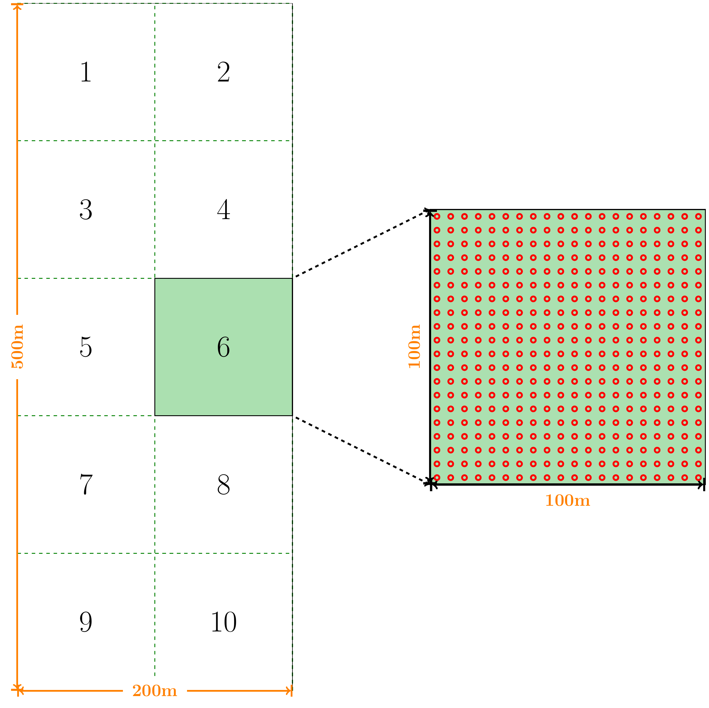
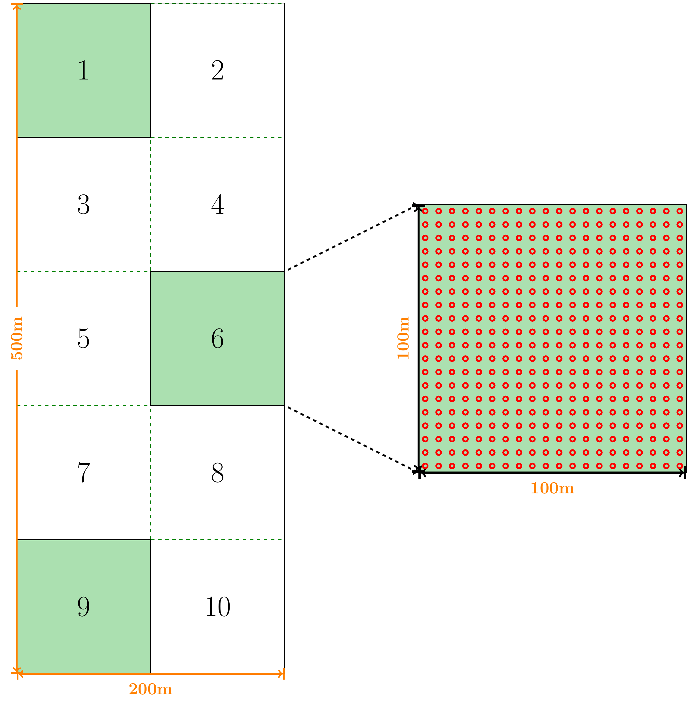
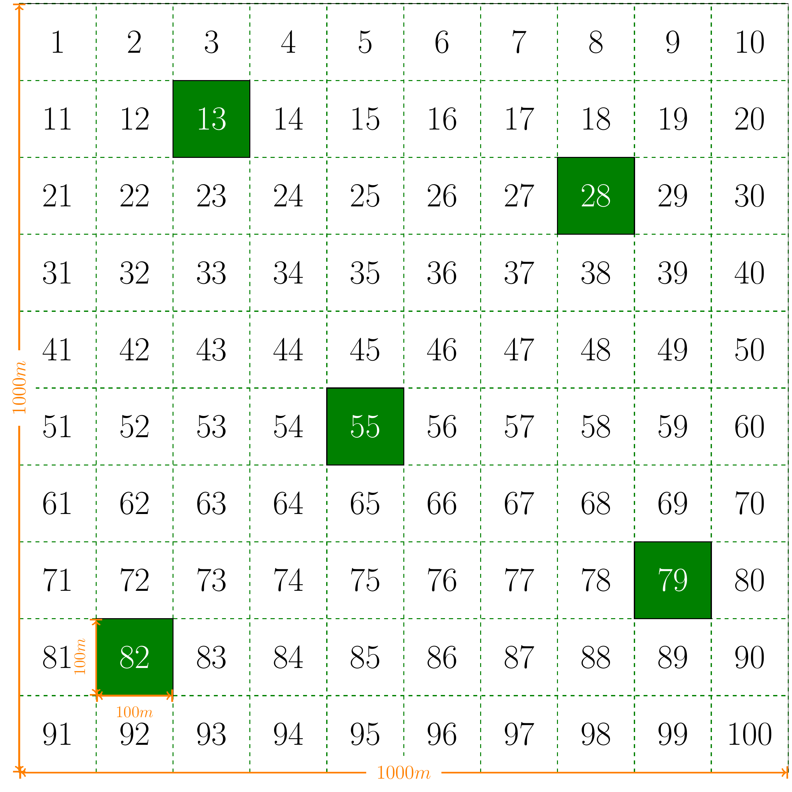
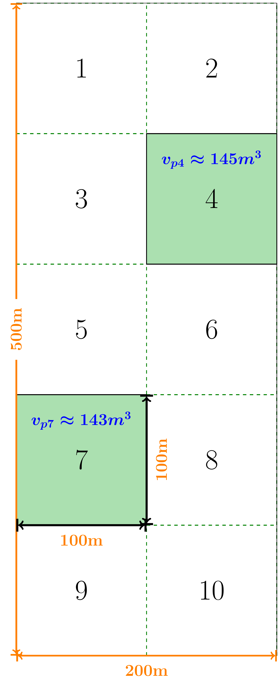
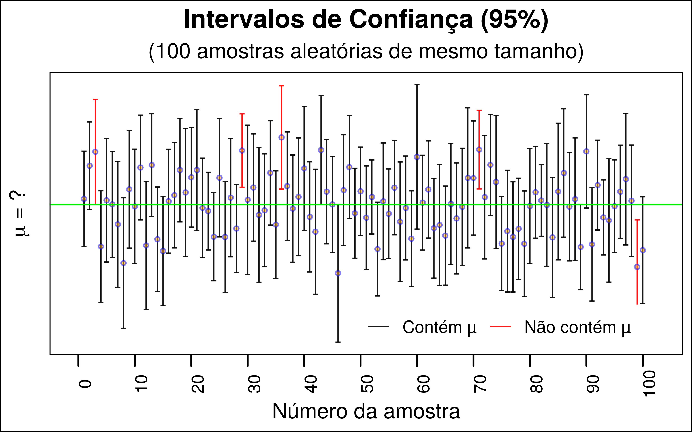

class: title-slide, center, middle
background-image: url(fig/slide-title/ufpa2.png), url(fig/slide-title/forest.png), url(fig/slide-title/img3.png)
background-position: 84% 90%, 95% 90%
background-size: 220px, 90px, cover

```{r setup, include=FALSE}
knitr::opts_chunk$set(
  fig.showtext = TRUE,
  fig.align = "center", 
  cache = FALSE,
  error = FALSE,
  message = FALSE, 
  warning = FALSE, 
  collapse = TRUE ,
  dpi = 600)
```

```{r xaringan-logo, echo=FALSE}
library(xaringanExtra)
use_logo(
  image_url = "fig/slide-title/ufpa.png",
  position = css_position(top = ".8em", right = "1em"),
  width = "140px",
  height = "140px"
)

use_scribble()

```

```{r icon, echo=FALSE}
#remotes::install_github("mitchelloharawild/icons")
#library(icons)
#download_fontawesome()
#download_simple_icons()
```

```{r customDT, echo=F}
CustomDT <- function(data){
  data %>% DT::datatable(editable = 'cell', rownames = FALSE,
                         style = "default",
                         class = "display", width = '250px',
                         caption = '',
     options=list(pageLength = 16, dom = 'tip', autoWidth = F,
       initComplete = htmlwidgets::JS(
          "function(settings, json) {",
          paste0("$(this.api().table().container()).css({'font-size': '", "14pt", "'});"),
          "}")
       ) 
     )
}
```

```{r packages, include=FALSE}
# remotes::install_github("dill/emoGG")
library(ggplot2)
library(dplyr)
library(ggimage)
```


<!-- title-slide -->
# Inventário Florestal <br> (FL03039 - IF)
<br>
## .yellow2[Amostragem] <br> `r anicon::faa("pagelines", animate="horizontal", colour="green")` .yellow2[Aleatória Simples] `r anicon::faa("pagelines", animate="horizontal", colour="green")`

#### **Prof. Dr. Deivison Venicio Souza**
##### Universidade Federal do Pará (UFPA) 
##### Faculdade de Engenharia Florestal
##### E-mail: deivisonvs@ufpa.br
<br>
##### 1ª versão: 23/Novembro/2021 <br> (Atualizado em: `r format(Sys.Date(),"%d/%B/%Y")`) <br> Altamira, Pará

---
layout: true
<div class="my-header"></div>
<div class="my-footer"><span>Prof. Dr. Deivison Venicio Souza (E-mail: deivisonvs@ufpa.br)&emsp;&emsp;&emsp;&emsp;&emsp;Inventário Florestal (FL03039 - IF)/ <div3>Amostragem Aleatória Simples - AAS</div3> </div>

---

## Ementa da disciplina (FL03039 - IF)

.pull-left-9[
.shadow4[
.font90[
1 - Introdução aos Inventários Florestais;

2 - Amostragem em Inventários Florestais;

**3 - Amostragem Aleatória Simples**;

4 - Amostragem Estratificada;

5 - Amostragem Sistemática; 

6 - Amostragem em Dois Estágios;

7 - Amostragem em Conglomerados;

8 - Censo Florestal (Inventário Florestal 100%); 

9 - Amostragem em Múltiplas Ocasiões;

10 - Inventário Florestal Nacional;

11 - Planejamento e Custo de Inventários Florestais; e

12 - Tecnologias em Inventários Florestais.
]
]
]

.pull-right-9[
<br>

.shadow3C[
<br>
```{r echo = FALSE, out.width='45%', fig.align='center', fig.cap='', dpi=600}

```

.font70[
**Prof. Dr. Deivison Venicio Souza**
.left[
- Bacharel em Engenharia Florestal - UFRA
- Mestre em Ciências Florestais - PPGCF/UFRA
- Doutor em Engenharia Florestal - PPGEF/UFPR
- Especialista em Big Data e Data Science - UFPR
]
]
]
]

---

## Objetivos
<br><br>
Ao final desta aula espera-se que o discente seja capaz de...

* Compreender os conceitos básicos associados à Amostragem Aleatória Simples (AAS);
* Conhecer os principais estimadores da AAS;
* Aprender a obter as estimativas da AAS por meio de um estudo de caso; e
* Aprender a interpretar as estimativas e concluir sobre a precisão do IF realizado.

---

## Conteúdo

.pull-left-4[
.pull-top[
**Parte 1 - Teoria da Amostragem Aleatória Simples**
.font90[

[1 - Definição e características](#con)

[2 - Seleção da Unidade de Amostra](#sua)

[3 - Argumentos favoráveis e contra-argumentos](#afc)

[4 - Quando usar a AAS?](#qu)

]
]
]


.pull-right-4[

**Parte 2 - Estimadores da AAS**

.font90[

[1 - Parâmetro, Estimador e Estimativa](#pee)

[2 - Principais Estimadores da AAS](#peaas)

&nbsp;&nbsp;[2.1 - Média Aritmética Amostral](#ma)

&nbsp;&nbsp;[2.2 - Variância, Desvio Padrão e Coeficiente de Variação](#dp)

&nbsp;&nbsp;[2.3 - Intensidade Amostral (ou Suficiência Amostral)](#ia)

&nbsp;&nbsp;[2.4 - Erro Padrão da Média Amostral](#epm)

&nbsp;&nbsp;[2.5 - Erro de Amostragem](#ea)

&nbsp;&nbsp;[2.6 - Intervalo de Confiança Para Média](#icm)

&nbsp;&nbsp;[2.7 - Total da População](#tp)

&nbsp;&nbsp;[2.8 - IC Para o Total da População](#icptp)

]
]

---

## Conteúdo

.pull-left-4[
.pull-top[
**Parte 3 - Aplicação Inventário Florestal usando AAS**
.font90[

[1 - Estudo de Caso (Sanquetta et al., 2014; pg. 110)](#ec)

&nbsp;&nbsp;[1.1 - Média Aritmética Amostral](#maEC)

&nbsp;&nbsp;[1.2 - Variância, Desvio Padrão e Coeficiente de Variação](#dpEC)

&nbsp;&nbsp;[1.3 - Intensidade Amostral (ou Suficiência Amostral)](#iaEC)

&nbsp;&nbsp;[1.4 - Erro Padrão da Média Amostral](#epmEC)

&nbsp;&nbsp;[1.5 - Erro de Amostragem](#eaEC)

&nbsp;&nbsp;[1.6 - Intervalo de Confiança Para Média](#icmEC)

&nbsp;&nbsp;[1.7 - Total da População](#tpEC)

&nbsp;&nbsp;[1.8 - IC Para o Total da População](#icptpEC)

]
]
]

<!-- Slide XX -->
---
layout: false
name: if
class: inverse, middle, center
background-image: url(fig/au1/sec.png)
background-size: cover

.font200[.yellow2[**Teoria da <br> Amostragem Aleatória Simples**]]

---
layout: true
<div class="my-header"></div>
<div class="my-footer"><span>Prof. Dr. Deivison Venicio Souza (E-mail: deivisonvs@ufpa.br)&emsp;&emsp;&emsp;&emsp;&emsp;<div3>Amostragem Aleatória Simples - AAS</div3>/ <div2>Parte 1 - Teoria da Amostragem Aleatória Simples</div2> </div>

---
name: con
## Amostragem Aleatória Simples
<br>

.pull-left-3[
.shadow1a[
### Definição
.font100[
**Processo de amostragem** de características de uma população, cujas unidades amostrais são escolhidas de forma **aleatória** e sob **igual probabilidade** (amostragem probabilística).
]
]
]

.pull-right-3[
.pull-down[
`r anicon::faa("tree", size = 5, speed = "slow", animate = 'vertical', color = "green")`
`r anicon::faa("tree", size = 5, speed = "slow", animate = 'vertical', color = "green")`
`r anicon::faa("tree", size = 5, speed = "slow", animate = 'vertical', color = "green")`

]
]

---
name: car
## Amostragem Aleatória Simples
<br>

.shadow1a[
### Características (Queiroz, 1998)

- A Amostragem Aleatória Simples (AAS) é baseada em um processo estritamente aleatório;
- As unidades amostrais (parcelas) são escolhidas sob igual probabilidade (**1/N**); <br> (**N** = número de UA que compõem o espaço amostral).

]

---
name: sua
## Amostragem Aleatória Simples

.shadow1a[
### Método de Seleção da Unidade de Amostra
<br>

A seleção das Unidades Amostrais (UA) pode ser realizada por meio de sorteio **COM** ou **SEM** reposição (Péllico Netto; Brena, 1997):
<br>

- **Sorteio com reposição**: Uma unidade de amostra poderá ser sorteada .magenta[mais de uma vez] para compor a amostra.
- **Sorteio sem reposição**: Uma unidade de amostra poderá ser sorteada somente .magenta[uma única vez] para compor a amostra.

]

---

## Amostragem Aleatória Simples

.shadow1a[
### Como funciona nos inventários florestais?

- A AAS em inventários florestais é comumente conduzida por meio de um **sorteio SEM reposição** das unidades de amostras (Queiroz, 1998). <br><br>
- **Motivo**: A inclusão de uma unidade amostral mais de uma vez na amostra refletirá uma homogeneização da variância (entre UAs) para a variável de interesse.

]

---

## Amostragem Aleatória Simples

.pull-left-15[
- Vamos supor um Povoamento de *Khaya Ivorensis*...(5m x 5m)

🌳  🌳  🌳  🌳  🌳  🌳  🌳  🌳  🌳  🌳  🌳  🌳  🌳  🌳
🌳  🌳  🌳  🌳  🌳  🌳  🌳  🌳  🌳  🌳  🌳  🌳 
🌳  🌳  🌳  🌳  🌳  🌳  🌳  🌳  🌳  🌳  🌳  🌳  🌳  🌳
🌳  🌳  🌳  🌳  🌳  🌳  🌳  🌳  🌳  🌳  🌳  🌳  
🌳  🌳  🌳  🌳  🌳  🌳  🌳  🌳  🌳  🌳  🌳  🌳  🌳  🌳
🌳  🌳  🌳  🌳  🌳  🌳  🌳  🌳  🌳  🌳  🌳  🌳  
🌳  🌳  🌳  🌳  🌳  🌳  🌳  🌳  🌳  🌳  🌳  🌳  🌳  🌳
🌳  🌳  🌳  🌳  🌳  🌳  🌳  🌳  🌳  🌳  🌳  🌳  
🌳  🌳  🌳  🌳  🌳  🌳  🌳  🌳  🌳  🌳  🌳  🌳  🌳  🌳
🌳  🌳  🌳  🌳  🌳  🌳  🌳  🌳  🌳  🌳  🌳  🌳
🌳  🌳  🌳  🌳  🌳  🌳  🌳  🌳  🌳  🌳  🌳  🌳  🌳  🌳
🌳  🌳  🌳  🌳  🌳  🌳  🌳  🌳  🌳  🌳  🌳  🌳  
🌳  🌳  🌳  🌳  🌳  🌳  🌳  🌳  🌳  🌳  🌳  🌳  🌳  🌳
🌳  🌳  🌳  🌳  🌳  🌳  🌳  🌳  🌳  🌳  🌳  🌳  
🌳  🌳  🌳  🌳  🌳  🌳  🌳  🌳  🌳  🌳  🌳  🌳  🌳  🌳
🌳  🌳  🌳  🌳  🌳  🌳  🌳  🌳  🌳  🌳  🌳  🌳  
🌳  🌳  🌳  🌳  🌳  🌳  🌳  🌳  🌳  🌳  🌳  🌳  🌳  🌳
🌳  🌳  🌳  🌳  🌳  🌳  🌳  🌳  🌳  🌳  🌳  🌳 
🌳  🌳  🌳  🌳  🌳  🌳  🌳  🌳  🌳  🌳  🌳  🌳  🌳  🌳
🌳  🌳  🌳  🌳  🌳  🌳  🌳  🌳  🌳  🌳  🌳  🌳
🌳  🌳  🌳  🌳  🌳  🌳  🌳  🌳  🌳  🌳  🌳  🌳  🌳  🌳
🌳  🌳  🌳  🌳  🌳  🌳  🌳  🌳  🌳  🌳  🌳  🌳
🌳  🌳  🌳  🌳  🌳  🌳  🌳  🌳  🌳  🌳  🌳  🌳  🌳  🌳
🌳  🌳  🌳  🌳  🌳  🌳  🌳  🌳  🌳  🌳  🌳  🌳
🌳  🌳  🌳  🌳  🌳  🌳  🌳  🌳  🌳  🌳  🌳  🌳  🌳  🌳
🌳  🌳  🌳  🌳  🌳  🌳  🌳  🌳  🌳  🌳  🌳  🌳
🌳  🌳  🌳  🌳  🌳  🌳  🌳  🌳  🌳  🌳  🌳  🌳  🌳  🌳
🌳  🌳  🌳  🌳  🌳  🌳  🌳  🌳  🌳  🌳  🌳  🌳
]
<br><br><br>

.pull-right-15[
.font90[
**.brown[Como você executaria um IF usando a AAS?]**
<br><br>

**Variável de interesse**: .blue[Volume de Madeira].
]
]

---
name: afc
## Amostragem Aleatória Simples

.shadow1a[
### Contra-argumentos (Péllico Netto; Brena, 1997)
]

--

.shadow4[
.font90[
**1) Na fase de planejamento**
- As UAs devem ser listadas, para posterior seleção aleatória (sorteio de unidades ou pontos amostrais);
]
]

--

.shadow4[
.font90[
**2) Na fase de execução (em campo)**
- Existe a possibilidade de uma distribuição irregular da unidades amostrais;
- Pode haver maior dificuldade para se alcançar a posição das unidades amostrais; e
- Maior tempo improdutivo, devido ao deslocamento entre unidades amostrais.
]
]
<br>

.comment[**Fatores que aumentam as dificuldades**: Florestas Inequiâneas, Tamanho da Área...]

---

## Amostragem Aleatória Simples

.shadow1a[
### Argumentos favoráveis
]

--

.shadow4[
**1) Na fase de análise de dados (escritório)**
- Os estimadores da AAS são mais simples. Portanto, as estimativas do IF são obtidas com maior facilidade.
]

---
name: qu
## Amostragem Aleatória Simples

.shadow1a[
### Quando usar a AAS para IF? (Sanquetta et al., 2009)
<br>
Recomenda-se o uso da AAS quando a população florestal a ser inventariada for:

- Pequena;
- De fácil acesso; e
- Relativamente .magenta[homogênea] em relação à variável de interesse. <br><br>

.blue[Homogeneidade]: Tem relação com o grau de variabilidade da variável de interesse entre unidades amostrais.

.blue[Grau de variabilidade]: é estimado pelo estimador de variância amostral. <br><br>

.center[
.red[&#65308;] variância .red[&#65308;] intensidade amostral
]

]

<!-- Slide XX -->
---
layout: false
name: if
class: inverse, middle, center
background-image: url(fig/au1/sec.png)
background-size: cover

.font200[.yellow2[**Estimadores: <br> Amostragem Aleatória Simples**]]

---
layout: true
<div class="my-header"></div>
<div class="my-footer"><span>Prof. Dr. Deivison Venicio Souza (E-mail: deivisonvs@ufpa.br)&emsp;&emsp;&emsp;&emsp;&emsp;<div3>Amostragem Aleatória Simples - AAS</div3>/ <div2>Parte 2 - Estimadores da AAS</div2> </div>

---
name: pee
## Parâmetro, Estimador e Estimativa

- Recapitulando a diferença entre: .blue[Parâmetro, Estimador e Estimativa]...


.shadow1a[
### Parâmetro
]

--

.shadow4[
.font90[
- É uma .blue[estatística] usada para descrever uma característica de interesse, a partir de .blue[dados populacionais]. (**Mede-se todos os elementos da população!**)
- Os valores dos parâmetros populacionais são .blue[normalmente desconhecidos], pois na maioria das vezes é inviável medir todos os elementos da população.
- Os parâmetros são comumente representados por .blue[letras gregas].
]
]
<br>

--

.center[
.font80[
$\mu$ = Média Populacional (ou Paramétrica)

$\sigma^2$ = Variância Populacional (ou Paramétrica)

$\sigma$ = Desvio Padrão Populacional (ou Paramétrica)
]
]

.font80[
$\sigma$: letra grega sigma.

$\mu$: letra grega mu (lê-se "mi").
]

---

## Parâmetro, Estimador e Estimativa

.shadow1a[
### Estimador (do Parâmetro)
]

--

.shadow4[
- É uma .blue[estatística] usada para .blue[estimar um parâmetro da população] (para alguma característica de interesse), a partir de dados da .blue[amostra].
- São exemplos de estimadores: $\bar{X}$, $S^2$, $S$ e outros
]

--

.shadow1a[
### Estimativa (do Parâmetro)
]

--

.shadow4[
- É o valor numérico assumido pelo estimador, obtido a partir de dados amostrais.
- Estimativa = é um valor aproximado (do Parâmetro).
]

---

## Parâmetro, Estimador e Estimativa
<br>

### Formulação Matemática (Exemplos)

|                                Parâmetro                                |                         Estimador (do Parâmetro)                         |                                      Descrição                                      |
|:-----------------------------------------------------------------------:|:------------------------------------------------------------------------:|:-----------------------------------------------------------------------------------:|
|                   $$\mu = \frac{1}{N}\sum_{i=1}^{N}X_i$$                  |                 $$\bar{X} = \frac{1}{n}\sum_{i=1}^{n}X_i$$                 |        $\mu$ = média populacional <br> $\bar{X}$ = estimador da média populacional       |
|    $$\sigma^2 = \frac{1}{N}\sum_{i=1}^{N}\left (X_i - \mu  \right )^2$$   |    $$S^2 = \frac{1}{n-1}\sum_{i=1}^{n}\left (X_i - \bar{X}  \right )^2$$   |   $\sigma^2$ = variância populacional <br> $S^2$ = estimador da variância populacional   |
| $$\sigma = \sqrt{\frac{1}{N}\sum_{i=1}^{N}\left (X_i - \mu  \right )^2}$$ | $$S = \sqrt{\frac{1}{n-1}\sum_{i=1}^{n}\left (X_i - \bar{X}  \right )^2}$$ | $\sigma$ = desvio padrão populacional <br> $S$ = estimador do desvio padrão populacional |

---
name: peaas
## Estimadores da Amostragem Aleatória Simples
<br>

.pull-left-12[
**Os principais estimadores da Amostragem Aleatória Simples são:**
]

.pull-right-12[
| **Estimador (do Parâmetro)**                          | **Símbolo**                |
|-------------------------------------------------------|:----------------------------:|
| 1 - Média aritmética                                  | $\bar{X}$                  |
| 2 - Variância                                         | $S^2$                      |
| 3 - Desvio Padrão                                     | $S$                        |
| 4 - Coeficiente de variação                           | $CV$                       |
| 5 - Intensidade amostral                              | $n$                        |
| 6 - Erro padrão da média amostral                          | $S_{\bar{X}}$              |
| 7 - Erro de amostragem                                | $\left(E_a~ou~E_r \right)$ |
| 8 - Intervalo de confiança para média                 | $IC_{\bar{X}}$             |
| 9 - Total da população                               | $\hat{X}$                  |
| 10 - Intervalo de confiança para o total da população | $IC_{\hat{X}}$             |

]

---

## Estimadores da Amostragem Aleatória Simples
<br>

.shadow3[
.center[**NOTAÇÕES**]

$A$ = Área total da população

$a$ = Área ou tamanho da unidade de amostra

$N$ = Número de unidades de amostra possíveis na população

$n$ = Número de unidades amostradas (**medidas em campo!**)

$f$ = Fração de amostragem (**Proporção amostrada!**)

$t$ = Valor tabelado com $\left(n-1 \right)$ graus de liberdade ao nível de significância estabelecido

$LE$ = Limite de erro admitido no Inventário Florestal (0,1 ou 10%)

$E$ = Erro admissível para estimativa da média

$X_i$ = $i$-ésimo valor da variável de interesse $X$

]

---
name: ma
## Estimadores da Amostragem Aleatória Simples

.shadow1a[
## Média aritmética amostral

\begin{equation}
\Large
\bar{X} = \frac{1}{n}\sum_{i=1}^{n}X_i
\end{equation}

- $\bar{X}$ (lê-se: X-barra) = estimador da média aritmética populacional $\mu$ (lê-se: "mi").
- $n$ = número de observações.
- $\Sigma$ (sigma maiúscula) = símbolo de somatório. 
- $X_i$ = $i$-ésimo valor da variável de interesse $X$.

]

---
name: dp
## Estimadores da Amostragem Aleatória Simples

.shadow1a[
## Variância amostral
.font90[
👉 Estimar a variabilidade (ou dispersão) dos dados da amostra em relação à média aritmética.]

\begin{equation}
\Large
S^2 = \frac{1}{n-1}\sum_{i=1}^{n}\left (X_i - \bar{X}  \right )^2
\end{equation}

.font90[
- $S^2$ (lê-se: S-quadrado) = estimador da variância populacional $\sigma^2$ (lê-se: Sigma-quadrado).
- $n$ = número de observações.
- $\Sigma$ (sigma maiúscula) = símbolo de somatório. 
- $X_i$ = $i$-ésimo valor da variável de interesse $X$.
- $\bar{X}$ = estimativa da média aritmética populacional $\mu$.
]
]

---

## Estimadores da Amostragem Aleatória Simples

.shadow1a[
## Desvio padrão amostral

.font90[
👉 Estimar a variabilidade (ou dispersão) dos dados da amostra em relação à média aritmética. Porém, **é expresso na mesma unidade de medida da variável de interesse.**]

\begin{equation}
\Large
S = \sqrt{\frac{1}{n-1}\sum_{i=1}^{n}\left (X_i - \bar{X}  \right )^2}
\end{equation}

.font90[
- $S$ = estimador do desvio padrão populacional $\sigma$.
- $n$ = número de observações.
- $\Sigma$ (sigma maiúscula) = símbolo de somatório. 
- $X_i$ = $i$-ésimo valor da variável de interesse $X$.
- $\bar{X}$ = estimativa da média aritmética populacional $\mu$.
]
]

---

## Estimadores da Amostragem Aleatória Simples

.shadow1a[
## Coeficiente de variação amostral

\begin{equation}
\Large
CV = \frac{S}{\bar{X}} \left( 100 \right)
\end{equation}

.font90[
- $CV$ = estimador do coeficiente de variação populacional.
- $S$ = estimativa do desvio padrão populacional $\sigma$.
- $\bar{X}$ = estimativa da média aritmética populacional $\mu$.
]
]

---
name: ia
## Estimadores da Amostragem Aleatória Simples

.shadow1a[
## Intensidade amostral - Definição

.font90[
No âmbito de IFs, o estimador de intensidade amostral buscar responder:

- Qual o .blue[tamanho da amostra] necessário para estimar a média aritmética (ou outro parâmetro) de uma variável de interesse (ex.: volume/ha), admitindo-se um limite de erro e sob um nível de probabilidade?

<br>

**A definição do estimador de intensidade amostral depende de duas informações preliminares:**

- A natureza da população (Finita ou Infinita?).
- Da estimativa de variabilidade da variável de interesse (Variância ou CV?).
]
]

---

## Estimadores da Amostragem Aleatória Simples

.shadow1a[
## .font90[Intensidade amostral]
]

.pull-left-4[
.shadow3[
.font90[
.center[.blue[**Em função da variância amostral**]]

- **Populações Finitas**

\begin{equation}
\large
n = \frac{Nt^2S^2}{(NE^2) + (t^2S^2)}
\end{equation}

- **Populações Infinitas**

\begin{equation}
\large
n = \frac{t^2S^2}{E^2}
\end{equation}
]
]

.font70[
$N$ = Número de unidades de amostra possíveis na população

$S^2$ = Estimativa da variância populacional

$t_{n-1;~\alpha}$ = Valor crítico com (n-1) GL e nível $\alpha$ de significância

$E$ = Erro admissível para estimativa da média
]

]

--

.pull-right-4[
.shadow3[
.font90[
.center[.blue[**Em função do CV amostral**]]

- **Populações Finitas**

\begin{equation}
\large
n = \frac{Nt^2(CV)^2}{N(LE)^2 + t^2(CV)^2}
\end{equation}

- **Populações Infinitas**

\begin{equation}
\large
n = \frac{t^2(CV)^2}{(LE)^2}
\end{equation}
]
]

.font70[
$CV$ = estimativa do coeficiente de variação (em %) populacional

$LE$ = Limite de Erro (em %) admitido no Inventário Florestal
]

]

---

## Estimadores da Amostragem Aleatória Simples

.pull-left-4[
.font90[
**🤔 Como determinar o número de unidades de amostras possíveis na população** $\left(N\right)$?
<br><br>

**Exemplo**: 

- Suponha uma população florestal de *Khaya Ivorensis* com 15 anos de idade, implantada a pleno sol sob o espaçamento 5m x 5m (Área Total = 10ha).
- **Objetivo**: Estimar o volume de madeira/hectare.
- **Amostragem**: Supondo o uso de parcelas de 100m x 100m, qual o valor de $\left(N\right)$?

]
]

--

.pull-right-4[
```{r, echo=FALSE, out.width='95%', fig.align='center', fig.cap='', dpi=600}

```
]

---

## Estimadores da Amostragem Aleatória Simples

.pull-left-4[
.font90[
**Depende do tamanho da população e da parcela:**
]
]

.pull-right-4[
```{r, echo=FALSE, out.width='95%', fig.align='center', fig.cap='', dpi=600}

```
]

--

.pull-left-4[
\begin{equation}
\normalsize
N = \frac{A}{a}
\end{equation}
]


--

.pull-left-4[
\begin{equation*}
\normalsize
N = \frac{100.000\color{orange}{m²}}{10.000\color{orange}{m²}} = \frac{10\color{blue}{ha}}{1\color{blue}{ha}} = 10~UA
\end{equation*}

]


.font90[
- **Interpretação**: É possível estabelecer 10 unidades amostrais de 1ha na população florestal de 10ha.
]

---

## Estimadores da Amostragem Aleatória Simples
<br>

.shadow3[
.center[**População Finita x População Infinita**]

- Em estatística, uma população é finita quando a fração amostral é maior do que 2%.
- A fração amostral pode ser calculada como:

\begin{equation}
\large
f = \frac{n}{N}
\end{equation}

$n$ = número de unidades amostradas

$N$ = número de unidades de amostras possíveis na população

]

---

## Estimadores da Amostragem Aleatória Simples

.pull-left-4[
.font90[
**🤔 Como determinar a fração amostral** $\left(f\right)$?
<br><br>

- Retornemos ao exemplo da população florestal de *Khaya Ivorensis*...
- Agora, suponha que foram aleatorizadas 3 UAs de 1 hectare cada.
- 🤔 **Pergunta-se**: Qual a fração amostral?
]
]

--

.pull-right-4[
```{r, echo=FALSE, out.width='95%', fig.align='center', dpi=600}

```
]


---

## Estimadores da Amostragem Aleatória Simples

.pull-left-4[
.font90[
**🤔 Como determinar a fração amostral** $\left(f\right)$?
<br>
]
]

--

.pull-right-4[
```{r, echo=FALSE, out.width='95%', fig.align='center', dpi=600}

```
]

--
<br>

.pull-left-4[
.font90[
**Abordagem 1:** .blue[Usando a equação]
<br>

\begin{equation*}
\normalsize
f = \frac{n}{N} = \frac{3}{10} = 0,3 (100) = \color{blue}{30\%}
\end{equation*}

<br>
**Abordagem 2**: .blue[Usando regra de 3]
<br>

\begin{align*}
& 10ha -\!\!\!-\!\!\!- 100\% \\
& 3ha -\!\!\!-\!\!\!- x\%
\end{align*}

$$x = \frac{300}{10}=\color{blue}{30\%}$$

]
]

--

.pull-left-4[
.font90[**Interpretação**: Foi amostrada uma fração de 30% da área total da população florestal. (**.orange[População é Finita!]**)]
]

---

## Estimadores da Amostragem Aleatória Simples

**Vamos praticar...**

.pull-left-4[
.font90[
- Suponha uma população florestal de *Khaya Ivorensis* com área total de 100ha e a implantação de 5 parcelas de 100m x 100m. Pergunta-se:
]
]

.pull-right-4[
```{r, echo=FALSE, out.width='85%', fig.align='center', dpi=600}

```
]

--

.pull-left-4[
.font90[
**a)** Qual o número de UAs possíveis na população (*N*)?
]
]

--

.pull-left-4[
\begin{equation*}
\normalsize
N = \frac{A}{a} = \frac{1.000.000\color{orange}{m²}}{10.000\color{orange}{m²}} = \frac{100\color{green}{ha}}{1\color{green}{ha}} = \color{blue}{100~UA}
\end{equation*}
]


--

.pull-left-4[
.font90[
**b)** Qual a fração amostral (*f*) e a natureza da população?]
]

--

.pull-left-4[
\begin{equation*}
\normalsize
f = \frac{n}{N} = \frac{5}{100} = 0,05 (100) = \color{blue}{5\%}~\left(\color{orange}{População~é~Finita!}\right)
\end{equation*}
]

---
name: epm
## Estimadores da Amostragem Aleatória Simples

.shadow1a[
## .font90[Erro Padrão da Média Amostral]

.font90[
👉 Estimar a variação das médias amostrais que poderiam ser, hipoteticamente, tomadas na população.


\begin{equation}
\large
S_{\bar{X}} = \frac{S}{\sqrt{n}}\sqrt{1-f}
\end{equation}

- $S$ = estimativa do desvio padrão populacional $\sigma$.
- $n$ = número de observações (Em IF, comumente é quantidade de parcelas!).
- $f$ = fração de amostragem.
- $1-f$ = **Fator de Correção (FC)**. Deve ser usado apenas quando a **População for Finita**. Portanto, no caso de **Populações Infinitas** a fração $\sqrt{1-f}$ deve ser removida do estimador.
]
]


---

## Estimadores da Amostragem Aleatória Simples

.pull-left-9[
**🤔 Mas, o que é Erro Padrão da Média?**
.font90[
- Vamos supor a seleção aleatória de duas UAs (4 e 7).
]
]

.pull-right-9[
```{r, echo=FALSE, out.width='50%', fig.align='center', dpi=600}

```
]

--

.pull-left-9[
.font90[
- Todas as árvores foram medidas nas UAs sorteadas e o volume/parcela calculado.

$\large v_{p4} = 145~(m^3.ha^{-1})~~~~~~$
$\large v_{p7} = 143~(m^3.ha^{-1})$
]
]

--

.pull-left-9[
.font90[
- Obtendo-se a média, têm-se:

$\large \bar{v} = \dfrac{(145 + 143)}{2} = \color{blue}{144~(m^3.ha^{-1})}$
]
]

---

## Estimadores da Amostragem Aleatória Simples

.pull-left-9[
**🤔 Mas, o que é Erro Padrão da Média?**
]

.pull-right-9[
```{r, echo=FALSE, out.width='50%', fig.align='center', dpi=600}

```
]

--

.pull-left-9[
.font90[
👉 **Questão:** Mas, se uma nova amostra de mesmo tamanho (n = 2) fosse sorteada da população, o que aconteceria com a média amostral?
]
]

--

.pull-left-9[
.font90[
- A média amostral seria a mesma? 👎
- A média amostral poderia variar em função da amostra selecionada? 👍 (.blue[Mais provável!])
]
]

--

.pull-left-9[
.font90[
**O estimador de erro padrão da média fornecerá a resposta para essa pergunta!**
]
]

--

.pull-left-9[
.font90[
- O quanto podemos estar confiantes de que a média amostral $(144~m^3.ha^{-1})$ é uma boa aproximação da média populacional $\mu$?
]
]


---

## Estimadores da Amostragem Aleatória Simples

.pull-left-9[
**🤔 Mas, o que é Erro Padrão da Média?**
.font90[
- Perceba que a amostra sorteada (4 e 7) é apenas uma possibilidade dentre as várias combinações possíveis de amostras de mesmo tamanho.
]
]

.pull-right-9[
```{r, echo=FALSE, out.width='50%', fig.align='center', dpi=600}

```
]

--

.pull-left-9[
.font90[
- Portanto, teoricamente, o número de amostras de tamanhos k = 2 tomadas de n = 10 elementos pode ser determinado por combinação simples:
]
]


--

.pull-left-9[
\begin{equation*}
\normalsize
C_{n,k} =\frac{n!}{k!(n-k)!}
\end{equation*}
]

--

.pull-left-9[
.font80[
`r anicon::faa("hand-point-right", animate="horizontal")` **Acesse o tutorial**: [Combinação Simples no R](https://deivisonsouza.github.io/FL03039-Inventario-Florestal/Slides/Combinacao-simples.html) para uma melhor intuição das combinações teóricas possíveis.

`r anicon::faa("hand-point-right", animate="horizontal")` **Acesse o tutorial**: [Simulação de Dados Dendrométricos](https://deivisonsouza.github.io/FL03039-Inventario-Florestal/Slides/Simulacao-khaya.html) para acessar os dados simulados para as 10 parcelas.
]
]

---
name: ea
## Estimadores da Amostragem Aleatória Simples

.shadow1a[
## .font90[Erro de Amostragem]

.font90[
👉 Estimar o erro devido ao uso da amostragem. Pode ser expresso em valores absolutos - na unidade de medida da variável de interesse - e relativo (em, %).


\begin{equation}
\large
E_{a} = \pm tS_{\bar{X}}
\end{equation}

\begin{equation}
\large
E_{r} = \pm \left(\dfrac{tS_{\bar{X}}}{\bar{X}}\right).100
\end{equation}


- $S_{\bar{X}}$ = Estimativa do erro padrão da média amostral.
- $t_{(n-1;~\alpha)}$ = Valor crítico da distribuição *t* de *Student*. ( $\alpha$ = nível de confiança; n = número de parcelas amostrais)
- $\bar{X}$ = Estimativa da média aritmética populacional $\mu$.
]
]

---

## Estimadores da Amostragem Aleatória Simples

.pull-left-9[
**🤔 Mas, como encontrar o valor t?**
.font90[
- Pode ser encontrado em tabelas da distribuição *t* de *Student*.
- São necessárias duas informações:

**1)** Grau de liberdade, dado por $n-1$;

**2)** Nível de confiança $\alpha$.
<br><br>

`r anicon::faa("hand-point-right", animate="horizontal")` **Acesse o tutorial**: [Distribuição t-Student](https://deivisonsouza.github.io/FL03039-Inventario-Florestal/Slides/Tutorial4-Distribuicao-t.html).

]
]

--

.pull-right-9[
<br><br>

```{r echo=F, eval=T, out.width='95%', fig.align='center', fig.cap=''}
# Gera uma sequência de 100 valores entre -4 e 4
x <- seq(-4, 4, length = 100)

# Define vetor de valores para graus de liberdade
df <- c(1, 4, 10, 20)

# Define cores para as linhas
colour <- c("red", "blue", "darkgreen", "gold", "black")

# Plota a distribuição Normal (Gaussiana)
plot(x, dnorm(x), type = "l", lty = 2, 
     xlab = "Valor t", ylab = "Densidade",
     main = "Comparação de distribuições t", 
     col = "black")

# Adiciona as linhas para as distribuições t, com diferentes graus de liberdade
for (i in 1:4){
  lines(x, dt(x, df[i]), col = colour[i])
  }

# Adiciona legenda
labels <- c("df = 1", "df = 4", "df = 10", "df = 20", "Normal")

legend("topright", labels, col = colour,
       title = "Distribuições t",
       lty = c(1, 1, 1, 1, 2)
       )
```

]

---
name: icm
## Estimadores da Amostragem Aleatória Simples

.font90[
.shadow1a[
## Intervalo de Confiança Para Média

👉 É um intervalo numérico que conterá, sob o nível de confiança $\alpha$, o valor do parâmetro populacional desconhecido $\mu$ (média populacional). 
<br>

\begin{equation}
\large
IC_{\bar{X}} = \left[\underbrace{\bar{X} - (t_{(n-1;~\alpha)}S_{\bar{X}})}_\text{Limite Inferior} \leq \mu \leq \underbrace{\bar{X} + (t_{(n-1;~\alpha)}S_{\bar{X}})}_\text{Limite Superior} \right]
\end{equation}
<br>

- $S_{\bar{X}}$ = Estimativa do erro padrão da média amostral.
- $t_{(n-1;~\alpha)}$ = Valor crítico da distribuição *t* de *Student*.
- $\bar{X}$ = Estimativa da média aritmética populacional $\mu$.

]
]

---

## Estimadores da Amostragem Aleatória Simples

.pull-left-9[
**🤔 Idéia básica de IC para Média...**
.font80[
- Suponha o interesse no parâmetro populacional $\mu$, porém desconhecido, de uma variável de interesse. (**Lembre-se**: $\mu$ é a média populacional.)
]
]

--

.pull-left-9[
.font80[
- Suponha também que a variável de interesse é o .blue[volume de madeira por hectare] em uma população florestal de tamanho conhecido.
]
]

--

.pull-left-9[
.font80[
- **Você teria duas opções**: censo florestal ou inventário florestal por amostragem (IFA). **Perfeito!** Agora, suponha a decisão pela segunda opção.
]
]

--


.pull-right-9[
.pull-down[
.shadow4[
.font80[
.center[**CENSO FLORESTAL x INVENTÁRIO POR AMOSTRAGEM**]

- **Censo Florestal**: consiste em medir a característica de interesse em todos os elementos da população florestal. <br> (.green[Parâmetro populacional] $\color{green}{\mu}$ .green[será conhecido!])
- **IF por Amostragem**: consiste em medir a característica de interesse apenas em parte da população florestal, comumente usando parcelas amostrais. <br> (.green[Parâmetro populacional] $\color{green}{\mu}$ .green[será estimado!])
<br><br>

**Lembre-se**: Em IF, comumente uma amostra é um conjunto de parcelas amostrais!
]
]
]
]

---

## Estimadores da Amostragem Aleatória Simples

.pull-left-9[
**🤔 Idéia básica de IC para Média...**
.font80[
- **Estimativa do parâmetro**: usando os dados de parcelas amostrais pode-se obter uma .blue[estimativa do valor do parâmetro populacional] $\color{blue}{\mu}$ (Ex.: $\bar{X} = 144~m^3.ha^{-1}$). 
]
]

--

.pull-left-9[
.font80[
- Nesse caso, o valor de $\bar{X} = 144~m^3.ha^{-1}$, por exemplo, representaria o valor mais plausível do parâmetro $\mu$, baseado nos dados da amostra. Esse único valor - estimado a partir de uma amostra - é chamado de .blue[estimativa pontual de] $\color{blue}{\mu}$.

]
]

--

.pull-left-9[
.font80[
- Perceba, porém, que o valor estimado para o parâmetro $\mu$ depende da amostra tomada. Ou seja, se outra amostra aleatória de mesmo tamanho fosse realizada na população, esperar-se-ia um valor diferente para a estimativa de $\mu$.
]
]

--
<br><br>

.pull-right-9[
.pull-down[
.font80[
<br>
- Ok. Então, não seria mais informativo estimar um intervalo númerico dentro do qual se esperaria, com determinada probabilidade, encontrar o valor verdadeiro do parâmetro μ? <br>

--

.blue[**Essa é a idéia básica de intervalo de confiança!**]]
<br><br>

```{r echo = FALSE, out.width='65%', fig.align='center', fig.cap='', dpi=600}
knitr::include_graphics("https://media4.giphy.com/media/3o7abKhOpu0NwenH3O/giphy.gif")
```

]
]

---

## Estimadores da Amostragem Aleatória Simples

.pull-left-5[
.font80[
- A figura ilustra o parâmetro $\mu$ desconhecido (linha horizontal verde) e a construção de 100 ICs a partir de 100 amostras aleatórias (de mesmo tamanho n) tomadas de uma população.
- **O que esperar?**: que 95% dos ICs construídos a partir das 100 amostras aleatórias da população contenham o verdadeiro valor de $\mu$ (**Que é desconhecido!**).
]
]


.pull-right-5[
```{r echo = FALSE, out.width='85%', fig.align='center', fig.cap='', dpi=600}

```
.font80[**Tutorial para reproduzir**: [Intervalo de Confiança](https://deivisonsouza.github.io/FL03039-Inventario-Florestal/Slides/Tutorial5-Intervalo-Confianca.html)]

]


---
name: tp
## Estimadores da Amostragem Aleatória Simples

.shadow1a[
## Total da População

👉 É a estimativa do valor da variável de interesse na população.

\begin{equation}
\large
\hat{X} = N\bar{X}
\end{equation}
<br>

- $\hat{X}$ = Estimativa do valor da variável na população.
- $N$ = Número de unidades de amostras possíveis na população.
- $\bar{X}$ = Estimativa da média aritmética populacional $\mu$.

]

---
name: ictp
## Estimadores da Amostragem Aleatória Simples

.font90[
.shadow1a[
## Intervalo de Confiança Para Total da População

👉 É um intervalo numérico que conterá, sob o nível de confiança $\alpha$, o valor total da variável de interesse. 
<br>

\begin{equation}
\large
IC_{\hat{X}} = \left[\underbrace{\hat{X} - N(t_{(n-1;~\alpha)}S_{\bar{X}})}_\text{Limite Inferior} \leq X \leq \underbrace{\hat{X} + N(t_{(n-1;~\alpha)}S_{\bar{X}})}_\text{Limite Superior} \right]
\end{equation}
<br>

- $S_{\bar{X}}$ = Estimativa do erro padrão da média amostral.
- $t_{(n-1;~\alpha)}$ = Valor crítico da distribuição *t* de *Student*.
- $\hat{X}$ = Estimativa do total populacional.
- $N$ = Número de unidades de amostras possíveis na população.

]
]


---

## Estimadores da Amostragem Aleatória Simples

### Unidades de Medidas das Estimativas
<br>

.pull-left-12[
.font90[
- A unidade de medida das estimativas dependerá da variável de interesse. Veja o exemplo quando a variável de interesse é o volume de madeira por hectare...
]
]


.pull-right-12[
.font90[
| **Estimador (do Parâmetro)**                          | Volume               |
|-------------------------------------------------------|:----------------------------:|
| 1 - Média aritmética                                  | $m³.ha^{-1}$                    |
| 2 - Variância                                         | $\left(m³.ha^{-1}\right)^2$                       |
| 3 - Desvio Padrão                                     | $m³.ha^{-1}$                        |
| 4 - Coeficiente de variação                           | $\%$                       |
| 5 - Intensidade amostral                              | $Parcelas$                        |
| 6 - Erro padrão da média amostral                                | $m³.ha^{-1}$              |
| 7 - Erro de amostragem                                | $\left(m³.ha^{-1}~ou~\% \right)$ |
| 8 - Intervalo de confiança para média                 | $m³.ha^{-1}$             |
| 9 - Total da população                               | $m³$                  |
| 10 - Intervalo de confiança para o total da população | $m³$             |
]
]


<!-- Slide XX -->
---
layout: false
name: if
class: inverse, middle, center
background-image: url(fig/au1/sec.png)
background-size: cover

.font200[.yellow2[**Aplicação de <br> Inventário Florestal usando AAS**]]

.font150[.white[**Estudo de Caso <br> (Sanquetta et al., 2014; pg. 110)**]]

---
layout: true
<div class="my-header"></div>
<div class="my-footer"><span>Prof. Dr. Deivison Venicio Souza (E-mail: deivisonvs@ufpa.br)&emsp;&emsp;&emsp;&emsp;&emsp;<div3>Amostragem Aleatória Simples - AAS</div3>/ <div2>Parte 3 - Aplicação de Inventário Florestal usando AAS</div2> </div>

---
name: ecap
## Inventário Florestal usando AAS
<br>

### .font90[Estudo de Caso - *Pinus taeda* (Sanquetta et al., 2014; pg. 110)]
<br>

.font90[
Em um talhão de *Pinus taeda*, plantado em uma área de 40ha, foi realizado um inventário cujo objetivo é .blue[estimar o volume de madeira da população] em questão. Para realização do inventário foi utilizado o processo de amostragem aleatória simples, onde se deseja saber quantas parcelas de $600~m^2$ devem ser usadas para atingir a precisão desejada. A definição do número ideal de parcelas depende da variabilidade da população. Para isto, foi realizado um inventário piloto, onde foram medidas .blue[16 parcelas] (veja tabela a seguir), com a finalidade de obter a variância da população e assim estimar a intensidade amostral para o inventário definitivo.
Para o calculo das estimativa considere o .blue[erro máximo admissível de 10%] e uma .blue[probabilidade de 95%]. Assim, pede-se:
<br><br>

a) Calcular as estimativas do inventário amostral.

b) Concluir sobre a precisão das estimativas obtidas a partir do inventário realizado.

c) O Inventário Piloto pode ser admitido como Inventário Definitivo?
]

---
name: data
## Inventário Florestal usando AAS

.pull-left-4[
<br><br>
### .font90[Estudo de Caso - *Pinus taeda* <br> (Sanquetta et al., 2014; pg. 110)]
<br>

(**Unidade de medida**: $m^3/parcela$ ou $m^3/600~m^2$)

]

.pull-right-4[
```{r tibble, echo=F, eval=T}
data <- readxl::read_excel("data/AAS-Sanquetta.xlsx")
DT::datatable(data,
              editable = 'cell', rownames = FALSE,
                         style = "default",
                         class = "display", width = '250px',
                         caption = '',
     options=list(pageLength = 16, dom = 't', autoWidth = F,
       initComplete = htmlwidgets::JS(
          "function(settings, json) {",
          paste0("$(this.api().table().container()).css({'font-size': '", "10pt", "'});"),
          "}")
       ))
```
]

---

## Inventário Florestal usando AAS
<br>

.pull-left-12[
### .font90[Estudo de Caso - *Pinus taeda* <br> (Sanquetta et al., 2014; pg. 110)]
<br><br>

**Unidades de Medidas**
]


.pull-right-12[
.font90[
| **Estimador (do Parâmetro)**                          | Volume               |
|-------------------------------------------------------|:----------------------------:|
| 1 - Média aritmética                                  |  $m^3/600~m^2$                    |
| 2 - Variância                                         | $\left(m^3/600~m^2\right)^2$                       |
| 3 - Desvio Padrão                                     | $m^3/600~m^2$                        |
| 4 - Coeficiente de variação                           | $\%$                       |
| 5 - Intensidade amostral                              | $Parcelas$                        |
| 6 - Erro padrão da média amostral                                |  $m^3/600~m^2$              |
| 7 - Erro de amostragem                                | $\left(m^3/600~m^2~ou~\% \right)$ |
| 8 - Intervalo de confiança para média                 |  $m^3/600~m^2$             |
| 9 - Total da população                               | $m³$                  |
| 10 - Intervalo de confiança para o total da população | $m³$             |
]
]

---
name: maEC
## Inventário Florestal usando AAS

.shadow1a[
## .font90[Média aritmética amostral]
<br>

\begin{equation*}
\normalsize
\bar{X} = \frac{1}{n}\sum_{i=1}^{n}X_i = \frac{20,85+19,47+...+36,16+17,83}{16} = 23,83~(m^3/600~m^2)
\end{equation*}

<br>

.font90[
- $\bar{X}$ (lê-se: X-barra) = estimador da média aritmética populacional $\mu$ (lê-se: "mi").
- $n$ = número de observações.
- $\Sigma$ (sigma maiúscula) = símbolo de somatório. 
- $X_i$ = $i$-ésimo valor da variável de interesse $X$.
]
]

---
name: varEC
## Inventário Florestal usando AAS

.shadow1a[
## Variância amostral
<br>

\begin{equation*}
\normalsize
S^2 = \frac{1}{n-1}\sum_{i=1}^{n}\left (X_i - \bar{X}  \right )^2 = \frac{267,32}{16-1} = 17,82~ \left(m^3/600~m^2\right)^2
\end{equation*}

<br>

.font90[
- $S^2$ (lê-se: S-quadrado) = estimador da variância populacional $\sigma^2$ (lê-se: Sigma-quadrado).
- $n$ = número de observações.
- $\Sigma$ (sigma maiúscula) = símbolo de somatório. 
- $X_i$ = $i$-ésimo valor da variável de interesse $X$.
- $\bar{X}$ = estimativa da média aritmética populacional $\mu$.
]
]

---
name: varEC
## Inventário Florestal usando AAS

.pull-right-12[
```{r echo=F, eval=T}

df <- data %>%
  mutate(Media = round(mean(Volume), 2),
         "xi-media" = round(Volume - mean(Volume), 6),
         "(xi-media)²" = round(`xi-media`^2, 6))%>%
  tibble::add_row(
    Parcela = "Total",
    "xi-media" = round(sum(.$`xi-media`), 1),
    "(xi-media)²" = round(sum(.$`(xi-media)²`), 4))

df %>% 
   DT::datatable(editable = 'cell', rownames = FALSE, style = "default",
                 class = "display", width = '250px',
                 caption = '',
     options=list(pageLength = 17, dom = 'tip', autoWidth = F,
       initComplete = htmlwidgets::JS(
          "function(settings, json) {",
          paste0("$(this.api().table().container()).css({'font-size': '", "8pt", "'});"),
          "}")
       ) 
     )
```

]

.pull-left-12[
<br>
**Na calculadora científica use o modo estatístico!**
]

---

## Inventário Florestal usando AAS

.shadow1a[
## .font90[Desvio padrão amostral]
<br>

\begin{equation*}
\normalsize
S = \sqrt{\frac{1}{n-1}\sum_{i=1}^{n}\left (X_i - \bar{X}  \right )^2} = \sqrt{\frac{267,32}{16-1}} = 4,22~ \left(m^3/600~m^2\right)
\end{equation*}

<br>

.font90[
- $S$ = estimador do desvio padrão populacional $\sigma$.
- $n$ = número de observações.
- $\Sigma$ (sigma maiúscula) = símbolo de somatório. 
- $X_i$ = $i$-ésimo valor da variável de interesse $X$.
- $\bar{X}$ = estimativa da média aritmética populacional $\mu$.
]
]

---

## Inventário Florestal usando AAS

.shadow1a[
## Coeficiente de variação amostral
<br>

\begin{equation*}
\normalsize
CV = \frac{S}{\bar{X}} \left( 100 \right) = \frac{4,22}{23,83} \left( 100 \right) = 17,71\%
\end{equation*}

<br>

.font90[
- $CV$ = estimador do coeficiente de variação populacional.
- $S$ = estimativa do desvio padrão populacional $\sigma$.
- $\bar{X}$ = estimativa da média aritmética populacional $\mu$.
]
]

---

## Inventário Florestal usando AAS

.shadow1a[
## .font90[Intensidade amostral (ou suficiência amostral)]
<br>

.font90[
**Para calcular a intensidade amostral é preciso das seguintes informações:**

- A natureza da população (Finita ou Infinita?).
- A estimativa de variabilidade da variável de interesse (Variância ou CV?).
- O número de unidades de amostras possíveis na população (N).
- Expectância (valor esperado) do erro (E).
]
<br>

.font90[
**Lembre-se**: Em estatística, uma população é finita quando a .blue[fração amostral é maior do que 2%].
]
]

---

## Inventário Florestal usando AAS

.shadow1a[
## .font90[Intensidade amostral (ou suficiência amostral)]
<br>

**Passo 1**: Calcular o número de unidades de amostras possíveis na população $\left(N\right)$

\begin{equation*}
\normalsize
N = \frac{A}{a} = \frac{400.000m^2}{600m^2} = \frac{40ha}{0,06ha} = 667~unidades~de~amostras
\end{equation*}


**Passo 2**: Calcular a fração amostral $\left(f\right)$

\begin{equation*}
\normalsize
f = \frac{n}{N} = \frac{16}{667} = 0,0240 (100) = 2,4\%~(\color{Orange}{População~Finita!})
\end{equation*}

<br>

.font90[
$n$ = número de unidades amostradas

$N$ = número de unidades de amostras possíveis na população
]
]

---

## Inventário Florestal usando AAS

.shadow1a[
## .font90[Intensidade amostral (ou suficiência amostral)]
<br>

**Passo 3**: Expectância (valor esperado) do erro $\left(E\right)$

\begin{equation*}
\normalsize
E = LE\left(\bar{X}\right) = 10\%(23,83) = 2,383~ \left(m^3/600~m^2\right)
\end{equation*}

**Passo 4**: Valor t de Student teórico (tabelado) (Nível probabilidade = 95%)

\begin{equation*}
\normalsize
t_{(n-1;~\alpha)} = t_{(16-1;~0,05)} = t_{(15;~0,05)} = 2,131
\end{equation*}

.font90[
`r anicon::faa("hand-point-right", animate="horizontal")` **Acesse o tutorial**: [Distribuição t-Student](https://deivisonsouza.github.io/FL03039-Inventario-Florestal/Slides/Tutorial4-Distribuicao-t.html).
]

<br>

.font90[
$LE$ = Limite de erro admissível (10%)

$\bar{X}$ = Estimativa da média populacional (ou média amostral)
]
]

---

## Inventário Florestal usando AAS

.shadow1a[
## .font90[Intensidade amostral (ou suficiência amostral)]

**Agora sim...Temos as informações necessárias para calcular a intensidade amostral!**
]

.pull-left-4[
$S^2 = 17,82~ \left(m^3/600~m^2\right)^2$

$N = 667~unidades~de~amostras$

$f = 2,4\%~(\color{Orange}{População~Finita!})$

$E = 2,383~ \left(m^3/600~m^2\right)$

$t_{(15;~0,05)} = 2,131$
]

--

.pull-right-4[
.center[.blue[Em função da variância amostral (PF)]]

\begin{equation*}
\normalsize
n = \frac{Nt^2S^2}{(NE^2) + (t^2S^2)}
\end{equation*}
]

--

.pull-right-4[
\begin{equation*}
\normalsize
n = \frac{667(2,131^2)17,82}{(667(2,383^2)) + ((2,131^2)17,82)} \\~\\
n = 13,9 \approx 14 ~unidades~de~amostras
\end{equation*}
]

--

.pull-right-4[
<br>

.font80[
`r anicon::faa("hand-point-right", animate="horizontal")` **Pratique**: Faça o cálculo da intensidade amostral usando a fórmula em função do Coeficiente de Variação (CV)!
]
]

---

## Inventário Florestal usando AAS

.shadow1a[
## .font90[Intensidade amostral (ou suficiência amostral)]


- **Interpretação**: No Inventário Piloto, foram amostradas 16 unidades de amostras (parcelas) com tamanho de 600m² cada. Após cálculo, o valor da intensidade amostral (n) foi de 14 (n = 14). Portanto, o Inventário Piloto (IP) pode ser convertido em Inventário Definitivo (ID), uma vez que seriam necessárias apenas 14 parcelas para atender a precisão requerida de 10% a uma probabilidade de 95%.

]

<br>

**Perfeito**: Agora, pode-se realizar os demais cálculos para obter as estimativas para o Inventário Definitivo!

---

## Inventário Florestal usando AAS

.shadow1a[
## .font90[Erro Padrão da Média Amostral]

\begin{equation*}
\large
S_{\bar{X}} = \frac{S}{\sqrt{n}}\sqrt{1-f} = \frac{4,2214}{\sqrt{16}}\sqrt{1-0,0240} = 1,043 \left(m^3/600~m^2\right)
\end{equation*}
<br>

.font90[
- $S$ = estimativa do desvio padrão populacional $\sigma$.
- $n$ = número de observações (Em IF, comumente é quantidade de parcelas!).
- $f$ = fração de amostragem.
- $1-f$ = **Fator de Correção (FC)**. Deve ser usado apenas quando a **População for Finita**.
]
]

---

## Inventário Florestal usando AAS

.shadow1a[
## .font90[Erro de Amostragem Absoluto]
<br>

\begin{equation*}
\large
E_{a} = \pm tS_{\bar{X}} = \pm 2,131(1,043) = \pm 2,223 \left(m^3/600~m^2\right)
\end{equation*}

<br>

.font90[
- $S_{\bar{X}}$ = Estimativa do erro padrão da média amostral.
- $t_{(n-1;~\alpha)}$ = Valor crítico da distribuição *t* de *Student*. ( $\alpha$ = nível de confiança; n = número de parcelas amostrais)
]
]


---

## Inventário Florestal usando AAS

.shadow1a[
## .font90[Erro de Amostragem Relativo (%)]
<br>

\begin{equation*}
\large
E_{r} = \pm \left(\dfrac{tS_{\bar{X}}}{\bar{X}}\right).100 = \pm \left(\dfrac{2,223}{23,83}\right).100 = \pm 9,33%
\end{equation*}

<br>

.font90[
- $S_{\bar{X}}$ = Estimativa do erro padrão da média amostral.
- $t_{(n-1;~\alpha)}$ = Valor crítico da distribuição *t* de *Student*. ( $\alpha$ = nível de confiança; n = número de parcelas amostrais)
- $\bar{X}$ = Estimativa da média aritmética populacional $\mu$.
]
]

---

## Inventário Florestal usando AAS

.shadow1a[
## Intervalo de Confiança Para Média

<br>

\begin{equation*}
\normalsize
IC_{\bar{X}} = \left[\underbrace{\bar{X} - (t_{(n-1;~\alpha)}S_{\bar{X}})}_\text{Limite Inferior} \leq \mu \leq \underbrace{\bar{X} + (t_{(n-1;~\alpha)}S_{\bar{X}})}_\text{Limite Superior} \right]\\~\\
LI = \bar{X} - (t_{(n-1;~\alpha)}S_{\bar{X}}) = 23,83 - 2,131(1,043) = 21,61 \left(m^3/600~m^2\right) \\
LS = \bar{X} + (t_{(n-1;~\alpha)}S_{\bar{X}}) = 23,83 + 2,131(1,043) = 26,05 \left(m^3/600~m^2\right)
\end{equation*}

<br>

.font90[
- $S_{\bar{X}}$ = Estimativa do erro padrão da média amostral.
- $t_{(n-1;~\alpha)}$ = Valor crítico da distribuição *t* de *Student*.
- $\bar{X}$ = Estimativa da média aritmética populacional $\mu$.

]
]

---

## Inventário Florestal usando AAS

.shadow1a[
## Intervalo de Confiança Para Média

<br>

\begin{equation*}
\normalsize
IC_{\bar{X}} = \left[\underbrace{21,61 \left(m^3/600~m^2\right)}_\text{Limite Inferior} \leq \mu \leq \underbrace{26,05 \left(m^3/600~m^2\right)}_\text{Limite Superior} \right]
\end{equation*}

<br>

.font90[
- $S_{\bar{X}}$ = Estimativa do erro padrão da média amostral.
- $t_{(n-1;~\alpha)}$ = Valor crítico da distribuição *t* de *Student*.
- $\bar{X}$ = Estimativa da média aritmética populacional $\mu$.

]
]

---

## Inventário Florestal usando AAS

.shadow1a[
## Total da População

<br>

\begin{equation*}
\large
\hat{X} = N\bar{X} = 667(23,83) = 15.895 m^3
\end{equation*}

<br>

.font90[
- $\hat{X}$ = Estimativa do valor da variável na população.
- $N$ = Número de unidades de amostras possíveis na população.
- $\bar{X}$ = Estimativa da média aritmética populacional $\mu$.
]
]

---

## Inventário Florestal usando AAS

.shadow1a[
## Intervalo de Confiança Para Total da População

<br>

\begin{equation*}
\normalsize
IC_{\hat{X}} = \left[\underbrace{\hat{X} - N(t_{(n-1;~\alpha)}S_{\bar{X}})}_\text{Limite Inferior} \leq X \leq \underbrace{\hat{X} + N(t_{(n-1;~\alpha)}S_{\bar{X}})}_\text{Limite Superior} \right]
\end{equation*}

<br>

.font90[
- $S_{\bar{X}}$ = Estimativa do erro padrão da média amostral.
- $t_{(n-1;~\alpha)}$ = Valor crítico da distribuição *t* de *Student*.
- $\hat{X}$ = Estimativa do total populacional.
- $N$ = Número de unidades de amostras possíveis na população.
]
]

---

## Inventário Florestal usando AAS

.shadow1a[
## Intervalo de Confiança Para Total da População

<br>

\begin{equation*}
\normalsize
IC_{\hat{X}} = \left[\underbrace{\hat{X} - N(t_{(n-1;~\alpha)}S_{\bar{X}})}_\text{Limite Inferior} \leq X \leq \underbrace{\hat{X} + N(t_{(n-1;~\alpha)}S_{\bar{X}})}_\text{Limite Superior} \right]\\~\\
LI = \hat{X} - N(t_{(n-1;~\alpha)}S_{\bar{X}}) = 15.895 - 667(2,131)(1,043) = 14.413 m^3\\
LS = \hat{X} + N(t_{(n-1;~\alpha)}S_{\bar{X}}) = 15.895 + 667(2,131)(1,043) = 17.377 m^3\\~\\
IC_{\hat{X}} = \left[\underbrace{14.413 m^3}_\text{Limite Inferior} \leq X \leq \underbrace{17.377 m^3}_\text{Limite Superior} \right]
\end{equation*}

]

---

## Inventário Florestal usando AAS

.shadow1a[
## .font80[Quadro de estimativas do Inventário Amostral sob AAS]
]


---

## Referências

<br><br>
CAMPOS, J. C. C.; LEITE, H. G. **Mensuração florestal: perguntas e respostas**. 3ª ed. - Viçosa, MG: Ed. UFV, 2009. 548 p.
<br><br>
PÉLLICO NETTO, S.; BRENA, D. A. **Inventário Florestal**. Curitiba: editorado pelos autores, 1997. 316p.
<br><br>
QUEIROZ, W. T. **Técnicas de amostragem em inventário florestal nos trópicos**. Belém: FCAP. Serviço de Documentação e Informação, 1998. 147 p.


---

## Referências

<br><br>
SANQUETTA, C.R.; WATZLAWICK, L.F.; CORTE, A.P.D.; FERNANDES, L.A.V.; SIQUEIRA, J.D.P. Inventários florestais: planejamento e execução. 2ª ed. Curitiba. 2009. 316p.
<br><br>
SCOLFORO, J. R. S.; MELLO, J. M. de. Inventário Florestal. Lavras: UFLA/FAEPE, 1997. 341 p.
<br><br>
SOARES, C. P. B.; PAULA NETO, F. de; SOUZA, A. L. de. Dendrometria e inventário florestal. 2ª ed. - Viçosa, MG: Ed. UFV, 2011. 272 p.
