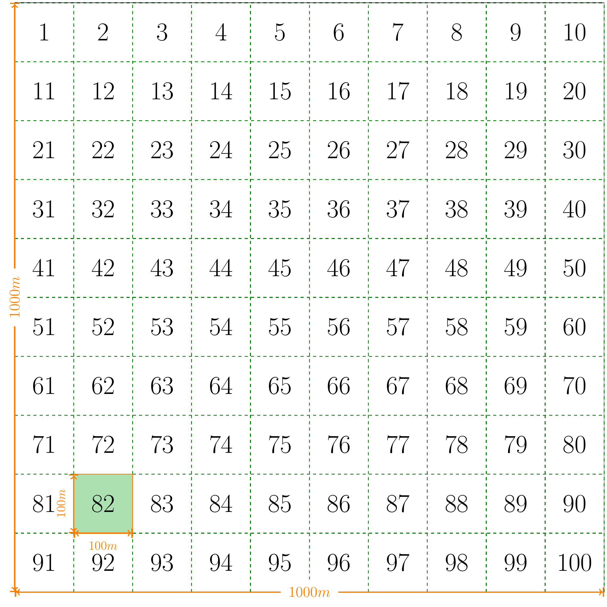
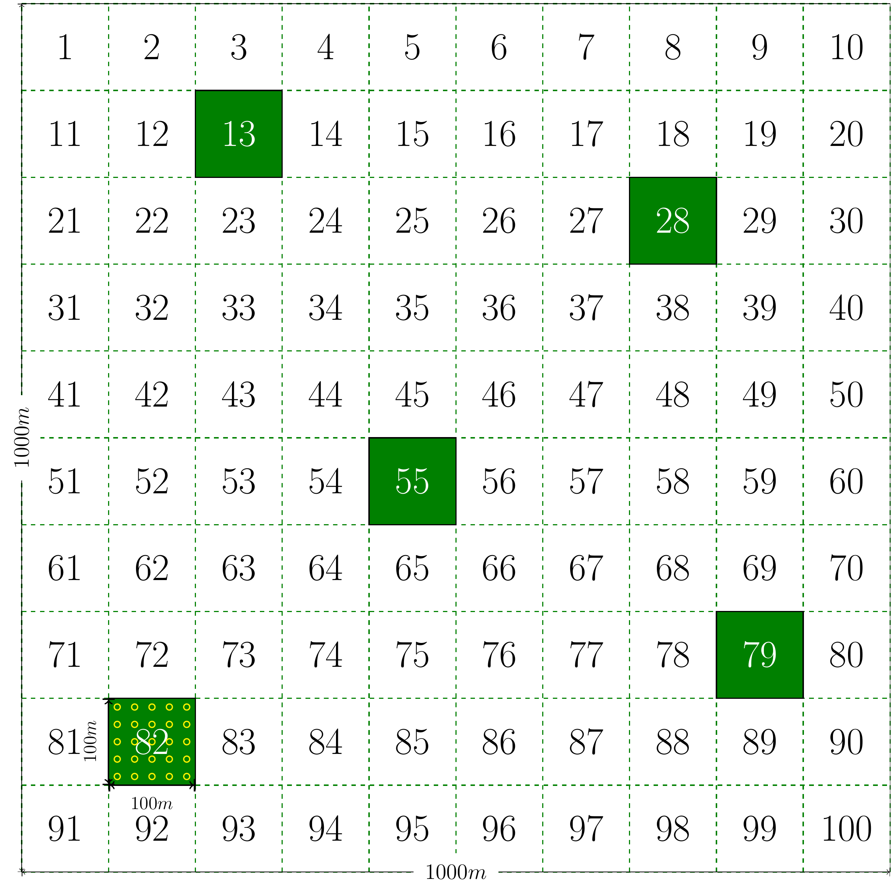

class: title-slide, center, middle
background-image: url(fig/slide-title/ufpa2.png), url(fig/slide-title/forest.png), url(fig/slide-title/img3.png)
background-position: 84% 90%, 95% 90%
background-size: 220px, 90px, cover

```{r setup, include=FALSE}
knitr::opts_chunk$set(
  fig.showtext = TRUE,
  fig.align = "center", 
  cache = TRUE,
  error = FALSE,
  message = FALSE, 
  warning = FALSE, 
  collapse = TRUE ,
  dpi = 600)
```

```{r xaringan-logo, echo=FALSE}
library(xaringanExtra)
use_logo(
  image_url = "fig/slide-title/ufpa.png",
  position = css_position(top = ".8em", right = "1em"),
  width = "140px",
  height = "140px"
)

use_scribble()

```

```{r icon, echo=FALSE}
#remotes::install_github("mitchelloharawild/icons")
#library(icons)
#download_fontawesome()
#download_simple_icons()
```

```{r packages, include=FALSE}
# remotes::install_github("dill/emoGG")
library(ggplot2)
library(dplyr)
library(ggimage)
```


<!-- title-slide -->
# Inventário Florestal <br> (FL03039 - IF)
<br>
## .yellow2[Amostragem] <br> `r anicon::faa("pagelines", animate="horizontal", colour="green")` .yellow2[Aleatória Simples] `r anicon::faa("pagelines", animate="horizontal", colour="green")`

#### **Prof. Dr. Deivison Venicio Souza**
##### Universidade Federal do Pará (UFPA) 
##### Faculdade de Engenharia Florestal
##### E-mail: deivisonvs@ufpa.br
<br>
##### 1ª versão: 23/Novembro/2021 <br> (Atualizado em: `r format(Sys.Date(),"%d/%B/%Y")`) <br> Altamira, Pará

---
layout: true
<div class="my-header"></div>
<div class="my-footer"><span>Prof. Dr. Deivison Venicio Souza (E-mail: deivisonvs@ufpa.br)&emsp;&emsp;&emsp;&emsp;&emsp;Inventário Florestal (FL03039 - IF)/ <div3>Amostragem Aleatória Simples - AAS</div3> </div>

---

## Ementa da disciplina (FL03039 - IF)

.pull-left-3[
.shadow4[
1 - Introdução aos Inventários Florestais;

2 - Amostragem em Inventários Florestais;

**3 - Amostragem Aleatória Simples**;

4 - Amostragem Estratificada;

5 - Amostragem Sistemática; 

6 - Amostragem em Dois Estágios;

7 - Amostragem em Conglomerados;

8 - Censo Florestal (Inventário Florestal 100%); 

9 - Amostragem em Múltiplas Ocasiões;

10 - Inventário Florestal Nacional;

11 - Planejamento e Custo de Inventários Florestais; e

12 - Tecnologias em Inventários Florestais.
]
]

---

## Objetivos
<br><br>
Ao final desta aula espera-se que o discente seja capaz de...

* Compreender os conceitos básicos associados à Amostragem Aleatória Simples (AAS);
* Conhecer os principais estimadores da AAS;
* Aprender a obter as estimativas da AAS por meio de um estudo de caso; e
* Aprender a interpretar as estimativas e concluir sobre a precisão do IF realizado.

---

## Conteúdo

.pull-left-4[
.pull-top[
**Parte 1 - Conceito e Características**
.font90[

[1 - Conceito](#con)

[2 - Seleção da Unidade de Amostra](#sua)

[3 - Quando usar a AAS?](#qu)

[4 - Argumentos favoráveis e contra-argumentos](#vl)

]
]
]


.pull-right-4[

**Parte 2 - Estimadores da AAS**

.font90[

[1 - Parâmetro, Estimador e Estimativa](#pee)

[2 - Principais Estimadores da AAS](#peaas)

&nbsp;&nbsp;[2.1 - Média Aritmética Amostral](#ma)

&nbsp;&nbsp;[2.2 - Desvio Padrão, Variância e Coeficiente de Variação](#dp)

&nbsp;&nbsp;[2.3 - Intensidade Amostral (ou Suficiência Amostral)](#ia)

&nbsp;&nbsp;[2.4 - Variância das Médias Amostrais](#vm)

&nbsp;&nbsp;[2.5 - Erro Padrão das Médias Amostrais](#epm)

&nbsp;&nbsp;[2.6 - Erro de Amostragem](#ea)

&nbsp;&nbsp;[2.7 - Intervalo de Confiança Para Média](#icm)

&nbsp;&nbsp;[2.8 - Total da População](#tp)

&nbsp;&nbsp;[2.9 - IC Para o Total da População](#icptp)

]
]

---

## Conteúdo

.pull-left-4[
.pull-top[
**Parte 3 - Inventário Florestal usando AAS - Estudo de Caso**
.font90[

[1 - Supressão Florestal - Aeródromo](#sfa)

&nbsp;&nbsp;[1.1 - Motivação](#mot)

&nbsp;&nbsp;[1.2 - Legislação Vigente](#lv)

&nbsp;&nbsp;[1.3 - Orgão Ambiental Licenciador](#oal)

&nbsp;&nbsp;[1.4 - Análise do IF para Supressão](#ifs)

]
]
]

<!-- Slide XX -->
---
layout: false
name: if
class: inverse, middle, center
background-image: url(fig/au1/sec.png)
background-size: cover

.font200[.yellow2[**Conceito <br> Características**]]

---
layout: true
<div class="my-header"></div>
<div class="my-footer"><span>Prof. Dr. Deivison Venicio Souza (E-mail: deivisonvs@ufpa.br)&emsp;&emsp;&emsp;&emsp;&emsp;<div3>Amostragem Aleatória Simples - AAS</div3>/ <div2>Parte 1 - Conceito e Características</div2> </div>

---
name: con
## Amostragem Aleatória Simples
<br>

.pull-left-3[
.shadow1a[
### Definição
.font100[
**Processo de amostragem** de características de uma população, cujas unidades amostrais são escolhidas de forma **aleatória** e sob **igual probabilidade** (amostragem probabilística).
]
]
]

.pull-right-3[
.pull-down[
`r anicon::faa("tree", size = 5, speed = "slow", animate = 'vertical', color = "green")`
`r anicon::faa("tree", size = 5, speed = "slow", animate = 'vertical', color = "green")`
`r anicon::faa("tree", size = 5, speed = "slow", animate = 'vertical', color = "green")`

]
]

---
name: car
## Amostragem Aleatória Simples
<br>

.shadow1a[
### Características (Queiroz, 1998)

- A Amostragem Aleatória Simples (AAS) é baseada em um processo estritamente aleatório;
- As unidades amostrais (parcelas) são escolhidas sob igual probabilidade (**1/N**); <br> (**N** = número de UA que compõem o espaço amostral).

]

---

## Amostragem Aleatória Simples

.shadow1a[
### Método de Seleção da Unidade de Amostra
<br>

A seleção das Unidades Amostrais (UA) pode ser realizada por meio de sorteio **COM** ou **SEM** reposição (Péllico Netto; Brena, 1997):
<br>

- **Sorteio com reposição**: Uma unidade de amostra poderá ser sorteada .magenta[mais de uma vez] para compor a amostra.
- **Sorteio sem reposição**: Uma unidade de amostra poderá ser sorteada somente .magenta[uma única vez] para compor a amostra.

]

---

## Amostragem Aleatória Simples

.shadow1a[
### Como funciona nos inventários florestais?

- A AAS em inventários florestais é comumente conduzida por meio de um **sorteio SEM reposição** das unidades de amostras (Queiroz, 1998). <br><br>
- **Motivo**: A inclusão de uma unidade amostral mais de uma vez na amostra refletirá uma homogeneização da variância (entre UAs) para a variável de interesse.

]

---

## Amostragem Aleatória Simples

.pull-left-15[
- Vamos supor um Povoamento de *Swietenia macrophylla*...(5m x 5m)

🌳  🌳  🌳  🌳  🌳  🌳  🌳  🌳  🌳  🌳  🌳  🌳  🌳  🌳
🌳  🌳  🌳  🌳  🌳  🌳  🌳  🌳  🌳  🌳  🌳  🌳 
🌳  🌳  🌳  🌳  🌳  🌳  🌳  🌳  🌳  🌳  🌳  🌳  🌳  🌳
🌳  🌳  🌳  🌳  🌳  🌳  🌳  🌳  🌳  🌳  🌳  🌳  
🌳  🌳  🌳  🌳  🌳  🌳  🌳  🌳  🌳  🌳  🌳  🌳  🌳  🌳
🌳  🌳  🌳  🌳  🌳  🌳  🌳  🌳  🌳  🌳  🌳  🌳  
🌳  🌳  🌳  🌳  🌳  🌳  🌳  🌳  🌳  🌳  🌳  🌳  🌳  🌳
🌳  🌳  🌳  🌳  🌳  🌳  🌳  🌳  🌳  🌳  🌳  🌳  
🌳  🌳  🌳  🌳  🌳  🌳  🌳  🌳  🌳  🌳  🌳  🌳  🌳  🌳
🌳  🌳  🌳  🌳  🌳  🌳  🌳  🌳  🌳  🌳  🌳  🌳
🌳  🌳  🌳  🌳  🌳  🌳  🌳  🌳  🌳  🌳  🌳  🌳  🌳  🌳
🌳  🌳  🌳  🌳  🌳  🌳  🌳  🌳  🌳  🌳  🌳  🌳  
🌳  🌳  🌳  🌳  🌳  🌳  🌳  🌳  🌳  🌳  🌳  🌳  🌳  🌳
🌳  🌳  🌳  🌳  🌳  🌳  🌳  🌳  🌳  🌳  🌳  🌳  
🌳  🌳  🌳  🌳  🌳  🌳  🌳  🌳  🌳  🌳  🌳  🌳  🌳  🌳
🌳  🌳  🌳  🌳  🌳  🌳  🌳  🌳  🌳  🌳  🌳  🌳  
🌳  🌳  🌳  🌳  🌳  🌳  🌳  🌳  🌳  🌳  🌳  🌳  🌳  🌳
🌳  🌳  🌳  🌳  🌳  🌳  🌳  🌳  🌳  🌳  🌳  🌳 
🌳  🌳  🌳  🌳  🌳  🌳  🌳  🌳  🌳  🌳  🌳  🌳  🌳  🌳
🌳  🌳  🌳  🌳  🌳  🌳  🌳  🌳  🌳  🌳  🌳  🌳
🌳  🌳  🌳  🌳  🌳  🌳  🌳  🌳  🌳  🌳  🌳  🌳  🌳  🌳
🌳  🌳  🌳  🌳  🌳  🌳  🌳  🌳  🌳  🌳  🌳  🌳
🌳  🌳  🌳  🌳  🌳  🌳  🌳  🌳  🌳  🌳  🌳  🌳  🌳  🌳
🌳  🌳  🌳  🌳  🌳  🌳  🌳  🌳  🌳  🌳  🌳  🌳
🌳  🌳  🌳  🌳  🌳  🌳  🌳  🌳  🌳  🌳  🌳  🌳  🌳  🌳
🌳  🌳  🌳  🌳  🌳  🌳  🌳  🌳  🌳  🌳  🌳  🌳
🌳  🌳  🌳  🌳  🌳  🌳  🌳  🌳  🌳  🌳  🌳  🌳  🌳  🌳
🌳  🌳  🌳  🌳  🌳  🌳  🌳  🌳  🌳  🌳  🌳  🌳
]
<br><br><br>

.pull-right-15[
.font90[
**.brown[Como você executaria um IF usando a AAS?]**
<br><br>

**Variável de interesse**: .blue[Volume de Madeira].
]
]

---

## Amostragem Aleatória Simples

.shadow1a[
### Contra-argumentos (Péllico Netto; Brena, 1997)
]

--

.shadow4[
.font90[
**1) Na fase de planejamento**
- As UAs devem ser listadas, para posterior seleção aleatória (sorteio de unidades ou pontos amostrais);
]
]

--

.shadow4[
.font90[
**2) Na fase de execução (em campo)**
- Existe a possibilidade de uma distribuição irregular da unidades amostrais;
- Pode haver maior dificuldade para se alcançar a posição das unidades amostrais; e
- Maior tempo improdutivo, devido ao deslocamento entre unidades amostrais.
]
]
<br>

.comment[**Fatores que aumentam as dificuldades**: Florestas Inequiâneas, Tamanho da Área...]

---

## Amostragem Aleatória Simples

.shadow1a[
### Argumentos favoráveis
]

--

.shadow4[
**1) Na fase de análise de dados (escritório)**
- Os estimadores da AAS são mais simples. Portanto, as estimativas do IF são obtidas com maior facilidade.
]

---

## Amostragem Aleatória Simples

.shadow1a[
### Quando usar a AAS para IF? (Sanquetta et al., 2009)
<br>
Recomenda-se o uso da AAS quando a população florestal a ser inventariada for:

- Pequena;
- De fácil acesso; e
- Relativamente .magenta[homogênea] em relação à variável de interesse. <br><br>

.blue[Homogeneidade]: Tem relação com o grau de variabilidade da variável de interesse entre unidades amostrais.

.blue[Grau de variabilidade]: é estimado pelo estimador de variância amostral. <br><br>

.center[
.red[&#65308;] variância .red[&#65308;] intensidade amostral
]

]

<!-- Slide XX -->
---
layout: false
name: if
class: inverse, middle, center
background-image: url(fig/au1/sec.png)
background-size: cover

.font200[.yellow2[**Estimadores: <br> Amostragem Aleatória Simples**]]

---
layout: true
<div class="my-header"></div>
<div class="my-footer"><span>Prof. Dr. Deivison Venicio Souza (E-mail: deivisonvs@ufpa.br)&emsp;&emsp;&emsp;&emsp;&emsp;<div3>Amostragem Aleatória Simples - AAS</div3>/ <div2>Parte 2 - Estimadores da AAS</div2> </div>

---
name: pee
## Parâmetro, Estimador e Estimativa

- Recapitulando a diferença entre: .blue[Parâmetro, Estimador e Estimativa]...


.shadow1a[
### Parâmetro
]

--

.shadow4[
.font90[
- É uma .blue[estatística] usada para descrever uma característica de interesse, a partir de .blue[dados populacionais]. (**Mede-se todos os elementos da população!**)
- Os valores dos parâmetros populacionais são .blue[normalmente desconhecidos], pois na maioria das vezes é inviável medir todos os elementos da população.
- Os parâmetros são comumente representados por .blue[letras gregas].
]
]
<br>

--

.center[
.font80[
$\mu$ = Média Populacional (ou Paramétrica)

$\sigma^2$ = Variância Populacional (ou Paramétrica)

$\sigma$ = Desvio Padrão Populacional (ou Paramétrica)
]
]

.font80[
$\sigma$: letra grega sigma.

$\mu$: letra grega mu (lê-se "mi").
]

---

## Parâmetro, Estimador e Estimativa

.shadow1a[
### Estimador (do Parâmetro)
]

--

.shadow4[
- É uma .blue[estatística] usada para .blue[estimar um parâmetro da população] (para alguma característica de interesse), a partir de dados da .blue[amostra].
- São exemplos de estimadores: $\bar{X}$, $S^2$, $S$ e outros
]

--

.shadow1a[
### Estimativa (do Parâmetro)
]

--

.shadow4[
- É o valor numérico assumido pelo estimador, obtido a partir de dados amostrais.
- Estimativa = é um valor aproximado (do Parâmetro).
]

---

## Parâmetro, Estimador e Estimativa
<br>

### Formulação Matemática (Exemplos)

|                                Parâmetro                                |                         Estimador (do Parâmetro)                         |                                      Descrição                                      |
|:-----------------------------------------------------------------------:|:------------------------------------------------------------------------:|:-----------------------------------------------------------------------------------:|
|                   $$\mu = \frac{1}{N}\sum_{i=1}^{N}X_i$$                  |                 $$\bar{X} = \frac{1}{n}\sum_{i=1}^{n}X_i$$                 |        $\mu$ = média populacional <br> $\bar{X}$ = estimador da média populacional       |
|    $$\sigma^2 = \frac{1}{N}\sum_{i=1}^{N}\left (X_i - \mu  \right )^2$$   |    $$S^2 = \frac{1}{n-1}\sum_{i=1}^{n}\left (X_i - \bar{X}  \right )^2$$   |   $\sigma^2$ = variância populacional <br> $S^2$ = estimador da variância populacional   |
| $$\sigma = \sqrt{\frac{1}{N}\sum_{i=1}^{N}\left (X_i - \mu  \right )^2}$$ | $$S = \sqrt{\frac{1}{n-1}\sum_{i=1}^{n}\left (X_i - \bar{X}  \right )^2}$$ | $\sigma$ = desvio padrão populacional <br> $S$ = estimador do desvio padrão populacional |

---

## Estimadores da Amostragem Aleatória Simples
<br>

.pull-left-12[
**Os principais estimadores da Amostragem Aleatória Simples são:**
]

.pull-right-12[
| **Estimador (do Parâmetro)**                          | **Símbolo**                |
|-------------------------------------------------------|:----------------------------:|
| 1 - Média aritmética                                  | $\bar{X}$                  |
| 2 - Variância                                         | $S^2$                      |
| 3 - Desvio Padrão                                     | $S$                        |
| 4 - Coeficiente de variação                           | $CV$                       |
| 5 - Intensidade amostral                              | $n$                        |
| 6 - Variância das médias amostrais                               | $S^2_{\bar{X}}$            |
| 7 - Erro padrão das médias amostrais                           | $S_{\bar{X}}$              |
| 8 - Erro de amostragem                                | $\left(E_a~ou~E_r \right)$ |
| 9 - Intervalo de confiança para média                 | $IC_{\bar{X}}$             |
| 10 - Total da população                               | $\hat{X}$                  |
| 11 - Intervalo de confiança para o total da população | $IC_{\hat{X}}$             |

]

---

## Estimadores da Amostragem Aleatória Simples
<br>

.shadow3[
.center[**NOTAÇÕES**]

$A$ = Área total da população

$a$ = Área ou tamanho da unidade de amostra

$N$ = Número de unidades de amostra possíveis na população

$n$ = Número de unidades amostradas (**medidas em campo!**)

$f$ = Fração de amostragem (**Proporção amostrada!**)

$t$ = Valor tabelado com $\left(n-1 \right)$ graus de liberdade ao nível de significância estabelecido

$LE$ = Limite de erro admitido no Inventário Florestal (0,1 ou 10%)

$E$ = Erro admissível para estimativa da média

$X_i$ = $i$-ésimo valor da variável de interesse $X$

]

---
name: ma
## Estimadores da Amostragem Aleatória Simples

.shadow1a[
## Média aritmética amostral

\begin{equation}
\Large
\bar{X} = \frac{1}{n}\sum_{i=1}^{n}X_i
\end{equation}

- $\bar{X}$ (lê-se: X-barra) = estimador da média aritmética populacional $\mu$ (lê-se: "mi").
- $n$ = número de observações.
- $\Sigma$ (sigma maiúscula) = símbolo de somatório. 
- $X_i$ = $i$-ésimo valor da variável de interesse $X$.

]

---
name: dp
## Estimadores da Amostragem Aleatória Simples

.shadow1a[
## Variância amostral

\begin{equation}
\Large
S^2 = \frac{1}{n-1}\sum_{i=1}^{n}\left (X_i - \bar{X}  \right )^2
\end{equation}

.font90[
- $S^2$ (lê-se: S-quadrado) = estimador da variância populacional $\sigma^2$ (lê-se: Sigma-quadrado).
- $n$ = número de observações.
- $\Sigma$ (sigma maiúscula) = símbolo de somatório. 
- $X_i$ = $i$-ésimo valor da variável de interesse $X$.
- $\bar{X}$ = estimativa da média aritmética populacional $\mu$.
]
]

---

## Estimadores da Amostragem Aleatória Simples

.shadow1a[
## Desvio padrão amostral

\begin{equation}
\Large
S = \sqrt{\frac{1}{n-1}\sum_{i=1}^{n}\left (X_i - \bar{X}  \right )^2}
\end{equation}

.font90[
- $S$ = estimador do desvio padrão populacional $\sigma$.
- $n$ = número de observações.
- $\Sigma$ (sigma maiúscula) = símbolo de somatório. 
- $X_i$ = $i$-ésimo valor da variável de interesse $X$.
- $\bar{X}$ = estimativa da média aritmética populacional $\mu$.
]
]

---

## Estimadores da Amostragem Aleatória Simples

.shadow1a[
## Coeficiente de variação amostral

\begin{equation}
\Large
CV = \frac{S}{\bar{X}} \left( 100 \right)
\end{equation}

.font90[
- $CV$ = estimador do coeficiente de variação populacional.
- $S$ = estimativa do desvio padrão populacional $\sigma$.
- $\bar{X}$ = estimativa da média aritmética populacional $\mu$.
]
]

---

## Estimadores da Amostragem Aleatória Simples

.shadow1a[
## Intensidade amostral - Definição

.font90[
No âmbito de IFs, o estimador de intensidade amostral buscar responder:

- Qual o .blue[tamanho da amostra] necessário para estimar a média aritmética (ou outro parâmetro) de uma variável de interesse (ex.: volume/ha), admitindo-se um limite de erro e sob um nível de probabilidade?

<br>

**A definição do estimador de intensidade amostral depende de duas informações preliminares:**

- A natureza da população (Finita ou Infinita?).
- Da estimativa de variabilidade da variável de interesse (Variância ou CV?).
]
]

---

## Estimadores da Amostragem Aleatória Simples

.shadow1a[
## .font90[Intensidade amostral]
]

.pull-left-4[
.shadow3[
.font90[
.center[.blue[**Em função da variância amostral**]]

- **Populações Finitas**

\begin{equation}
\large
n = \frac{Nt^2S^2}{(NE^2) + (t^2S^2)}
\end{equation}

- **Populações Infinitas**

\begin{equation}
\large
n = \frac{t^2S^2}{E^2}
\end{equation}
]
]

.font70[
$N$ = Número de unidades de amostra possíveis na população

$S^2$ = Estimativa da variância populacional

$t_{n-1;~\alpha}$ = Valor crítico com (n-1) GL e nível $\alpha$ de significância

$E$ = Erro admissível para estimativa da média
]

]

--

.pull-right-4[
.shadow3[
.font90[
.center[.blue[**Em função do CV amostral**]]

- **Populações Finitas**

\begin{equation}
\large
n = \frac{Nt^2(CV)^2}{N(LE)^2 + t^2(CV)^2}
\end{equation}

- **Populações Infinitas**

\begin{equation}
\large
n = \frac{t^2(CV)^2}{(LE)^2}
\end{equation}
]
]

.font70[
$CV$ = estimativa do coeficiente de variação (em %) populacional

$LE$ = Limite de Erro (em %) admitido no Inventário Florestal
]

]

---

## Estimadores da Amostragem Aleatória Simples

.pull-left-14[
.font90[
**🤔 Como determinar o número de unidades de amostras possíveis na população** $\left(N\right)$?
<br><br>

**Exemplo**: 

- Suponha que se deseja realizar um IF amostral em uma população florestal de 100ha para estimar o volume de madeira.
- Admitindo-se que serão usadas parcelas de 100m x 100m, qual o valor de $\left(N\right)$?

]
]

--

.pull-right-14[
```{r, echo=FALSE, out.width='75%', fig.align='center', fig.cap='', dpi=600}

```
]

---

## Estimadores da Amostragem Aleatória Simples

.pull-right-14[
```{r, echo=FALSE, out.width='75%', fig.align='center', fig.cap='', dpi=600}

```
]

--

.pull-left-14[
.font90[
**Depende do tamanho da população e da parcela:**
]
]

--

.pull-left-14[
\begin{equation}
\normalsize
N = \frac{A}{a}
\end{equation}
]

--


.pull-left-14[
\begin{equation*}
\normalsize
N = \frac{A}{a} = \frac{1.000.000\color{orange}{m²}}{10.000\color{orange}{m²}} = \frac{100\color{blue}{ha}}{1\color{blue}{ha}} = 100~UA
\end{equation*}

<br><br>

.font90[
- **Interpretação**: É possível estabelecer 100 unidades amostrais de 1ha em uma área de 100ha.
]
]

---

## Estimadores da Amostragem Aleatória Simples
<br>

.shadow3[
.center[**População Finita x População Infinita**]

- Em estatística, uma população é finita quando a fração amostral é maior do que 2%.
- A fração amostral pode ser calculada como:

\begin{equation}
\large
f = \frac{n}{N}
\end{equation}

$n$ = número de unidades amostradas

$N$ = número de unidades de amostras possíveis na população

]

---

## Estimadores da Amostragem Aleatória Simples

.pull-left-5[
.font90[
- Retornemos ao exemplo anterior...Qual a fração amostral?
]
]

--

.pull-right-5[

```{r, echo=FALSE, out.width='70%', fig.align='center', fig.cap='', dpi=600}

```
]

--

.pull-left-5[
.pull-down[

.font90[
**Abordagem 1: Usando a equação**
<br>

\begin{equation*}
\normalsize
f = \frac{n}{N} = \frac{5}{100} = 0,05 (100) = \color{blue}{5\%}
\end{equation*}

**Abordagem 2: Usando regra de 3 simples**
<br>

\begin{align*}
& 100ha -\!\!\!-\!\!\!- 100\% \\
& 5ha -\!\!\!-\!\!\!- x\%
\end{align*}

$$x = \frac{500}{100}=\color{blue}{5\%}$$


- **Interpretação**: Foi amostrada 5% da <br> área total da população. <br> (**.orange[População é Finita!]**)

]
]
]

---

## Estimadores da Amostragem Aleatória Simples

.shadow1a[
## .font90[Variância das Médias Amostrais]

]

---

## Estimadores da Amostragem Aleatória Simples

### Unidades de Medidas das Estimativas

.pull-left-12[
- A unidade de medida das estimativas dependerá da variável de interesse. Veja o exemplo quando a variável de interesse é o volume de madeira por hectare...
]


.pull-right-12[
.font90[
| **Estimador (do Parâmetro)**                          | Volume $\left(m³.ha^{-1}\right)$               |
|-------------------------------------------------------|:----------------------------:|
| 1 - Média aritmética                                  | $m³.ha^{-1}$                    |
| 2 - Variância                                         | $\left(m³.ha^{-1}\right)^2$                       |
| 3 - Desvio Padrão                                     | $m³.ha^{-1}$                        |
| 4 - Coeficiente de variação                           | $\%$                       |
| 5 - Intensidade amostral                              | $Parcelas$                        |
| 6 - Variância das médias amostrais                                 | $\left(m³.ha^{-1}\right)^2$            |
| 7 - Erro padrão das médias amostrais                                | $m³.ha^{-1}$              |
| 8 - Erro de amostragem                                | $\left(m³.ha^{-1}~ou~\% \right)$ |
| 9 - Intervalo de confiança para média                 | $m³.ha^{-1}$             |
| 10 - Total da população                               | $m³$                  |
| 11 - Intervalo de confiança para o total da população | $m³$             |
]
]

---

## Referências

<br><br>
CAMPOS, J. C. C.; LEITE, H. G. **Mensuração florestal: perguntas e respostas**. 3ª ed. - Viçosa, MG: Ed. UFV, 2009. 548 p.
<br><br>
PÉLLICO NETTO, S.; BRENA, D. A. **Inventário Florestal**. Curitiba: editorado pelos autores, 1997. 316p.
<br><br>
QUEIROZ, W. T. **Técnicas de amostragem em inventário florestal nos trópicos**. Belém: FCAP. Serviço de Documentação e Informação, 1998. 147 p.


---

## Referências

<br><br>
SANQUETTA, C.R.; WATZLAWICK, L.F.; CORTE, A.P.D.; FERNANDES, L.A.V.; SIQUEIRA, J.D.P. Inventários florestais: planejamento e execução. 2ª ed. Curitiba. 2009. 316p.
<br><br>
SCOLFORO, J. R. S.; MELLO, J. M. de. Inventário Florestal. Lavras: UFLA/FAEPE, 1997. 341 p.
<br><br>
SOARES, C. P. B.; PAULA NETO, F. de; SOUZA, A. L. de. Dendrometria e inventário florestal. 2ª ed. - Viçosa, MG: Ed. UFV, 2011. 272 p.
