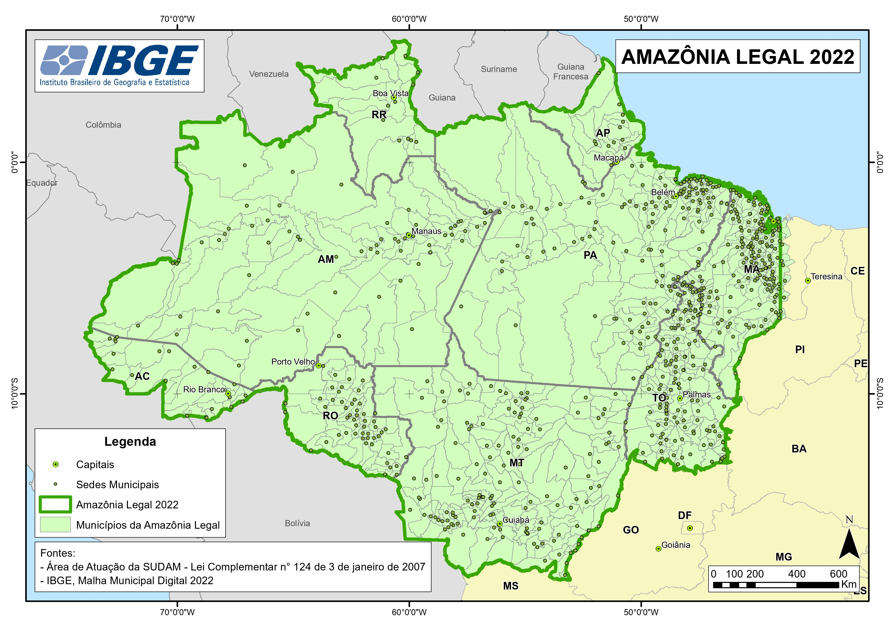
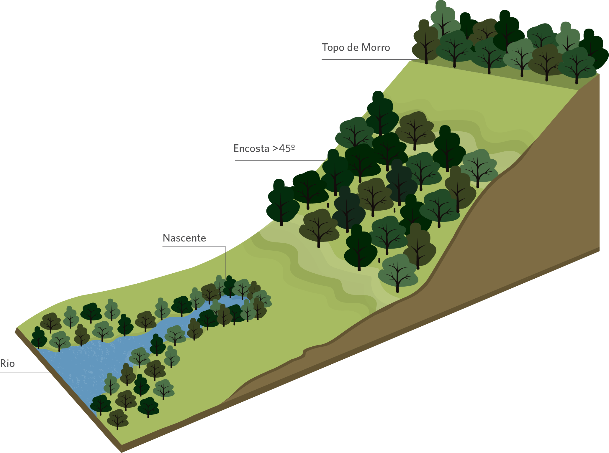
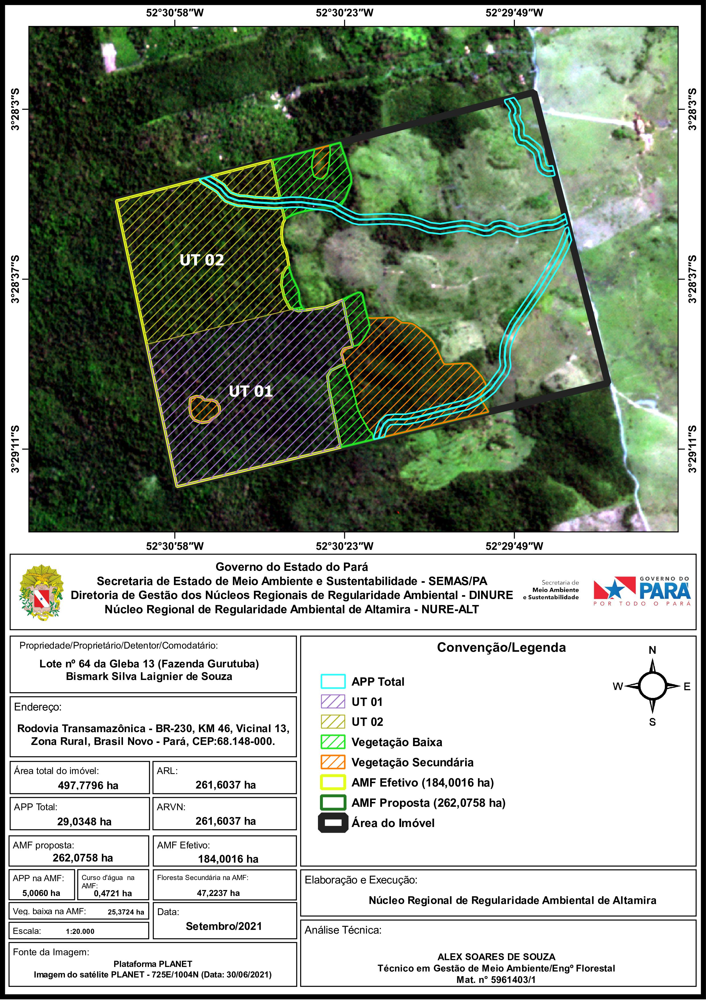
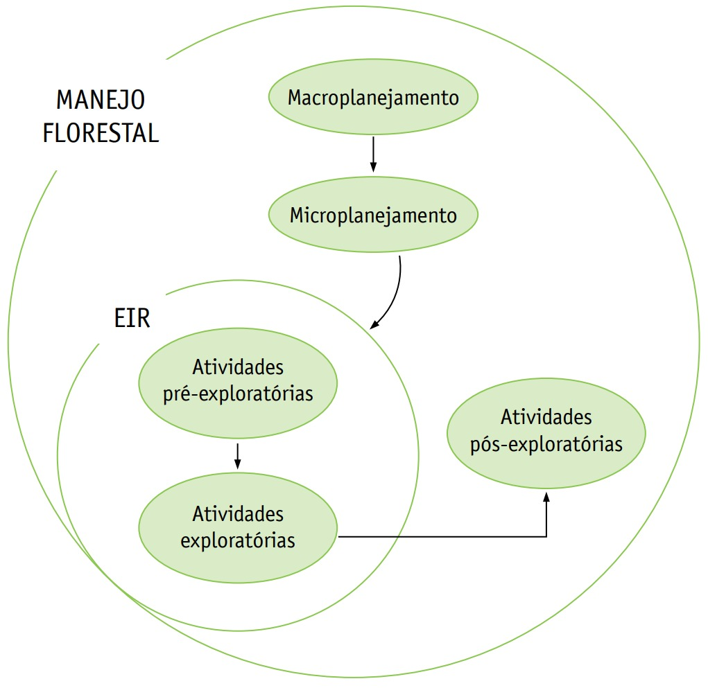

class: title-slide, center, middle
background-image: url(fig/slide-title/ufpa2.png), url(fig/slide-title/forest.png), url(fig/slide-title/img3.png)
background-position: 84% 90%, 95% 90%
background-size: 220px, 90px, cover

```{r setup, include=FALSE}
knitr::opts_chunk$set(
  fig.showtext = TRUE,
  fig.align = "center", 
  cache = TRUE,
  error = FALSE,
  message = FALSE, 
  warning = FALSE, 
  collapse = TRUE ,
  dpi = 600)
```

```{r xaringan-logo, echo=FALSE}
library(xaringanExtra)
use_logo(
  image_url = "fig/slide-title/ufpa.png",
  position = css_position(top = ".3em", right = "1em"),
  width = "110px",
  height = "110px"
)

use_scribble()

```

```{r icon, echo=FALSE}
#remotes::install_github("mitchelloharawild/icons")
#library(icons)
#download_fontawesome()
#download_simple_icons()
```

```{r customDT, echo=F}
CustomDT <- function(data){
  data %>% DT::datatable(editable = 'cell', rownames = FALSE,
                         style = "default",
                         class = "display", width = '250px',
                         caption = '',
     options=list(pageLength = 16, dom = 'tip', autoWidth = F,
       initComplete = htmlwidgets::JS(
          "function(settings, json) {",
          paste0("$(this.api().table().container()).css({'font-size': '", "14pt", "'});"),
          "}")
       ) 
     )
}
```

```{r packages, include=FALSE}
# remotes::install_github("dill/emoGG")
library(ggplot2)
library(dplyr)
library(ggimage)
```


<!-- title-slide -->
# Inventário Florestal <br> (FL03039 - IF)
<br>
## .yellow2[Censo Florestal] <br> `r anicon::faa("pagelines", animate="horizontal", colour="green")` .yellow2[(Inventário Florestal 100%)] `r anicon::faa("pagelines", animate="horizontal", colour="green")`

#### **Prof. Dr. Deivison Venicio Souza**
##### Universidade Federal do Pará (UFPA)
##### Faculdade de Engenharia Florestal
##### E-mail: deivisonvs@ufpa.br
###### 1ª versão: 21/Setembro/2023 <br> (Atualizado em: `r format(Sys.Date(),"%d/%B/%Y")`) <br> Altamira, Pará

---
layout: true
<div class="my-header"></div>
<div class="my-footer"><span>Prof. Dr. Deivison Venicio Souza (E-mail: deivisonvs@ufpa.br)&emsp;&emsp;&emsp;&emsp;&emsp; <div2>Inventário Florestal (FL03039 - IF)</div2>/<div3>Censo Florestal (Inventário Florestal 100%)</div3> </div>

---

## Ementa da disciplina (FL03039 - IF)

.pull-left-9[
.shadow4[
.font90[
1 - Introdução aos Inventários Florestais;

2 - Amostragem em Inventários Florestais;

3 - Amostragem Aleatória Simples;

4 - Amostragem Estratificada;

5 - Amostragem Sistemática; 

6 - Amostragem em Dois Estágios;

7 - Amostragem em Conglomerados;

**8 - Censo Florestal (Inventário Florestal 100%)**; 

9 - Amostragem em Múltiplas Ocasiões;

10 - Inventário Florestal Nacional;

11 - Planejamento e Custo de Inventários Florestais; e

12 - Tecnologias em Inventários Florestais.
]
]
]

.pull-right-9[
<br>

.shadow3C[
<br>
```{r echo = FALSE, out.width='55%', fig.align='center', fig.cap='', dpi=600}
knitr::include_graphics("fig/slide-title/Foto.jpeg")
```

.font70[
**Prof. Dr. Deivison Venicio Souza**
.left[
- Bacharel em Engenharia Florestal - UFRA
- Mestre em Ciências Florestais - PPGCF/UFRA
- Doutor em Engenharia Florestal - PPGEF/UFPR
- Especialista em Big Data e Data Science - UFPR
]
]
]
]

---

## Objetivos
<br>

.font80[
Ao final desta aula espera-se que o discente seja capaz de...

* Conhecer as principais legislações (Leis, Resoluções, INs) que orientam o MFS e IF-100%;
* Compreender os conceitos chaves (legais) para o licenciamento ambiental do MFS para fins madeireiros;
* Compreender as principais etapas do MFS para fins madeireiros;
* Compreender as principais etapas para realização do censo florestal; 
* Conhecer os instrumentos, materiais e produtos do IF-100%; e
* Aprender a realizar análise técnica de IF-100% no âmbito MFS para fins Madeireiro.
]

---

## Conteúdo

.pull-left-4[
.pull-top[
.font80[**Parte 1 - MFS para fins madeireiros e Legislação**]
.font70[

[1 - Conceitos chaves para o MFS madeireiro](#df)

&nbsp;&nbsp;[1.1 - Principais Legislações](#pl)

&nbsp;&nbsp;[1.2 - Constituição Federal e Meio Ambiente](#cfma)

&nbsp;&nbsp;[1.3 - Manejo Florestal Sustentável - MFS](#mfs)

&nbsp;&nbsp;[1.4 - Área de Reserva Legal - ARL](#rl)

&nbsp;&nbsp;[1.5 - Área de Preservação Permanente - APP](#app)

&nbsp;&nbsp;[1.6 - Área de Uso Alternativo do Solo - AUAS](#auas)

&nbsp;&nbsp;[1.7 - Área de Manejo Florestal - AMF](#amf)

&nbsp;&nbsp;[1.8 - Unidade de Manejo Florestal - AMF](#umf)

&nbsp;&nbsp;[1.9 - Área de Efetiva Exploração Florestal - AEEF](#aeef)

&nbsp;&nbsp;[1.10 - Unidade de Produção Anual - UPA](#upa)

&nbsp;&nbsp;[1.11 - Unidade de Trabalho - UT](#ut)

&nbsp;&nbsp;[1.12 - Plano Manejo Florestal Sustentável - PMFS](#pmfs)

&nbsp;&nbsp;[1.13 - Plano Operacional Anual - POA](#poa)

&nbsp;&nbsp;[1.14 - Autorização de Exploração - AUTEX (ou AUTEF)](#autex)

]
]
]


.pull-right-4[
.font80[**Parte 1 - MFS para fins madeireiros e Legislação** (cont.)]

.font70[

&nbsp;&nbsp;[1.15 - Ciclo de Corte](#cc)

&nbsp;&nbsp;[1.16 - Diâmetro Mínimo de Corte](#dmc)

&nbsp;&nbsp;[1.17 - Intensidade Máxima de Corte](#imc)

]
]


.pull-right-4[
.font80[**Parte 2 - Etapas do MFS para fins madeireiros**]

.font70[

[1 - Principais Etapas do MFS para fins madeireiros](#macro)

&nbsp;&nbsp;[1.1 - Macroplanejamento](#macro)

&nbsp;&nbsp;[1.2 - Microplanejamento (incluindo o IF-100%)](#micro)

&nbsp;&nbsp;&nbsp;&nbsp;[1.2.1 - Censo Florestal: conceito e importância](#sua)

&nbsp;&nbsp;[1.3 - Atividades Exploratórias](#ae)

&nbsp;&nbsp;[1.4 - Atividades Pós-Exploratórias](#ape)

]
]

---

## Conteúdo

.pull-left-4[
.font80[**Parte 3 - Censo Florestal (IF-100%)**]

.font70[

[1 - Censo florestal e legislação](#censo)

[2 - Etapas do censo florestal](#etapas)

&nbsp;&nbsp;[2.1 - Identificação de árvores](#id)

&nbsp;&nbsp;[2.2 - Medição e estimativa de variáveis dendrométricas](#med)

&nbsp;&nbsp;[2.3 - Avaliação da qualidade do fuste (tronco)](#qf)

&nbsp;&nbsp;[2.4 - Detecção de presença de oco](#oco)

&nbsp;&nbsp;[2.5 - Corte de cipós pré-exploratório no IF-100%](#cipo)

&nbsp;&nbsp;[2.6 - Seleção de árvores matrizes](#matr)

&nbsp;&nbsp;[2.7 - Plaqueamento de árvores](#placa)

&nbsp;&nbsp;[2.8 - Mapeamento de árvores](#mapa)

[3 - Equipe, equipamentos e materiais](#equip)

[4 - Produtos do censo florestal](#prod)

&nbsp;&nbsp;[4.1 - Cálculos de medidas derivadas](#md)

&nbsp;&nbsp;[4.2 - Mapa de corte e colheita](#corte)

]
]


.pull-right-4[
.pull-top[
.font80[**Parte 4 - Análise Técnica de IF-100%**]
.font70[

[1 - Estudo de Caso (Fazenda Maringá)](#ec)

]
]
]

<!-- Slide XX -->
---
layout: false
name: if
class: inverse, middle, center
background-image: url(fig/au1/sec.png)
background-size: cover

.font200[**Parte 1** <br> .yellow2[**MFS Madeireiro e Legislação**]]

---
layout: true
<div class="my-header"></div>
<div class="my-footer"><span>Prof. Dr. Deivison Venicio Souza (E-mail: deivisonvs@ufpa.br)&emsp;&emsp;&emsp;&emsp;&emsp; <div2>Parte 1 - MFS para fins madeireiros e Legislação</div2>/<div3>Conceitos chaves para o MFS</div3> </div>

---
name: pl
## Manejo Florestal Sustentável - MFS


.shadow1b[
.center[
### .blue[Principais Legislações - MFS para fins madeireiros]
]
<br>
.font70[

- **Esfera Federal:**

1 - [Constituição da República Federativa do Brasil de 1988](http://www.planalto.gov.br/ccivil_03/Constituicao/Constituicao.htm) (Art. 225º do Capítulo VI - Do Meio Ambiente)

2 - [Lei nº 6.938, de 31 de agosto de 1981](https://www.planalto.gov.br/ccivil_03/leis/l6938.htm) (Política Nacional do Meio Ambiente - PNMA)

3 - [Decreto nº 5.975, de 30 de novembro 2006](http://www.planalto.gov.br/ccivil_03/_ato2004-2006/2006/decreto/d5975.htm) (Defini fundamentos técnicos gerais do PMFS, transporte de produtos e subprodutos florestais)

4 - [Lei nº 11.284, de 02 de março de 2006](https://www.planalto.gov.br/ccivil_03/_Ato2004-2006/2006/Lei/L11284.htm) (Lei de gestão de florestas públicas para a produção sustentável)

5 - [Norma de Execução/IBAMA 01, de 24 de 04 de 2007](https://www.legisweb.com.br/legislacao/?id=91545)  (Diretrizes Técnicas para Elaboração dos PMFS)

6 - [Lei nº 12.651, de 25 de maio de 2012](https://www.planalto.gov.br/ccivil_03/_ato2011-2014/2012/lei/l12651.htm) (Novo Código Florestal)

7 - [Resolução nº 406, de 02 de fevereiro de 2009](http://conama.mma.gov.br/?option=com_sisconama&task=arquivo.download&id=578) (Parâmetros técnicos para elaboração, avaliação e execução de PMFS fins madeireiros)

8 - [Portaria MMA nº 443, de 17 de dezembro de 2014](https://www.icmbio.gov.br/cepsul/images/stories/legislacao/Portaria/2014/p_mma_443_2014_lista_esp%C3%A9cies_amea%C3%A7adas_extin%C3%A7%C3%A3o.pdf) (Lista as espécies da flora brasileira ameaçadas de extinção)

9 - [Portaria MMA nº 148, de 07 de junho de 2022](https://www.icmbio.gov.br/cepsul/images/stories/legislacao/Portaria/2020/P_mma_148_2022_altera_anexos_P_mma_443_444_445_2014_atualiza_especies_ameacadas_extincao.pdf) (Altera anexos da Portaria MMA nº 443, de 17 de dezembro de 2014)

10 - [Instrução Normativa nº 01, de 12 de fevereiro de 2015 – MMA](https://www.ibama.gov.br/sophia/cnia/legislacao/MMA/IN0001-12022015.pdf)  (Regulamenta o manejo das espécies vulneráveis - VU)
]
]

---
name: pl
## Manejo Florestal Sustentável - MFS


.shadow1b[
.center[
### .blue[Principais Legislações - MFS para fins madeireiros]
]
<br>
.font70[

- **Esfera Estadual (Pará):**

1 - [Instrução Normativa/SEMAS nº 09, de 22 de Junho de 2011](https://www.semas.pa.gov.br/legislacao/files/pdf/9523.pdf)  (Cadastro Ambiental Rural - CAR e Licenciamento Ambiental de Atividades Rurais – LAR)

2 - [Instrução Normativa/SEMAS nº 05, de 10 de Setembro de 2015](https://www.semas.pa.gov.br/legislacao/files/pdf/184.pdf)  (Procedimentos técnicos para elaboração, apresentação, execução e avaliação técnica de PMFS nas florestas nativas exploradas ou não e suas formas de sucessão)

3 - [Instrução Normativa/SEMAS nº 03, de 10 de Outubro de 2017](https://www.semas.pa.gov.br/legislacao/files/pdf/200.pdf)  (Calendário Florestal: períodos para a safra da exploração de madeira)

]
]

---
name: cfma
## Constituição Federal e Meio Ambiente

.shadow1b[
.font80[
.center[
### [Constituição da República Federativa do Brasil de 1988](http://www.planalto.gov.br/ccivil_03/Constituicao/Constituicao.htm)
]
<br>

**Constituição Federal e Meio Ambiente** (.orange[Art. 225º do Capítulo VI - Do Meio Ambiente]):
<br><br>

_.orange[**Art. 225**]. **Todos têm direito ao meio ambiente ecologicamente equilibrado**, bem de uso comum do povo e essencial à sadia qualidade de vida, impondo-se ao Poder Público e à coletividade o dever de **defendê-lo e preservá- lo para as presentes e futuras gerações**._

- § 1º Para assegurar a efetividade desse direito, incumbe ao Poder Público:

VII – proteger a fauna e a flora, vedadas, na forma da lei, as práticas que coloquem em risco sua função ecológica, provoquem a extinção de espécies ou submetam os animais a crueldade.

]
]

.pull-right-3[
.pull-down[
`r anicon::faa("seedling", size = 3, speed = "slow", animate = 'vertical', color = "green")`
`r anicon::faa("leaf", size = 3, speed = "slow", animate = 'vertical', color = "green")`

]
]

---
name: mfs
## Manejo Florestal Sustentável - MFS: Definição

.shadow1b[
.font80[
.center[
### [Lei nº 12.651, de 25 de maio de 2012 - Novo Código Florestal](https://www.planalto.gov.br/ccivil_03/_ato2011-2014/2012/lei/l12651.htm)
]
<br>

**Manejo Florestal Sustentável** (.orange[inciso VII do Art. 3º]):
<br><br>

_.orange[**Manejo Florestal Sustentável**]: **administração da vegetação natural** para a obtenção de **benefícios econômicos, sociais e ambientais**, respeitando-se os mecanismos de sustentação do ecossistema objeto do manejo e considerando-se, cumulativa ou alternativamente, a **utilização de múltiplas espécies madeireiras ou não**, **de múltiplos produtos e subprodutos da flora**, bem como a utilização de outros **bens e serviços**._
]
]

.pull-right-3[
.pull-down[
`r anicon::faa("seedling", size = 3, speed = "slow", animate = 'vertical', color = "green")`
`r anicon::faa("leaf", size = 3, speed = "slow", animate = 'vertical', color = "green")`

]
]

---
name: arl
## Área de Reserva Legal - ARL

.shadow1b[
.font80[
.center[
### [Lei nº 12.651, de 25 de maio de 2012 - Novo Código Florestal](https://www.planalto.gov.br/ccivil_03/_ato2011-2014/2012/lei/l12651.htm)
]

<br>

_.orange[**Reserva Legal** (inciso III do Art. 3º)]: **área** localizada no interior de uma **propriedade ou posse rural**, delimitada nos termos do .orange[art. 12], com a função de:_


a) Assegurar o uso econômico de modo sustentável dos recursos naturais do imóvel rural;

b) Auxiliar a conservação e a reabilitação dos processos ecológicos; 

c) Promover a conservação da biodiversidade; e

d) Servir de abrigo e a proteção de fauna silvestre e da flora nativa.

]
]

.pull-right-3[
.pull-down[
`r anicon::faa("seedling", size = 3, speed = "slow", animate = 'vertical', color = "green")`
`r anicon::faa("leaf", size = 3, speed = "slow", animate = 'vertical', color = "green")`

]
]

---

## Área de Reserva Legal - ARL

.shadow1b[
.font80[
.center[
### [Lei nº 12.651, de 25 de maio de 2012 - Novo Código Florestal](https://www.planalto.gov.br/ccivil_03/_ato2011-2014/2012/lei/l12651.htm)
]

<br>

_.orange[**Art. 12**]: Todo **imóvel rural deve manter área com cobertura de vegetação nativa**, **a título de Reserva Legal**, sem prejuízo da aplicação das normas sobre as Áreas de Preservação Permanente, observados os seguintes **percentuais mínimos em relação à área do imóvel**._

<br>

I - localizado na **Amazônia Legal**:

.red[a) 80% (oitenta por cento), no imóvel situado em área de florestas.]

b) 35% (trinta e cinco por cento), no imóvel situado em área de cerrado.

c) 20% (vinte por cento), no imóvel situado em área de campos gerais.

]
]

.pull-right-3[
.pull-down[
`r anicon::faa("seedling", size = 3, speed = "slow", animate = 'vertical', color = "green")`
`r anicon::faa("leaf", size = 3, speed = "slow", animate = 'vertical', color = "green")`

]
]

---

## Área de Reserva Legal - ARL

<br>

```{r echo = FALSE, out.width='35%', fig.align='center', fig.cap='', dpi=600}
knitr::include_graphics("fig/class8/RL.jpg")
```

.font50[**Fonte:** [https://www.behance.net](https://www.behance.net/gallery/13486573/Fazenda-Brasil-infografia-sobre-o-codigo-florestal)]

---
name: al
## Amazônia Legal

```{r echo = FALSE, out.width='66%', fig.align='center', fig.cap='', dpi=600}

```
.center[.font40[**Fonte**: [IBGE](https://www.ibge.gov.br/geociencias/cartas-e-mapas/mapas-regionais/15819-amazonia-legal.html)]]

---

## Área de Reserva Legal - ARL

<br>

**É permitida a exploração econômica direta da RL?**

**Resposta**: .green[**Sim, sob regime de manejo sustentável.**] `r anicon::faa("thumbs-up", colour="green", animate = "vertical")` 

-------------------------------------------------------------------------

.shadow1b[
.font80[
.center[
### [Lei nº 12.651, de 25 de maio de 2012 - Novo Código Florestal](https://www.planalto.gov.br/ccivil_03/_ato2011-2014/2012/lei/l12651.htm)
]

- O Novo código florestal admite o manejo sustentável da vegetação da RL:

**Seção II - Do Regime de Proteção da Reserva Legal**

_.orange[**§ 1º do Art. 17**]: **Admite-se a exploração econômica da Reserva Legal** mediante **manejo sustentável**, previamente aprovado pelo órgão competente do Sisnama, de acordo com as modalidades previstas no art. 20._

_.orange[**Art. 20**]: No manejo sustentável da vegetação florestal da Reserva Legal, serão adotadas práticas de exploração seletiva nas modalidades de **manejo sustentável sem propósito comercial** para consumo na propriedade e **manejo sustentável para exploração florestal com propósito comercial**._

]
]

---

## Área de Reserva Legal - ARL

<br>

**É permitida a exploração econômica direta da RL?**

**Resposta**: .green[**Sim, sob regime de manejo sustentável.**] `r anicon::faa("thumbs-up", colour="green", animate = "vertical")` 

-------------------------------------------------------------------------

.shadow1b[
.font80[
.center[
### [Lei nº 12.651, de 25 de maio de 2012 - Novo Código Florestal](https://www.planalto.gov.br/ccivil_03/_ato2011-2014/2012/lei/l12651.htm)
]

- O Novo código florestal admite o manejo sustentável da vegetação da RL:

**Seção II - Do Regime de Proteção da Reserva Legal**

_.orange[**Art. 21**]: É livre a coleta de **produtos florestais não madeireiros**, tais como frutos, cipós, folhas e sementes, devendo-se observar:_

I - os períodos de coleta e volumes fixados em regulamentos específicos, quando houver;

II - a época de maturação dos frutos e sementes; e

III - técnicas que não coloquem em risco a sobrevivência de indivíduos e da espécie coletada no caso de coleta de flores, folhas, cascas, óleos, resinas, cipós, bulbos, bambus e raízes.

]
]

---

## Área de Reserva Legal - ARL

<br>

**É permitida a exploração econômica direta da RL?**

**Resposta**: .green[**Sim, sob regime de manejo sustentável.**] `r anicon::faa("thumbs-up", colour="green", animate = "vertical")` 

-------------------------------------------------------------------------

.shadow1b[
.font80[
.center[
### [Lei nº 12.651, de 25 de maio de 2012 - Novo Código Florestal](https://www.planalto.gov.br/ccivil_03/_ato2011-2014/2012/lei/l12651.htm)
]

- O Novo código florestal admite o manejo sustentável da vegetação da RL:

**Seção II - Do Regime de Proteção da Reserva Legal**

_.orange[**Art. 22**]: O **manejo florestal sustentável da vegetação da Reserva Legal com propósito comercial depende de autorização do órgão competente** e deverá atender as seguintes diretrizes e orientações:_

I - não descaracterizar a cobertura vegetal e não prejudicar a conservação da vegetação nativa da área;

II - assegurar a manutenção da diversidade das espécies; e

III - conduzir o manejo de espécies exóticas com a adoção de medidas que favoreçam a regeneração de espécies nativas.

]
]

---
name: app
## Área de Preservação Permanente - APP

.shadow1b[
.font80[
.center[
### [Lei nº 12.651, de 25 de maio de 2012 - Novo Código Florestal](https://www.planalto.gov.br/ccivil_03/_ato2011-2014/2012/lei/l12651.htm)
]

<br>

_.orange[**Área de Preservação Permanente** (inciso II do Art. 3º)]: **área protegida**, **coberta ou não por vegetação nativa**, com a **função ambiental de preservar**:_

a) Os recursos hídricos;

b) A paisagem;

c) A estabilidade geológica;

d) A biodiversidade; 

e) Facilitar o fluxo gênico de fauna e flora;

f) Proteger o solo; e 

g) Assegurar o bem-estar das populações humanas.


<br>

`r anicon::faa("exclamation-triangle", colour="red")` **Área Protegida! Não é permitida a exploração econômica direta!**

`r anicon::faa("exclamation-triangle", colour="red")` **No MFS para fins madeireiros não pode explorar árvores em APP!**
]
]

---

## Área de Preservação Permanente - APP

.shadow1b[
.font70[
.center[
### [Lei nº 12.651, de 25 de maio de 2012 - Novo Código Florestal](https://www.planalto.gov.br/ccivil_03/_ato2011-2014/2012/lei/l12651.htm)
]

<br>

**Seção I - Da Delimitação das Áreas de Preservação Permanente**

_.orange[**Art. 4**]: Considera-se Área de Preservação Permanente, em zonas rurais ou urbanas:_

----------------------------------------------------------------------
_.blue[**I**] - **as faixas marginais de qualquer curso d’água natural perene e intermitente**, excluídos os efêmeros, desde a borda da calha do leito regular, em largura mínima de:_

a) 30 (trinta) metros, para os cursos d’água de menos de 10 (dez) metros de largura;

b) 50 (cinquenta) metros, para os cursos d’água que tenham de 10 (dez) a 50 (cinquenta) metros de largura;

c) 100 (cem) metros, para os cursos d’água que tenham de 50 (cinquenta) a 200 (duzentos) metros de largura;

d) 200 (duzentos) metros, para os cursos d’água que tenham de 200 (duzentos) a 600 (seiscentos) metros de largura; e

e) 500 (quinhentos) metros, para os cursos d’água que tenham largura superior a 600 (seiscentos) metros.

----------------------------------------------------------------------
_.blue[**II**] - as **áreas no entorno dos lagos e lagoas naturais**, em faixa com largura mínima de:_

a) 100 (cem) metros, em zonas rurais, exceto para o corpo d’água com até 20 (vinte) hectares de superfície, cuja faixa marginal será de 50 (cinquenta) metros; e

b) 30 (trinta) metros, em zonas urbanas.

]
]

---

## Área de Preservação Permanente - APP
<br>

```{r echo = FALSE, out.width='60%', fig.align='center', fig.cap='', dpi=600}
knitr::include_graphics("fig/class8/APP2.png")
```

.font50[**Fonte:** Adaptado de [https://www.inteliagro.com.br/](https://www.inteliagro.com.br/quanto-deve-medir-uma-app-area-de-preservacao-permanente-de-um-rio/)]

---

## Área de Preservação Permanente - APP
<br>
.font80[**Fonte:** [Climate Policy Initiative](https://www.climatepolicyinitiative.org/pt-br/publication/monitor-da-implementacao-do-codigo-florestal/)]

```{r echo = FALSE, out.width='60%', fig.align='center', fig.cap='Exemplos de APPs', dpi=600}

```

---
name: auas
## Área de Uso Alternativo do Solo - AUAS

.pull-left-15[
.shadow1b[
.font80[
.center[
### [Lei nº 12.651, de 25 de maio de 2012 - Novo Código Florestal](https://www.planalto.gov.br/ccivil_03/_ato2011-2014/2012/lei/l12651.htm)
]

<br>

_.orange[**Uso Alternativo do Solo** (inciso VI do Art. 3º)]: **substituição de vegetação nativa e formações sucessoras por outras coberturas do solo**, como atividades agropecuárias, industriais, de geração e transmissão de energia, de mineração e de transporte, assentamentos urbanos ou outras formas de ocupação humana._
]
]
]

---
name: amf
## Área de Manejo Florestal - AMF

.pull-left-16[
.shadow1b[
.font80[
.center[
### [Resolução nº 406, de 02 de fevereiro de 2009](http://conama.mma.gov.br/?option=com_sisconama&task=arquivo.download&id=578)
]

<br>

_.orange[**Área de Manejo Florestal** (inciso I do Art. 2º)]: **conjunto de Unidades de Manejo Florestal - UMF** que compõem o PMFS, contíguas ou não, localizadas em um único Estado._

<br>

_.orange[**Unidade de Manejo Florestal** (inciso XII do Art. 2º)]: Área do imóvel rural a ser utilizada no manejo florestal._
]
]
]

.pull-left-16[
.shadow1b[
.font80[
.center[
### [Instrução Normativa/SEMAS nº 05, de 10 de Setembro de 2015](https://www.semas.pa.gov.br/legislacao/files/pdf/184.pdf)
]

<br>

_.orange[**Unidade de Manejo Florestal** (inciso XXIV do Art. 2º)]: área do imóvel rural ou sob contrato de concessão que se constitui parte integrante da Área de Manejo Florestal – AMF._

]
]
]

---
name: upa
## Unidade de Produção Anual e Unidade de Trabalho

.pull-left-15[
.shadow1b[
.font80[
.center[
### [Resolução nº 406, de 02 de fevereiro de 2009](http://conama.mma.gov.br/?option=com_sisconama&task=arquivo.download&id=578)
]

<br>

_.orange[**Unidade de Produção Anual - UPA** (inciso XIII do Art. 2º)]: subdivisão da Área de Manejo Florestal, destinada a ser explorada em um ano._

<br>

_.orange[**Unidade de Trabalho - UT** (inciso XIV do Art. 2º)]: subdivisão operacional da Unidade de Produção Anual._
]
]
]

---
name: umf
## UMF, UPA e UT
<br>

```{r echo = FALSE, out.width='80%', fig.align='center', fig.cap='', dpi=600}
knitr::include_graphics("fig/class8/UMF_UPA_UT.png")
```

.font80[**Fonte:** [Pinheiro et al., 2020.](http://www.ift.org.br/publicacoes/producao-tecnica/manuais-e-cartilhas/)]

---
name: aeef
## Área de Efetiva Exploração (ou Manejo) Florestal

.pull-left-16[
.shadow1b[
.font80[
.center[
### [Instrução Normativa/SEMAS nº 05, de 10 de Setembro de 2015](https://www.semas.pa.gov.br/legislacao/files/pdf/184.pdf)
]

<br>

_.orange[**Área de Efetiva Exploração Florestal - AEE** (inciso I do Art. 2º)]: área, efetivamente, explorada na Unidade de Trabalho - UT, computando-se as áreas com árvores sem porte comercial para exploração e excluindo-se as áreas de preservação permanente, inacessíveis, de infraestrutura, antropizadas em regime ou não de pousio, bem como indisponíveis legalmente**_

<br>

_.orange[**Área de Efetivo Manejo** (inciso II do Art. 2º)]: área da Unidade de Manejo Florestal - UMF com potencial presente ou futuro para exploração florestal, excluídas as áreas de preservação permanente, inacessíveis, de infraestrutura, antropizadas em regime ou não de pousio, bem como indisponíveis legalmente._
]
]
]

---
name: pmfs
## Documentos técnicos: PMFS e POA

.pull-left-15[
.shadow1b[
.font80[
.center[
### [Resolução nº 406, de 02 de fevereiro de 2009](http://conama.mma.gov.br/?option=com_sisconama&task=arquivo.download&id=578)
]

<br>

_.orange[**Plano Manejo Florestal Sustentável - PMFS** (inciso X do Art. 2º)]: documento técnico básico que apresenta as diretrizes e procedimentos para administração da floresta de acordo com os princípios do manejo florestal sustentável._

<br>

_.orange[**Plano Operacional Anual - POA** (inciso XI do Art. 2º)]: documento a ser apresentado ao órgão ambiental competente, contendo as informações definidas em suas diretrizes técnicas, com a especificação das atividades a serem realizadas no período de 12 meses._
]
]
]

---
name: autef
## Documentos técnicos: AUTEX ou AUTEF

.pull-left-15[
.shadow1b[
.font80[
.center[
### [Resolução nº 406, de 02 de fevereiro de 2009](http://conama.mma.gov.br/?option=com_sisconama&task=arquivo.download&id=578)
]

<br>

_.orange[**Autorização para Exploração - AUTEX** (inciso II do Art. 2º)]: documento expedido pelo órgão competente que autoriza o início da exploração da Unidade de Produção Anual-UPA e especifica o volume máximo por espécie permitido para exploração._
]
]
]

.pull-left-15[
.shadow1b[
.font80[
.center[
### [Instrução Normativa/SEMAS nº 05, de 10 de Setembro de 2015](https://www.semas.pa.gov.br/legislacao/files/pdf/184.pdf)
]

<br>

_.orange[**Autorização para Exploração Florestal - AUTEF** (inciso VI do Art. 2º)]: documento expedido pela Secretaria de Estado de Meio Ambiente e Sustentabilidade do Pará - SEMAS/PA, que autoriza o início da exploração da Unidade de Produção Anual - UPA, do ano a que se refere, e especifica o volume máximo por espécie e volume total permitido para exploração, com a validade para uma safra._
]
]
]

---
name: autef
## Modelo de AUTEF (SEMAS/PA)

.pull-left-10[
```{r echo = FALSE, out.width='85%', fig.align='center', fig.cap='Página 1', dpi=600}
knitr::include_graphics("fig/class8/AUTEF/1.jpg")
```
]

.pull-right-10[
```{r echo = FALSE, out.width='55%', fig.align='center', fig.cap='Página 2', dpi=600}

```
]

---

## Modelo de AUTEF (SEMAS/PA)

.pull-left-10[
```{r echo = FALSE, out.width='100%', fig.align='center', fig.cap='Página 3', dpi=600}
knitr::include_graphics("fig/class8/AUTEF/3.jpg")
```
]

.pull-right-10[
```{r echo = FALSE, out.width='55%', fig.align='center', fig.cap='Página 4', dpi=600}
knitr::include_graphics("fig/class8/AUTEF/4.jpg")
```
]


---
name: pmfs
## Outros conceitos

.pull-left-15[
.shadow1b[
.font80[
.center[
### [Resolução nº 406, de 02 de fevereiro de 2009](http://conama.mma.gov.br/?option=com_sisconama&task=arquivo.download&id=578)
]

<br>

_.orange[**Ciclo de Corte** (inciso III do Art. 2º)]: período de tempo, em anos, entre sucessivas colheitas de produtos florestais madeireiros ou não-madeireiros numa mesma área._

<br>

_.orange[**Diâmetro Mínimo de Corte** (inciso V do Art. 2º)]: diâmetro mínimo de uma árvore a partir do qual é permitido seu corte em um PMFS._

<br>

_.orange[**Intensidade de Corte** (inciso VI do Art. 2º)]: volume comercial das árvores derrubadas para aproveitamento, estimado por meio de equações volumétricas previstas no PMFS e com base nos dados do IF-100%, expresso em metros cúbicos por unidade de área (m³/ha) de efetiva exploração florestal, calculada para cada Unidade de Trabalho (UT)._

]
]
]

---

## Ciclo de Corte

```{r echo = FALSE, out.width='90%', fig.align='center', fig.cap='', dpi=600}
knitr::include_graphics("fig/class8/UPA.png")
```


---
layout: false
name: if
class: inverse, middle, center
background-image: url(fig/au1/sec.png)
background-size: cover

.font200[**Parte 2** <br> .yellow2[**Etapas do MFS Madeireiro**]]

---
layout: true
<div class="my-header"></div>
<div class="my-footer"><span>Prof. Dr. Deivison Venicio Souza (E-mail: deivisonvs@ufpa.br)&emsp;&emsp;&emsp;&emsp;&emsp; <div2>Parte 2 - Etapas do MFS para fins madeireiros</div2>/<div3>Principais etapas</div3> </div>

---
name: emfs
## Manejo Florestal Sustentável Para Fins Madeireiros

.shadow1b[
### Etapas do MFS em Florestas Naturais (Balieiro et al., 2010)
<br>

```{r echo = FALSE, out.width='40%', fig.align='center', fig.cap='Etapas do MFS para fins madeireiros', dpi=600}

```

]

---

## Manejo Florestal Sustentável Para Fins Madeireiros

.shadow1b[
### Etapas do MFS em Florestas Naturais (Balieiro et al., 2010)
<br>

As principais etapas do MFS para fins madeireiros são:
<br>

- **1ª Etapa - Macroplanejamento**
- **2ª Etapa - Microplanejamento (.blue[incluindo o IF-100%])**
- **3ª Etapa - Atividades Exploratórias**
- **4ª Etapa - Atividades Pós-Exploratórias**

]

---

## Manejo Florestal Sustentável Para Fins Madeireiros

.shadow1b[
### 1ª Etapa - Macroplanejamento (Balieiro et al., 2010)
.font80[
<br>

Etapa fundamental para a elaboração e a execução do Plano de Manejo Florestal Sustentável (PMFS):

- O MFS é viável economicamente?
- Subsidios para as demais atividades do MFS.

<br>

**1 - Identificação e seleção das áreas com potencial ao MFS madeireiro**

- Na Unidade de Manejo Florestal (UMF) existem .blue[Áreas de Preservação Permanente (APPs)]?
- Na UMF deve constar a .blue[Área de Reserva Absoluta] (≥ 5% do total da área concedida)? (**Proibida exploração econômica!**)
- Na UMF já existem .blue[Áreas abertas] (com construções ou sem vegetação)?

]
]

---

## Manejo Florestal Sustentável Para Fins Madeireiros

.shadow1b[
### 1ª Etapa - Macroplanejamento (Balieiro et al., 2010)
<br>
.font90[
**1 - Identificação e seleção das áreas com potencial ao MFS**

]
]

---
layout: false
name: if
class: inverse, middle, center
background-image: url(fig/au1/sec.png)
background-size: cover

.font200[**Parte 3** <br> .yellow2[**Censo Florestal (IF-100%)**]]

---
layout: true
<div class="my-header"></div>
<div class="my-footer"><span>Prof. Dr. Deivison Venicio Souza (E-mail: deivisonvs@ufpa.br)&emsp;&emsp;&emsp;&emsp;&emsp; <div2>Parte 3 - Censo Florestal (IF-100%)</div2>/<div3>Aspectos Técnicos</div3> </div>

---

## Etapas Precedentes ao Censo Florestal (IF-100%)

.shadow1b[
### Antes do IF-100% deve-se:
<br>
.font80[
**1 - Mapa de localização (UPA e UTs).**
- .blue[**Objetivo**]: Auxiliar em campo na delimitação da UT (Azimute da linha base da UT).

**2 - Delimitar as Unidades de Trabalho - UT.**

- .blue[**Objetivo**]: Definir dos limites físicos da UT.
- .blue[**Tamanho**]: É comum (.red[Não é uma regra!]) a delimitação de UTs com área de 100ha (1000m x 1000m).
- .blue[**Largura das faixas**]: Comumente de 50m de largura.

**3 - Realizar a abertura das trilhas de orientação.**

- Divisão interna da UT por meio da abertura de trilhas ou picadas perpendiculares à linha  base, formando faixas, que nortearão a realização do IF-100% e outras atividades do MFS.

]
]

---

## Unidade de Trabalho: Estrutura


.shadow1b[
### Estrutura da Unidade de Trabalho
<br>
.font90[

]
]


---

## Dados coletados no Censo Florestal (IF-100%)

```{r echo = FALSE, out.width='50%', fig.align='center', fig.cap='', dpi=600}
knitr::include_graphics("fig/class8/Etapas.jpg")
```


---

## Etapas do Censo Florestal (IF-100%)

.shadow1b[
### Identificação de espécies
<br>


]


---
layout: false
name: if
class: inverse, middle, center
background-image: url(fig/au1/sec.png)
background-size: cover

.font200[**Parte 4** <br> .yellow2[**Análise Técnica de IF-100%**]]

---
layout: true
<div class="my-header"></div>
<div class="my-footer"><span>Prof. Dr. Deivison Venicio Souza (E-mail: deivisonvs@ufpa.br)&emsp;&emsp;&emsp;&emsp;&emsp; <div2>Parte 4 - Análise Técnica de IF-100%</div2>/<div3>Estudo de Caso</div3> </div>

---


## Referências

<br>
Balieiro, M. R.; Espada, A. L. V.; Nogueira, O; Palmieri, R.; Lentini, M. **As Concessões de Florestas Públicas na Amazônia Brasileira: Um manual para pequenos e médios produtores florestais.** 2ª edição, Piracicaba: Imaflora, SP. Belém: IFT, PA, 2010. 204p.
<br><br>
Pinheiro, C. S.; Costa, P. F.; Galdino, M.; Pires, I. P. Encarte Técnico. **Planejamento e Construção da Delimitação em Áreas Florestais**. Instituto Floresta Tropical - IFT. Belém-PA, 2020.
<br><br>
Sanquetta, C. R.; Corte, A. P. D.; Rodrigues, A. L.; Watzlawick, L. F. **Inventários Florestais: Planejamento e Execução.** 4ª edição - Revista e Ampliada. Curitiba. 2023. 406p.
