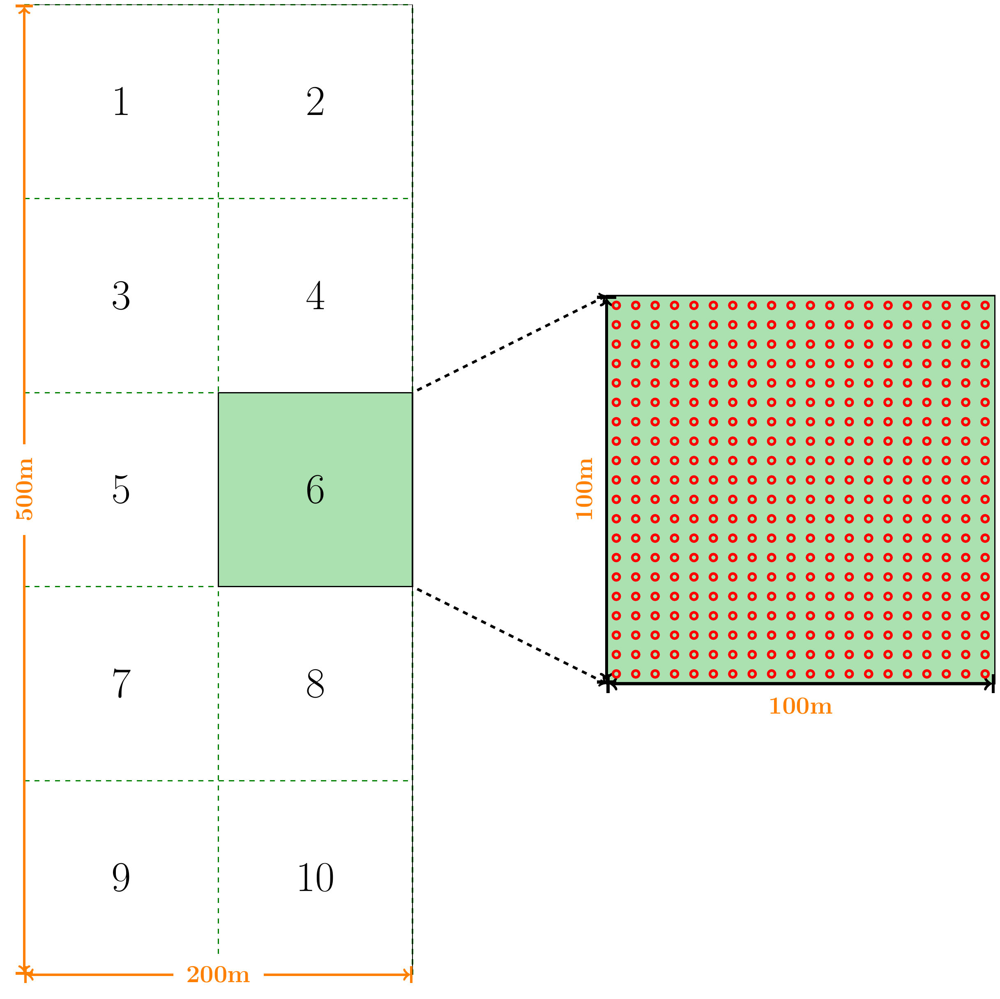
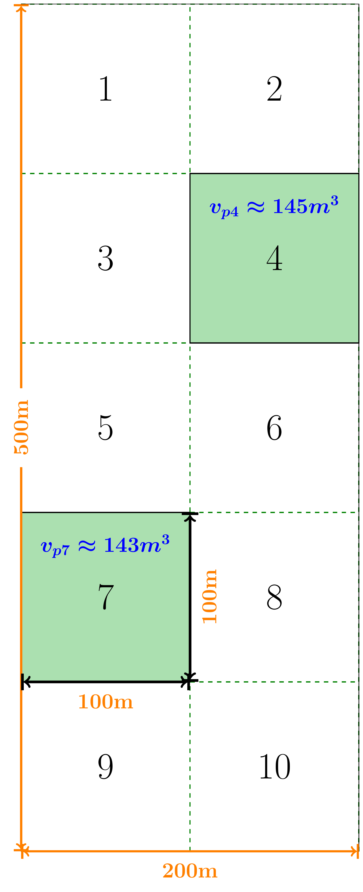

```{r setup, include=TRUE, echo = F}
library(rmarkdown)
knitr::opts_chunk$set(fig.align="center", cache=TRUE, prompt=FALSE, comment = NA, eval = TRUE)
library("distill")
```

# Combinação Simples no R

## Objetivos

- Demonstrar funções para obter resultados (quantas e quais combinações possíveis?) de uma análise de combinação simples;
- Usar a população florestal de *Khaya Ivorensis* hipotética (`Aula3-AAS.Rmd`) como base.

## Características da população hipotética

- Admitir-se-á uma população florestal de *Khaya Ivorensis* com área total de 10 hectares e com 15 anos de idade, implantada a pleno sol e sob o espaçamento 5m x 5m.
- Admitindo-se um espaçamento de 5m x 5m, em 1ha são possíveis 400 árvores. Portanto, pode-se admitir que a população de *Khaya Ivorensis* será composta de 4000 árvores (**sem mortalidade!**).

## Amostragem Aleatória Simples - AAS

- Suponha que você (Engenheiro Florestal) foi consultado para realizar um inventário florestal no povoamento de *Khaya Ivorensis* com o objetivo de quantificar o volume de madeira nos 10 hectares.
- **Existe duas opções**: Censo ou Amostragem? Qual você escolheria e porque?
- **Inventário Piloto**: Em inventários florestais por amostragem é comum a realização de Inventários Pilotos (IP), com um número reduzido de unidades de amostras, com fins de capturar a variabilidade da variável de interesse. Esse IP pode (ou não) ser considerado inventário definitivo (ID) a depender da precisão requerida, e entre outros fatores.
- Na população florestal de *Khaya Ivorensis* hipotética, se admitido o uso de parcelas amostrais de 100m x 100m (1ha), seria possível estabelecer 10 parcelas no povoamento. (Ver aula `Aula3-AAS.Rmd`) (**Ver Figura**)

```{r, echo=FALSE, out.width='60%', fig.align='center', fig.cap='', dpi=600}

```

- **Perfeito!** Sabe-se que o número de parcelas possíveis na população florestal de *Khaya Ivorensis* é 10. Se a decisão for por usar amostragem, por exemplo, amostragem aleatória simples, poder-se-ia simplesmente fazer um sorteio sem reposição das parcelas que serão medidas. Porém, é necessário definir, a priori, quantas parcelas serão amostradas no IP.
- Então, suponha a decisão de sortear 2 parcelas amostrais dentre as possíveis. A figura a seguir é apenas uma das possibilidades de combinação do sorteio sem reposição. Veja que foram sorteadas as **parcelas 4 e 7**.

```{r, echo=FALSE, out.width='30%', fig.align='center', fig.cap='', dpi=600}

```

- Mas, veja que a amostra sorteada (4 e 7) é apenas uma possibilidade dentre as várias combinações possíveis de amostras de mesmo tamanho (n = 2).
- Portanto, teoricamente, o número de amostras de tamanhos k = 2 tomadas de n = 10 elementos pode ser determinado por combinação simples.

\begin{equation*}
\normalsize
C_{n,k} =\frac{n!}{k!(n-k)!} \\~\\~\\
C_{10,2} =\frac{10!}{2!(10-2)!} = \frac{(10).(9).(8!)}{2!(8!)} = \frac{(10).(9)}{2} = \color{blue}{45}
\end{equation*}

- Assim, seria possível obter 45 amostras diferentes de tamanho k = 2 a partir das 10 parcelas possíveis na população florestal.
- Na linguagem R, pode-se usar a função `choose(n, k)` para encontrar o total de combinações simples possíveis. Em que: **n** = número de observações (No caso, número de parcelas possíveis); e **k** = tamanho da amostra.

```{r}
choose(n = 10, k = 2)
```

- Mas, quais são essas combinações possíveis?

```{r}
combn(1:10, 2)
```

- Pode-se transpor para visualizar melhor as combinações:

```{r}
t(combn(1:10, 2))
```

